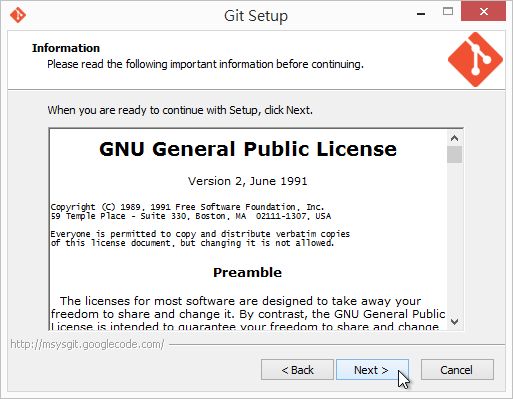
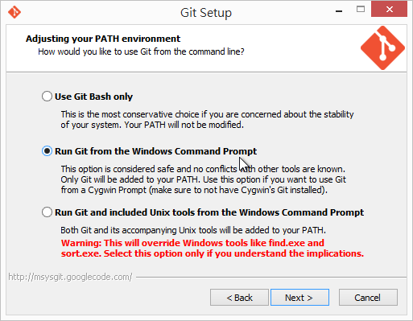
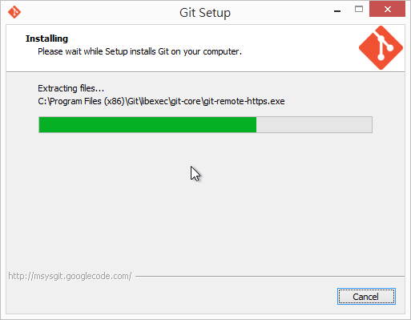
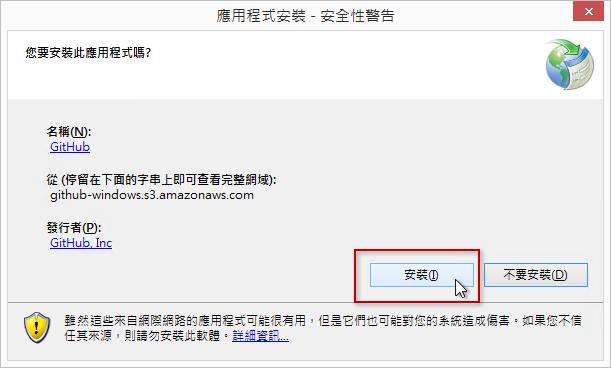
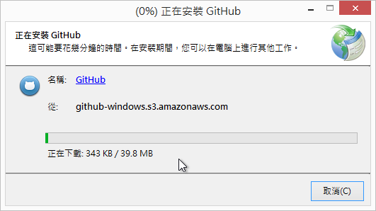
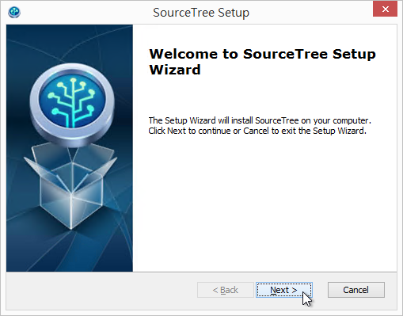
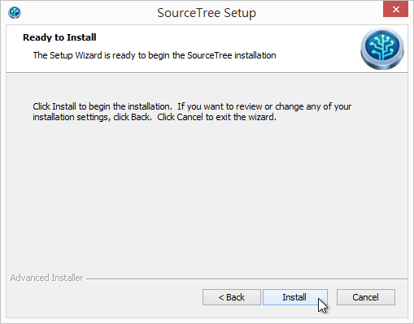

# Day 02: Three Essential Git Tools for Windows Platform

To start using Git version control, you first need to install appropriate Git tools. This series of articles mainly focuses on the Windows platform. This article will introduce three Git version control tools we use most often, introduce the similarities and differences between these tools, and when to use which tool.

## First Tool: [Git for Windows](https://msysgit.github.io/)

This is a set of command-line tools that can be executed in the **Command Prompt**. Currently, all GUI tools for Git on the market actually execute these lower-level Git tools internally, so it is an essential Git management tool that must be installed!

Below is the installation process:

* First go to https://msysgit.github.io/ official website to prepare to download the installer

* Download the latest version regardless of which version

* Directly click the downloaded file to install

* Installation program welcome page

* Agree to GPL license terms

* Select installation path

* Select components. **It is recommended to uncheck the Windows Explorer integration option!**  ( Because this integration tool is too basic, it is recommended to use [TortoiseGit](https://code.google.com/p/tortoisegit/) tool instead )

* Set the program group name, keep the default options

* Here it is recommended to **select Run Git from the Windows Command Prompt option!**  ( Because most Windows users are not familiar with Bash commands )

* Line ending conversion, it is recommended to keep the default options.

* Start installation

* Installation complete

* After installation, directly open the command prompt to start using it

* You can enter the `git --version` command to query the current version of the tool program

## Second Tool: [GitHub for Windows](https://windows.github.com/)

This is a tool officially developed by [GitHub](https://github.com) for people who don't have a deep understanding of Git. It uses a simple and friendly GUI interface, attempting to hide those hard-to-understand concepts and command parameters of Git. Although the GitHub for Windows tool is much more friendly than Git for Windows, for people who have no concept of Git at all, getting started with the GitHub for Windows tool may not be easy.

> [GitHub for Windows](https://windows.github.com/) has a built-in [Git Shell](https://github.com/dahlbyk/posh-git/) tool, which uses [Git for Windows](https://msysgit.github.io/), so if you don't have Git for Windows installed, you will not be able to use the Git Shell tool of GitHub for Windows.

This tool can help you accomplish quite a lot of Git version control work. At least basic version control functions are provided, mainly with the following capabilities:

* Clone Repositories
	* Clone repositories from GitHub (git clone)
* Browse History
	* Browse version history of local repositories
* Commit Changes
	* Commit changes to local repositories
* Branch Code
	* Create and manage Git branches, and can switch branches in the working directory
* Share on GitHub.com
	* Synchronize changes with GitHub
	* The meaning of "Sync" here is to integrate git pull and git push together
	* When GitHub for Windows synchronizes, it uses rebase by default for merging.

Most of what Git for Windows can do besides this cannot be done in GitHub for Windows! If you really want to apply it to larger development projects, you may need to consider whether it is suitable, but for non-software developers, simple version control work should be more than enough.

Below is the GitHub for Windows installation process:

* First go to https://windows.github.com/ to prepare to download the installer

* After downloading, execute the installation directly

* Logging in requires a GitHub account

* Setting up account information

* Find local Git repositories
	* If you have never used Git, there should be no results here

* After installation, you will see the main program interface of GitHub for Windows

## Third Tool: [SourceTree](https://www.sourcetreeapp.com/)

[SourceTree](https://www.sourcetreeapp.com/) is currently a tool I highly recommend that can support Windows and Mac platforms. This tool is a GUI tool developed by Atlassian (the company that makes JIRA, Confluence, Bamboo) and is provided free of charge. With this tool, almost all Git version control work can be done (including git-flow workflow), which is a very powerful Git version control tool.

> [SourceTree](https://www.sourcetreeapp.com/) also requires [Git for Windows](https://msysgit.github.io/) to be installed first, because it relies on Git's command-line tools to work.

Below is the SourceTree installation process:

* First go to https://www.sourcetreeapp.com/ to prepare to download the installer

* Download the installer

* After downloading, execute the installation directly, this is a graphical installation program

* You need to agree to the license agreement

* Registration is required to use (this is free)

* If you don't have a Bitbucket or Google account, you can also register for free

* Setup wizard

* SSH key setup

* Whether to load SSH Key from Pageant/PuTTY

* Installation complete!

Today's Summary
------

Today we briefly introduced three common Git version control tools on the Windows platform. The first is [Git for Windows](https://msysgit.github.io/), the second is [GitHub for Windows](https://windows.github.com/), and the third is [SourceTree](https://www.sourcetreeapp.com/). These three tools have their own merits, but personally I think if you want to deeply understand Git version control, you should use Git for Windows and learn to execute Git commands through the command line. If you want a more intuitive GUI tool, then use [SourceTree](https://www.sourcetreeapp.com/).

I want to emphasize that to truly master Git version control, you must understand what Git is doing at the bottom layer. So in the following articles, I will basically introduce the operation of Git version control using [Git for Windows](https://msysgit.github.io/), and use [SourceTree](https://www.sourcetreeapp.com/) as an auxiliary tool to help you better understand Git's version control operations and the changes in the repository.

---

* [Back to Table of Contents](README.md)
* [Previous Day: Understanding Git Version Control](01.md)
* [Next Day: Creating a Repository](03.md)

---
