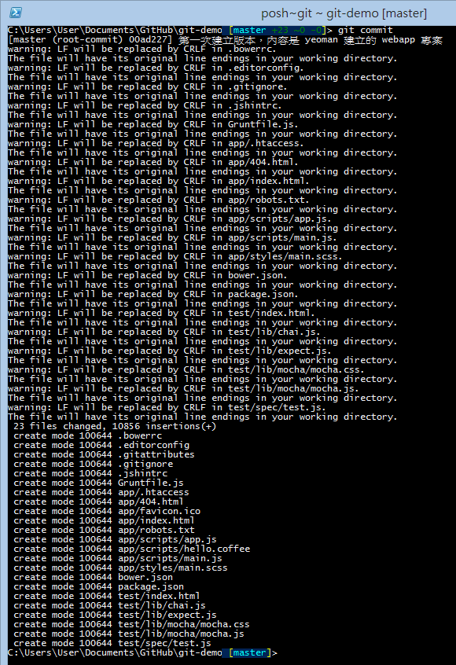

# Day 04: Common Git Version Control Commands

This article will help you learn several of the most important and basic version control tasks, including basic file operations such as adding, deleting, renaming files, committing changes (creating new versions), and querying history records.

## Preparing the Working Directory

Reviewing the content from the previous article "Day 03: Creating a Repository," let's directly create a local repository to begin all the exercises in this article.

```
mkdir git-demo
cd git-demo
git init
```

## Adding Files

Let's put some files in the working directory. Any files will do; just copy some existing files and directories into the current working directory.

For this article, I will use the [YEOMAN](https://yeoman.io/) tool to quickly generate a webapp example website. With just one command, you can create a complete website:

```
yo webapp
```

**Note**: Regarding the use of [YEOMAN](https://yeoman.io/) on the Windows platform, you can refer to the author's article [How to Install and Use Yeoman 1.0 Related Tools on Windows Platform](https://blog.miniasp.com/post/2013/08/11/Yeoman-1-0-Installation-and-Usage-on-Windows), which describes the complete installation and usage process in detail.

After adding files, if you're still in the Git Shell interface, you should immediately see a prompt like the following:


That is, the following prompt located after the path:

```
[master +10 ~0 -0 !]
```

In this prompt section, you can see several things:

* master represents the current working directory is the **master** branch, which is also Git's default branch name.
* "Red" numbers all represent Untracked files, which means these changes will not enter version control.
* +10 represents 10 "added" files
* ~0 represents 0 "modified" files
* -0 represents 0 "deleted" files

If you want to add these new files to Git version control, you must execute the following command:

```
git add .
```

In this way, all files, directories, and all files in subdirectories under this working directory will all be added to the [index] or [cache] of this Git working directory. Please note: At this time, no version has been created. It just tells Git that these files are "about to" be added to the Git repository.

As shown in the following figure, this is the result after I execute `git add .` here. The warning message that occurs here is not very serious. Those interested in understanding can refer to another article by the author: [Notes on Git for Windows Line Ending Conversion (CRLF)](https://blog.miniasp.com/post/2013/09/15/Git-for-Windows-Line-Ending-Conversion-Notes).


However, what's interesting is that the originally "red numbers" have now turned into "green numbers." The meaning represented here is:

* "Green" numbers all represent Staged (ready) files, which means these changes will enter version control.
* +23 represents 23 "added" files will be created as a version
* ~0 represents 0 "modified" files will be created as a version
* -0 represents 0 "deleted" files will be created as a version

But wasn't it originally only +10 (red)? How did it become +23 (green) after execution?

We execute `git reset` to reset the index state of the working directory, then execute `git status` again to query the detailed state of the current working directory, as shown in the following figure:


You can see that only "files and directories under the first-level directory" are listed here because git won't check how many files are not tracked in subdirectories at this time.

When we execute `git add .` and then execute `git status` again to query the status, you can find that files in subdirectories have all been added, so this number increases, as shown in the following figure:


## Adding Partial Files

The `git add .` command just mentioned will automatically add all files (including files in subdirectories) to the working directory index. Sometimes we only want to add specific directories or specific files to the version. At this time, you can also specify specific directories or use wildcards to add files.

Let's execute `git reset` again to reset the index state of the working directory, then use `git add app` to add the app folder and all files under it, and use `git add .*` to add all files starting with a "dot," as shown in the following figure:


**Note**: The `.*` wildcard cannot add all "dot" files because the first character of `.` can only match one directory. If you want to add all files starting with a dot, you should use `.??*` to make sure it matches files starting with a dot.

## Committing Changes

After adding files to the index, you can commit changes to create a version. The commit command is:

```
git commit -m "Initial commit"
```

The `-m` parameter is followed by the commit message. This message will be recorded in the version history. It is recommended to write meaningful commit messages to help you and others understand the purpose of this version in the future.


## Viewing Commit History

After committing, you can use the `git log` command to view the commit history:

```
git log
```


You can also use the `git log --oneline` parameter to display a simplified version of the log:

```
git log --oneline
```



## Modifying Files

Now let's try modifying files. Open any file in the working directory and make some changes, then save it.

After modification, if you execute `git status`, you will see information about modified files:


You can see that the modified files will be displayed in red, and the number of modified files is displayed as ~1.

## Viewing File Differences

Before committing modified files, you may want to see what changes were made. You can use the `git diff` command:

```
git diff
```


The git diff command will display the differences between the working directory and the index.

## Committing Modified Files

To commit modified files, you also need to execute `git add` first to add the modified files to the index, then execute `git commit`:

```
git add .
git commit -m "Update files"
```


## Deleting Files

If you want to delete files and have this deletion action recorded in the version, you can use the `git rm` command:

```
git rm [filename]
```

After executing this command, the file will be deleted from both the working directory and the index. Then execute `git commit` to commit this deletion action.


## Renaming or Moving Files

If you want to rename or move files, you can use the `git mv` command:

```
git mv [old_filename] [new_filename]
```

This command will rename or move the file and automatically add this change to the index. Then execute `git commit` to commit this change.


## Today's Summary

Today we learned several basic Git commands, summarized as follows:

* `git add [file]` - Add files to the index
* `git add .` - Add all files in the current directory to the index
* `git commit -m "message"` - Commit changes from the index to create a new version
* `git status` - View the current state of the working directory
* `git log` - View commit history
* `git log --oneline` - View simplified commit history
* `git diff` - View differences between the working directory and the index
* `git rm [file]` - Delete files from the working directory and index
* `git mv [old] [new]` - Rename or move files
* `git reset` - Reset the index state

## Reference Links

* [Git - Recording Changes to the Repository](https://git-scm.com/book/en/v2/Git-Basics-Recording-Changes-to-the-Repository)

---

* [Back to Table of Contents](README.md)
* [Previous Day: Creating a Repository](03.md)
* [Next Day: Understanding the Relationship Between Repository, Working Directory, Objects, and Index](05.md)

---
