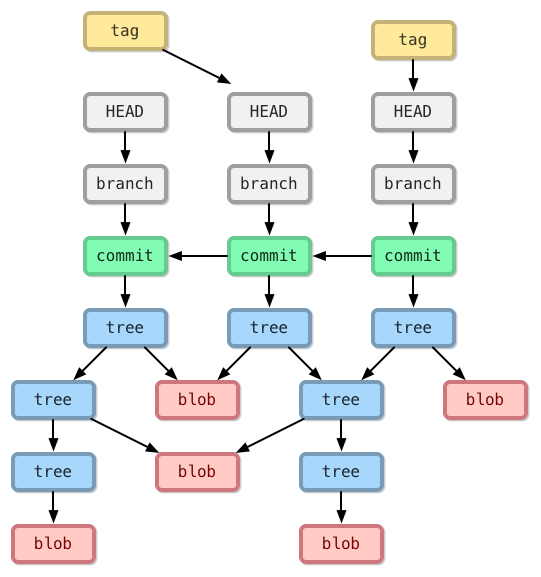

# Day 06: Parsing Git Data Structure - Object Structure

In Git's data structure, "objects" are an "immutable" file type. All files stored in the "object storage" usually only go in and don't come out, and their content won't be modified. The reason is that if you tamper with the file content, the SHA1 hash value calculated from the new content will be different from the original object's file name, which will cause Git to fail to continue executing, and relatively also provides a certain degree of protection for the Git repository. This article will introduce Git's object structure in more detail, and finally will also explain in detail the process and logic of how objects are generated through a video.

## About Object Database

As mentioned in the previous article, whether blob objects or tree objects, these are all objects, and these objects will be stored in a so-called "object storage" (object storage), and this "object storage" is by default in the objects directory of the "repository", as shown in the following figure:

However, each "object" in the Git repository performs a SHA1 hash operation on the "file content" to calculate a hash value, and uses this hash value as the name of the object (file name). Taking 8a6b275638f3cf164395e65066a1132bb36b7896 as an example, Git will first take the first two characters (8a) as the directory, and then use the remaining hash value as the file name (6b275638f3cf164395e65066a1132bb36b7896). The physical directory and files of these objects will also be placed in the .git\objects directory, as shown in the following figure:

## Object Types

In this "object database", there are 4 types of objects:

1. **blob object**: This is the "content" of a file in the working directory, and only the content. When you execute the git add command, the content of these new files will be immediately written as blob objects. The file name is the hash result of the object content, without any other information. Information such as file time, original file name, or other file information will be stored in other types of objects (i.e., tree objects).

2. **tree object**: This type of object stores all information under a specific directory, including file names under that directory, corresponding blob object names, symbolic links, or other tree objects. Since tree objects can contain other tree objects, browsing tree objects is actually the same as "folders" in the file system. Simply put, tree objects are snapshots of a folder under a specific version.

3. **commit object**: Used to record which tree objects are included in the version. A commit object represents a Git commit, recording which tree objects are in a specific commit version, as well as the time of the version commit, commit message, etc. Usually, it also records the name of the previous commit object (only the first commit version does not have a previous commit object name).

4. **tag object**: This is a container, usually used to associate with a specific commit object (can also be associated with specific blob and tree objects), and stores some additional reference information (metadata), such as the tag name. The most common use of tag objects is to mark a specific version of a commit object with an easy-to-understand name, which may represent a specific release version or a version with special significance.

Git will create a corresponding blob object for each file in each version. Similarly, the file name of the blob object is calculated in the above manner. From these blob files, you cannot see any relationship with the version. You must use tree objects (snapshots of folders) and commit objects (snapshots of each version) to associate the relationship between these blobs and versions.

All objects are compressed using the zlib algorithm, which can not only effectively improve file access efficiency but also use the delta compression algorithm to save space when packing in the future. It will automatically find similar blobs, automatically calculate the differences between blobs, and store these differences in a file called *packfile*, which can greatly save disk space). Usually, *packfiles* are placed in the .git\objects\pack directory, as shown in the following figure:

The relationship between these four types of objects can be referred to in the following diagram:

However, just looking at text and diagrams may still be difficult to see the relationship between these object types. It's okay. I have specially recorded a tutorial video to try to explain Git's object structure and the process of generating objects using git commands, so that everyone can more clearly understand how Git generates and manages these files.

YouTube video link: [Understanding the Relationship Between Object Database and Objects in Git Data Structure](https://www.youtube.com/watch?v=PZbSRy_ow0U)

## Advantages of Object Structure

You should gradually understand how beautiful Git's "object" design is. In the first article, we mentioned several important designs of Git. Let's re-list a few designs related to "object" characteristics:

* Efficient handling of large projects
* Not only will a complete repository be cloned to the local machine, but since all blob objects are content addressable through "content", finding the same content between different versions is very efficient.
* Historical record protection
* In the Git version control process, each commit generates a commit object, and the name of this commit object is generated through the content of the commit object. Furthermore, the commit object is associated with tree objects, and the name of the tree object is generated through the content of the tree object. Tree objects are associated with blob and tree objects, and the names of these objects are also generated through content. Layer by layer association like this, if you really want to tamper with the history of a certain version today, the difficulty is quite high!
* Since Git repositories are often cloned or forked, as long as a repository is cloned, if any object in the source repository is modified, it will be difficult for these cloned repositories to be merged back, so you can hardly arbitrarily tamper with version records.
* Regular packing of objects
* The "objects" we mention in Git actually represent files in the repository. In the process of version changes, the code or other files in the project will be updated. Each time it is updated, as long as the file content is different, a new "object" will be created, and all these files with different content will be retained.
* You can imagine that as a project becomes larger and has more versions, there will be more and more objects. Although each file can be compressed individually to make the file smaller, too many files will still make file access less and less efficient. Therefore, Git's design has a mechanism that can automatically pack a group of old "objects" into a packfile to improve file access efficiency.
* Those newly added files will still exist as single files, which also means a "file" in a Git repository is a Git "object," but it needs to be repacked every once in a while.
* Presumably, Git will automatically perform actions such as repacking, but you can still issue commands to execute them yourself. For example: git gc
* If you want to check whether the file system maintained by Git is complete, you can execute the following command: git fsck

## Today's Summary

"Objects" in Git are very important, and their characteristics are also very important. Although we usually don't need to directly touch these files during the process of operating Git commands, understanding the existence of these objects does help you better understand Git's operation mode and Git's unique design concepts.

## Reference Links

* [Git Internals - Git Objects](https://git-scm.com/book/en/Git-Internals-Git-Objects)
* [Pro Git Book](https://progit.org/)
* [Git Magic - Traditional Chinese Version](https://www-cs-students.stanford.edu/~blynn/gitmagic/intl/zh_tw/)
* [Git (software) - Wikipedia, the free encyclopedia](https://en.wikipedia.org/wiki/Git_(software) "Git (software) - Wikipedia, the free encyclopedia")

---

* [Back to Table of Contents](README.md)
* [Previous Day: Understanding the Relationship Between Repository, Working Directory, Objects, and Index](05.md)
* [Next Day: Parsing Git Data Structure - Index Structure](07.md)

---
