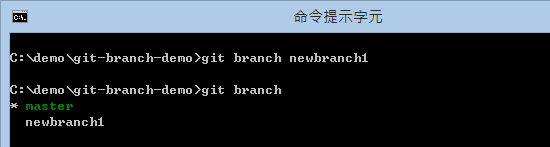
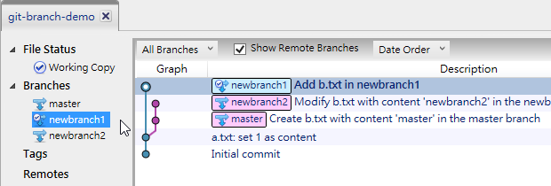

# Day 08: Basic Concepts and Usage of Branches

In Git, **branches** are a very important mechanism and must be used with special care because a project can't branch indefinitely. Eventually, branches must be merged, but merging is a topic for later. This article will first help you learn the basic concepts and usage of Git branches.

## Basic Concepts of Branches

The main purpose of using the "branch" mechanism in version control is to solve the problem of version conflicts during the development process. I believe that many people who have used any version control mechanism will think that "branching" is the culprit that "causes version conflicts" because when you start branching, you will definitely think about the issue of merging. After branching, if someone modifies the same line of the same file as you, it will cause a "version conflict." Whenever a conflict occurs, you must take the trouble to resolve it.

When a conflict occurs, sometimes you can easily decide to use your own version or the other party's version, but sometimes it's not that easy. When it's complicated, you also have to find the person who originally modified these lines based on the conflicting fragment, coordinate the impact of each other's changes on the system, and finally decide how to merge. Such problems are very tedious, so many people will try to avoid "branching" to avoid "conflicts."

However, if the development team gets larger and there are more and more system functions, even if you don't branch the version, everyone's conflicts will still emerge endlessly. Sometimes it's not even a conflict problem, but A finished a function and was overwritten by B's subsequent version without any conflict, which is not what everyone wants to see. However, this is also an "invisible conflict" situation.

In the past, in the centralized Subversion version control mechanism, there was also the concept of branching, which could work very well. Of course, if your software architecture is not good enough, if you are not very clear about the concept of branching and the use of tools, I believe that using "branching" will not be smooth. This is an inevitable result. There will never be a version control tool in this world that allows you to "learn without effort, pain-free, naturally learn branching." It depends on people. If people's concepts are wrong, no tool will work smoothly.

Since Git is a "distributed version control mechanism," in the distributed version management scenario, the last thing you want to do is "management," so Git rarely has so-called management mechanisms or permission control mechanisms. The only thing it wants to do is to allow everyone to smoothly "branch" and "merge."

Taking the "remote repository" mentioned in [Day 03: Creating a Repository] as an example, you can imagine: from the moment we use the `git clone` command, it's actually the beginning of "branching." You copy a complete repository from the remote repository, then start creating versions on your own local machine. After the software is revised to a certain extent, you "merge" it back. It's just that the merge command at this time is called `git push`.

This situation of branching and merging is everywhere in the Git version control process. Remote repositories can have branches, local repositories can have branches. You can merge (pull) from any remote branch to a local branch, or you can push a local branch to a remote branch. Of course, you can also merge from any local branch to another local branch. It can be imagined that if "branching" does not have a good control logic, you can finally combine various extremely complex version control scenarios, which is not what everyone wants to see. Therefore, it is really important to learn "branching" and "merging" well. For example, git-flow is a very popular branch management model. This is not a tool, but a logic for managing branches. I will explain this part in my future articles.

During the development of the Linux kernel, tens of thousands of developers from all over the world participated together. In order to manage such a large development team, Git was born. This is a distributed version control mechanism. Everyone has a complete version. After the version is distributed, everyone must manage their own version and then merge it back according to the team's requirements. However, before merging back, this mechanism ensures that everyone can develop smoothly without being affected by any other developer's version. Git has indeed done this while also reducing the complexity of version control.

Of course, I must also say that if the team participating in software development only has two or three people, and these people are still gathered together, then it is indeed not necessary to use Git version control. Using Subversion is also a very good choice, simple and intuitive. If problems are encountered during the development process, they can be solved by coordinating with those around you. This is much more convenient than letting the whole team understand Git.

If your team has a certain scale, or everyone is not working together, and you need to do version control, perhaps Git is a good choice. However, having a consistent version control concept or habit among the work team is also a very important thing.

## Preparing the Working Directory

We quickly create a Git repository and working directory with two versions through the following commands:

```
mkdir git-branch-demo
cd git-branch-demo
git init

echo. > a.txt
git add .
git commit -m "Initial commit"

echo 1 > a.txt
git add .
git commit -m "a.txt: set 1 as content"
```

Then use `git log` to get the version information as follows:

```
C:\demo\git-branch-demo>git log
commit b917758c0f2f347a895ee5bbb5e5c8228f66335a
Author: Will <doggy.huang@gmail.com>
Date:   Fri Oct 4 20:58:16 2013 +0800

    a.txt: set 1 as content

commit aa3e4fe2ee065b046e00a74b1f12a0b0f8154003
Author: Will <doggy.huang@gmail.com>
Date:   Fri Oct 4 20:04:39 2013 +0800

    Initial commit
```

Then we use the `git branch` command to learn that we already have a branch named `master`, which is the default branch in the Git repository. If you try to delete this branch through `git branch -d master`, you will get the error message `error: Cannot delete the branch 'master' which you are currently on.` This means "when your current working directory branch is set to master, you cannot delete the current branch," which means you must first switch to "another branch" before deleting this branch.


Of course, we now only have one branch, so naturally we cannot delete ourselves.

## Creating Branches

There are two most common ways to create branches:

1. Create a branch, but keep the current working directory on your own branch: `git branch [BranchName]`

   When I execute the `git branch newbranch1` command, this will create a new `newbranch1` branch. We then use `git branch` to see how many branches there are currently. You will see two, but the current working directory will still stay on the `master` branch, as shown in the following figure:

   

   If you create a version in the current working directory at this time, it will be created in the `master` branch. We create a new file at this time and create a version through `git commit`. The commands are as follows:

   ```
    echo master > b.txt
    git add .
    git commit -m "Create b.txt with content 'master' in the master branch"
   ```

   Please remember: We first created two versions in the default `master` branch, then created a branch, and then created another version in the `master` branch.

2. Create a branch and switch the current working directory to the new branch: `git checkout -b [BranchName]`

   Next, we create a branch using the second method. When I execute the `git checkout -b newbranch2` command, not only will a new branch be created, but the current working directory will also be switched to another branch. Finally, use `git branch` to see how many branches there are currently. You will see that there are already three, and the current working directory has been switched to the `newbranch2` branch just created, as shown in the following figure:

   

   If you create a version in the current working directory at this time, it will be created in the `newbranch2` branch. We create a new file at this time and create a version through `git commit`. The commands are as follows:

   ```
    echo newbranch2 > b.txt
    git add .
    git commit -m "Modify b.txt with content 'newbranch2' in the newbranch2 branch"
   ```

   Please remember: We first created two versions in the default `master` branch, then created a branch, then created another version in the `master` branch, then created a new `newbranch2` branch based on the current state of the `master` branch, switched the working directory to the `newbranch2` branch, and then created another version. If we execute `git log` at this time, it will display 4 version records because the branch will automatically inherit the complete history of the source branch.

**Note**: For detailed command and parameter descriptions, you can enter `git help branch` to query the complete documentation.

```
git branch [branch_name]
```

## Switching Branches

If you want to switch the working directory to another branch, you can enter the following command (without the -b parameter):

```
git checkout [branch_name]
```

Assuming we want to switch the working directory to the `newbranch1` branch, we can enter `git checkout newbranch1` to switch over. Then you can immediately use `git branch` to check whether the current working directory has switched over, and then use `git log` to check the historical records of the current `newbranch1` branch. Because this is the first branch we created, theoretically this branch state should only have two historical records, as shown in the following figure:


**Note**: For detailed command and parameter descriptions, you can enter `git help checkout` to query the complete documentation.

```
git checkout [branch_name]
```

## Deleting Branches

If you want to delete an existing branch, just as we mentioned in **Preparing the Working Directory**, the command is as follows:

```
git branch -d [branch_name]
```

It was also mentioned earlier that you cannot delete the branch specified by the current working directory. You must first switch to another branch before deleting your current branch. For example, if you want to delete the current `newbranch1` branch, then you must first switch to another branch, such as the `master` branch, and then issue the `git branch -d newbranch1` command to delete the branch, as shown in the following figure:


## Checking Which Branch the Working Directory is On

You can use the `git branch` command to see which branch you are currently on, as shown in the following figure:


## Viewing the Complete Branch Graph of the Git Repository

Finally, I use the SourceTree tool to display the current branch graph of the Git repository. Currently, we only have two branches, one is the `master` branch, and the other is the `newbranch2` branch, because the `newbranch1` branch has been deleted during the practice. In order to give our branches a "tree" feeling, next I will demonstrate how to recreate a branch with the same state as the previous `newbranch1` and add a new version under this branch.

I don't know if you still remember, we created the `newbranch1` branch after creating two versions in the `master` branch. Now let's first find the commit object id of this version, which can be obtained through `git log`, as shown in the following figure:


So my commit object id is: b917758c0f2f347a895ee5bbb5e5c8228f66335a

Then I first switch the working directory to this version, which can be completed through `git checkout [commit_id]`:

```
git checkout b917758c0f2f347a895ee5bbb5e5c8228f66335a
```

At this time, if you use `git log`, you should only see two version records because we have switched the state of the working directory to this version. From the following figure, you can see that when we execute `git checkout b917758c0f2f347a895ee5bbb5e5c8228f66335a`, a pair of messages will appear. These messages are very important and must be understood, as shown in the following figure:


First, since you switch the version of the working directory to an "old" version, you will be prompted that this working directory has entered the so-called **detached HEAD** state. This is a reminder that "the current working directory is not at the latest version." You can switch to any version of the Git repository at any time, but since this version already has a "next version," if you execute `git commit` in the current "old version," this new version will not be tracked for changes, so it is recommended not to do this.

If you want to create a trackable version in the **detached HEAD** state, then the correct method is to track through "creating a branch." Now we will create a new `newbranch1` branch in this version and switch the working directory over. The command is as follows:

```
git checkout -b newbranch1
```


Then we create a new file `b.txt` with the content `newbranch1` and create a new version. The commands are as follows:

```
echo newbranch1 > b.txt
git add .
git commit -m "Add b.txt in newbranch1"
```

Okay, we now have two branches besides `master`, and both branches have their own versions. Think about what this tree looks like in your mind!

Next, we open the SourceTree tool and add this working directory to the SourceTree management tool:


After adding, we switch to the branches of this Git repository. There are three in total. Let's switch to each one:





The earliest version is at the bottom, and the latest version is at the top. When we switch to different branches, you can see that the three branch diagrams are the same, only the default "light bar" is different. First, from the pictures, what you see is "the entire Git repository" with all versions, all branches, and which version the branch started from. The "light bar" is the "latest version" of that branch located at which version in the entire Git repository.

## Today's Summary

In fact, using branches in Git is an easy thing. The difficult part is to let everyone know what "branching" is doing, and whether everyone's **imagination** of "branching" is consistent. As long as everyone's imagination of branching is consistent, there won't be too much gap in team version control.

For me, I would imagine a branch as a kind of "snapshot" function, creating a snapshot of a certain commit version and its historical versions, then copying one, and giving it a branch name. You can create versions on these branches and wait for future merging.

The entire Git repository will retain all branches and versions, and finally present a tree-structured branch diagram. Finally, through the SourceTree tool, we can clearly see the branch situation and version changes in the Git repository. I saw this diagram very early, but the first time I looked at it, I couldn't understand it at all. I just thought it was "a diagram" with no feeling. But since I learned more and more about Git, this branch diagram allows me to understand the changes in the entire Git repository at a glance and better grasp the version changes of Git.

I hope that through my text and command demonstrations with pictures, I can help you outline a branch structure in your own mind and have a deeper understanding of the Git branch structure.

Let me reorganize the Git commands and parameters learned today:

* git branch
* git branch \[branch\_name]
* git checkout -b \[branch\_name]
* git checkout \[branch\_name]
* git branch -d \[branch\_name]
* git log

---

* [Back to Table of Contents](README.md)
* [Previous Day: Parsing Git Data Structure - Index Structure](07.md)
* [Next Day: Comparing File and Version Differences](09.md)

---
