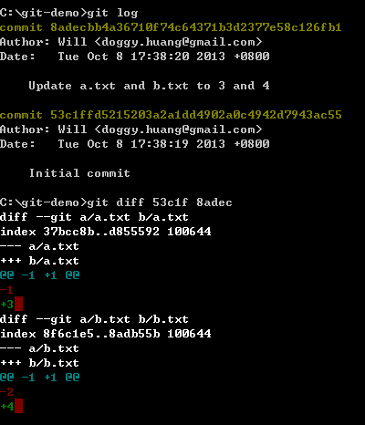

# Day 09: Comparing File and Version Differences

In the process of using any version control software, you often need to view historical records and compare differences between versions. How to compare in Git will be the focus of this article.

## Preparing the Working Directory

We quickly create a Git repository and working directory with two files and two version change records through the following commands:

```
mkdir git-demo
cd git-demo
git init

echo 1 > a.txt
echo 2 > b.txt
git add .
git commit -m "Initial commit"

echo 3 > a.txt
echo 4 > b.txt
git add .
git commit -m "Update a.txt and b.txt to 3 and 4"
```

## Basic Concepts of git diff

To compare the differences between two versions in Git, you usually use the `git diff` command. Let's first execute a simple command to compare the differences between two versions:

1. First execute `git log` to get version information and get the ids of the last two commit objects
2. We execute the `git diff commit1 commit2` command to compare the differences between the two versions, where commit1 should use the older version and commit2 should use the newer version.

As shown in the following figure:



From the output of the `git diff` execution, we can get an execution result. Since we have two files in these two repositories, and both have changed between these two versions, it will list two segments of "difference comparison" results.

You can see from the above figure that each segment starts with `diff --git`, representing which two files git is comparing.

The second line `index 37bcc8b..d855592 100644` represents the "Header Line" when git performs this comparison. There may be several lines here, and the information is not necessarily just these. Many additional information about this difference comparison will be marked here. For example, the index line, the two hash ids after it (`37bcc8b..d855592`) represent the two blob object ids in the Git object storage (object storage), used to compare these two blob objects. The `100644` after it is a git attribute, a bit like file attributes in a Linux environment, such as declaring this is a file, directory, readable, writable, executable, etc. Here are some common examples of git attributes:

```
0100000000000000 (040000): Directory
1000000110100100 (100644): Regular non-executable file
1000000110110100 (100664): Regular non-executable group-writeable file
1000000111101101 (100755): Regular executable file
1010000000000000 (120000): Symbolic link
1110000000000000 (160000): Gitlink
```

For related links, please refer to the following discussion thread:

* [How to read the mode field of git-ls-tree's output](https://stackoverflow.com/a/8347325/910074)

The third line `--- a/a.txt` represents the "older" version of the two compared versions.

The fourth line `+++ b/a.txt` represents the "newer" version of the two compared versions.

The fifth line `@@ -1 +1 @@` represents the total number of lines in the old version and the new version of this file. -1 represents the old version has only 1 line, and +1 represents the new version also has only 1 line.

Finally, all changed content is listed. There are three possible representations here:

* Starting with a minus sign -, it means this line was deleted in the process from the old version to the new version.
* Starting with a plus sign +, it means this line was added in the process from the old version to the new version.
* Starting with a space character, it means this line appears in both versions without any changes.

This completes the difference comparison of the first blob object in these two versions, and then it will display the difference comparison of the second blob object in that version, and so on.

When using `git diff` in Git, in fact, the tree object is the unit of comparison. We learned from the diagram and video in [Day 06: Parsing Git Data Structure - Object Structure] that each commit object actually includes a tree object of the root directory. So when we just used `git diff` to compare two commit objects, we were actually comparing the tree objects under those commit objects, and the comparison process will recursively continue down. From this, you should be able to feel that Git's diff comparison mechanism is very powerful. You can quickly compare changes between any two versions.

When using the `git diff` command, there are mainly three sources of tree objects:

* Tree objects that exist in all commit graphs, which means any tree object in any version.
* Index, representing the information after you have sent the file status to the "index database." In fact, tree objects have been created when using the `git add` command.
* Your current working directory, although changes to the working directory have not yet become tree objects, they can be used through `git diff`.

## Four Basic Comparison Methods

To compare any two versions through the `git diff` command, there are usually the following four command usages:

1. git diff

   Without any parameters, what is compared is the difference between the "working directory" and the "index." This is a very commonly used command because before you execute the `git add .` command, you can first use `git diff` to see what you have changed.

   **Note**: In fact, in the process of using Git version control, before executing `git commit`, it is indeed possible to execute the `git add` command several times to confirm which files to add to the index, and finally commit to the version.

2. git diff commit

   If you only add a commit id after `git diff`, what is compared is the "working directory" and the "tree object in the specified commit object."

   The most commonly used command is `git diff HEAD` because this represents comparing the "working directory" with the "latest version of the current branch." This comparison method will not compare the "index" state, so you must distinguish clearly what tree object source you are comparing.

3. git diff --cached commit

   Before executing `git commit`, the index state should be ready. So if you want to compare the "current index state" with the "tree object in the specified commit object," you can use this command to complete the comparison task.

   The most commonly used command is also `git diff --cached HEAD`, which means comparing the "current index state" with the "latest version of the current branch." This comparison method will not compare the file content of the "working directory," but directly compares the difference between the "index" and the "current latest version." This helps you find out what changes are there before executing `git commit`, which means what changes you will have created as a version.

   **Note 1**: `git diff --cached` and `git diff --staged` have exactly the same result. `--staged` is just an alias for `--cached` to make it easier for you to remember!

   **Note 2**: `git diff --cached` and `git diff --cached HEAD` also have exactly the same result when executed. The final HEAD can be omitted.

4. git diff commit1 commit2

   The last one is to compare the difference between two different versions (commit ids). This command can skip any changes in the "index" and "working directory" and directly compare two specific versions. In fact, Git compares the tree objects in those two specific version commit objects.

   The most commonly used command is `git diff HEAD^ HEAD`, which means you want to compare the difference between [the previous version of the latest version] and [the latest version]. The meaning of HEAD and ^ here will be explained in future articles.

## Today's Summary

The `git diff` introduced today is a very commonly used command, and you should use it proficiently. Let's finally review the differences between its commonly used commands:

```
git diff                 => working directory vs index
git diff HEAD            => working directory vs HEAD
git diff --cached HEAD   => index     vs HEAD
git diff --cached        => index     vs HEAD
git diff HEAD^ HEAD     => HEAD^   vs HEAD
```

Let me reorganize the Git commands and parameters learned today:

* git log
* git diff
* git diff HEAD
* git diff --cached
* git diff --staged
* git diff HEAD^ HEAD

## Reference Links

* [git-diff(1) Manual Page](https://www.kernel.org/pub/software/scm/git/docs/git-diff.html)

---

* [Back to Table of Contents](README.md)
* [Previous Day: Basic Concepts and Usage of Branches](08.md)
* [Next Day: Understanding Git Object Absolute Names](10.md)

---
