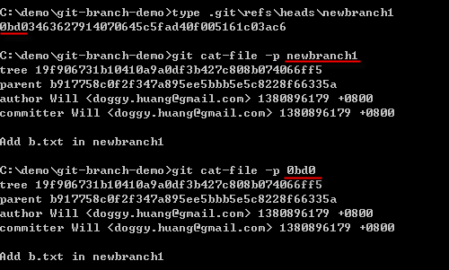
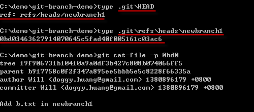
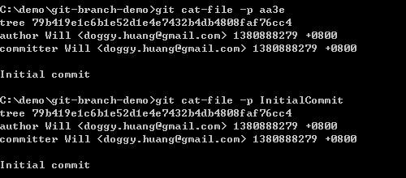
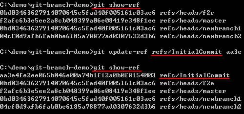

# Day 11: Understanding Git Object References and Symbolic References

After understanding the "absolute names" of Git objects, next we will introduce the most commonly used "reference names" in the Git version control process.

## Understanding Object Reference Names

Reference names (ref) are simply a "pointer" to Git objects, or another "memorable name" relative to "absolute names," using a predefined or your own defined name to represent a certain Git object.

The "branch names" we learned before or the HEAD we have used (representing the latest version), or the "tag names" we will learn later, these are all "reference names," in short, to help you remember.

We will use "branch names" as an example to explain what the physical structure of "reference names" is. In the following figure, we use `git branch` to get all branch names. You can see that we currently have three branches. However, these three branch names are actually "reference names," which means these three "reference names" correspond to three commit objects in the Git object repository. In the following figure, you can also see that these branch reference names are actually just files. All "local branch" reference names are located in the `.git\refs\heads` directory:

Then I will use the following figure to prove how this file is linked to the "absolute name." I first use `git branch` to get all branch names and find that the current "working directory" points to the `newbranch1` branch. At this time, we can get all version records of this branch through `git log --pretty=oneline`. By default, these branch "reference names" will point to the "latest version" of the branch. We just need to open the content of the `.git\refs\heads\newbranch1` file to see that this is just a plain text file pointing to the "latest version" in the version history. Finally, use `git cat-file -p 0bd0` to get the content of that commit object and `git show 0bd0` to get the change record of that version, thereby proving that these files are the main purpose of "reference names."

We then use commands to see the content of reading a specific commit object using "absolute names" and "reference names," proving that the results of these two commands are the same:

In most cases, "reference names" usually point to a commit object, but it is not necessary. You can also point to other Git object types, such as blob objects, tree objects, tag objects, etc.

## About the .git/refs/ Directory

From the above examples, you can actually see that all "reference names" are files and are all placed in the `git/refs/` directory. The directory locations where Git's reference names are placed mainly have three:

* Local branches: `.git/refs/heads/`
* Remote branches: `.git/refs/remotes/`
* Tags: `.git/refs/tags/`

Let me give you a simple example. If you create a branch named `f2e`, at this time you will know that the "reference name" of the local branch will create the `.git/refs/heads/f2e` file, as shown in the following figure:

In fact, the "full name" of this `f2e` should be called `refs/heads/f2e`. It's just that Git allows you to enter abbreviations to facilitate quick input of reference names. As shown in the following figure, these three ways of using "reference names" are all feasible:

However, when you enter the "abbreviation" of the reference name, Git will search for the appropriate reference name in the following order by default. As long as the corresponding file is found, it will immediately return the "object absolute name" of that file content:

* `.git/<reference abbreviation>`
* `.git/refs/<reference abbreviation>`
* `.git/refs/tags/<reference abbreviation; tag name>`
* `.git/refs/heads/<reference abbreviation; local branch name>`
* `.git/refs/remotes/<reference abbreviation>`
* `.git/refs/remotes/<reference abbreviation; remote branch name>/HEAD`

For example, when you enter the `git cat-file -p f2e` command, Git will find the relative "reference name file" in the following order and extract the content of that file (i.e., the absolute name of the Git object):

* `.git/f2e` --> File not found
* `.git/refs/f2e` --> File not found
* `.git/refs/tags/f2e` --> File not found
* `.git/refs/heads/f2e` --> **Reference name found, no further search**
* `.git/refs/remotes/f2e`
* `.git/refs/remotes/f2e/HEAD`

## Understanding Object Symbolic Reference Names (symref)

Symbolic reference names (symref) are actually also a type of reference name (ref), just with different content. We can see the difference in content from the following figure. "Symbolic references" will point to another "reference name" and the content starts with `ref:`:

In Git tools, some special symbolic references are maintained by default to facilitate quick access to commonly used commit objects, and these objects are stored in the `.git/` directory by default. These symbolic references have the following four:

* HEAD
* Will always point to the "latest version" in the "branch" set in the "working directory."
* So when you execute `git commit` in this branch, this `HEAD` symbolic reference will also be updated to that commit object of the latest version of this branch.
* ORIG_HEAD
* Simply put, it is the "previous version" of the HEAD commit object, often used to restore the previous version change.
* FETCH_HEAD
* When using a remote repository, you may use the `git fetch` command to retrieve all objects from the remote repository. This FETCH_HEAD symbolic reference will record the "absolute name" of the HEAD (latest version) of each branch in the remote repository.
* MERGE_HEAD
* When you perform merge work (the topic of merging will be mentioned in future articles), the absolute name of the commit object from the "merge source" will be recorded in this MERGE_HEAD symbolic reference.

## Usage of General References and Symbolic References

We know that "reference names" have special purposes and are usually used in scenarios such as "local branches," "remote branches," and "tags," but in fact you can create any number of "custom reference names." You can freely create "general references" through `git update-ref`.

I attempt to create a general reference named `InitialCommit` and point to the first version in the Git repository. Please refer to the following figure for the command execution sequence to learn how to create general references:

After creation, the default file will be placed in the `.git` folder, and at this time, you can access the content of specific Git objects with both "absolute names" and "reference names":

**Note**: Please remember that reference names can point to any Git object and are not limited to commit objects.

To create a more formal reference name, it is best to add the `refs/` prefix, for example: `git update-ref refs/InitialCommit [object_id]`.

To delete a general reference, you can use the `-d` option. As shown in the following figure:

To display all references, you can use the `git show-ref` command, as shown in the following figure:

To create and delete "symbolic references," you can refer to the following figure for the usage of `git symbolic-ref`. Please look at the figure and tell the story. After understanding, you will really find that Git is very flexible and powerful in the use of references. Also, executing `git show-ref` will only display those references in the `.git\refs` directory, and it is the same for both "general references" and "symbolic references":

Earlier in this article, it was mentioned that you can create references to the following directories:

* `.git/<reference abbreviation>`
* `.git/refs/<reference abbreviation>`
* `.git/refs/tags/<reference abbreviation; tag name>`
* `.git/refs/heads/<reference abbreviation; local branch name>`
* `.git/refs/remotes/<reference abbreviation>`
* `.git/refs/remotes/<reference abbreviation; remote branch name>/HEAD`

Custom references are usually created in the first two paths to avoid confusion with our use of "local branches," "remote branches," and "tags." However, you can indeed use `git update-ref` to create any custom reference. If you create a custom reference in `refs/heads/Will`, it is equivalent to creating a branch named `Will`. Git is really that simple. The more you understand Git's internal structure, the more you will love Git's various features.

## Today's Summary

We know that "reference names (ref)" are simply a "pointer" to Git objects, used to point to specific Git objects. So you can imagine "reference names" as aliases for Git object absolute names, used to help memory. In Git, there are many mechanisms to help you control projects, such as "branches," "tags," etc. These mechanisms are actually accomplished by "references" under the hood.

Git reference names are further divided into "general references" and "symbolic references." The two have the same purpose, only the content is a little different. "Symbolic references" will point to another "general reference," while "general references" point to the "absolute name" of a Git object.

Let me reorganize the Git commands and parameters learned today:

* git branch
* git log --pretty=oneline
* git log --oneline
* git cat-file -p [ref or object_id]
* git show [ref or object_id]
* git update-ref
* git symbolic-ref
* git show-ref

---

* [Back to Table of Contents](README.md)
* [Previous Day: Understanding Git Object Absolute Names](10.md)
* [Next Day: Understanding Git Object Relative Names](12.md)

---
