第 02 天：在 Windows 平台必装的三套 Git 工具
==========================================

要开始使用 Git 版本控制，首先要安装适当的 Git 工具，这个系列的文章主要还是以 Windows 平台为主，这篇文章将会介绍三套我们最常用的 Git 版控工具，并介绍这几套工具之间的异同之处，还有在何时要用什么工具。

第 1 套：[Git for Windows](http://msysgit.github.io/)
---------------------------------------------

这是一个可以在 **命令提示字元** (Command Prompt) 下执行的一套指令列工具，目前市面上所有 Git 的 GUI 工具，其实骨子里都是执行这些较为底层的 Git 工具，所以是一套必备的 Git 管理工具，非装不可！

以下是安装过程：

* 先连到 http://msysgit.github.io/ 官网，准备下载安装档

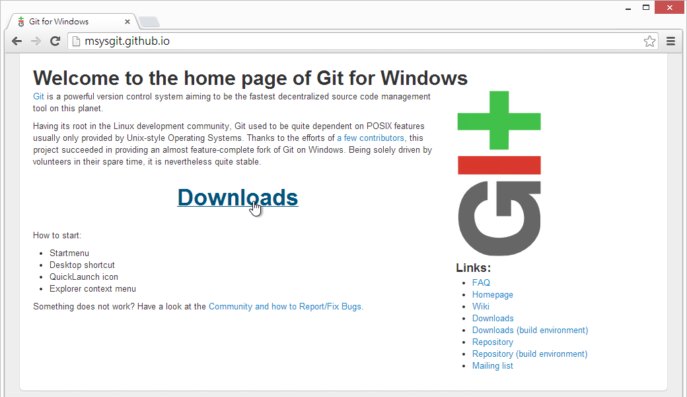

* 不管哪个版本，下载最新版就对了

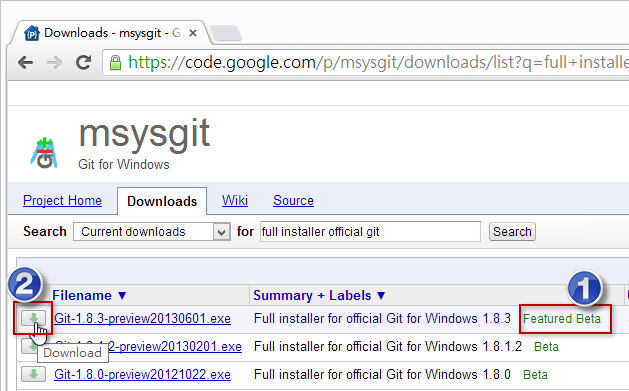

* 直接点击下载的文件进行安装

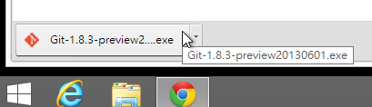

* 安装程序欢迎页面

* 同意 GPL 授权条款

* 选择安装路径

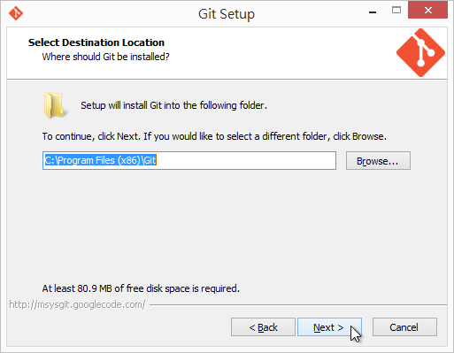

* 选取元件，**建议取消勾选 Windows Explorer integration 选项！**  ( 因为这套整合工具太陽春，建议改用 [TortoiseGit](https://code.google.com/p/tortoisegit/) 工具 )

* 设定程序集名称，保留预设选项即可

* 这里建议 **选择选择 Run Git from the Windows Command Prompt 这个选项！**  ( 因为 Windows 使用者大多不熟 Bash 指令 )

* 换行字元转换，建议保留预设选项即可。

* 开始进行安装

* 安装完成

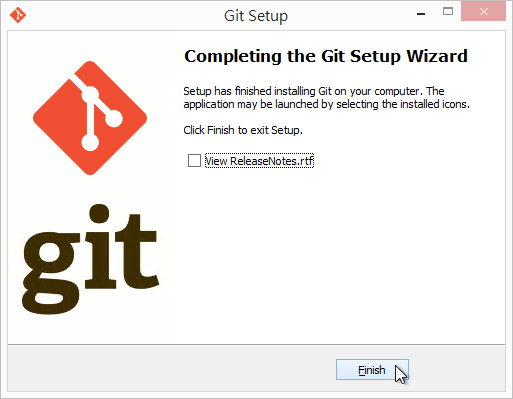

* 安装完成后，直接开启命令提示字元，就可以开始使用

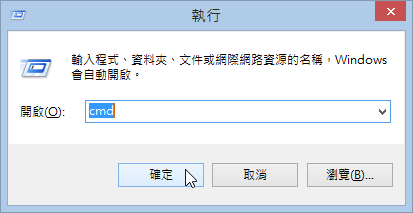

* 你可以输入 `git --version` 指令查询目前工具程序的版本

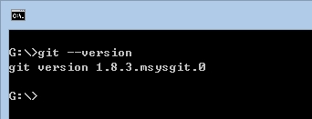

第 2 套：[GitHub for Windows](http://windows.github.com/)
---------------------------------------------

这套是由 [GitHub](https://github.com) 官方开发的工具，写给那些对 Git 没有很了解的人用的，用简洁与亲民的 GUI 介面，企图隐藏 Git 那些难懂的观念与指令参数。虽然 GitHub for Windows 工具比起 Git for Windows 亲和许多，但对 Git 完全没有概念的人来说，要上手 GitHub for Windows 工具可能也不是件容易的事。

> [GitHub for Windows](http://windows.github.com/) 内建了一个 [Git Shell](https://github.com/dahlbyk/posh-git/) 工具，这工具会用到 [Git for Windows](http://msysgit.github.io/)，所以如果你没有安装 Git for Windows 的话，也将无法使用 GitHub for Windows 的 Git Shell 工具 。

这套工具可以帮你完成的 Git 版控工作已经蛮多的，至少基本版控功能都有提供，最主要有以下能力：

* Clone Repositories
	* 将 GitHub 上面的仓库复制回来 (git clone)
* Browse History
	* 浏览本地仓库的版本历史记录
* Commit Changes
	* 提交变更到本地仓库
* Branch Code
	* 建立与管理 Git 分支，还可以在工作目录中切换分支
* Share on GitHub.com
	* 与 GitHub 同步变更
	* 这里「同步」 (Sync) 的意思是将 git pull 与 git push 整合在一起
	* GitHub for Windows 在同步的时候，预设是使用 rebase 方式进行合并。

除此之外的大部分 Git for Windows 能做的事，在 GitHub for Windows 里面都不能做！若真的要应用在较为大型的开发项目上，可能要考虑看看是否适用，但如果是给非软件开发人员来说，简单的版控工作应该非常足够。

以下是 GitHub for Windows 安装过程：

* 先连到 http://windows.github.com/ 准备下载安装档

* 下载完后直接执行安装

* 刚下载 GitHub for Windows 安装档的时候可能觉得安装档很小，但事实上真正在安装的时候才会下载所需的文件，所以必须保持网络连线

* 下载完成后，GitHub for Windows 工具会直接被开启，并进行初始设定工作

	* 开启 GitHub for Windows 的第一步就是先登入 GitHub 账户 (你也可以点击 SKIP SETUP 跳过这一步)

	

	* 然后他会要求你先设定好 user.name 与 user.email 这两个参数，这两个是使用任何 Git 工具最重要的步骤之一，没有设定这两个参数是完全无法 commit 任何版本的。 备注: 这两个参数预设会设定到 Global config 之中，也就是 "C:\Users\<user>\.gitconfig" 这个文件。

	

	* 设定完成

	

* 首次使用如果有成功登入 GitHub 账户，GitHub for Windows 会自动建立一组 SSH Key-Pair 在 `C:\Users\<username>\.ssh` 目录下，这可以让你在日后「同步」本地与远端仓库时不用再输入账号密码。

* GitHub for Windows 帮你产生的 SSH Key 预设路径如下：

	* **C:\Users\&lt;username&gt;\\.ssh\github_rsa**
	* **C:\Users\&lt;username&gt;\\.ssh\github_rsa.pub**

* SSH Key 的签章的部分也会在登入的同时上传到 GitHub 网站，你可以从个人的设定画面 ( [https://github.com/settings/ssh](https://github.com/settings/ssh) ) 中看到曾经上传过的 SSH Key 签章：

* GitHub for Windows 装好之后，其实还额外帮你安装了一个 Git Shell 工具，这预设是一个 PowerShell 介面的操作环境，好处有很多，之后我们的例子也会尽量使用 Git Shell 来进行操作：
	* 可以在指令列使用 ^ 符号 (在命令提示字元不能接使用 ^ 符号)
	* 可以在 Git 工作目录下可以得到额外的提示信息 (Prompt)
* 不过使用 Git Shell (PowerShell) 也有一个小缺点
	* 由于 PowerShell 里面 `{}` 具有特殊意义，所以若你的 git 参数会用到 `{}` 符号的话，记得该参数的前后要加上 '单引号'

第 3 套：[SourceTree](http://www.sourcetreeapp.com/)
---------------------------------------------

这套是由 [ATLASSIAN](https://www.atlassian.com) 这间公司开发的工具，是一套非常专业的 GUI 操作工具，不仅支持 Git 版本控制，同时也支持 [Mercurial](http://mercurial.selenic.com/) 版本控制机制，这两套版本控制机制都属于分布式版本控制的分类，概念上也十分相近，所以可以整合在这一套工具上使用。

> [SourceTree](http://www.sourcetreeapp.com/) 其实骨子里也是通过 [Git for Windows](http://msysgit.github.io/) 工具进行版本操作，如果你没有事先安装 [Git for Windows](http://msysgit.github.io/) 的话，安装的过程中他也会提示你要不要顺便安装起来。

[SourceTree](http://www.sourcetreeapp.com/) 的功能相较于 [GitHub for Windows](http://windows.github.com/) 是强大许多，几乎所有的指令列功能都能够过 SourceTree 的 GUI 介面完成(通过鼠标操作)，不过还是老话一句，如果你对 Git 的核心观念不太了解，再多的右键选单对你来说等同于白纸一张，一样不知道怎样操作。但你若认真的了解 Git 的运作机制与观念，使用 SourceTree 绝对能够事半功倍！

以下是 SourceTree 安装过程：

* 先连到 http://www.sourcetreeapp.com/ 准备下载安装档

	

* 下载完后直接执行安装，其余的安装步骤就直接一直按 `Next` 到最后，然后直接开启 SourceTree 程序

	

	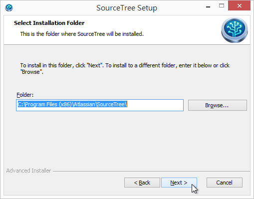

	

	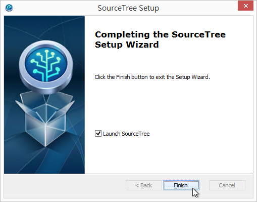

* 第一次启动 SourceTree 时，会问你要不要顺便安装 [Mercurial](http://mercurial.selenic.com/)，可装可不装

	

* 第一次使用 SourceTree 时，跟 GitHub for Windows 一样，都要设定预设的 user.name 与 user.email 这两个参数，不过，如果你有按照本文步骤安装的话，这一步应该不用特别输入，因为之前输入的参数都已经写入到 Git for Windows 的 Global 设定档中，这边会自动被带入，你直接按下 `Next` 即可。

	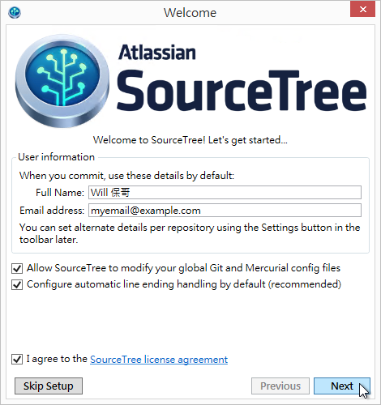

* 这个步骤则是选择适当的 SSH Client，这是为了跟远端的 Git 仓库认证所需要的工具，选用预设值即可。

	

* 接着这个步骤则是问你是否已有 SSH Key 存在，由于我们在 GitHub for Windows 已经产生过一个 GitHub 专用的 SSH Key，所以你也可以在这一步按下 `Yes` 并选取 `C:\Users\<username>\.ssh\github_rsa` 这个文件 (这是一个 SSH 私密金钥)。

	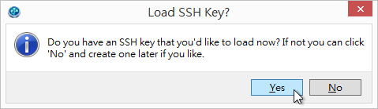

* 虽然 SourceTree 是免费软件，但还是必须在安装后 30 天内 "免费注册" 得到序号后，才能继续使用。

	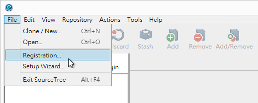

* 立即注册一个授权

	

* 先输入 Email 地址

	

* 然后输入一些个人基本资料与设定一个密码，即可注册完成

	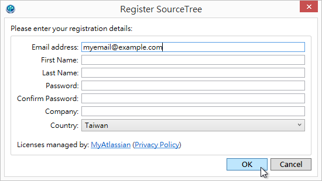

* 如果你在另外一台电脑也安装 SourceTree 的话，直接输入第一次注册时设定的密码即可自动下载授权档进行注册

	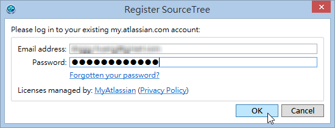

* 注册成功

	

* 在使用 SourceTree 的时候，有个 Open in Terminal 功能，这会开启一个类似 [Cygwin](http://www.cygwin.com/) 的命令提示字元视窗，让你直接操作 git 命令。

	

第 4 套：[TortoiseGit](https://code.google.com/p/tortoisegit/)
-----------------------------------------------------------------

TODO

今日小结
--------

今天这篇非常详细的介绍三套在 Windows 底下常用且功能强大的 Git 版控工具，这三套只要能上手，绝对能够大幅提升 Git 版本控制的使用效率，绝对值得大家好好研究研究。

不过，我再耳提面命一次，要学会使用 Git 的 GUI 介面工具，一定要先拥有完整的 Git 版控概念，否则真的很难灵活运用这些好用工具。

参考连结
-------

* [Git for Windows](http://msysgit.github.io/)
* [GitHub for Windows](http://windows.github.com/)
* [SourceTree](http://www.sourcetreeapp.com/)
* [TortoiseGit](https://code.google.com/p/tortoisegit/)

-------
* [HOME](../README)
* [回目录](README)
* [前一天：认识 Git 版本控制](01)
* [下一天：建立仓库](03)

-------

