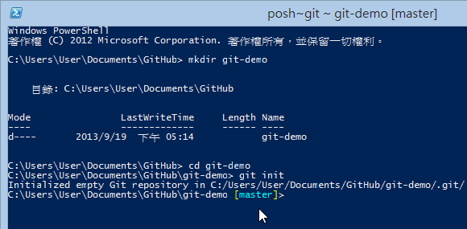
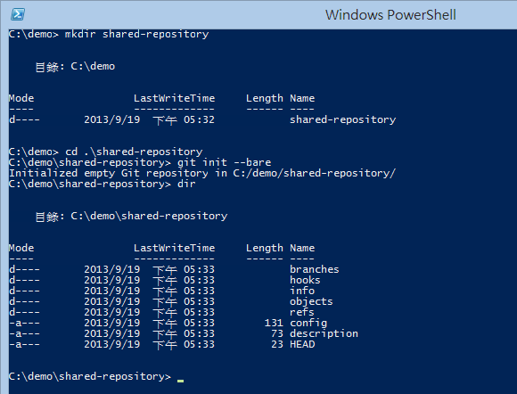
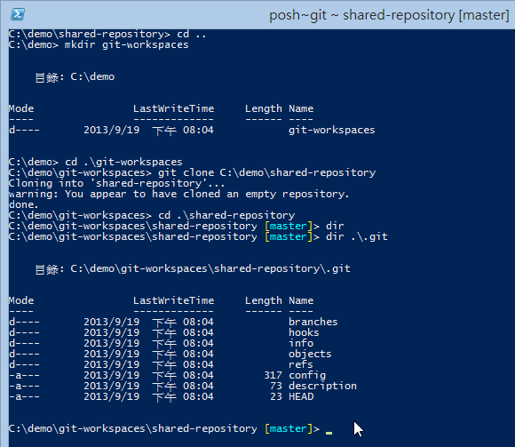
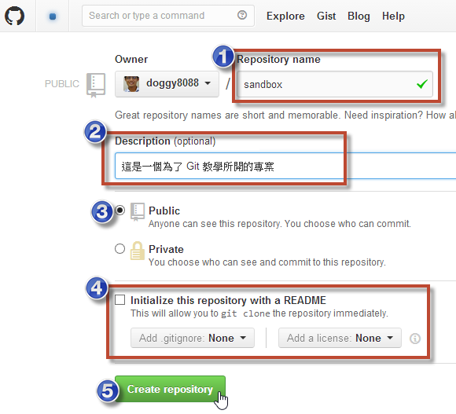
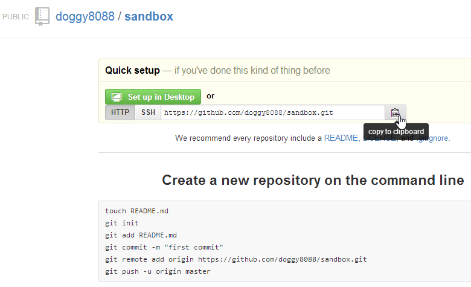

第 03 天：建立仓库
===========================================================

要开始使用 Git 最重要的就是要先有一份 Git 仓库 (Git Repository) 才行，但是，这份仓库从哪里来呢？本篇文章会介绍多种建立仓库的方式。

要建立仓库，事实上，你有很多选择，例如：

* 在本机建立本地的仓库 (local repository)
* 在本机建立一个共用的仓库 (shared repository)
* 在 GitHub 或其他 Git 平台建立远端的仓库 (remote repository)

无论如何，你总是需要一个仓库，我们分別说明如下：

在本机建立本地的仓库 (local repository)
---------------------------------------

我们先开启 [GitHub for Windows](http://windows.github.com/) 的 Git Shell 工具，这工具其实是个 Windows PowerShell 介面，但外掛了一些 Git 相关的环境变数与命令提示设定(Command Prompt)：

开启后，预设会直接进入 `%USERPROFILE%\Documents\GitHub` 资料夹，这是 [GitHub for Windows](http://windows.github.com/) 的预设项目根目录，也就是只要预设通过 [GitHub for Windows](http://windows.github.com/) 从 GitHub 复制 (clone) 下来的项目都会放在这个目录。

所以，我们可以直接在这里建立一个新目录，好当成我们的「工作目录」(working directory)，我们可以输入指令 `mkdir git-demo` 把目录建立起来。然后再用 `cd git-demo` 进入该目录。

由于这是一个空目录，并不包含任何 Git 仓库，这时我们要建立仓库，就可以用 `git init` 指令把仓库给建立起来，预设仓库会放在工作目录下的 `.git` 目录下。

完整的操作步骤如下图示：

建立完成后，你在 Git Shell 的命令提示符号中，应该可以发现有些不太一样，他在目前所在路径后面加上了个高亮的 `[master]` 字样。这段提示，会显示你目前所在`工作目录`的各种状态，如果看得懂的话，是一个非常有用的信息来源，可以让你在用命令列工具操作 Git 时，少打很多 `git status` 指令来查询目前工作目录的状态。这部分会再下一篇文章中特别说明。

在本机建立一个共用的仓库 (shared repository)
---------------------------------------

共用仓库 (shared repository) 是指建立一个 Git 仓库但不包含工作目录，这种情況比较常发生在 Linux 操作系统下，因为在 Linux 操作系统下通常都是多人使用同一台 Linux 主机。虽然在 Windows 操作系统也可以这样使用，不过我们的开发环境大多还是在 Windows Client 的环境，比较少有多人共用一台电脑的情況。

如果要建立共用仓库，可以使用 `git init --bare` 指令建立，如下图示。你可以发现，当 `git init` 加上 `--bare` 参数后，他会在当前目录建立所有 Git 仓库的相关文件与资料夹，你必须特别注意，这个资料夹不能直接拿来做开发用途，只能用来储存 Git 的相关信息，大多数情況下，你都不应该手动编辑这个资料夹的任何文件，最好通过 git 指令进行操作。

由于这是一个「没有工作目录的纯仓库」，所以共用仓库也有个別名叫做「裸仓库」 (bare repository)。

再次强调，Git 属于「分布式版本控制」，每个人都有一份完整的仓库(Repository)。也就是说，当你想要建立一个「工作目录」时，必须先取得这个「裸仓库」的内容回来，这时你必须使用 `git clone [REPO_URI]` 指令「复制」(clone)一份回来才行，而通过 `git clone` 的过程，不但会自动建立工作目录，还会直接把这个「裸仓库」完整的复制回来。这个复制的过程，就如同「完整备份」一样，是把所有 Git 仓库中的所有版本记录、所有版本的文件、...等等，所有资料全部复制回来。完整的指令操作过程可以参考以下图示：

在实际上，会使用「共用仓库」或「裸仓库」的方式可能有几种：

* 在一台多人使用的机器上进行协同开发，可开放大部分人对这个「裸仓库的资料夹」仅有唯读权限，只让一个人或少许人才有写入权限。
* 有些人会把裸仓库放到 Dropbox 跟自己的多台电脑同步这个裸仓库

请注意: 虽然「工作目录」下的 `.git` 目录也是一个「仓库」，不过工作目录下的仓库还包含一些工作目录下的索引信息，记录着工作目录下的状态信息，这些状态信息不会出现在 「共用仓库」里面，这里只有版本信息而已 (也就是 Git 的物件信息)。

在 GitHub 或其他 Git 平台建立远端的仓库 (remote repository)
---------------------------------------

其实「远端仓库」跟「共用仓库」几乎是一样的，差別仅在于「共用仓库」大多使用直接的文件存取，而「远端仓库」通常使用 SSH, Git protocol, HTTP 等协定可「远端」存取 Git 仓库，其他的使用方式基本上是一样的。

以下示范通过 GitHub 建立仓库，并将仓库复制回本地的情況：

* 先登入 GitHub，然后建立一个新的仓库

* 设定 GitHub 项目的相关信息并建立仓库

* 建立完成后，他会提示你要如何取得该项目，或将你本地现有的项目汇入到 GitHub

* 如上图，我们可以在 Quick setup 的地方点击 "Set up in Desktop"，你的电脑会自动开启 GitHub for Windows 工具，并自动复制(clone)这个仓库回来，并且建立工作目录。

* 你也可以将远端 Git 仓库的网址复制(Copy)下来，然后执行 `git clone [REPO_URL]` 即可复制(clone)一份回来。

今日小结
-------

以上就是三种建立 Git 仓库的方式。我重新整理一下本日学到的 Git 指令与参数：

* git init
* git init --bare
* git clone [REPOSITORY_URI]

参考连结
-------

*  [GETTING AND CREATING PROJECTS - Git Reference](http://gitref.org/creating/)
*  [Git for Windows](http://msysgit.github.io/)
*  [GitHub for Windows](http://windows.github.com/)

-------
* [HOME](../README.md)
* [回目录](README.md)
* [前一天：在 Windows 平台必装的三套 Git 工具](02.md)
* [下一天：常用的 Git 版本控制指令](04.md)

-------

