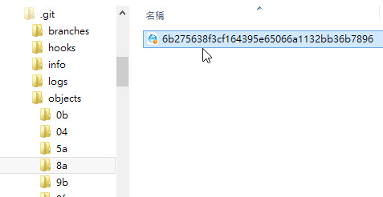
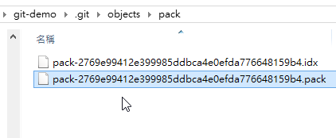

第 06 天：解析 Git 资料结构 - 物件结构
=====================================================

在 Git 的资料结构中，「物件」是一种「不可变的」 (immutable) 文件类型，所有储存在「物件储存区」的文件通常只进不出，也不会被修改内容。原因在于，如果你窜改了文件内容，新的内容所运算出来的 SHA1 哈希值将会与原有物件的档名不一样，这导致 Git 无法继续执行，相对地也对 Git 仓库产生了一定程度的保护作用。本篇文章，将更加仔细地介绍 Git 的物件结构，最后也会通过一则影片，详细解说整个物件被产生的过程与逻辑。

关于物件资料库
------------

前一篇文章有提到，无论 blob 物件与 tree 物件，这些都算是物件，这些物件都会储存在一个所谓的「物件储存区」 (object storage) 之中，而这个「物件储存区」预设就在「仓库」的 objects 目录下，如下图示：

然而 Git 仓库中的每一个「物件」，都是以「文件内容」进行 SHA1 哈希运算出一个 hash 值，并用这个 hash 值当作物件的名称 (档名)。我们以 8a6b275638f3cf164395e65066a1132bb36b7896 为例，Git 会先拿前两个字元(8a)当作目录，然后把剩下的 hash 值当成档名 (6b275638f3cf164395e65066a1132bb36b7896)，这些物件的实体目录与文件也都会放在 .git\objects 目录下，如下图示：

物件的类型
---------

在这些「物件资料库」里面，又包含了 4 种物件类型，分別是：

1. **blob 物件**：就是工作目录中某个文件的 "内容"，且只有内容而已，当你执行 git add 指令的同时，这些新增文件的内容就会立刻被写入成为 blob 物件，档名则是物件内容的哈希运算结果，没有任何其他其他信息，像是文件时间、原本的档名或文件的其他信息，都会储存在其他类型的物件里 (也就是 tree 物件)。
2. **tree 物件**：这类物件会储存特定目录下的所有信息，包含该目录下的档名、对应的 blob 物件名称、文件连结(symbolic link) 或其他 tree 物件等等。由于 tree 物件可以包含其他 tree 物件，所以浏览 tree 物件的方式其实就跟文件系统中的「资料夹」没两样。简单来说，tree 物件这就是在特定版本下某个资料夹的快照(Snapshot)。
3. **commit 物件**：用来记录有哪些 tree 物件包含在版本中，一个 commit 物件代表着 Git 的一次提交，记录着特定提交版本有哪些 tree 物件、以及版本提交的时间、记录消息等等，通常还会记录上一层的 commit 物件名称 (只有第一次 commit 的版本没有上层 commit 物件名称。
4. **tag 物件**：是一个容器，通常用来关联特定一个 commit 物件 (也可以关联到特定 blob、tree 物件)，并额外储存一些额外的参考信息(metadata)，例如: tag 名称。使用 tag 物件最常见的情況是替特定一个版本的 commit 物件标示一个易懂的名称，可能是代表某个特定发行的版本，或是拥有某个特殊意义的版本。

Git 会将每一个版本中的文件建立一个对应的 blob 物件，一样的，该 blob 物件的档名就是用上述的方式计算出来的，从这些 blob 文件，你看不出跟版本有任何关系，你必须通过 tree 物件 (资料夹的快照) 与 commit 物件 (每一个版本的快照) 才能关联出这些 blob 与版本的关系。

所有的物件都会以 zlib 演算法进行压缩，不但可以有效的提升文件存取效率，在日后进行封装(pack)的时候也可以利用差异压缩(delta compression)演算法来节省空间。他会自动找出相似的 blobs，并自动计算出 blob 之间的变化差异，再将这些差异储存在一个名为 *packfile* 的文件中，这样就可以大幅节省磁盘空间的耗用)。通常 *packfile* 会置于 .git\objects\pack 目录下，如下图示：

上述这四种物件之间的关系，可参考以下图示：

然而，光是观看文字与图示，或许还是难以看出这几种物件类型之间的关系，没关系，笔者特别录制了一段教学影片，试图用 git 指令的方式解释 Git 的物件结构与产生物件的过程，也让各位更清楚的了解到底 Git 如何产生与管理这些文件。

YouTube 影片连结：[认识 Git 资料结构中的物件资料库与物件之间的关系](http://www.youtube.com/watch?v=PZbSRy_ow0U)

物件结构的优点
------------

你应该可以渐渐了解 Git 的「物件」设计是如此的漂亮，我们在第一篇文章曾经提到几个 Git 重要的设计，我们重新列出几点与「物件」特性有关的设计来看看：

* 有效率的处理大型项目
	* 不仅仅是完整的版本库会复制(clone)一份在本机，由于所有的 blob 物件都是通过「内容」来做定址的 (content addressable)，因此，若在不同版本之间找寻相同的内容，效率是非常高的。
* 历史记录保护
	* Git 版控的过程，每次提交变更都会产生一个 commit 物件，而这个 commit 物件的名称又是通过 commit 物件的内容产生。再者，commit 物件会关连到 tree 物件，tree 物件的名称又是通过 tree 物件的内容所产生。tree 物件又会关联到 blob 与 tree 物件，这些物件的名称也是通过内容产生。就这样一层一层的关联下去，如果你今天真的想窜改某个版本的历史记录，困难度也是挺高的！
	* 由于 Git 仓库经常会被 clone 或 fork，只要是被 clone 过的仓库，来源的仓库只要任何一个物件被修改，这些 clone 出去的仓库就很难再合并回来，所以你几乎不可能任意窜改版本记录。
* 定期的封装物件
	* 我们在 Git 中提到的 "物件" 其实就是代表版本库中的一个文件。而在版本异动的过程中，项目中的代码或其他文件会被更新，每次更新时，只要文件内容不一样，就会建立一个新的 "物件"，这些不同内容的文件全部都会保留下来。
	* 你应该可以想像，当一个项目越来越大、版本越来越多时，这个物件会越来越多，虽然每个文件都可以各自压缩让文件变小，不过过多的文件还是会文件存取变得越来越没效率。因此 Git 的设计有个机制可以将一群老旧的 "物件" 自动封装进一个封装档(packfile)中，以改善文件存取效率。
	* 那些新增的文件还是会以单一文件的方式存在着，也代表一个 Git 版本库中的 "文件" 就是一个 Git "物件"，但每隔一段时间就会需要重新封装(repacking)。
	* 照理说 Git 会自动执行重新封装等动作，但你依然可以自行下达指令执行。例如: git gc
	* 如果你要检查 Git 维护的文件系统是否完整，可以执行以下指令: git fsck

今日小结
-------

Git 里的「物件」十分重要，其特性也十分重要，虽然我们在操作 Git 指令的过程中通常不太需要直接接触这些文件，不过了解这些物件的存在，也确实有助于让你更加理解 Git 的运作模式，与 Git 独到的设计概念。

参考连结
-------

* [Git Internals - Git Objects](http://git-scm.com/book/en/Git-Internals-Git-Objects)
* [Pro Git Book](http://progit.org/)
* [Git Magic - 繁体中文版](http://www-cs-students.stanford.edu/~blynn/gitmagic/intl/zh_tw/)
* [Git (software) - Wikipedia, the free encyclopedia](http://en.wikipedia.org/wiki/Git_(software) "Git (software) - Wikipedia, the free encyclopedia")

-------
* [回目录](README.md)
* [前一天：了解仓库、工作目录、物件与索引之间的关系](05.md)
* [下一天：解析 Git 资料结构 - 索引结构](07.md)

-------

