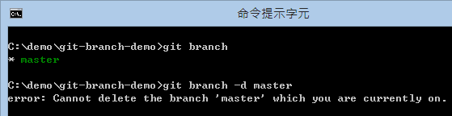
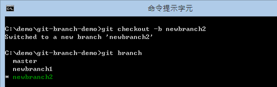
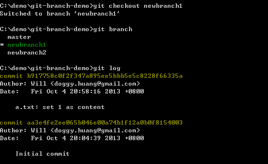
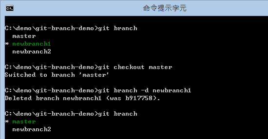
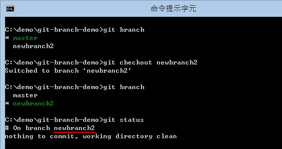
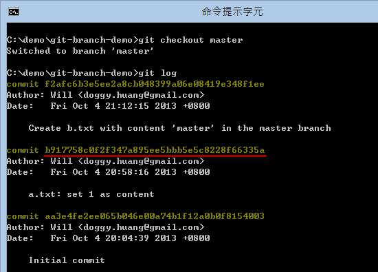
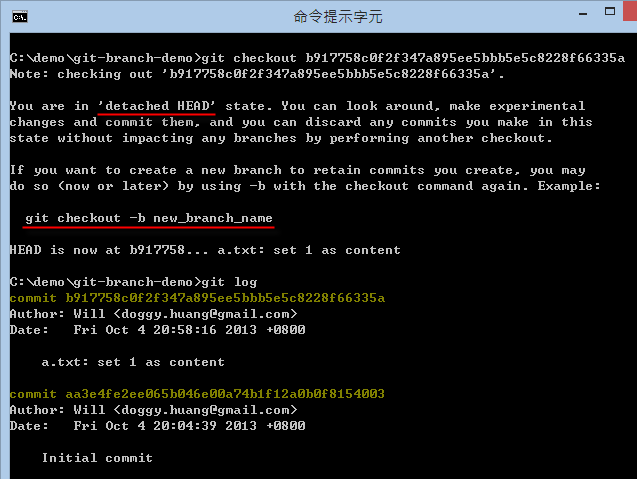
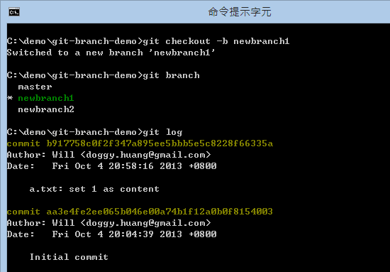
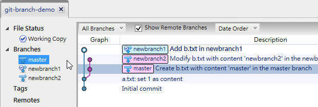
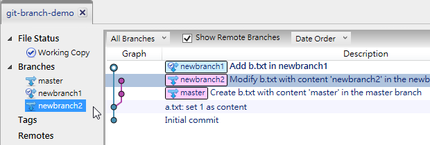

第 08 天：关于分支的基本观念与使用方式
===========================================================

在 Git 里面 **分支** (Branch) 是个非常重要的机制，使用上也必须特别小心，因为项目总不能无限制的「分支」下去，最终总是要合并的，但合并是日后的议题，这篇文章将会先带大家学会 Git 分支基本观念与使用方式。

关于分支的基本观念
----------------

在版本控制中使用「分支」机制，最主要的目的就是用来解决开发过程中版本冲突的问题。笔者认为，有许多曾经用过任何版本控制机制的人，都会认为「分支」是个「产生版本冲突」的元凶，因为当你开始分支之后，一定就会想到合并的议题，而当分支之后，若是有人跟你一样修改到相同文件的相同一行时，就会引发「版本冲突」，而只要发生冲突，就必须费心解决。

当冲突发生时，有时可以很轻易的决定要用自己的版本或是对方的版本，但有时却没那么容易，复杂的时候还要依据冲突的片段，找到当初改过这几行的人出来，协调出彼此的变更对系统的影响，最后决定要怎样合并，诸如此类的问题非常繁琐，也因此很多人会尽力避免「分支」的情況发生，以免发生「冲突」。

不过，若是开发团队越来越大，系统功能越来越多，就算你不对版本做分支，大家的冲突情況一样也会层出不穷，有时候还不是冲突的问题，而是 A 写好一个功能，但被 B 的后续版本给盖掉了，然后没有任何冲突发生，这也不是大家所乐见的。然而，这也是一种「无形的冲突」状況。

以前在集中管理的 Subversion 版控机制中，也有分支的概念，也可以运作的很好。当然，如果你的软件架构不够好，如果你对分支的概念、工具的使用也不是很清楚，我相信使用「分支」时也不会多顺利，这是个必然的结果，这世界绝不会有「免学、无痛、自然学会分支」的这种版本控制工具出现，事在人为，人的观念不对，用什么工具都不会顺的。

由于 Git 属于「分布式版本控制机制」，在分散式版本管理的使用情境中，最不想做的事情就是「管理」，所以 Git 很少有所谓的管理机制或权限控制机制，它唯一想做的仅仅是让大家可以顺利的「分支」与「合并」而已。

我们以【第 03 天：建立仓库】这篇文章提到的「远端的仓库 (remote repository)」为例，你可以这样想像：从我们使用 `git clone` 指令开始，其实就是「分支」的开始，你从远端仓库复制一份完整的仓库下来，然后开始在自己的本地端建立版本，等软件修订到一定程度后再「合并」回去，只是这时合并的指令叫做 `git push` 而已。

这种分支与合并的情形，在 Git 版本控制的过程中无所不在，远端的仓库可以有分支，本地的仓库可以有分支，你可以从远端任何一个分支合并(pull)到本地分支，也可以将本地的分支推向(push)远端的分支，你当然也可以从本地任何一个分支合并(merge)到本地的另一个分支。可以想见，如果「分支」没有一套良好的控制逻辑，最后可以组合出各种极其复杂的版本控制使用情境，这也不是大家所乐见的。因此，好好学会「分支」与「合并」真的非常重要。例如 git-flow 就是一套广受欢迎的分支管理模式，这不是一套工具，而是一种管理分支的逻辑，这部分在我未来的文章中将会加以说明。

Linux kernel 发展的过程，在全世界有成千上万的开发人员共同参与，为了管理这么大量的开发团队，Git 俨然而生，这是套分散式的版控机制，每个人都有完整的版本，版本散出去之后，大家必须管好自己的版本，然后遵照团队的要求合并回来。然而，在合并回来之前，这套机制确保每个人都能够顺利的开发，不受任何其他开发人员的版本而影响，而 Git 确实做到了这点，同时又降低了版本控制的复杂度。

当然，我也必须讲，如果参与软件开发的团队只有两三人，而且这些人还都聚在一起，那确实不一定要使用 Git 版本控制，使用 Subversion 也是个很好的选择，简单又直觉，开发的过程中若遇到问题，前后左右协调一下就能解决，这比让整个团队都来了解 Git 来的方便很多。

如果你的团队有点规模，或大家并没有坐在一起工作，又要做版本控制的话，或许 Git 是个不错的选择，但工作团队之间拥有一致的版控观念或习惯，也是非常重要的一件事。

准备工作目录
-----------

我们通过以下指令快速建立一个拥有两个版本的 Git 仓库与工作目录：

	mkdir git-branch-demo
	cd git-branch-demo
	git init

	echo. > a.txt
	git add .
	git commit -m "Initial commit"

	echo 1 > a.txt
	git add .
	git commit -m "a.txt: set 1 as content"

接着使用 `git log` 取得版本信息如下：

	C:\demo\git-branch-demo>git log
	commit b917758c0f2f347a895ee5bbb5e5c8228f66335a
	Author: Will <doggy.huang@gmail.com>
	Date:   Fri Oct 4 20:58:16 2013 +0800

	    a.txt: set 1 as content

	commit aa3e4fe2ee065b046e00a74b1f12a0b0f8154003
	Author: Will <doggy.huang@gmail.com>
	Date:   Fri Oct 4 20:04:39 2013 +0800

	    Initial commit

接着我们通过 `git branch` 指令得知我们已经拥有一个名为 `master` 的分支，这是在 Git 仓库中的预设分支。如果你尝试通过 `git branch -d master` 删除这个分支，将会得到 `error: Cannot delete the branch 'master' which you are currently on.` 的错误消息，这意思是「当你目前工作目录分支设定为 master 时，不能删除目前这个分支」，也就是说，你必须先切换到「其他分支」才能删除这个分支。

当然，我们现在只有一个分支，自然无法删除自己。

建立分支
--------

建立分支最常见有两种方法，分別是：

1. 建立分支，但目前工作目录维持在自己的分支: `git branch [BranchName]`

	当我执行 `git branch newbranch1` 指令，这会建立一个新的 `newbranch1` 分支，我们接着用 `git branch` 查看目前有多少分支，你会看到两个，但目前工作目录还会停留在 `master` 分支上，如下图示：

	

	如果这时你在目前的工作目录建立版本，这时会建立在 `master` 分支里面，我们这时建立一个新文件，并且通过 `git commit` 建立版本，指令如下：

		echo master > b.txt
		git add .
		git commit -m "Create b.txt with content 'master' in the master branch"

	请先记得：我们先在预设的 `master` 分支建立两个版本，然后建立一个分支，然后在 `master` 分支又建立了一个版本。

2. 建立分支，并将目前工作目录切换到新的分支: `git checkout -b [BranchName]`

	接下来，我们用第二种方法建立分支，当我执行 `git checkout -b newbranch2` 指令，不但会建立一个新分支，还会将目前工作目录切换到另一个分支，最后用 `git branch` 查看目前有多少分支，你会看到已经有三个，而且目前工作目录已经切换到刚刚建立的 `newbranch2` 分支上，如下图示：

	

	如果这时你在目前的工作目录建立版本，这时会建立在 `newbranch2` 分支里面，我们这时建立一个新文件，并且通过 `git commit` 建立版本，指令如下：

		echo newbranch2 > b.txt
 		git add .
		git commit -m "Modify b.txt with content 'newbranch2' in the newbranch2 branch"

	请记得：我们先在预设的 `master` 分支建立两个版本，然后建立一个分支，然后在 `master` 分支又建立了一个版本，接着又把当下这份 `master` 分支的状态建立一个新的 `newbranch2` 分支，并将工作目录到切换到 `newbranch2` 分支，然后再建立一个版本。我们这时如果执行 `git log` 会显示出 4 个版本记录，因为分支会自动继承来源分支的完整历史。

**注**: 详细的指令与参数说明，可以输入 `git help branch` 查询完整的文件。

	git branch [branch_name]

切换分支
--------

如果你想将工作目录切换到其他分支，你可以输入以下指令 (不含 -b 参数)：

	git checkout [branch_name]

假设我们想把工作目录切换到 `newbranch1` 分支，这时可以输入 `git checkout newbranch1` 切换过去，然后你可以立刻使用 `git branch` 检查目前工作目录是否切换过去，然后再用 `git log` 检查当下 `newbranch1` 分支的历史记录。因为这是我们第一次建立的分支，照理说这个分支状态应该只会有两笔历史记录而已，如下图示：

**注**: 详细的指令与参数说明，可以输入 `git help checkout` 查询完整的文件。

	git checkout [branch_name]

删除分支
---------

如果你想删除现有的分支，就如同我们在**准备工作目录**有提到过的指令，如下：

	git branch -d [branch_name]

先前也有提到，你不能删除目前工作目录所指定的分支，必须先切换到其他分支后，再删除你目前这个分支。举个例子来说，如果你想删除当下这个 `newbranch1` 分支，那么你必须先切换到其他分支，例如 `master` 分支，然后再下达 `git branch -d newbranch1` 指令，即可删除分支，如下图示：

查看工作目录在哪个分支
--------------------

你可以通过 `git branch` 命令，查看目前所在分支，如下图示：

查看 Git 仓库的完整分支图
-------------------------

最后，我用 SourceTree 工具来显示目前 Git 仓库的分支图。目前我们只有两个分支，一个是 `master` 分支，另一个是 `newbranch2` 分支，因为 `newbranch1` 分支已经在练习的过程中被删除了。为了要让我们的分支有「树状」的感觉，接下来我要示范如何重新建立一个与先前 `newbranch1` 一样状态的分支，并且在这个分支下加入一个新版本。

不知道各位还记不记得，我们是在 `master` 分支建立两个版本后才建立 `newbranch1` 分支的，现在我们就先找到到这个版本的 commit 物件 id，通过 `git log` 即可取得，如下图示：

所以我的 commit 物件 id 为: b917758c0f2f347a895ee5bbb5e5c8228f66335a

接着我先把工作目录切换到这个版本，通过 `git checkout [commit_id]` 即可完成这个任务：

	git checkout b917758c0f2f347a895ee5bbb5e5c8228f66335a

这时你用 `git log` 应该只会看到两个版本记录而已，因为我们已经把工作目录的状态切换成这个版本了。从下图可以看到我们执行 `git checkout b917758c0f2f347a895ee5bbb5e5c8228f66335a` 时会出现一对消息，这些消息很重要，必须了解一下，如下图示：

首先，由于你将工作目录的版本切换到「旧的」版本，所以你会被提示这个工作目录已经进入了所谓的 **detached HEAD** 状态，这是一种「目前工作目录不在最新版」的提示，你可以随时切换到 Git 仓库的任意版本，但是由于这个版本已经有「下一版」，所以如果你在目前的「旧版」执行 `git commit` 的话，就会导致这个新版本无法被追踪变更，所以建议不要这么做。

若你要在 **detached HEAD** 状态建立一个可被追踪的版本，那么正确的方法则是通过「建立分支」的方式来追踪，现在我们就要在这个版本建立一个新的 `newbranch1` 分支，并将工作目录切换过去，指令如下：

	git checkout -b newbranch1

然后我们再建立一个新文件 `b.txt`，内容为 `newbranch1`，并建立一个新版本，指令如下：

	echo newbranch1 > b.txt
	git add .
	git commit -m "Add b.txt in newbranch1"

好了，我们现在有了 `master` 以外的两个分支，而且两个分支都有自己的版本，你先在脑中思考一下这棵树长怎样！

接着我们开启 SourceTree 工具，并将这个工作目录加入到 SourceTree 的管理工具中：

加入后，我们切换到这个 Git 仓库的分支，总共有三个，我们分別切换过去看看：

最早的版本在最下面，最新版在最上面，当我们切换到不同的分支，你可看到这三个分支图示都一样，只有预设停留的「光棒」不一样。首先，从图片来看，你看到的是「整份 Git 仓库」中的所有版本、所有分支，以及该分支是从哪个版本开始建立分支的。而「光棒」则是该分支的「最新版」位于整个 Git 版本库的哪个版本。

今日小结
-------

其实在 Git 里面使用分支是很容易的事，难的地方在于让大家都知道「分支」到底在做什么，还有大家对「分支」的**想像**是否是一致的，只要大家对分支的想像是一致的，在团队版控上就不会有太大的落差。

对我来说，分支我会把它想像成一种「快照」功能，把某个 commit 版本与其历史版本建立出一个快照，然后复制一份出来，并给予一个分支名称，你可以在这些分支上建立版本，等待日后进行合并。

而整份 Git 仓库，则会保留所有的分支与版本，最终呈现出一个树状架构的分支图，我们最后通过 SourceTree 工具可以清楚的看到 Git 仓库中的分支状況与版本变化。这张图，我很早就看过，但第一次完全看不懂，只觉得是「一张图」，没有感觉，但自从越来越了解 Git 之后，这张分支图可以让我一目了然的理解整个 Git 仓库的变化情形，也更容易掌握 Git 的版本变化。

希望可以通过我的文字与指令搭配图片示范，让大家在自己脑中勾勒出一个分支架构，对 Git 分支结构有更深层的理解。

我重新整理一下本日学到的 Git 指令与参数：

* git branch
* git branch [branch_name]
* git checkout -b [branch_name]
* git checkout [branch_name]
* git branch -d [branch_name]
* git log

参考连结
-------

* [BRANCHING AND MERGING](http://gitref.org/branching/)

-------
* [HOME](../README)
* [回目录](README)
* [前一天：解析 Git 资料结构 - 索引结构](07)
* [下一天：比对文件与版本差异](09)

-------

