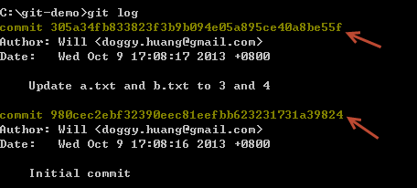
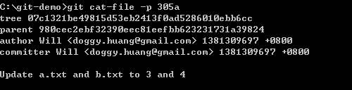
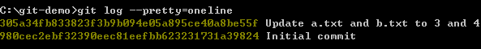
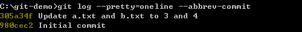

第 10 天：认识 Git 物件的绝对名称
=================================================

在 Git 版本控制的过程，每一个版本就代表一个 commit 物件。又因为版控过程中经常会建立分支，最终产出的 commit graph 可能会蛮复杂的，所以如何识別不同的版本，或是快速定位到特定版本以取得信息，就变得很重要。本篇文章将带大家认识 Git 里常用的物件名称概念与使用方法。

物件绝对名称
------------

在 Git 中，每个物件都会有一个以 SHA1 哈希运算过的 id，而这个 id 就是所谓的「绝对名称」。如果该物件是 commit 物件，那这就是 commit 物件的绝对名称，所以我们只要找出 commit 物件的绝对名称，就可以随时取得该版本。如下图箭头标示处，就是我们通过 `git log` 取得的 commit 物件 id，我们随时可以取得该 commit 物件的详细信息。

如果我们想看如上图 commit 物件的内容，可以利用 `git cat-file -p commitid` 来取得，如下图示：

物件绝对名称的简短语法
---------------------

由于 Git 物件 id 是通过内容进行 SHA1 哈希后的结果，所以很长，在 Git 标示「绝对名称」时，可以用前面几码代替，最少不可低于 4 个字元。也就是说 4 ~ 40 个字元长度的「绝对名称」都是可以用的。

例如我们从上图也可以看出在这个 commit 物件的的内容包含了一个 tree 物件，该物件也有一个 tree 物件的绝对名称 `07c1321be49815d53eb2413f0ad5286010ebb6cc`，所以我也可以再次通过 `git cat-file -p treeid` 来取得该 tree 物件的内容，如下图示：

有时候我们想取得版本记录会使用 `git log` 命令，同时也会输出每个文件的变更比较结果，结果会十分冗长，这时可以用 `git log --pretty=oneline` 指令来取得较为精简的历史记录，同时你也可以取得 commit 物件完整的「绝对名称」，如下图示：

另外一个常用的技巧则是仅输出部分的「绝对名称」，通过 `git log --pretty=oneline --abbrev-commit` 指令执行即可，如下图示：

今日小结
-------

以上这就是绝对名称的用法，由于 Git 物件的特性，你可以通过物件的绝对名称存取到 Git 仓库中任意物件，还有很多 git 指令都会用到绝对名称，熟悉了这些概念与表示法，你将更能掌握 Git 物件。

我重新整理一下本日学到的 Git 指令与参数：

* git log
* git cat-file -p [object_id]
* git log --pretty=oneline
* git log --pretty=oneline --abbrev-commit

-------
* [回目录](README.md)
* [前一天：比对文件与版本差异](09.md)
* [下一天：认识 Git 物件的一般参照与符号参照](11.md)

-------

