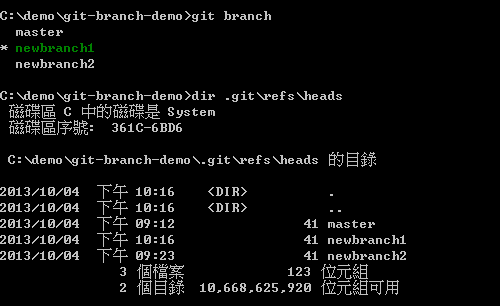
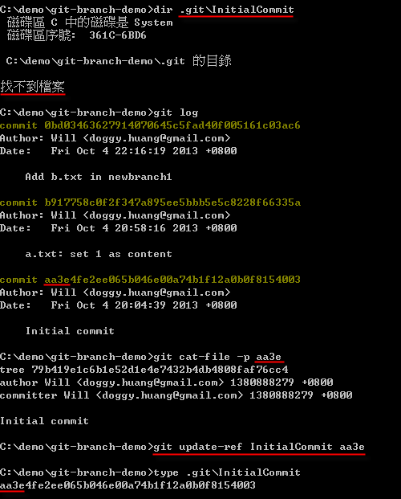

第 11 天：认识 Git 物件的一般参照与符号参照
==========================================================

在认识了 Git 物件的「绝对名称」后，接下来就要介绍 Git 版控过程中最常用到的「参照名称」。

认识物件的参照名称
------------------

参照名称 (ref) 简单来说就是 Git 物件的一个「指标」，或是相对于「绝对名称」的另一个「好记名称」，用一个预先定义或你自行定义的名称来代表某一个 Git 物件。

在我们之前学到的｢分支名称｣或我们曾经用过的 HEAD (代表最新版本)，或是我们之后会学到的「标签名称」，这些都是「参照名称」，总之就是为了让你好记而已。

我们以｢分支名称｣为例，来说明一下「参照名称」的实体结构为何。以下图为例，我们通过 `git branch` 取得所有分支名称，你可以看到我们目前有三个分支，然而这三个分支的名称其实就是一个｢参照名称｣，这代表这三个「参照名称」分別对应到 Git 物件仓库中的三个 commit 物件。在下图中你也可以看出这些分支的参照名称其实就是一个文件而已，所有「本地分支」的参照名称皆位于 `.git\refs\heads` 目录下：

接着我再以下图来证明这个文件是如何跟「绝对名称」做连结。我先通过 `git branch` 取得所有分支名称，并发现目前「工作目录」是指向 `newbranch1` 这个分支。此时我们通过 `git log --pretty=oneline` 即可取得该分支的所有版本记录。预设这些分支的「参照名称」会指向分支的「最新版」，我们只要打开 `.git\refs\heads\newbranch1` 文件的内容，就可以看出这是一个纯文字档而已，而且是指向版本历史记录中的「最新版」。最后再以 `git cat-file -p 0bd0` 取得该 commit 物件的内容，以及用 `git show 0bd0` 取得该版本的变更记录，藉此证明这些文件就是「参照名称」的主要用途。

我们再通过指令看看使用「绝对名称」与「参照名称」读取特定 commit 物件的内容，证明这两个指令执行的结果是相同的：

在大多数的情況下，「参照名称」通常都会指向一个 commit 物件，但并非必要，你也可以指向其他 Git 物件类型，像是 blob 物件、tree 物件、tag 物件等等。

关于 .git/refs/ 目录
---------------------

从上述范例其实已经能看出，所有的「参照名称」都是个文件，而且一律放在 `git/refs/` 目录下。而 Git 的参照名称所放置的目录位置，主要有三个：

* 本地分支：`.git/refs/heads/`
* 远端分支：`.git/refs/remotes/`
* 标　　签：`.git/refs/tags/`

再举个简单例子，如果你建立一个分支名称为 `f2e`，这时你会知道本地分支的「参照名称」会建立 `.git/refs/heads/f2e` 文件，如下图示：

事实上，这个 `f2e` 的「全名」应该叫做 `refs/heads/f2e` 才对，只是 Git 允许你输入简写，方便你快速输入参照名称而已。如下图示，这三种使用「参照名称」的方式都是可行的：

不过当你输入参照名称的「简称」时，预设 Git 会依照以下顺序搜寻适当的参照名称，只要找到对应的文件，就会立刻回传该文件内容的「物件绝对名称」：

* `.git/<参照简称>`
* `.git/refs/<参照简称>`
* `.git/refs/tags/<参照简称;标签名称>`
* `.git/refs/heads/<参照简称;本地分支名称>`
* `.git/refs/remotes/<参照简称>`
* `.git/refs/remotes/<参照简称;远端分支名称>/HEAD`

例如，当你输入 `git cat-file -p f2e` 指令的话，那么 Git 就会用以下顺序找到相对的「参照名称档」，取出该文件的内容 (即 Git 物件的绝对名称)：

* `.git/f2e` --> 找不到此文件
* `.git/refs/f2e` --> 找不到此文件
* `.git/refs/tags/f2e` --> 找不到此文件
* `.git/refs/heads/f2e` --> **找到了参照名称，以下就不继续搜寻**
* `.git/refs/remotes/f2e`
* `.git/refs/remotes/f2e/HEAD`

认识物件的符号参照名称 (symref)
-----------------------------

符号参照名称 (symref) 其实也是参照名称 (ref) 的一种，只是内容不同而已。我们从下图应可看出其内容的差异，「符号参照」会指向另一个「参照名称」，并且内容以 `ref:` 开头：

在 Git 工具中，预设会维护一些特别的符号参照，方便我们快速取得常用的 commit 物件，且这些物件预设都会储存在 `.git/` 目录下。这些符号参考有以下四个：

* HEAD
	* 永远会指向「工作目录」中所设定的「分支」当中的「最新版」。
	* 所以当你在这个分支执行 `git commit` 后，这个 `HEAD` 符号参照也会更新成该分支最新版的那个 commit 物件。
* ORIG_HEAD
	* 简单来说就是 HEAD 这个 commit 物件的「前一版」，经常用来复原上一次的版本变更。
* FETCH_HEAD
	* 使用远端仓库时，可能会使用 `git fetch` 指令取回所有远端仓库的物件。这个 FETCH_HEAD 符号参考则会记录远端仓库中每个分支的 HEAD (最新版) 的「绝对名称」。
* MERGE_HEAD
	* 当你执行合并工作时 (关于合并的议题会在日后的文章中会提到)，「合并来源｣的 commit 物件绝对名称会被记录在 MERGE_HEAD 这个符号参照中。

一般参照与符号参照的使用方式
---------------------------

我们知道「参照名称」有特殊的目的，通常用于「本地分支」、「远端分支」与「标签」等情境下，但事实上你可以建立任意数量的「自订参照名称」，只要通过 `git update-ref` 就可以自由建立「一般参照」。

我企图建立一个名为 `InitialCommit` 的一般参照，并指向 Git 仓库中的第一个版本，请参见如下图的指令执行顺序，得知一般参照的建立方式：

建立完成后，预设文件会放在 `.git` 资料夹下，且此时用「绝对名称」与「参照名称」都能存取特定 Git 物件的内容：

**注**：请记得，参照名称可以指向任意 Git 物件，并没有限定非要 commit 物件不可。

若要建立较为正式的参照名称，最好加上 `refs/` 开头，例如：`git update-ref refs/InitialCommit [object_id]`。

若要删除一般参照，则可以使用 `-d` 选项。如下图示：

显示所有参照的方式，则可以使用 `git show-ref` 指令，如下图示：

若要建立与删除「符号参照」，可以参考如下图 `git symbolic-ref` 的用法。请自行看图说故事，理解之后，你真的会发现 Git 对于参照的用法非常灵活且强大。还有，执行 `git show-ref` 只会显示在 `.git\refs` 目录下的那些参照，而且不管是「一般参照」或「符号参照」都一样：

本文稍早提到你可以建立参照到以下目录：

* `.git/<参照简称>`
* `.git/refs/<参照简称>`
* `.git/refs/tags/<参照简称;标签名称>`
* `.git/refs/heads/<参照简称;本地分支名称>`
* `.git/refs/remotes/<参照简称>`
* `.git/refs/remotes/<参照简称;远端分支名称>/HEAD`

自订参照通常会自行建立在前两个路径下，以免分不清跟我们使用「本地分支」、「远端分支」与「标签」的使用方式。不过，你的确可以利用 `git update-ref` 建立任何自订参照，若把自订参照建立在 `refs/heads/Will` 的话，也等同于建立了一个名为 `Will` 的分支，而 Git 真的就是这么单纯，当你越来越了解 Git 的内部结构，也会更加喜欢上 Git 的各种特性。

今日小结
-------

我们知道「参照名称 (ref)」 简单来说就是 Git 物件的一个「指标」，用来指向特定 Git 物件，所以你可以把「参照名称」想像成 Git 物件绝对名称的別名 (Alias)，用来帮助记忆。在 Git 里，有许多机制可以帮你控制项目，例如「分支」、「标签」等等，这些机制骨子里其实就是靠「参照」完成的。

Git 参照名称又有区分「一般参照」与「符号参照」，两者的用途一模一样，只在于内容不太一样。「符号参照」会指向另一个「一般参照」，而「一般参照」则是指向一个 Git 物件的「绝对名称」。

我重新整理一下本日学到的 Git 指令与参数：

* git branch
* git log --pretty=oneline
* git log --oneline
* git cat-file -p [ref or object_id]
* git show [ref or object_id]
* git update-ref
* git symbolic-ref
* git show-ref

-------
* [HOME](../README.md)
* [回目录](README.md)
* [前一天：认识 Git 物件的绝对名称](10.md)
* [下一天：认识 Git 物件的相对名称](12.md)

-------

