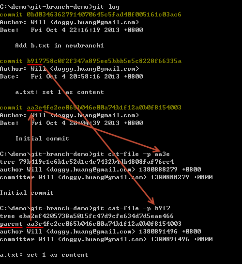

第 12 天：认识 Git 物件的相对名称
=================================================

在认识了 Git 物件的「绝对名称」与「参照名称」后，最后我们来介绍 Git 版控过程中也很常用到的「相对名称」。

我们再复习一次，在 Git 版本控制的过程，每一个版本就代表一个 commit 物件，每个 commit 物件会有一个「绝对名称」，该名称是将内容以 SHA1 哈希运算后的一个 40 字元的字串，你可以用前 4 ~ 40 个字元来当成该 commit 物件的识別名称。版控的过程中，也可以让你通过「参照名称」来代表某个 commit 物件，每个「参照名称」最终会对应到一个物件的「绝对名称」。而「参照名称」又区分「一般参照」与「符号参照」，其中「一般参照」直接对应到｢绝对名称｣，而「符号参照」则是对应到另一个「一般参照」。

这篇文章所要介绍的则是通过「相对名称」的表示法，让你找到特定 commit 物件后，用相对的位置来找到其他的「commit 物件」。

相对名称的表示法
----------------

使用相对名称其实非常简单，这里有两个特殊符号你必须记得，一个是 `^` 另一个是 `~` 符号。

如果要找到 `HEAD` 的前一版本，我们会使用 `HEAD~` 或 `HEAD~1` 来表示「HEAD 这个 commit 物件的前一版」。**注**：这里你应该已经很清楚 `HEAD` 是一个 Git 内建的「符号参照名称」，代表目前分支的最新版。

如果你要找出另一个 `f2e` 分支的前两个版本 (不含 `f2e` 的 `HEAD` 版本)，你则可以用 `f2e~2` 或用 `f2e~~` 来表示，这就是最基本的表示方法。

在没有分支与合并的仓库中，关于 `^1` 与 `~1` 所表达的意思是完全相同的，都代表「前一版」。但事实上在有分支与合并的仓库中，他们有不同的意义，这部分容后再述。

这就是最基本的「相对名称」表示法。

关于 commit 物件彼此间的连结
---------------------------

比较常见的 Git 仓库，预设只会有一个「根 commit 物件」，也就是我们最一开始建立的那个版本，又称「初始送交」(Initial Commit)。你也至少要有第一个 commit 物件后才能开始分支，所以我们可以说：「在一个 Git 仓库中，所有的 commit 物件中，除了第一个 commit 物件外，任何其他的 commit 物件一定都会有一个以上的上层 commit 物件(parent commit)」。为什么有可能有「一个以上」的上层 commit 物件呢？因为你很有可能会合并两个以上的分支到另一个分支里，所以合并完成后的那个 commit 物件就会有多个 parent commit 物件。

我们用个简单的例子来证明这点，我们用 `git cat-file -p [object_id]` 来取得最前面两笔 commit 物件的内容，藉此了解到每个 commit 物件确实一定会有 parent 属性，并指向上层 commit 物件的绝对名称，唯独第一笔 commit 物件不会有 parent 属性。如下图示：

了解相对名称表示法 `^` 与 `~` 的差异
------------------------------------

关于 `~` 的意义，代表「第一个上层 commit 物件」的意思。

关于 `^` 代表的意思则是「拥有多个上层 commit 物件时，要代表第几个第一代的上层物件」。

如果你有一个「参照名称」为 `C`，若要找到它的第一个上层 commit 物件，你可以有以下表达方式：

* `C^`
* `C^1`
* `C~`
* `C~1`

如果你要找到它的第二个上层 commit 物件 (在没有合并的状況下)，你可以有以下表达方式：

* `C^^`
* `C^1^1`
* `C~2`
* `C~~`
* `C~1~1`

但你不能用 `C^2` 来表达「第二个上层 commit 物件」！原因是在没有合并的情況下，这个 `C` 只有一个上层物件而已，你只能用 `C^2` 代表｢上一层物件的第二个上层物件」。

上述讲起来有点抽象又有点绕口，我特别画了一张图给各位看一下，通过图解可能会比较明白些。如下图示，我们想找到 `C` 这个 commit 物件的相对路径下的其他 commit 物件(上层物件)，由于 `C` 这个 commit 物件有三个上层物件，这代表这个 commit 物件是通过合并而被建立的，那么你要通过「相对名称」找到每一个路径，就必须搭配组合 `^` 与 `~` 的使用技巧，才能定位到每个你想开启的版本。

介绍 `git rev-parse` 指令
--------------------------

在 Git for Windows 工具里有个 `git rev-parse` 指令，通过这个指令可以把任意「参考名称」或「相对名称」解析出「绝对名称」，虽然这工具不是很常会用到，但做 Git 教学的时候还蛮实用的。用法如下范例：

* git rev-parse master
* git rev-parse HEAD
* git rev-parse ORIG_HEAD
* git rev-parse HEAD^
* git rev-parse HEAD~5

今日小结
-------

当了解了「相对名称」后，在 Git 中表示 commit 物件的各种方式已经讲解完毕，相信你应该更能掌握 Git 各版本之间的操作。

我重新整理一下本日学到的 Git 指令与参数：

* git log
* git cat-file -p [object_id]
* git rev-parse

-------
* [回目录](README.md)
* [前一天：认识 Git 物件的一般参照与符号参照](11.md)
* [下一天：暂存工作目录与索引的变更状态](13.md)

-------

