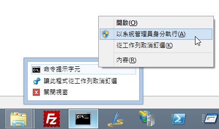
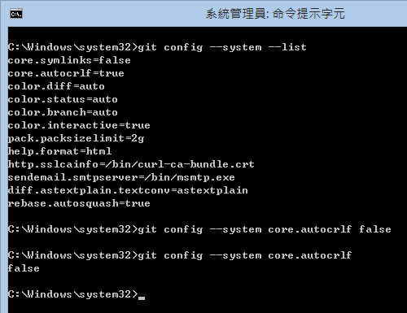
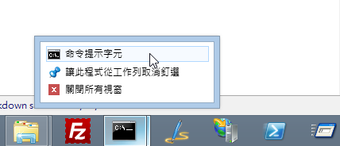
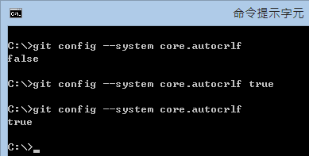
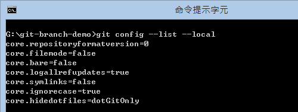
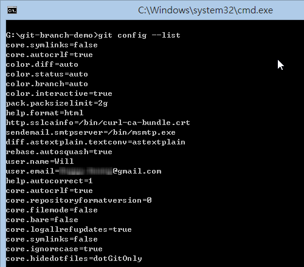
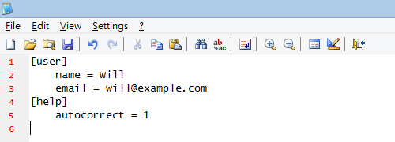
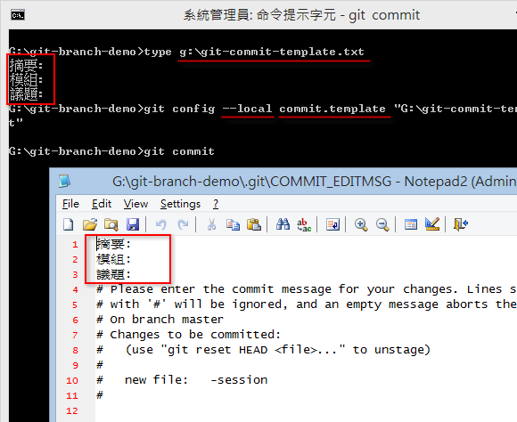

第 14 天： Git for Windows 选项设定
====================================================

使用 Git for Windows 指令列工具绝对比通过 GUI 工具操作来的有效率，原因就在于你可以把许多重复的版控工作通过指令自动化，或将复杂的标准作业流程(SOP)转化成简单的指令操作。本篇文章将分享几则使用 Git for Windows 指令列工具的小技巧。

关于 Git 指令列工具的选项设定
----------------------------

在 Git 指令列工具里，有许多「选项」可以设定，如同我们使用 GUI 工具通常都会有 [工具] -> [偏好设定] 一样，可以微调指令执行时的一些行为。最常见的，当然就是首次使用 Git for Windows 的时候，必须设定 `user.name` 与 `user.email` 选项，没有这两个选项设定，你连执行 `git commit` 的权力都没有。

若要列出目前设定在 Git for Windows 工具下的所有选项，可以使用 `git config --list` 命令，如下图示：

**注**：由于网络上大部分的 Git 文章，都介绍 Linux 或 Mac 电脑的执行环境如何设定，我的文章将会专注于 Windows 平台的设定教学。不过，除了储存路径比较不一样之外，其实指令的用法都是相通的。

若想查询所有可用的「选项」有哪些，可在命令提示字元下执行 `git help config` 即可显示完整的文件说明或可连到 [git-config(1) Manual Page](https://www.kernel.org/pub/software/scm/git/docs/git-config.html) 页面查看。

储存 Git 选项设定的三个地方
--------------------------

1. **系统层级** ( `--system` ) (System-level configuration) (**设定于整台电脑，适用于本机所有使用者的预设值**)

	如果要列出所有设定在「系统层级」的「选项」，可以执行 `git config --list --system` 命令，也就是额外加上 `--system` 即可篩选出关于系统层级的选项设定，如下图示：

	

	所有的「系统层级」的选项设定预设会储存在 `C:\Program Files (x86)\Git\etc\gitconfig` 这个文件里。不过，如果你电脑使用的操作系统是 Windows Vista 以上版本 (含 Windows 7 与 Windows 8 操作系统) 又同时启用「使用者账户控制」 (UAC; User Access Control) 的话，那么这个路径将会是 `%LOCALAPPDATA%\VirtualStore\Program Files (x86)\Git\etc\gitconfig` (这个路径位于使用者的目录下）。会有这层改变的原因就出在 UAC 限制了一般程序存取「系统资料夹」中的文件权限，导致你无法在使用 `git config` 写入选项设定到这个设定档里。在 Windows Vista 以上版本，实作了一套 **VirtualStore** 相容性技术，让你的程序试图写入文件的同时，也可以写入成功，不过写入的路径却是不同的，这点必须特别注意。

	这个 Windows 内建的 **VirtualStore** 相容性技术，其技术文件非常稀有，似乎代表着很少人知道这个东西，但这技术确实可能会让使用者产生困扰。例如，我们用「**一般方式执行命令提示字元**」与用「**以系统管理员身分执行命令提示字元**」，所写入的「系统层级选项」是不能互通的。换句话说，如果你用「**以系统管理员身分执行命令提示字元**」，如下图示：

	

	然后执行 `git config --system --list` 先列出所有参数，我们可以发现目前的 `core.autocrlf` 参数为 `true`，接着我将系统层级的 `core.autocrlf` 修改为 false，最后执行 `git config --system core.autocrlf` 读出 `core.autocrlf` 的内容，你可以看到我们已经把 `core.autocrlf` 选项修改为 `false` 了。如下图示：

	

	再来我们用一般权限执行「命令提示字元」：

	

	然后执行 `git config --system core.autocrlf` 读出 `core.autocrlf` 的内容，这时你可以看到我的 `core.autocrlf` 选项值也是 `false`，目前并没有发现任何问题。不过这时如果你再执行 `git config --system core.autocrlf true` 把 `core.autocrlf` 选项设定改回 `true` 的话，在目前的环境下也没问题：

	

	但如果我们重新「**以系统管理员身分执行命令提示字元**」，再输入一次 `git config --system core.autocrlf` 读出 `core.autocrlf` 的内容，你会发现其选项值竟然为 `false`，这个所谓的「系统层级」设定并没有真的套用到所谓的「系统层级」，所以你日后使用 Git 的过程中发现「怪怪的」状況，或怀疑 Git for Windows 这工具好像有 Bugs，但事实上这跟工具一点关系都没有，是操作系统的问题！

	

	如果你的 Windows 登入账号为 `Will` 的话，这个 `%LOCALAPPDATA%\VirtualStore\Program Files (x86)\Git\etc\gitconfig` 路径就会自动展开为 `C:\Users\Will\AppData\Local\VirtualStore\Program Files (x86)\Git\etc\gitconfig`，也代表着，当你在「一般权限」下执行「命令提示字元」，并且通过 `git config --system` 设定「系统层级」选项，那么该设定将会变成只有「自己」能够套用而已，不会套用到本机其他使用者身上。

	结论：**若要设定「系统层级」选项，请务必用【以系统管理员身分执行】的方式启用命令提示字元，然后再执行 `git config` 命令，才能写入正确的文件位置。**

	補充信息: [VirtualStore - Inside Windows Vista User Account Control](http://technet.microsoft.com/en-us/magazine/2007.06.uac.aspx)

2. **使用者层级** ( `--global` ) (User-level configuration) (**设定于目前登入的使用者**)

	如果要列出所有设定在「使用者层级」的「选项」，可以执行 `git config --list --global` 命令，也就是额外加上 `--global` 即可篩选出关于使用者层级的选项设定，如下图示：

	

	关于「使用者层级」的选项设定预设会储存在 `%USERPROFILE%\.gitconfig` 或 `C:\Users\<使用者账号>\.gitconfig` 这个文件里。由于文件储存在自己的使用者资料夹下，没有像「系统层级」设定时有权限问题。

	一般来说，我们通常会把 `user.name` 与 `user.email` 选项设定在「使用者层级」，例如以下设定范例(请换成你自己的姓名与电子邮件地址)：

		git config --global user.name "Will Huang"
		git config --global user.email "will@example.com"

	还有，由于「使用者层级」顾名思义就是「使用者自己专用的地方」，所以通常我们也会把「个人化」的环境设定都设定在这里，这部分本文稍后就会分享几个环境设定的技巧。

3. **储存区层级** ( `--local` ) (Repository-level configuration) (**设定于工作目录下的 `.git\config` 设定档中**)

	如果要列出所有设定在「储存区层级」的「选项」，可以执行 `git config --list --local` 命令，也就是额外加上 `--local` 即可篩选出关于储存区层级的选项设定，如下图示：

	

	储存区层级的选项设定档预设储存在你 Git 工作目录的 `.git\config` 设定档中，这文件会在你建立本地仓库或通过 `git clone` 取得远端仓库时自动建立，如果你要定义将「特定工作目录」才要有的选项设定，则可以直接将选项设定储存在这里。

Git 选项设定的套用顺序
----------------------

由于设定 Git 选项时可以套用三种不同的层级，不同的层级下可以设定相同名称的选项，但要以哪一个层级的设定为准呢？事实上 Git 指令列工具在执行时会依据以下优先顺序进行套用：

1. 先套用系统层级 (优先权最低)
2. 再套用使用者层级
3. 再套用储存区层级 (优先权最高)

也就是说，你如果在系统层级曾经设定过 `core.autocrlf` 选项，然后在使用者层级又重新定义过一次，那么最终会套用的 `core.autocrlf` 选项值将会是「使用者层级」的设定值。

不过，若你的执行环境若是使用 Windows Vista 以上并启用 UAC 使用者存取控制，而且还只用「一般权限」执行这些 Git 命令的话，读取与套用的顺序会多一个判断：

1. 套用系统层级: `C:\Program Files (x86)\Git\etc\gitconfig`
2. 套用系统层级: `%LOCALAPPDATA%\VirtualStore\Program Files (x86)\Git\etc\gitconfig`
3. 套用使用者层级: `%USERPROFILE%\.gitconfig`
4. 套用储存区层级: `.git\config`

若你想要知道目前的工作环境最终套用的选项设定有哪些，直接执行 `git config --list` 即可以取得所有「已设定」的选项设定清单：

选项设定的操作方式
------------------

* 取得选项设定清单

		git config --list
		git config --list --system
		git config --list --global
		git config --list --local

* 取得特定选项值

		git config [config_section.config_name]

		git config user.name
		git config user.email

* 设定特定选项值

		git config [config_section.config_name] [config_value]

		git config user.name "Will Huang"
		git config user.email "will@example.com"

* 删除特定选项设定

		git config --unset --system [config_section.config_name]
		git config --unset --global [config_section.config_name]
		git config --unset --local  [config_section.config_name]

选项设定档的内容结构
------------------

Git 选项设定的文件内容其实格式都一样，我们试着开启一个**使用者层级**下的设定档看看 ( `%USERPROFILE%\.gitconfig` )：

我们从上图可以看到，中括号 ( `[` 与 `]` ) 所包含的是一个「区段名称」，代表某一群设定档的分类，而其他的内容则是一组 Key/Value 的对应设定。通常我们会用 `git config` 命令来操作这些选项设定，但你其实也可以直接用 Notepad 编辑这些文件，可以达到完全一样的效果。
如果想了解有哪些选项可用，可以在命令提示字元下执行 `git help config` 即可显示说明文件。

常用选项设定
------------

* 设定指令別名 (Alias)

	有没有觉得每次用 git 打指令很囉嗦，尤其是经常使用的 `git status`, `git commit`, `git add` 或 `git log` 等指令，有时候还要外加一些额外的指令参数，每次这样输入还真的挺烦的。其实你可以通过指令別名的设定，让指令输入的更短一些。

	首先，我们先设定一些我常用的 Git Alias 设定，指令如下：

		git config --global alias.co   checkout
		git config --global alias.ci   commit
		git config --global alias.st   status
		git config --global alias.sts  "status -s"
		git config --global alias.br   branch
		git config --global alias.re   remote
		git config --global alias.di   diff
		git config --global alias.type "cat-file -t"
		git config --global alias.dump "cat-file -p"
		git config --global alias.lo   "log --oneline"
		git config --global alias.ll "log --pretty=format:'%h %ad | %s%d [%Cgreen%an%Creset]' --graph --date=short"
		git config --global alias.lg "log --graph --pretty=format:'%Cred%h%Creset %ad |%C(yellow)%d%Creset %s %Cgreen(%cr)%Creset [%Cgreen%an%Creset]' --abbrev-commit --date=short"

	设定完这些「指令別名」后，如果今后你要显示工作目录状态，原本你要输入完整的 `git status`，现在你可以只输入 `git st` 即可完成。如果你要显示简易版的状态信息，以前你要输入 `git status -s` 才能完成，现在你只要输入 `git sts` 即可完成。要显示单行的历史记录，现在也只要输入 `git lo`, `git ll` 或 `git lg` 就可以完成。是不是相对的简单很多呢！ :-)

* 指定预设文字编辑器

	预设 Git for Windows 在执行 `git commit` 的时候，会开启 Vim 编辑器。如果你想切换成记事本的话，可以通过以下指令完成设定：

		git config --global core.editor notepad.exe

	如果想指定 Notepad++ 当为主要编辑器的话，可以通过以下指令完成设定 (请自行修改执行档路径)：

		git config --global core.editor "\"C:\Program Files (x86)\Notepad++\notepad++.exe\""

	当然，你想换成 Sublime Text 也是没问题的，只要把执行档路径写对即可！

* 直接编辑设定档

	有时候直接编辑设定档会比下指令来的方便些，所以如果你想要直接从指令列开启编辑设定档的话，可以参考以下指令：

		git config --edit --system
		git config --edit --global
		git config --edit --local

	如此一来可以省去开启文件总管，并找到路径后再开启文件的繁琐步骤。

* 自动辨识 CRLF 字元

	在 Windows 底下，建议最好打开 core.autocrlf 选项，让 Git 将文件储存进物件储存区 ( object storage ) 时，可以自动过濾所有 CR 字元 ( `\r` )，以利 Git 项目能更容易跨平台，让在 Linux 与 Windows 平台做开发的人都能顺利使用 Git 版本控制。

		git config --global core.autocrlf true

	笔者曾经写过一篇 [Git 在 Windows 平台处理断行字元 (CRLF) 的注意事项](http://blog.miniasp.com/post/2013/09/15/Git-for-Windows-Line-Ending-Conversion-Notes.aspx) 的文章，建议各位可以看看。

* 自动订正打错的参数

	毕竟我们是用指令列工具再输入，打错字在所难免，例如你输入 `git statsu` (打错字了)，若启用「自动订正」选项，则 Git 工具会自动修正为 `git status` 并成功执行，让你不用重打一次。以下是开启自动订正选项的指令：

		git config --global help.autocorrect 1

* 启用消息顏色

	预设 Git for Windows 的「系统层级」设定中已经启用了消息顏色功能，但如果你不小心关闭的话，可以用以下指令开启：

		git config --system color.ui auto

* 自订 commit 消息范本

	每当我们输入 `git commit` 的时候，都会跳出一个文字编辑视窗，让我们输入本次要 commit 的记录消息，但每次都需要重头输入消息。在团队中，你可能会希望大家共用一个「文字范本」，好让大家在 `git commit` 的时候都能够填写必要的栏位或信息。

	如果要指令 commit 消息范本，必须先建立一个文字范本文件，假设我放在 G:\git-commit-template.txt

	接着通过以下指令，设定 commit 消息范本的路径：

		git config --local commit.template "G:\git-commit-template.txt"

	最后执行 `git commit` 所跳出的消息编辑视窗就会有预设内容了：

	

	各位不知道有没有注意到，我故意用 `--local` 参数，将设定储存在「仓库层级」下 ( `.git\config` )，主要原因就是「消息范本」有时候是跟着「项目」走的，不同的项目可能会想套用不同的消息范本。如果你跟我有相同的需求，就可以套用 `--local` 参数。否则，你也可以套用 `--global` 直接套用在使用者层级下。

今日小结
-------

今天介绍的 Git for Windows 选项设定不是很常用，通常也只需要设定一次就没事了，但「工欲善其事、必先利其器」，先把环境、选项都给设定好，你将可大幅減少 Git 版本控制的花费时间。

我重新整理一下本日学到的 Git 指令与参数：

* git config --list
* git config --list --system
* git config --list --global
* git config --list --local

* git config --edit --system
* git config --edit --global
* git config --edit --local

* git config [config_section.config_name]
* git config [config_section.config_name] [config_value]
* git config --unset --system [config_section.config_name]
* git config --unset --global [config_section.config_name]
* git config --unset --local  [config_section.config_name]

* git config user.name
* git config user.email
* git config user.name "Will Huang"
* git config user.email "will@example.com"

* git config --global alias.co   checkout
* git config --global alias.ci   commit
* git config --global alias.st   status
* git config --global alias.sts  "status -s"
* git config --global alias.br   branch
* git config --global alias.re   remote
* git config --global alias.di   diff
* git config --global alias.type "cat-file -t"
* git config --global alias.dump "cat-file -p"
* git config --global alias.lo   "log --oneline"
* git config --global alias.ll "log --pretty=format:'%h %ad | %s%d [%Cgreen%an%Creset]' --graph --date=short"
* git config --global alias.lg "log --graph --pretty=format:'%Cred%h%Creset %ad |%C(yellow)%d%Creset %s %Cgreen(%cr)%Creset [%Cgreen%an%Creset]' --abbrev-commit --date=short"
* git config --global core.editor notepad.exe
* git config --global core.autocrlf true
* git config --global help.autocorrect 1
* git config --system color.ui auto
* git config --local commit.template "G:\git-commit-template.txt"

参考连结
-------

* [Git - Alias](http://c9s.blogspot.tw/2009/11/git-alias.html)
* [11. Aliases | Git How To](http://githowto.com/aliases)
* [7.1 Customizing Git - Git Configuration](http://git-scm.com/book/en/Customizing-Git-Git-Configuration)
* [git-config(1) Manual Page](https://www.kernel.org/pub/software/scm/git/docs/git-config.html)

-------
* [HOME](../README.md)
* [回目录](README.md)
* [前一天：暂存工作目录与索引的变更状态](13.md)
* [下一天：标签 - 标记版本控制过程中的重要事件](15.md)

-------

