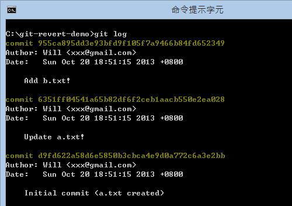
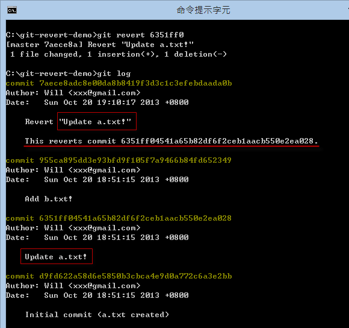
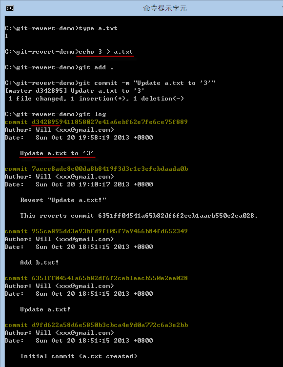
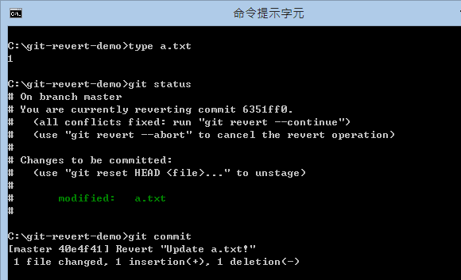
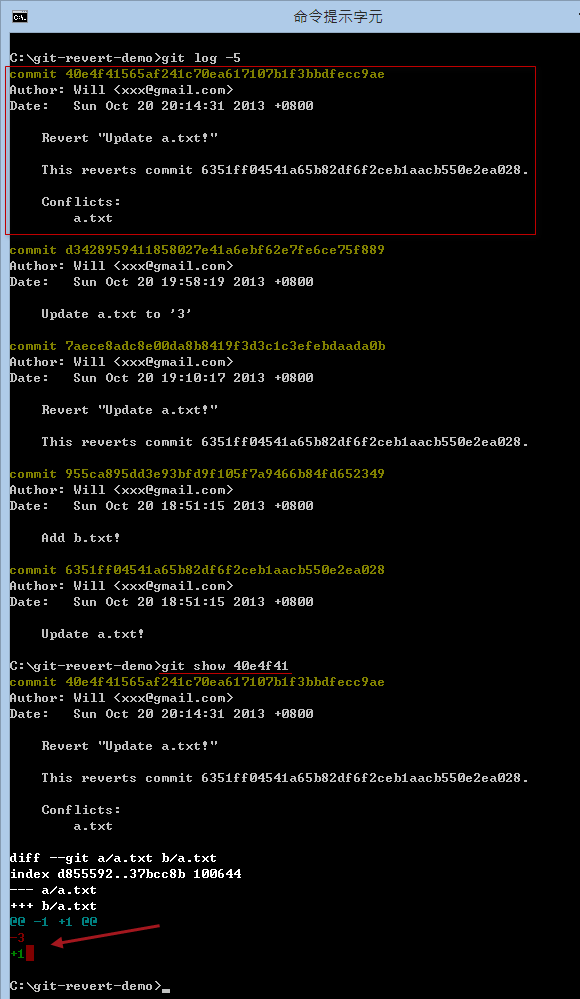
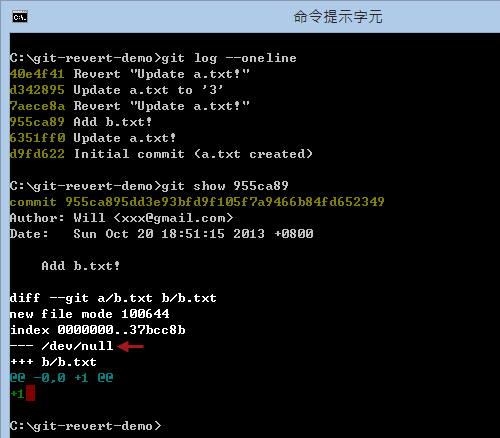
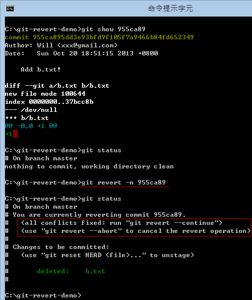

第 20 天：修正 commit 过的版本历史记录 Part 2
=============================================================

在版本控制过程中，还有个常见的状況，那就是当执行了多个版本之后，才发现前面有几个版本改错了，例如你不小心把测试中的代码也给 commit 进去，导致目前这个版本发生了问题。这时你就必须了解本篇文章所说明的内容。

准备本日练习用的版本库
----------------------

在开始说明前，我们一样先用以下指令建立一个练习用的工作目录与本地仓库。我们先建立一个 `a.txt` 的文件，内容为 `1`。然后修正一版，内容改为 `2`。接着在新增一个 `b.txt` 文件，内容为 `1`。所以一共有三个版本：

	mkdir git-revert-demo
	cd git-revert-demo
	git init

	echo 1 > a.txt
	git add .
	git commit -m "Initial commit (a.txt created)"

	echo 2 > a.txt
	git add .
	git commit -m "Update a.txt!"

	echo 1 > b.txt
	git add .
	git commit -m "Add b.txt!"

假设我们这个时候发现，在我们上一个版本 ( `HEAD~` 或 `HEAD^` 或 `6351ff0` ) 被改错了，你希望可以将**该版本**还原就好，而不是把版本重置到第一版再重改一次，那么你可以试试 `git revert` 指令，他可以把某个版本的变更，通过「相反」的步骤把变更给还原。

何谓「相反」的步骤呢？我们立刻来试试这个指令的用法。

使用 `git revert` 命令
-----------------------

假设我们从 `git log` 显示的历史记录中，发现有个版本有问题，那么我们可以先看看这个版本的变更记录。如下图示，你可以先用 `git log` 查出版本编号，然后再用 `git show [commit_id]` 查出该版本的相关信息。

**请注意**：执行 `git revert` 命令之前，请先确保工作目录是干净的！如果有改到一半的文件，建议可通过 `git stash` 建立暂存版本。

从上图你可以看到 `6351ff0` 这个版本的 `a.txt` 文件，是将第 1 行的内容从 `1` 修改成 `2` 的，那也代表着「相反」的步骤则是把 `2` 改成 `1` 才对。这时，如果我想把这个版本的变更给「还原」，则可以输入 `git revert 6351ff0` 这个指令，执行成功后会额外再建立一个新版本。如下图示：

执行过程中会让你编辑最后要 commit 的消息，预设会加上 `Revert` 字样，还有会在第三行的地方加上 `This reverts commit xxxx` 告诉你说这个版本主要目的是从 `xxxx` 版本还原的。

从最新版的变更中，你也可以看出，这次版本主要是将 `a.txt` 内容第 1 行的 `2` 改为 `1` 的，刚好跟原本的变更「相反」。

使用 `git revert` 命令失败的情況
--------------------------------

事实上，这个 `git revert` 是执行了「合并」的动作，我们来证明这个过程。我们在还原了 `6351ff0` 这个版本后，这个 `a.txt` 的内容变成了 `1`，然而我再修改一次 `a.txt` 文件，这次把内容修改为 `3`，如下图示：

这时如果我们再重新执行一次 `git revert 6351ff0` 这个指令，试图再还原一次，你会看到的是「合并」失败时才会有的冲突情形：

发生本次冲突的原因就在于，我们想还原的 `6351ff0` 这个版本，这次的变更原本是 `1` 改成 `2`，由于我们想还原内容，则是把 `2` 改为 `1`，但我们现在的内容却是 `3` 而不是 `2`，因而发生了冲突状況。

所以这种「合并冲突」的状況，跟我们之前在【第 17 天：关于合并的基本观念与使用方式】如出一辙，解决的方法也是一样，你可以选择：

1. 手动编辑 `a.txt` 文件，把合并冲突的标示给移除，编辑出一个你觉得正确的内容。
2. 使用 SourceTree 工具，自行选出一个你想要的版本。

如果你选择 'Theirs' (他的) 版本，就代表你想要接受 `6351ff0` 的版本：

解决冲突后，你可以看到我们的 `a.txt` 内容已经变回了 `1`，并执行 `git commit` 提交这次版本变更：

一样在执行 `git commit` 的过程中，会跳出让你编辑 commit 消息的视窗，这里的预设内容也会标示那些文件发生了冲突：

我们重看一次 `git log` 的内容与最近一次的变更内容，你就可以看出完整的版本变更信息：

使用 `git revert` 命令套用变更，但不执行 commit 动作
---------------------------------------------------

使用 `git revert` 时，预设若执行成功，会直接建立一个 commit 版本，如果你希望在执行 `git revert` 之后先保留变更的内容，也许再添加一些文件或修改一些内容，然后再自行签入的话，可以使用以下步骤。

假设这次我们想还原 `955ca89` 这个版本，这个版本其实是新增一个 `b.txt` 文件而已，如果我们用 `git show 955ca89` 显示其变更状況，你可以看到有一行 `--- /dev/null` 其实就是代表 `955ca89` 这一版之前并没有这个文件，代表这个文件是在这一版本才新增进来的，而且内容为 `1`。这也代表着，如果要成功「还原」(revert) 这版，目前的 `b.txt` 内容必须为 `1`，然后才会成功执行「删除」的动作。

现在我们输入 `git revert -n` 执行完后，没有提示任何文字，但事实上 `b.txt` 这个文件已经成功被删除了，我们执行 `git status` 就可以看出结果：

这个时候，索引状态已经被更新，但你还是可以继续修改这个版本，直到你想完成本次动作。从上图你可以看到你有两个执行的选项，分別是：

1. `git revert --continue` 代表你已经完成所有操作，并且建立一个新版本，就跟执行 `git commit` 一样。
2. `git revert --abort` 代表你准备放弃这次复原的动作，执行这个命令会让所有变更状态还原，也就是删除的文件又会被加回来。

**请注意**：当 `git revert -n` 执行完后，并不是用 `git commit` 建立版本喔！

今日小结
-------

今天介绍的「还原」版本的机制，其实是通过「新增一个版本」的方式把变更的内容改回来，而且通过这种方式，你可以通过版本历史记录中明确找出你到底是针对哪几个版本进行还原的。另外就是这个「还原」的过程，其实跟「合并」的过程非常类似，发生冲突时的解决方法也都如出一辙。

我重新整理一下本日学到的 Git 指令与参数：

* git show [commit_id]
* git revert [commit_id]
* git revert [commit_id] -n

另外还有些参数没介绍到，建议可用 `git help revert` 查询完整用法：

* git revert [commit_id] -s	(在消息内容加上目前使用者的签署名称)
* git revert [commit_id] -e (在完成版本之前显示编辑消息的视窗)

-------
* [回目录](README.md)
* [前一天：设定 .gitignore 忽略清单](19.md)
* [下一天：修正 commit 过的版本历史记录 Part 3 (cherry-pick)](21.md)

-------

