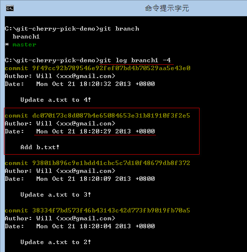

第 21 天：修正 commit 过的版本历史记录 Part 3
=============================================================

在版本控制过程中，还有个常见的状況，那就是当你在一个分支中开发了一段时间，但后来决定整个分支都不要了，不过当中却有几个版本还想留下，这时要删除分支也不是，把这个分支合并回来也不是，那该怎么办呢？本篇文章将说明你该如何利用 `git cherry-pick` 指令「手动挑出」你想套用的变更。

准备本日练习用的版本库
----------------------

在开始说明前，我们一样先用以下指令建立一个练习用的工作目录与本地仓库。文章看到这里，想必各位看到指令应该都知道在做什么事了吧。我们在一开始建立 2 个版本后，就建立了一个 `branch1` 分支，然后在分支里建立了三个版本，其中一个版本为新增一个 `b.txt` 文件。最后我们再切换回 `master` 分支，并新增一个变更：

	mkdir git-cherry-pick-demo
	cd git-cherry-pick-demo
	git init

	echo 1 > a.txt
	git add .
	git commit -m "Initial commit (a.txt created)"

	echo 2 > a.txt
	git add .
	git commit -m "Update a.txt to 2!"

	git checkout -b branch1

	echo 3 > a.txt
	git add .
	git commit -m "Update a.txt to 3!"

	echo b > b.txt
	git add .
	git commit -m "Add b.txt!"

	echo 4 > a.txt
	git add .
	git commit -m "Update a.txt to 4!"

	git checkout master

	echo 3 > a.txt
	git add .
	git commit -m "Update a.txt to 3!"

如果我们用 SourceTree 查看仓库的 commit graph (版本线图) 的话，可以看到如下图蓝色的部分是我们 `master` 分支的变化，一共三个版本。红色是 `branch1` 的分支，如果仅以这个分支来看也有三个版本。

使用 `git cherry-pick` 命令的注意事项
---------------------------------------

首先，你的「工作目录」必须是干净，工作目录下的「索引」不能有任何准备要 commit 的文件 (staged files) 在里面，否则将会无法执行。

使用 `git cherry-pick` 命令
-----------------------------

使用 `git cherry-pick` 跟使用 `git revert` 非常相似，也是让你「挑选」任意一个或多个版本，然后套用在目前分支的最新版上，但主要差异则在于「`git revert` 执行的是相反的合并，而 `git cherry-pick` 则是重新套用完全相同的变更」，但一样都是通过「合并」的方式进行，所以本篇文章我不会做太多类似的相关练习，而是专注在讲解两种指令上的差异。

**注**：`cherry-pick` 的英文是「捡樱桃」的意思，代表你可以从其他篮子(分支)「挑」一些好的櫻桃到自己的篮子(分支)里！

各位在使用 `git cherry-pick` 命令时，最好搭配 SourceTree 等 GUI 工具，查看你想要「挑选」出来的版本，然后套用在目前的分支上 (当然是套用在目前的 `HEAD` 版本之后)。

目前我们位于 `master` 分支上，若要查询 `branch1` 的所有记录，我们执行 `git log branch1` 即可 (如下图加上 `-4` 代表仅显示前 4 笔记录)：

今天我想套用 `branch1` 的 `dc07017  Add b.txt!` 这个版本到目前的 `master` 版本上，可以执行 `git cherry-pick dc07017` 命令，若成功执行，则会在目前的 `master` 分支建立一个新版本。

不过，与 `git revert` 最大的不同之处，就在于执行完 `git cherry-pick` 命令后，其建立的版本消息，将会与你指定挑选的那些版本一模一样，其中包括 **Author** 与 **Date** 栏位，都会一模一样，并不会用你在选项设定中指定的 `user.name` 与 `user.email` 参数。这点你必须特别注意！

使用 `git cherry-pick` 命令的其他参数
---------------------------------------

你可以选择加上 `-x` 参数在指令列上，就会像 `git revert` 那样，自动加上 `(cherry picked from commit dc070173c8d087b4e65084653e31b81910f3f2e5)` 的消息，如下图示：

不过，做这个动作之前也请先思考，你这次挑选的版本是不是只有「本地才有的分支」上挑选的，如果是的话，这样的记录可能会造成其他人的混淆，因为他们查不到该版本的任何信息。这在使用远端仓库的情境比较会碰到。

如果希望在建立版本前先编辑消息，那么你可以输入 `git cherry-pick dc07017 -e` 指令。

如果你不想建立版本，仅套用其变更，那么你可以执行 `git cherry-pick dc07017 -n` 指令，这样就不会自动建立版本，你可以在加上自己的修改后，执行 `git commit` 建立版本。通过 `-n` 参数，这次建立的版本就会留下自己的 Author & Date 信息！

今日小结
-------

今天大家学到如何「捡樱桃」的技巧，不过我没办法教你「怎样挑出好的櫻桃」，这就要问你自己才知道了！ :-)

我重新整理一下本日学到的 Git 指令与参数：

* git cherry-pick [commit_id]
* git cherry-pick [commit_id] -e
* git cherry-pick [commit_id] -x
* git cherry-pick [commit_id] -n

-------
* [HOME](../README)
* [回目录](README)
* <a href="20.md">前一天：修正 commit 过的版本历史记录 Part 2 (revert)</a>
* <a href="22.md">下一天：修正 commit 过的版本历史记录 Part 4 (rebase)</a>

-------

