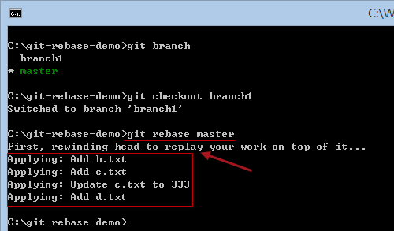
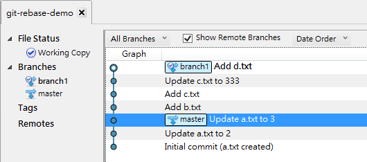
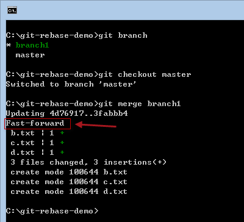
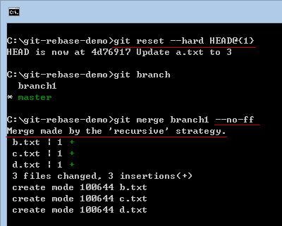
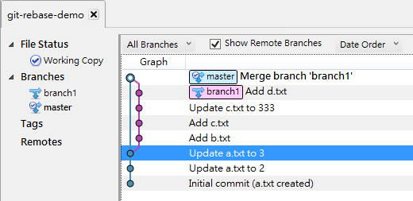
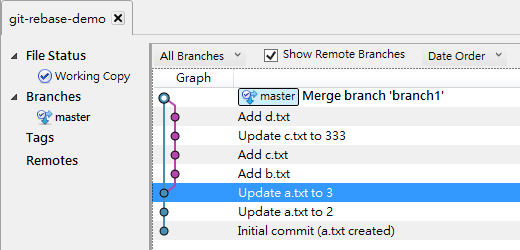
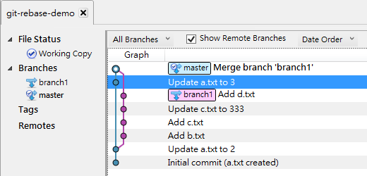

第 22 天：修正 commit 过的版本历史记录 Part 4 (Rebase)
======================================================================

我们之前已经讲了三种不同的修正版本的方法，严格上来说 `git revert` 与 `git cherry-pick` 并不算「修正版本历史记录」，而是套用先前曾经 commit 过的版本，看是「重新套用」或「反向套用」的差別而已。本篇文章将要来说明 Git 中的 Rebase 机制，这个所谓的 Rebase 机制就是真的用来修改 commit 记录的功能了，其功能重要而且强大。

准备本日练习用的版本库
----------------------

我们一样先用以下指令建立一个练习用的工作目录与本地仓库 (一样先切换到 `C:\` 然后复制贴上就会自动建立完成)：

	mkdir git-rebase-demo

	cd git-rebase-demo
	git init

	echo 1 > a.txt
	git add .
	git commit -m "Initial commit (a.txt created)"

	ping 127.0.0.1 -n 2 >nul

	echo 2 > a.txt
	git add .
	git commit -m "Update a.txt to 2"

	ping 127.0.0.1 -n 2 >nul

	:: 建立并切换到 branch1 分支
	git checkout -b branch1

	echo b > b.txt
	git add .
	git commit -m "Add b.txt"

	echo c > c.txt
	git add .
	git commit -m "Add c.txt"

	echo 333 > c.txt
	git add .
	git commit -m "Update c.txt to 333"

	echo d > d.txt
	git add .
	git commit -m "Add d.txt"

	ping 127.0.0.1 -n 2 >nul

	:: 切换到 master 分支
	git checkout master

	echo 3 > a.txt
	git add .
	git commit -m "Update a.txt to 3"

我们用 SourceTree 查看仓库的 commit graph (版本线图) 如下：

使用 `git rebase` 命令的注意事项
---------------------------------

首先，你的「工作目录」必须是干净，工作目录下的「索引」不能有任何准备要 commit 的文件 (staged files) 在里面，否则将会无法执行。

再来，也是最重要的，如果你的分支是从远端仓库下载回来的，请千万不要通过 Rebase 修改版本历史记录，否则你将会无法将修改过后的版本送到远端仓库！

Rebase 是什么？
-----------------

Rebase 是 "Re-" 与 "Base" 的复合字，这里的 "Base" 代表「基础版本」的意思，表示你想要重新修改特定分支的「基础版本」，把另外一个分支的变更，当成我这个分支的基础。

我们现在就来做一个简单的 Rebase 示范，我们大概做几件事：

1. 切换至 `branch1` 分支： `git checkout branch1`
2. 然后执行 Rebase 动作，把 `master` 当成我们的基础版本： `git rebase master`

请注意执行完 `git rebase master` 之后的显示消息，他说先将我们 `branch1` 分支的最新版本(head)倒带(rewind)到跟 `master` 一样的分支起点(rewinding head)，然后再重新套用(replay)指定的 `master` 分支中所有版本。英文的 **on top of it** 代表的是让 `branch1` 分支原本的变更套用在 `master` 上面，所谓的「上面」代表的是先套用 `master` 的版本，然后才套用 `branch1` 的版本 (请见上图的 `Applying:` 那几行)。

我们看看套用完之后从 SourceTree 看到的版本线图(commit graph)，你看看这是不是很神奇，版本线图变成一直线了：

各位看官，看到上面的版本线图，你会不会觉得「分支」的感觉不见了呢？事实上，分支并没有改变，而是这几个版本的「套用顺序」被修改了。目前这张图所代表的意思，就如同以下指令的执行顺序：

1. 建立 Initial commit (a.txt created)，同时预设建立 `master` 分支
2. 建立 Update a.txt to 2
3. 建立 Update a.txt to 3
4. 建立并切换至 `branch1` 分支
5. 然后不断 commit 到 Add d.txt 这个版本

所以，这其实还是「两个分支」喔，并没有被合并成一个！**千万別认为**这张图只有一条线，所以只有一个分支。

有分支，就有合并，现在的你，如果想要把 `branch1` 的变更，套用到 `master` 分支上，在使用过 Rebase 之后，你会有两种合并的方式：

### 1. 通过一般合并指令，并触发 Git 的快转机制 (Fast-forward)

先切换到 `master` 分支，然后直接执行 `git merge branch1`，这时会引发 Git 的快转机制(Fast-forward)。所谓的「快转机制」，就是 Git 得知这个合并的过程，其实会依序套用 `branch1` 原本就有的变更，所以在合并的时候会直接修改 `master` 分支的 `HEAD` 参照绝对名称，直接移动到 `branch1` 的 `HEAD` 那个版本。

最后我们得到的线图还是一直线，但你可以看到 `master` 的分支已经移动到跟 `branch1` 一样了。如下图示：

### 2. 通过 `--no-ff` 参数，停用 Git 的快转机制

先切换到 `master` 分支，然后直接执行 `git merge branch1 --no-ff` 即可。

当你合并时指定停用 Git 的快转机制，那就代表「不允许快转」的意思。也代表着，他会强迫你打算合并的那个 `branch1` 先建立一个分支，然后最后再合并回 `master`，也代表着我们再次变更了 `branch1` 的版本线图。最终，你看到的版本线图应该会长成以下这个样子，不是比刚刚一直线的版本线图还漂亮呢！ :-)

最后，如果你的 `branch1` 用不到的话，就可以把这个分支给删除： `git branch -d branch1`

最终我们的版本线图如下：

我们来比对一下，如果用我们最刚开始的建立的初始版本进行合并的话，线图会长得像以下这样。各位有没有发现，我们原本的 `branch1` 是从 **Update a.txt to 2** 这一版开始分支的，经过我们通过 Rebase 之后，分支的起点不太一样了，而是改由 **Update a.txt to 3** 这个分支开始，是不是很有趣呢！

今日小结
-------

第一次接触 Rebase 的人，或许会觉得很抽象，各位必须细心品味，才能真正感受到 Rebase 带来的强大威力。之后的文章里，我还会更加详细的介绍 Rebase 的进阶用法。

我重新整理一下本日学到的 Git 指令与参数：

* git rebase master
* git merge branch1
* git branch -d branch1

-------
* [回目录](README.md)
* [前一天：修正 commit 过的版本历史记录 Part 3 (cherry-pick)](21.md)
* [下一天：修正 commit 过的版本历史记录 Part 5 (rebase 2)](23.md)

-------

