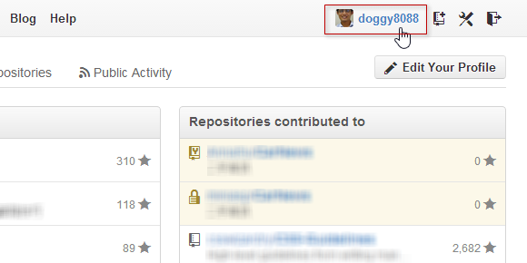
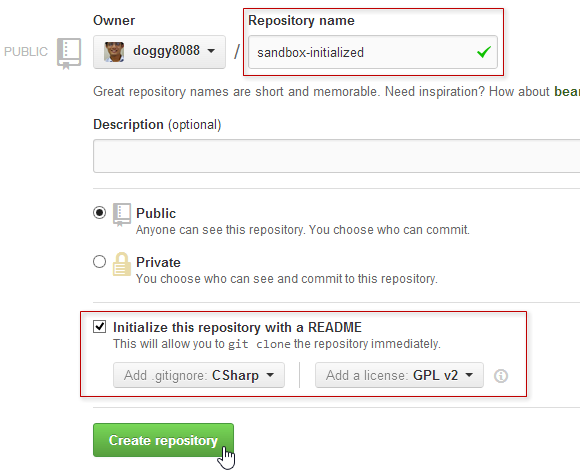
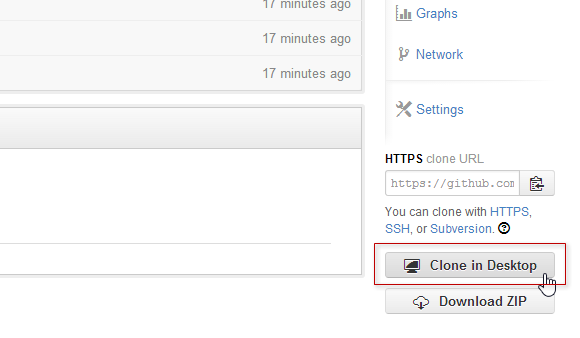
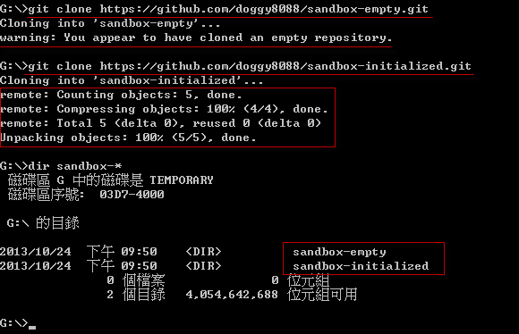
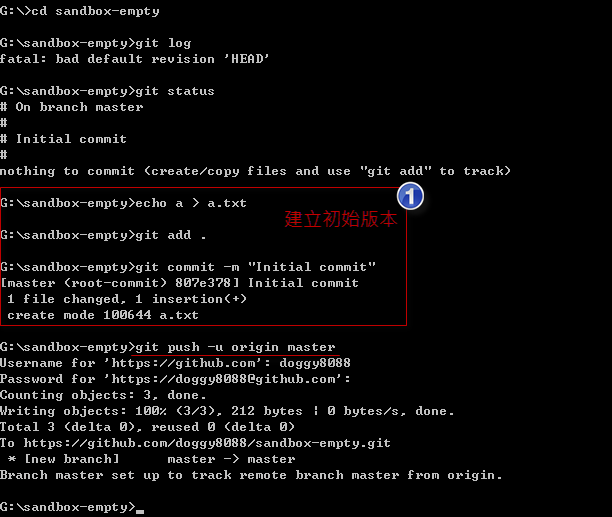
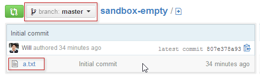
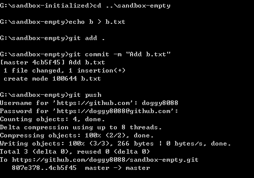
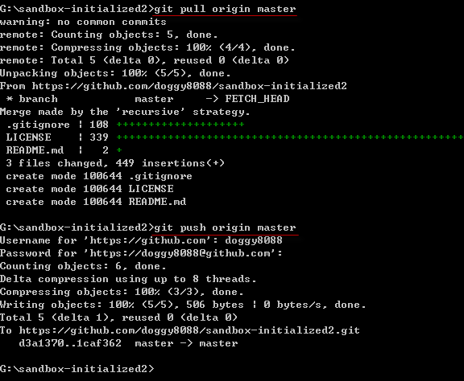
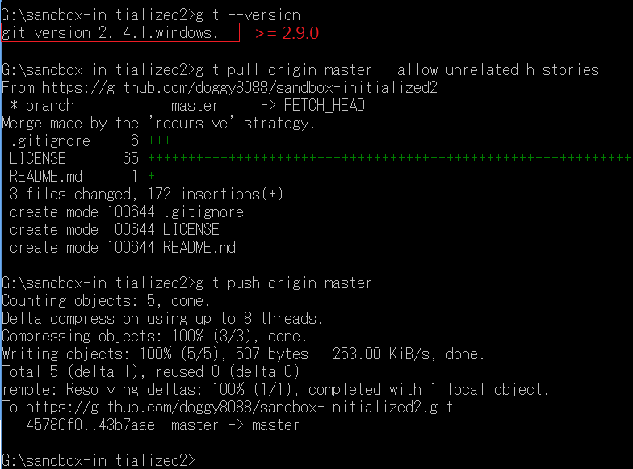
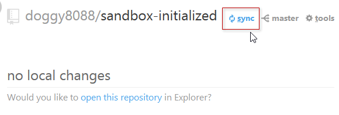

第 24 天：使用 GitHub 远端仓库 - 入门篇
========================================================

GitHub 是目前全世界最多人采用的 Git 线上管理平台，他包含了完整的 Git 远端仓库实作，还有完整的议题追踪机制与报表，更有成千上万的开源码项目都在 GitHub 进行 Git 版本控制。即便在我们公司，也有许多项目采用 GitHub 当成我们主要的 Git 平台。本篇文章主要带大家上手 GitHub 最基本的使用方式。

我们先来说明在 GitHub 建立项目的两种不同的方式。

在 GitHub 建立一个「**没有版本**」的空白 Git 仓库
----------------------------------------------------

先登入 GitHub，再进入 GitHub 首页： [https://github.com](https://github.com)

点选右上角你的使用者名称进入个人首页：

切换到 **Repositories** 页签：

再点选右边绿色的 **New** 按钮，以建立一个你自己的 GitHub 项目 (包含 Git 远端仓库)：

如果你要建立一个「**没有版本**」的空白 Git 仓库，最重要的就是最下方的 **Initialize this repository with a README** 不要勾选，还有 **Add .gitignore** 与 **Add a licenes** 都保留预设的 **None** 选项：

最后按下 **Create repository** 即可建立完成，当你建立起一个「**没有版本**」的空白 Git 仓库之后，画面最下方也提到了几个让你上传本地 Git 仓库的指令教学，照着打就可以把本地仓库的变更上传到 GitHub 的远端仓库中。

在 GitHub 建立一个「**有初始化版本**」的 Git 仓库
----------------------------------------------------

建立一个「**有初始化版本**」的空白 Git 仓库，其实就是在 GitHub 建立项目时，勾选了一些初始化的文件，在建立的过程 GitHub 会依据你所挑选的选项，先帮你建立好一个初始化的 Git 版本：

建立完成后，在 GitHub 上显示的内容会不太一样，因为你已经有一个 commit 版本在上面了：

将本地仓库的变更上传到远端仓库的方法
--------------------------------------

我有在【第 03 天：建立仓库】这篇文章中提到如何取得从 GitHub 建立的远端仓库 (remote repository)，不过若要将本地变更送上 GitHub 则有好几种不同的方式，其中包括：

1. 在 GitHub 建立一个「**没有版本**」的空白 Git 仓库，然后通过 `git clone` 取得远端仓库，再建立版本后上传
2. 在 GitHub 建立一个「**没有版本**」的空白 Git 仓库，然后直接将现有的本地 Git 仓库上传到指定的 GitHub 项目
2. 在 GitHub 建立一个「**有初始化版本**」的 Git 仓库，然后通过 `git clone` 取得远端仓库，再建立版本后上传
3. 在 GitHub 建立一个「**有初始化版本**」的 Git 仓库，然后直接将现有的本地 Git 仓库上传到指定的 GitHub 项目

以上就是我们首次使用 GitHub 时，最常见的四种上传方式。严格说起来，上述四种上传方式，应该只有两种而已，也就是：

1. 通过 `git clone` 取得远端仓库，再建立版本后上传
2. 直接将现有的本地 Git 仓库上传到指定的 GitHub 项目

为什么我想拆成四个来讲呢？主要有两个原因：

1. 【通过 `git clone` 取得远端仓库，再建立版本后上传】的这种方式，因为「**没有版本**」的空白 Git 仓库，连预设的 `master` 分支都没有，所以用预设的指令无法上传到远端仓库。所以在指令操作上会有两种用法。
2. 【直接将现有的本地 Git 仓库上传到指定的 GitHub 项目】的这种方式，因为通常一个 Git 仓库只会有一个「初始 commit 物件」，如果你在本地仓库已经建立了几个版本，代表在你的本地仓库中已经有了自己的「初始 commit 物件」，这将会与 GitHub 建立的「**有初始化版本**」的 Git 仓库相互冲突，所以上传的指令也会有些不同。

以下我们先来说明【**通过 `git clone` 取得远端仓库，再建立版本后上传**】这个方法。

通过 `git clone` 取得远端仓库，再建立版本后上传
------------------------------------------------

这个方法最简单，因为你还没有本地仓库的存在，什至连工作目录都还没有，所以我们直接利用 `git clone` 即可把项目下载。然而，在使用 GitHub 的时候，最简单的方法就是利用 GitHub for Windows 工具。你只要点击 **Clone in Desktop** 按钮，即可自动启动 GitHub for Windows 工具帮你下载 Git 项目：

* 「**没有版本**」的空白 Git 仓库

	

* 「**有初始化版本**」的 Git 仓库

	

你也可以直接复制 GitHub 提供的 URL 网址，然后利用 `git clone` 指令下载，例如：

如果你用 `git clone https://github.com/doggy8088/sandbox-empty.git` 复制一个 「**没有版本**」的空白 Git 仓库，将会得到一个 **warning: You appear to have cloned an empty repository.** 警告消息，不过这不影响你上传本地的变更。

如果你用 `git clone https://github.com/doggy8088/sandbox-initialized.git` 复制一个 「**有初始化版本**」的 Git 仓库，将会直接从 GitHub 下载拥有完整变更历史的「远端仓库」，所以你会看到有下载物件数量、压缩、解压缩等信息。

我们以 `sandbox-empty` 这个项目为例，由于这是一个 「**没有版本**」的空白 Git 仓库，在 GitHub 上的远端仓库是完全空的，连预设的 `master` 分支都没有，所以在下达 `git push` 指令时必须加上 `-u` 参数，才能成功地把本地仓库上传到 GitHub 上的远端仓库，其指令是 `git push -u origin master`

我们再以 `sandbox-initialized` 这个项目为例，由于这是一个  「**有初始化版本**」的 Git 仓库，在 GitHub 上的远端仓库已经有一个版本，同时也建立好预设的 `master` 分支，所以在下达 `git push` 指令时可以不用加上 `-u` 参数，就成功地把本地仓库上传到 GitHub 上的远端仓库，其指令是 `git push origin master`

当你第二次建立版本时，直接执行 `git push` 就会自动上传成功：

不过，当你执行简单版本的 `git push` 会出现一段提示，告诉你要设定 `push.default` 这个选项，因为这种简写的 `git push` 方法，Git 的预设行为将会在 Git 2.0 之后发生改变，建议你通过设定  `push.default` 选项的方式明确指定 push 的方法。详细说明请参见 `git help config` 的说明文件，搜寻 `push.default` 即可找到相关说明。我建议各位设定成 `simple`，以利跟日后的 Git 指令列工具的预设值相同，指令如下：

	git config --global push.default simple

设定好之后，下次执行 `git push` 就不会再出现提示消息了：

之后的操作，在我们这两个练习用的工作目录都完全一样。

直接将现有的本地 Git 仓库上传到指定的 GitHub 项目
------------------------------------------------

接下来我们再来说明【**直接将现有的本地 Git 仓库上传到指定的 GitHub 项目**】这个方法。但由于练习用的 GitHub 项目已经被上传一些物件，所以请各位重新再建立两个新项目，分別是一个「**没有版本**」的空白 Git 仓库，与另一个「**有初始化版本**」的 Git 仓库。

一个「**没有版本**」的 Git 仓库，项目名称：`sandbox-empty2`
一个「**有初始化版本**」的空白 Git 仓库，项目名称：`sandbox-initialized2`

接着我们建立两个本地仓库与工作目录，指令如下：

	mkdir sandbox-empty2
	cd sandbox-empty2

	git init

	echo a > a.txt
	git add .
	git commit -m "Initial commit"

	cd ..
	mkdir sandbox-initialized2
	cd sandbox-initialized2

	git init

	echo a > a.txt
	git add .
	git commit -m "Initial commit"

我们先以 `sandbox-empty2` 项目为例，由于我们本地仓库跟 GitHub 上的远端仓库完全没有关联，所以必须告诉 Git 远端仓库在哪。这时我们可以输入 `git remote add origin https://github.com/doggy8088/sandbox-empty2.git` 建立一个名为 `origin` 的参照名称，并指向 `https://github.com/doggy8088/sandbox-empty2.git` 位址，也就是我们在 GitHub 上的远端仓库位址。接着就跟我们先前讲解的步骤一模一样，如下图示：

接着我们再以 `sandbox-initialized2` 项目为例，请记得复制到正确的 URL 位址：

然后输入跟以上相同的指令 (记得改 URL 喔)：`git remote add origin https://github.com/doggy8088/sandbox-initialized2.git`

你可以发现，这次的 `git push` 动作被 GitHub 拒绝了！因为你不能把两个完全无关的 Git 版本直接上传到 GitHub 上的远端仓库。

解决的方法很简单，只要把远端仓库的 `master` 分支，成功合并回我本地的分支，即可建立两个不同版本库之间的关联，这样你就可以把本地的 `master` 分支推送到 GitHub 上远端仓库的 `master` 分支了。

将远端仓库的 `master` 分支取回，并合并到本地仓库的 `master` 分支，有两种方法：

1. 使用 `git pull origin master` 指令
2. 使用 `git fetch` 指令后再执行 `git merge origin/master` 合并动作 (这个方法会在后续的文章详述)

先用 `git --version` 查看自己的版本，若你的 Git 版本是 `2.8.4` (包含)以前，你可以成功合并，

成功执行的过程如下图示：

但是从 `Git 2.9.0` 开始，预设行为不允许合并没有共同祖先的分支：

需要加上 `--allow-unrelated-histories` 允许 Git 合并没有共同祖先的分支。

因此完整指令为 `git pull origin master --allow-unrelated-histories`：

今日小结
-------

本篇文章完整的介绍如何将本地仓库上传到 GitHub 上的远端仓库，虽然过程有点麻烦，但如果你通过 GitHub for Windows 操作的话，要上传到 GitHub 只要简单的按下 **sync** 按钮，就可以自动上传了，连账号密码都不用输入，这样是不是简单很多。 (^_^)

我重新整理一下本日学到的 Git 指令与参数：

* git push origin master
* git push -u origin master
* git pull origin master
* git config --global push.default simple
* git push
* git fetch
* git merge origin/master
* git --version
* git pull origin master --allow-unrelated-histories

-------
* [HOME](../README)
* [回目录](README)
* <a href="23.md">前一天：修正 commit 过的版本历史记录 Part 5 (rebase 2)</a>
* [下一天：使用 GitHub 远端仓库 - 观念篇](25)

-------

