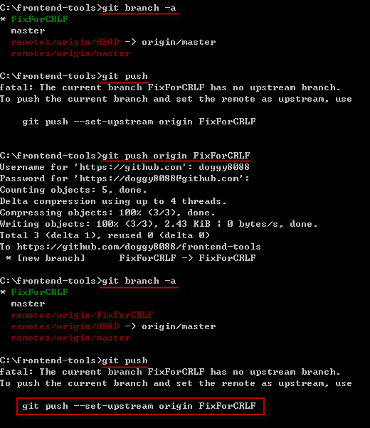

第 25 天：使用 GitHub 远端仓库 - 观念篇
========================================================

上一篇大家学会了如何下载远端仓库 (`git clone`, `git pull`) 与上传远端仓库 (`git push`)，本篇文章来教大家认识远端仓库的其他细节。

与远端仓库有关的指令
---------------------

* `git clone`

	将**远端仓库**复制到本地，并建立**工作目录**与**本地仓库** (就是 `.git` 资料夹)

* `git pull`

	将远端仓库的最新版下载回来，下载的内容包含完整的物件仓库(object storage)。并且将远端分支合并到本地分支。 (将 `origin/master` 远端分支合并到 `master` 本地分支)

	所以一个 `git pull` 动作，完全相等于以下两段指令：

		git fetch
		git merge origin/master

* `git push`

	将本地仓库中目前分支的所有相关物件**推送**到远端仓库中。

* `git fetch`

	将远端仓库的最新版下载回来，下载的内容包含完整的物件仓库(object storage)。
	这个命令**不包含**「合并」分支的动作。

* `git ls-remote`

	显示特定远端仓库的参照名称。包含**远端分支**与**远端标签**。

关于追踪分支的概念
------------------

我们先前学习过关于「分支」的概念，不过仅限于｢本地分支｣，今天我们多出了个「远端分支」，事情就相对复杂一些。

基本上，当我们的版本控制流程加上了远端仓库之后，原本的**分支**就可以被拆成四种不同的概念：

1. 远端追踪分支

	这个分支位于远端，目的是用来追踪分支的变化情形。通常远端分支你是存取不到的。

2. 本地追踪分支

	当你执行 `git clone` 复制一个远端容器回来之后，所有远端追踪分支会被下载回来，并且相对应的建立起一个同名的 **本地追踪分支**。

	我们以复制 jQuery 在 GitHub 上的项目为例，通过 `git clone https://github.com/jquery/jquery.git` 下载回来后，执行 `git branch -a` 指令，显示出所有「本地分支」与「本地追踪分支」。「本地追踪分支」就是如下图**红字**的部分：

	

3. 本地分支

	在通过 `git branch` 指令执行时所显示的分支，就是所谓的「本地分支」，这些分支存在于本地端，而这些分支又常被称为 **主题分支** (Topic Branch) 或 **开发分支** (Development Branch)，就是因为这些分支预设不会被推送到远端仓库，主要用来做开发用途。

4. 远端分支

	顾名思义，远端分支就是在远端仓库中的分支，如此而已。如果你用 GitHub 的话，你是无法存取远端分支的。

	虽然说「概念上」可以分为这四类，但其实这些分支就只是**参照名称**而已，而这里的「追踪分支」主要就是用来跟远端的分支做对应，你不应该直接在这些分支上建立版本 (虽然你还是可以这么做，但强烈不建议乱搞)，而是把这些「本地追踪分支」视为是一种｢唯读｣的分支。

注册远端仓库
---------------

我们在上一篇有提过可以通过 `git remote` 指令手动加入一个「远端仓库」，例如：

	git remote add origin https://github.com/doggy8088/sandbox-empty2.git

这个 `origin` 名称是在 Git 版本控制中惯用的预设远端分支的参照名称，主要目的是用来代表一个远端仓库的 URL 位址。

不过，事实上你可以在你的工作目录中，建立多个远端仓库的参照位址。例如我们以 `sandbox-empty2` 这个项目为例，我们先复制回来，然后通过 `git remote -v` 可列出目前注册在工作目录里的远端仓库信息。如果我们额外将 jQuery 的远端仓库也一并下载回来，则可以用以下指令先行注册一个名称起来。

	git remote add jquery https://github.com/jquery/jquery.git

最后再用 `git fetch` 指令把完整的 jQuery 远端仓库一并下载回来，完整的执行过程如下图示：

你可以看到，我们事实上可以在一个 Git 工作目录中，加入许多相关或不相关的远端仓库，这些复制回来的**完整仓库**，都包含了这些仓库中的所有物件与变更历史，这些 Git 物件随时都可以灵活运用。不过，通常我们注册多个远端仓库的机会并不多，除非你想抓特其他团队成员的版本库回来查看内容。

这些注册进工作目录的远端仓库设定信息，都储存在 `.git\config` 设定档中，其内容如下范例：

	[remote "origin"]
		url = https://github.com/doggy8088/sandbox-empty2.git
		fetch = +refs/heads/*:refs/remotes/origin/*
	[remote "jquery"]
		url = https://github.com/jquery/jquery.git
		fetch = +refs/heads/*:refs/remotes/jquery/*

这个 `[remote "origin"]` 区段的设定，包含了远端仓库的代表名称 `origin`，还有两个重要的参数，分別是 `url` 与 `fetch` 这两个，所代表的意思是：「远端仓库 URL 位址在 `https://github.com/doggy8088/sandbox-empty2.git`，然后 `fetch` 所指定的则是一个**参照名称对应规格**(refspec)。」

何谓参照名称对应规格 (refspec)
-------------------------------

我们先来看一下 refspec 的格式：

	+refs/heads/*:refs/remotes/origin/*

这个格式概略区分成 4 塊：

* `+`

	设定 `+` 加号，代表传输资料时，不会特别使用安全性确认机制。

* `refs/heads/*`

	「来源参照规格」，代表一个位于**远端仓库**的**远端分支**，而 `*` 星号代表 `refs/heads/` 这个路径下｢所有的远端参照」。

* `:`

	这用来区隔｢来源分支｣与「目的分支」

* `refs/remotes/origin/*`

	「目的参照规格」，代表一个位于**本地仓库**的**本地追踪分支**，而 `*` 星号代表工作目录的 `refs/remotes/origin/` 这个路径下｢所有的本地参照」。

当我们定义好这份 refspec 对应规格后，主要会影响到的是 `git fetch` 与 `git push` 这两个远端仓库的操作。

`git fetch` 就是把远端仓库的相关物件取回，但要取得那些远端分支的物件呢？就是通过这份 refspec 的定义，他才知道的。以上述为例，当你执行 `git fetch` 或 `git fetch origin` 的时候，他会先通过 URL 连到远端仓库，然后找出「来源参照规格」的那些远端分支 (`refs/heads/*`)，取回之后放入「目的参照规格」的那些本地追踪分支(`refs/remotes/origin/*`)。

我们要怎样查询远端仓库到底有哪些分支呢？你可以执行 `git ls-remote` 或 `git ls-remote origin` 即可列出所有远端分支：

如果你把 fetch 的 refspec 修改成以下这样，那么除了 `master` 以外的远端分支，就不会被下载了！：

	fetch = +refs/heads/master:refs/remotes/origin/master

如果你想明确下载特定几个分支就好，你可以重复定义好几个不同的 `fetch` 参照规格 (refspec)，例如：

	[remote "origin"]
	       url = https://github.com/doggy8088/sandbox-empty2.git
	       fetch = +refs/heads/master:refs/remotes/origin/master
	       fetch = +refs/heads/TestBranch:refs/remotes/origin/TestBranch

另外，在我们通过 `git remote add [URL]` 建立远端仓库设定时，并没有 `push` 参照规格，其预设值如下：

	push = +refs/heads/*:refs/heads/*

所代表的意思则是，当执行 `git push` 时，Git 指令会参考这份 `push` 的参照规格，让你将本地仓库在 `refs/heads/*` 底下的所有分支与标签，全部都推送到相对应远端仓库的 `refs/heads/*` 参照名称下。

最后，无论你执行 `git push` 或 `git fetch`，在不特别加参数的情況下，Git 预设就是用 `origin` 当成远端仓库，并使用 `origin` 的参照规格。

本地分支与远端仓库之间的关系
---------------------------

我们已经知道，一个工作目录下的本地仓库，可能会定义有多个远端仓库。所以当你想将 **非 `master` 分支** 通过 `git push` 推送到远端时，Git 可能不知道你到底想推送到哪里，所以我们要另外定义本地分支与远端仓库之间的关系。

我们以 `https://github.com/doggy8088/frontend-tools.git` 这个远端仓库为例，我复制下来后，预设就会有一个 `master` 本地分支，我尝试建立一个 `FixForCRLF` 本地分支，直接通过 `git push` 无法推送成功，你必须输入完整的 `git push origin FixForCRLF` 指令才能将本地分支推送上去，原因就出在你并没有设定「本地分支」与「远端仓库」之间的预设对应。

要将**本地分支**建立起跟**远端仓库**的对应关系，只要在 `git push` 的时候加上 `--set-upstream` 参数，即可将本地分支注册进 `.git\config` 设定档，之后再用 `git push` 就可以顺利的自动推送上去。

执行 `git push --set-upstream origin FixForCRLF` 的同时，会在 `.git\config` 设定档增加以下内容：

	[branch "FixForCRLF"]
		remote = origin
		merge = refs/heads/FixForCRLF

你可以从这个设定档的格式中发现，在这个 `[branch "FixForCRLF"]` 设定里面，有两个属性分別是 `remote` 与 `merge`，所代表的意思是：「当你想要将本地的 `FixForCRLF` 分支推送到远端仓库时，预设的远端仓库为 `origin` 这个，然后推送的时候要将本次的变更合并到 `refs/heads/FixForCRLF` 这个远端分支里。」

当然，我们在一开始执行 `git clone https://github.com/doggy8088/frontend-tools.git` 的时候，Git 就会预设帮我们建立好 `master` 分支的对应关系，所以针对 `master` 分支进行操作时，不需要额外加上 `--set-upstream` 就能使用。其分支的定义内容如下：

	[branch "master"]
		remote = origin
		merge = refs/heads/master

今日小结
-------

本篇文章详细的介绍，在面对远端仓库时的一些重要观念，尤其是参照规格 (refspec) 这一段,学会之后才有机会设定更加符合自己或团队需要的设定。不过，还是建议大家不要修改预设值，以免把大家搞糊塗了。

我重新整理一下本日学到的 Git 指令与参数：

* git remote -v
* git branch -r
* git branch -a
* git branch
* git push
* git ls-remote

-------
* [回目录](README.md)
* [前一天：使用 GitHub 远端仓库 - 入门篇](24.md)
* [下一天：多人在同一个远端仓库中进行版控](26.md)

-------

