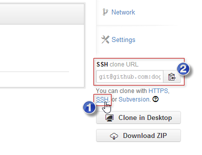
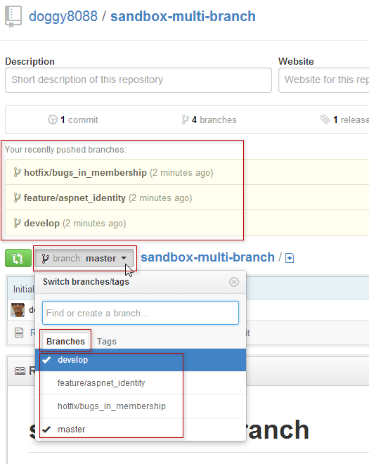
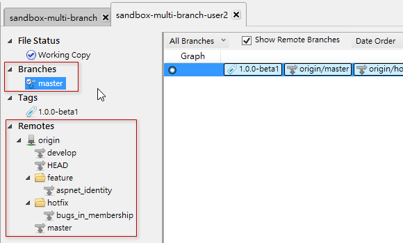
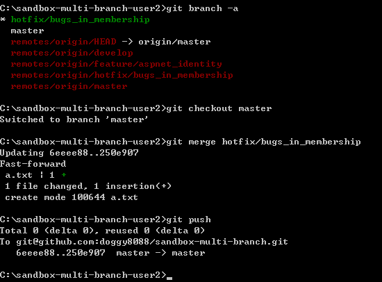

第 27 天：通过分支在同一个远端仓库中进行版控
============================================================

如果在公司内部只有一个共用的 Git 远端仓库，大家都有存取权限的情況下，可能会遇到一些协同作业上的问题，那就是不同人彼此之间的代码互相干扰的情況。例如你在团队开发的过程中，被指派负责开发新功能，但同时间其他同事负责修正目前上线的程序错误，如果两人共用同一个分支 (例如 `master` 分支)，那么在版控的过程中就很容易发生冲突的情況，这时你应该要善加利用分支将不同用途的原始码分別进行版本管理。

建立多人使用的远端仓库与工作目录
--------------------------------

我在 GitHub 上建立了一个 `sandbox-multi-branch` 项目，并直接在 GitHub 上建立一个 **Initial commit** 版本，用做本篇文章的远端仓库。但这次我改用 `git@github.com:doggy8088/sandbox-multi-branch.git` 这个网址，通过 SSH 通讯协定来存取我的远端仓库，好让我可以不用每次执行远端仓库的操作时都要输入账号密码。

我们执行以下指令将项目复制回来：

	C:\>git clone git@github.com:doggy8088/sandbox-multi-branch.git
	Cloning into 'sandbox-multi-branch'...
	Receiving objecg objects: 3, done.Receiving objects:  33% (1/3)
	Receiving objects: 100%0), reused 0 (delta 0)ts:  66% (2/3)
	Receiving objects: 100% (3/3), done.

	C:\>cd sandbox-multi-branch

	C:\sandbox-multi-branch>git log
	commit 6eeee883275e3d5e0281767aca4f456d952fa682
	Author: Will 保哥 <xxx@gmail.com>
	Date:   Sun Oct 27 07:13:50 2013 -0700

	    Initial commit

	C:\sandbox-multi-branch>git branch -a
	* master
	  remotes/origin/HEAD -> origin/master
	  remotes/origin/master

此时我们的 `.git\config` 内容如下：

	[core]
		repositoryformatversion = 0
		filemode = false
		bare = false
		logallrefupdates = true
		symlinks = false
		ignorecase = true
		hideDotFiles = dotGitOnly
	[remote "origin"]
		url = git@github.com:doggy8088/sandbox-multi-branch.git
		fetch = +refs/heads/*:refs/remotes/origin/*
	[branch "master"]
		remote = origin
		merge = refs/heads/master

常见的分支名称
--------------

我们知道在建立好一个新的 Git 仓库时，预设都会有一个 `master` 分支。在实际上，这个分支通常用来当作目前系统的「稳定版本」，也就是这个版本必须是干净且高品质的原始码版本。所以，我们会要求所有人都不要用这个分支来建立任何版本，真正要建立版本时，一定会通过「合并」的方式来进行操作，以确保版本能够更容易被追踪。

进入开发阶段时，我们通常会再从 `master` 分支建立起另一个 `develop` 分支，用来作为「开发分支」，也就是所有人都会在这个分支上进行开发，但这个时候或许会产生一些冲突的情形，因为大家都在同一个分支上进行版本控制。不过这种用法跟以往我们用 Subversion 的时候是比较类似的，所以使用上的观念通常差不多。本文稍后就会介绍一些分支开发的练习，但我们现在就可以先建立一个 `develop` 分支起来。

	C:\sandbox-multi-branch>git branch
	* master

	C:\sandbox-multi-branch>git checkout -b develop
	Switched to a new branch 'develop'

	C:\sandbox-multi-branch>git branch
	* develop
	  master

开发过程中，有时候我们也会因为需求变更，而被指派开发一些新功能，但这些新功能可能变动性还很大，什至只是想进行 PoC 验证而开发的小功能。这些小功能只是测试用途，你不想因为开发这些测试功能而影响到大家的开发作业，所以这时我们会选择再建立起一个「新功能分支」，专门用来存放这些新增功能的代码版本。这个测试用的「功能分支」，通常会建立在 `develop` 之上，所以我们会再从 `develop` 分支来建立另一个分支。但这个分支的名称，实际上通常会取名为 `feature/[branch_name]`，例如：`feature/aspnet_identity`。

	C:\sandbox-multi-branch>git branch
	* develop
	  master

	C:\sandbox-multi-branch>git checkout -b feature/aspnet_identity
	Switched to a new branch 'feature/aspnet_identity'

	C:\sandbox-multi-branch>git branch
	  develop
	* feature/aspnet_identity
	  master

如果你发现在开发的过程中，「正式机」 (生产环境) 的系统出现了一个严重错误，但在「开发分支」里又包含一些尚未完成的功能，这时你可能会从 `master` 分支紧急建立一个「修正分支」，通常的命名为 `hotfix/[branch_name]`，例如：`hotfix/bugs_in_membership`。

	C:\sandbox-multi-branch>git branch
	  develop
	* feature/aspnet_identity
	  master

	C:\sandbox-multi-branch>git checkout master
	Switched to branch 'master'

	C:\sandbox-multi-branch>git branch
	  develop
	  feature/aspnet_identity
	* master

	C:\sandbox-multi-branch>git checkout -b hotfix/bugs_in_membership
	Switched to a new branch 'hotfix/bugs_in_membership'

	C:\sandbox-multi-branch>git branch
	  develop
	  feature/aspnet_identity
	* hotfix/bugs_in_membership
	  master

如果你发现目前的 `master` 分支趋于稳定版本，那么你可能会想替目前的 `master` 分支建立起一个「标签物件」或称「标示标签」(annotated tag)，那么你可以先切换到 `master` 分支后输入 `git tag 1.0.0-beta1 -a -m "V1.0.0-beta1 created"` 即可建立一个名为 `1.0.0-beta` 的标示标签，并通过 `-m` 赋予标签一个说明消息。

	C:\sandbox-multi-branch>git branch
	  develop
	  feature/aspnet_identity
	* hotfix/bugs_in_membership
	  master

	C:\sandbox-multi-branch>git checkout master
	Switched to branch 'master'

	C:\sandbox-multi-branch>git tag 1.0.0-beta1 -a -m "V1.0.0-beta1 created"

	C:\sandbox-multi-branch>git tag
	1.0.0-beta1

以上就是使用 Git 的过程中常见的命名规则与版控流程。

将本地分支送上远端仓库
--------------------------

目前为止我们建立了好几个分支与标签，用 SourceTree 来看，目前还看不出分支的版本线图，毕竟我们还没有建立任何版本，但该有的分支已经被成功建立，如下图示：

不过，这些分支都仅储存在本地仓库中，团队中所有其他人都无法得到你建立的这些分支，如果要将这些分支的参照名称推送到远端仓库，可以使用 `git push --all` 这个指令。

	C:\sandbox-multi-branch>git push --all
	Total 0 (delta 0), reused 0 (delta 0)
	To git@github.com:doggy8088/sandbox-multi-branch.git
	 * [new branch]      develop -> develop
	 * [new branch]      feature/aspnet_identity -> feature/aspnet_identity
	 * [new branch]      hotfix/bugs_in_membership -> hotfix/bugs_in_membership

不过如果只下达 `--all` 参数是不够的，可能还要加上 `--tags` 参数，才能将标示标签也一并推送到远端仓库。

	C:\sandbox-multi-branch>git push --tags
	Counting objects: 1, done.
	Writing objects: 100% (1/1), 159 bytes | 0 bytes/s, done.
	Total 1 (delta 0), reused 0 (delta 0)
	To git@github.com:doggy8088/sandbox-multi-branch.git
	 * [new tag]         1.0.0-beta1 -> 1.0.0-beta1

这个时候，所有物件与参照名称都已经储存在远端仓库了。我们连到 GitHub 就能看到这些物件已经可以被浏览到：

如果切换到 **Tags** 页签的话，也可以看到标签物件也被送上来了：

请团队成员下载远端仓库所有物件
------------------------------

这个时候大家就能够通过 `git fetch --all --tags` 将所有物件取回，包含所有物件参照与标签参照。

我们建立起另一个工作目录，模拟其他使用者取回资料的情況：

	C:\>git clone git@github.com:doggy8088/sandbox-multi-branch.git sandbox-multi-branch-user2
	Cloning into 'sandbox-multi-branch-user2'...
	remote: Counting objects: 4, done.
	remote: Compressing objects: 100% (2/2), done.
	remote: Total 4 (delta 0), reused 1 (delta 0)
	Receiving objects: 100% (4/4), done.

	C:\>cd sandbox-multi-branch-user2

	C:\sandbox-multi-branch-user2>git fetch --all --tags
	Fetching origin

取回物件后，用 SourceTree 查看仓库的状态如下：

开始各自进行不同的分支开发
-------------------------

现在开始，团队所有成员都拥有了预先定义好的「Git 仓库范本」，大家就能各就各位，开发自己需要开发的功能。或许会有两个人在 `develop` 分支上进行开发，或许会有一个人被指派 `hotfix/bugs_in_membership` 分支进行修复任务，诸如此类的，等分支完成开发后，再将变更推送到远端仓库里。

眼尖的你可能会发现，这个 `User2` 的本地分支只有 `master` 而已，跟我们原本建立的那个工作目录有些不一样。之前在【第 25 天：使用 GitHub 远端仓库 - 观念篇】文章中不是提到说「**把这些「本地追踪分支」视为是一种｢唯读｣的分支**」吗？没有本地分支要怎样进行呢？

关于这一点，各位也不用担心，Git 早就帮我们想好了。假设你现在被赋予的任务是去开发 `hotfix/bugs_in_membership` 分支，并负责把变更错误修正，你可以直接执行 `git checkout hotfix/bugs_in_membership` 将这个「本地追踪分支」给取出 (checkout)。

	C:\sandbox-multi-branch-user2>git branch -a
	* master
	  remotes/origin/HEAD -> origin/master
	  remotes/origin/develop
	  remotes/origin/feature/aspnet_identity
	  remotes/origin/hotfix/bugs_in_membership
	  remotes/origin/master

	C:\sandbox-multi-branch-user2>git checkout hotfix/bugs_in_membership
	Branch hotfix/bugs_in_membership set up to track remote branch hotfix/bugs_in_me
	mbership from origin.
	Switched to a new branch 'hotfix/bugs_in_membership'

	C:\sandbox-multi-branch-user2>git branch -a
	* hotfix/bugs_in_membership
	  master
	  remotes/origin/HEAD -> origin/master
	  remotes/origin/develop
	  remotes/origin/feature/aspnet_identity
	  remotes/origin/hotfix/bugs_in_membership
	  remotes/origin/master

在取出 `hotfix/bugs_in_membership` 这个「本地追踪分支」后，Git 会动帮你建立起一个同名的「本地分支」，所以你根本不用担心有没有本地分支的情形。

这时我们模拟在 `hotfix/bugs_in_membership` 这个「本地分支」建立一个版本：

	C:\sandbox-multi-branch-user2>git status
	# On branch hotfix/bugs_in_membership
	nothing to commit, working directory clean

	C:\sandbox-multi-branch-user2>echo %date% %time% > a.txt

	C:\sandbox-multi-branch-user2>git add .

	C:\sandbox-multi-branch-user2>git commit -m "Add a.txt"
	[hotfix/bugs_in_membership 250e907] Add a.txt
	 1 file changed, 1 insertion(+)
	 create mode 100644 a.txt

目前的版本线图如下：

接着如果你想将变更推送到远端，只要下达 `git push origin hotfix/bugs_in_membership` 即可将变更推送回去：

	C:\sandbox-multi-branch-user2>git push origin hotfix/bugs_in_membership
	Counting objects: 4, done.
	Delta compression using up to 8 threads.
	Compressing objects: 100% (2/2), done.
	Writing objects: 100% (3/3), 294 bytes | 0 bytes/s, done.
	Total 3 (delta 0), reused 0 (delta 0)
	To git@github.com:doggy8088/sandbox-multi-branch.git
	   6eeee88..250e907  hotfix/bugs_in_membership -> hotfix/bugs_in_membership

不过目前为止，你所推送回去的，只有 `hotfix/bugs_in_membership` 这个分支的版本而已，你并没有将变更「合并」回 `master` 分支。这样操作所代表的意思是，你将变更放上远端仓库，目的是为了将变更可以让其他人看到，也可以取回继续修改，就跟昨天【第 26 天：多人在同一个远端仓库中进行版控】文章中讲的版控流程一样。

如果你想合并回去，可以先切换至 `master` 分支，再去合并 `hotfix/bugs_in_membership` 分支的变更，最后在推送到远端仓库。如下指令范例：

	C:\sandbox-multi-branch-user2>git branch -a
	* hotfix/bugs_in_membership
	  master
	  remotes/origin/HEAD -> origin/master
	  remotes/origin/develop
	  remotes/origin/feature/aspnet_identity
	  remotes/origin/hotfix/bugs_in_membership
	  remotes/origin/master

	C:\sandbox-multi-branch-user2>git checkout master
	Switched to branch 'master'

	C:\sandbox-multi-branch-user2>git merge hotfix/bugs_in_membership
	Updating 6eeee88..250e907
	Fast-forward
	 a.txt | 1 +
	 1 file changed, 1 insertion(+)
	 create mode 100644 a.txt

	C:\sandbox-multi-branch-user2>git push
	Total 0 (delta 0), reused 0 (delta 0)
	To git@github.com:doggy8088/sandbox-multi-branch.git
	   6eeee88..250e907  master -> master

如此一来，`master` 的分支内容就成功被更新，并且推送到远端仓库了。

想当然尔，其他的分支也都是用类似的方式运作着。

今日小结
-------

今天更进一步介绍了 Git 更接近实际面的版控流程，让大家通过不同的分支进行开发，彼此之间做一个有效区隔，然后还能在同一个远端仓库中进行版控，同时享受了集中式版本控制的特性，以及分布式版本控制的弹性，非常优秀不是吗！ ^_^

我重新整理一下本日学到的 Git 指令与参数：

* git push --all --tags
* git fetch --all --tags
* git branch -a
* git checkout hotfix/bugs_in_membership
* git push origin hotfix/bugs_in_membership

-------
* [HOME](../README.md)
* [回目录](README.md)
* [前一天：多人在同一个远端仓库中进行版控](26.md)
* [下一天：了解 GitHub 上 forks 与 pull request 的版控流程](28.md)

-------

