第 28 天：了解 GitHub 的 fork 与 pull request 版控流程
========================================================================

我们知道 Git 仓库并没有什么「权限控制」的概念，因为他是分散式的版本控制系统，当你执行 `git clone` 之后就会把整份拥有完整版本历史的仓库下载回来，接着你就可以在本地离线的进行开发与建立版本，最后再将变更推送到远端仓库。不过，如果我们只有一份远端仓库的话，这代表大家都有权限将变更推送到远端仓库。因此，GitHub 采用了 forks 与 pull request 的流程，让你可以做到基本的权限控制。

设定 GitHub 项目的权限控制 - 个人账号
-------------------------------------

在 GitHub 的个人账户下，并没有什么权限控制的机制，所以只要你授权特定人为协同开发人员 (Collaborators)，他就能自由的 Push 与 Pull 项目原始码。

我以我之前在 GitHub 上建立的某个项目为例，项目网址：[https://github.com/doggy8088/DataDictionaryCreator](https://github.com/doggy8088/DataDictionaryCreator)

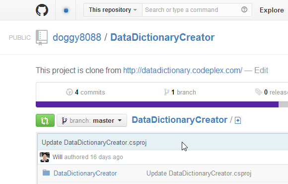

进入该网址后，点选右侧选单的 **Settings** 连结进入：

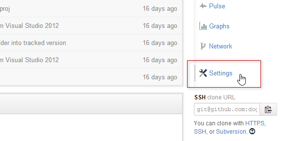

然后就可以加入授权的协同开发人员，这里要输入的是对方在 GitHub 上的账号：

设定成功的图示如下：

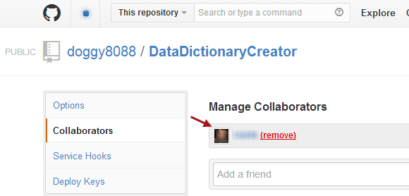

但由于你没办法设定更细的 Git 远端仓库权限，所以只要被指派的人，就能够存取完整的 Git 远端仓库，大家都能对任意分支进行推送 (Push)、拉取 (Pull) 或删除分支等动作，要是团队遇上天兵，那可能会是场灾难。

设定 GitHub 项目的权限控制 - 组织账号
-------------------------------------

在 GitHub 的组织账户下，就可以设定人员群组(Teams)，你就可以在群组上设定更细的权限，其中包括三种权限：

* Pull Only (唯读)
* Push & Pull (可读可写)
* Push, Pull & Administrative (可读可写以及项目管理权限)

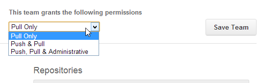

设定群组的方法如下：

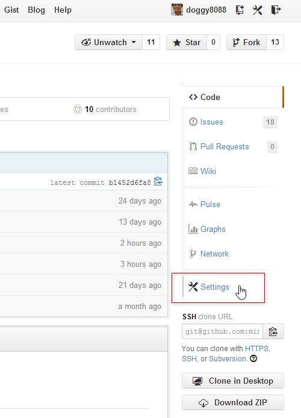

然后选择团队：

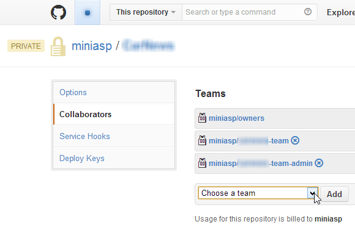

你也可以点选进入组织设定页面，进一步的来挑选团队成员：

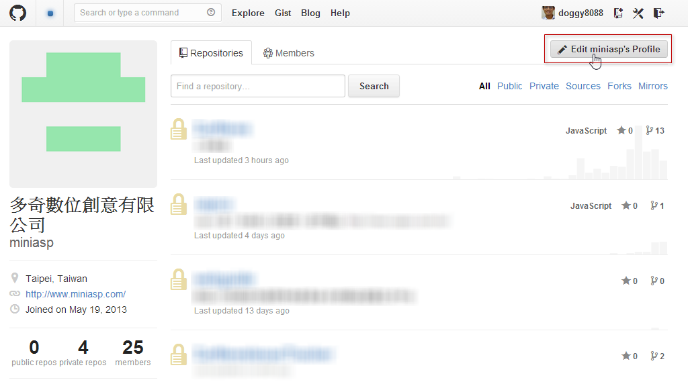

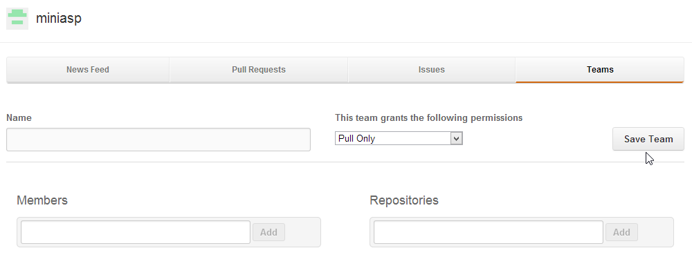

使用 Fork 功能
---------------

英文的 Fork 字面翻译是「叉子」的意思，就好像你刀叉去把食物「叉」起来一样，直接把菜挪放到你自己的盘子里，我比喻的「菜」就是你要复制的 GitHub 项目，而「盘子」就是你的 GitHub 账号。

注：老外用刀叉比较多，如果 GitHub 是台湾发展的，这个单字可能会是 Chopsticks (筷子)，哈！ XD

现在我们以 [https://github.com/doggy8088/DataDictionaryCreator](https://github.com/doggy8088/DataDictionaryCreator) 为例，这个项目，你当然没有「写入」权限，只有「唯读」而已。

我现在登入另外一个 GitHub 账号 ( `LearnGitForks` )，然后将该项目「叉」到这个账户自己 GitHub 账号下：

按下去之后，他骨子里其实就是使用 `git clone` 来复制该项目到你的 GitHub 账号下，估计只要十几秒钟就会复制完成，看你复制的项目大小：

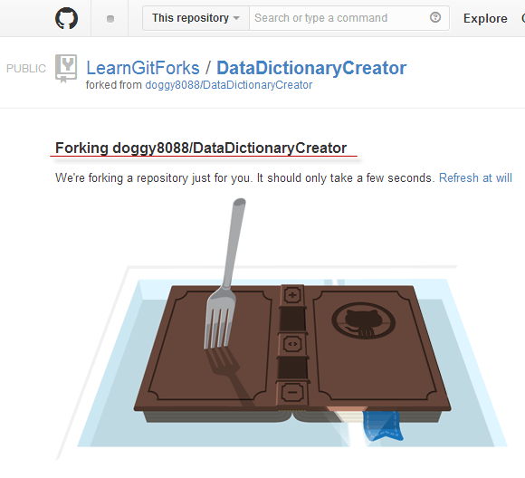

完成后，在你自己的账号下，就会有个完全一样的 Git 项目被建立，但会在名称下显示一段 `forked from` 提示你该项目是来从哪里复制过来的。

因为该项目已经在你自己的账号下，所以此时你已经可以把该项目当成「自己的远端仓库」在用，完全没有读写权限的问题。

因为 Git 是个分布式版本控制系统，只要你有 fetch 的权限，基本上就可以抓到该版本库的完整版本变更历程。

使用 Fork 过的 Git 远端仓库
-------------------------------

在版本控制方面，使用上几乎跟用自己的 Git 远端仓库没什么两样，而且你也有完整的历史记录。请记得这份资料是从 [https://github.com/doggy8088/DataDictionaryCreator](https://github.com/doggy8088/DataDictionaryCreator) 复制过来的就好。

我们先取得远端仓库回来：

	C:\>git clone git@github.com:LearnGitForks/DataDictionaryCreator.git
	Cloning into 'DataDictionaryCreator'...
	remote: Counting objects: 57, done.
	remote: Compressing objects: 100% (45/45), done.
	Receiving objects:  71% (41/57), 36.00 KiB | 42.00 KiB/s
	Receiving objects: 100% (57/57), 94.08 KiB | 42.00 KiB/s, done.
	Resolving deltas: 100% (12/12), done.

	C:\>cd DataDictionaryCreator

	C:\DataDictionaryCreator>

然后我们建立起一个版本，然后把变更推送回去：

	C:\DataDictionaryCreator>echo TEST > test.md

	C:\DataDictionaryCreator>git add .

	C:\DataDictionaryCreator>git commit -m "Add a test.md for test purpose"
	[master b2004b0] Add a test.md for test purpose
	 1 file changed, 1 insertion(+)
	 create mode 100644 test.md

	C:\DataDictionaryCreator>git push
	Counting objects: 4, done.
	Delta compression using up to 8 threads.
	Compressing objects: 100% (2/2), done.
	Writing objects: 100% (3/3), 285 bytes | 0 bytes/s, done.
	Total 3 (delta 1), reused 0 (delta 0)
	To git@github.com:LearnGitForks/DataDictionaryCreator.git
	   c29aaab..b2004b0  master -> master

	C:\DataDictionaryCreator>

使用 pull request 将变更合并回当初的 GitHub 项目
--------------------------------------------------

刚刚我们用 `LearnGitForks` 身分，把项目从 `doggy8088` 这边 Fork 回来，然后用 `LearnGitForks` 的身分 `git clone` 回本地端，建立版本后再用 `git push` 推回 GitHub 的 `LearnGitForks` 下。

现在我们要把储存在 `LearnGitForks` 账号下的 `DataDictionaryCreator` 项目「合并」回 `doggy8088` 账号下的 `DataDictionaryCreator` 项目，这时因为是跨账号的，所以必须利用 `pull request` 才能把变更「合并」回去。

注：这里的 pull request 照字面翻译是「拉取要求」的意思，代表要以 `LearnGitForks` 的身分，请 `doggy8088` 把我的变更给拉回去 (`git pull`)，但你不能强迫对方拉(`pull`)，所以必须拜託(`request`)对方拉，所以才叫做 pull request。

这时，你要用 `LearnGitForks` 的身分，连到 `https://github.com/doggy8088/DataDictionaryCreator` 这一页，然后点选 **Pull Requests** 页签：

然后点选 `New pull request` 按钮，准备建立一个新的 pull request 项目：

接下来你要选择两个版本 (两个 commit 物件)，GitHub 才能建立 patch 文件，也才能知道要合并那些东西回去。但你选不到自己 fork 过的版本，因此你要点选 **compare across forks**

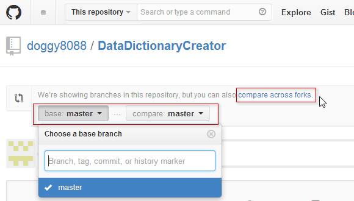

然后你就可以选择到自己 fork 过的项目与分支了！不过，这一步要特别注意不要选错，你的版本因为比较新，所以应该要把右边的版本选择成你的，GitHub 才知道从 `doggy8088/DataDictionaryCreator` 的 `master` 分支，到 `LearnGitForks/DataDictionaryCreator` 的 `master` 分支，到底发生了那些版本变化。

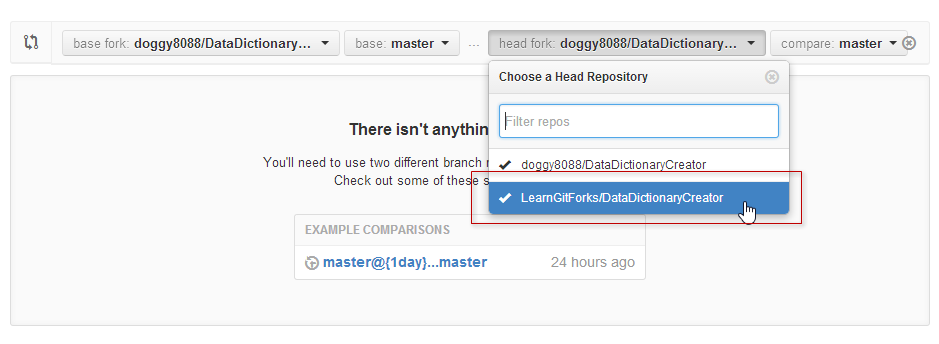

最后你会看到有哪些文件以及哪些地方变更了，然后你就可以按下 **Click to create a pull request for this comparison** 建立起一个 pull request：

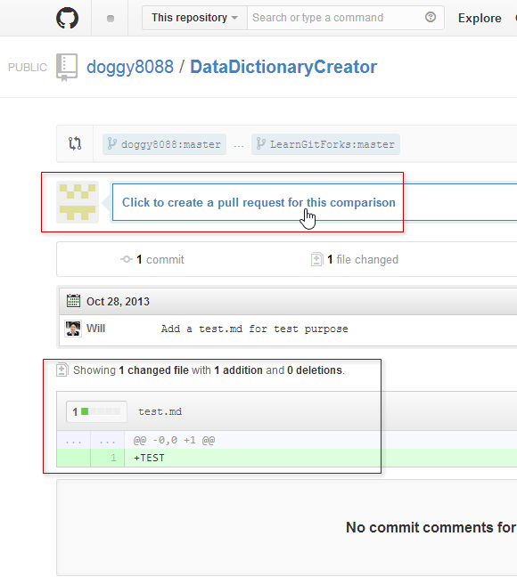

最后，我们先看一下右上角有个 **Able to merge** 的地方，会预先告诉你合并的结果，显示你的版本跟目前的 `doggy8088:master` 的版本是否有冲突发生。如果都没问题，再输入一些说明文字给原作者 ( `doggy8088` ) ，并按下 `Send pull request` 即可建立完成。

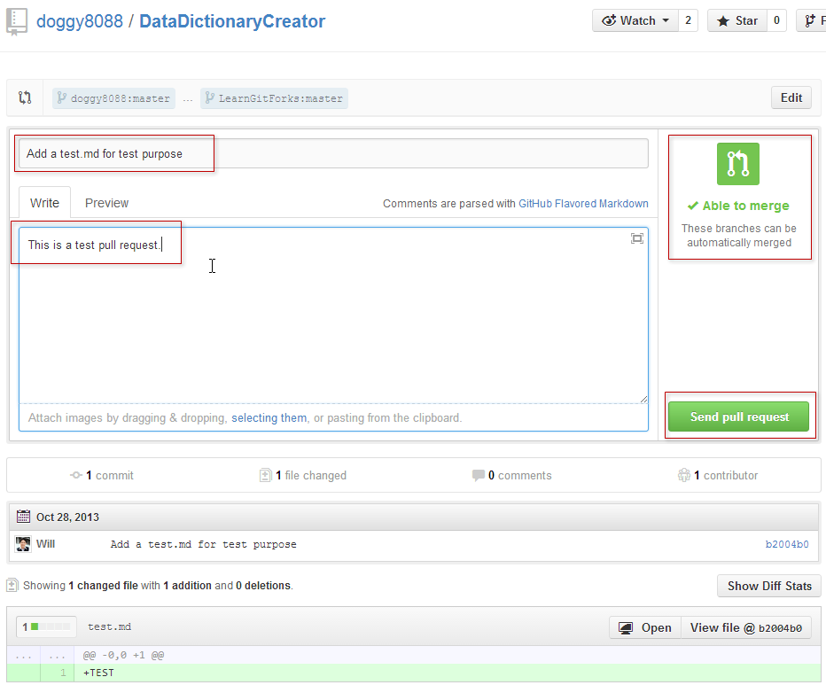

**注** Github for Mac;Github for Windows 已增加pull request功能

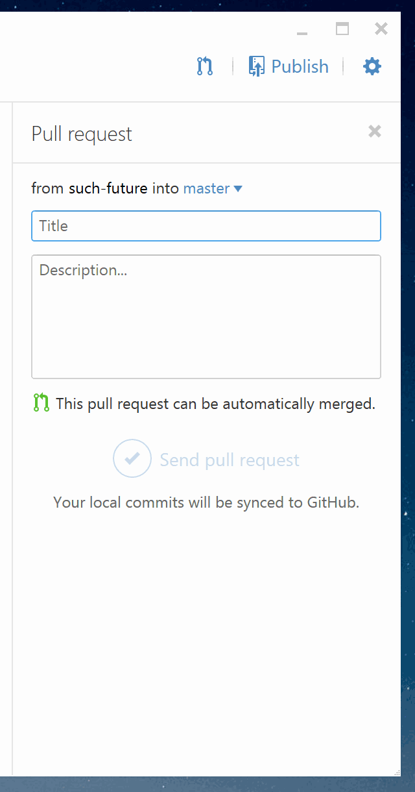

接受 pull request 的要求，确认合并回自己的 GitHub 项目
------------------------------------------------------

最后一个步骤，则是让原作者 ( `doggy8088` ) 去看有谁传送了一个 pull request 给自己。

现在我重新以 `doggy8088` 登入 GitHub，并到该项目发现有一个 **Pull Requests** 进来了：

点击进去：

最后按下 **Merge pull request** 即可完成合并工作。

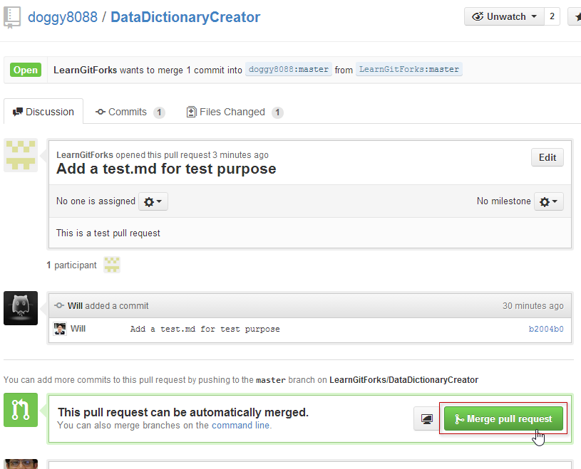

今日小结
-------

做到这里，你应该大致能够了解为什么会有 fork 与 pull request 的存在，最主要的就是「权限」以及「版本库隔离」的需求。一个上千人的项目 (`Linux Kernel`)，如果所有人都能存取主要的远端仓库，那不是很恐怖吗！

不过在一般企业里，你不一定要这样做，毕竟操作的步骤确实繁琐了些。实际要怎么用，就要靠你自己判断了。

参考连结
-------

* [Fork A Repo](https://docs.github.com/en/get-started/quickstart/fork-a-repo)
* [Using Pull Requests](https://docs.github.com/en/pull-requests/collaborating-with-pull-requests/proposing-changes-to-your-work-with-pull-requests/about-pull-requests)
* [Fork a Repo, Compare Code, and Create a Pull Request](https://confluence.atlassian.com/bitbucketserver/forks-776639958.html)
* [Forks and Pull Requests in GitHub](https://www.chronicle.com/blogs/profhacker/forks-and-pull-requests-in-github)

-------
* [回目录](README.md)
* [前一天：通过分支在同一个远端仓库中进行版控](27.md)
* [下一天：如何将 Subversion 项目汇入到 Git 仓库](29.md)

-------

