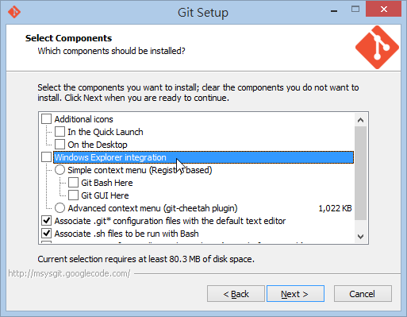
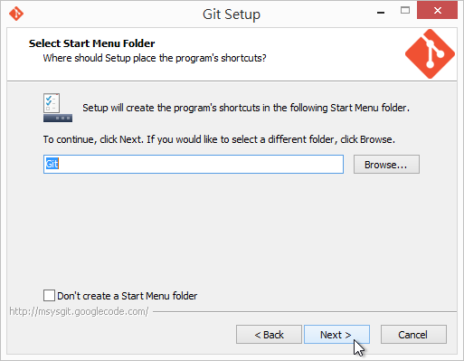
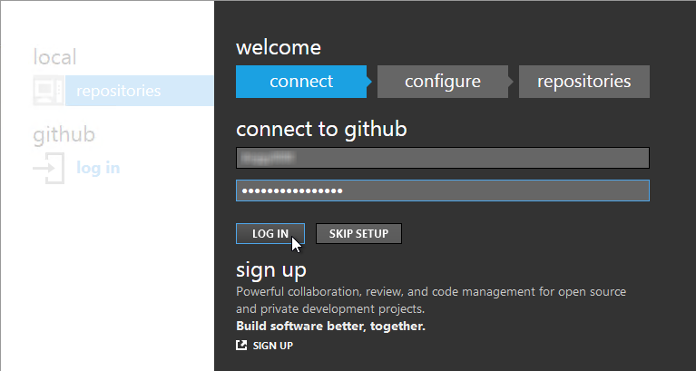
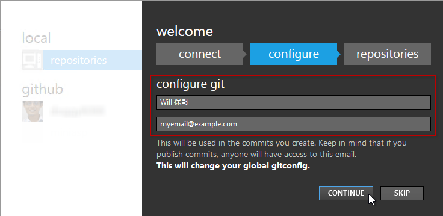
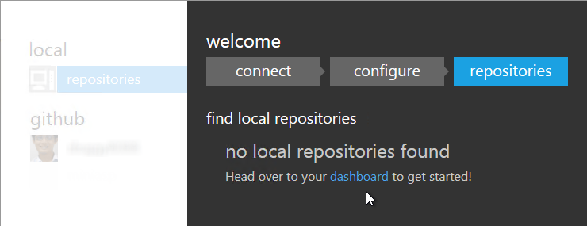
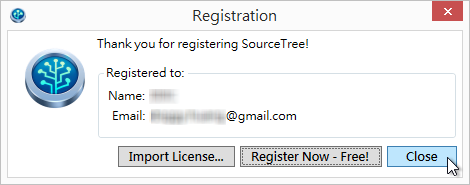

第 02 天：在 Windows 平台必裝的三套 Git 工具
==========================================

要開始使用 Git 版本控管，首先要安裝適當的 Git 工具，這個系列的文章主要還是以 Windows 平台為主，這篇文章將會介紹三套我們最常用的 Git 版控工具，並介紹這幾套工具之間的異同之處，還有在何時要用甚麼工具。

第 1 套：[Git for Windows](http://msysgit.github.io/)
---------------------------------------------

這是一個可以在 **命令提示字元** (Command Prompt) 下執行的一套指令列工具，目前市面上所有 Git 的 GUI 工具，其實骨子裡都是執行這些較為底層的 Git 工具，所以是一套必備的 Git 管理工具，非裝不可！

以下是安裝過程：

* 先連到 http://msysgit.github.io/ 官網，準備下載安裝檔

* 不管哪個版本，下載最新版就對了

* 直接點擊下載的檔案進行安裝

* 安裝程式歡迎頁面

* 同意 GPL 授權條款

* 選擇安裝路徑

* 選取元件，**建議取消勾選 Windows Explorer integration 選項！**  ( 因為這套整合工具太陽春，建議改用 [TortoiseGit](https://code.google.com/p/tortoisegit/) 工具 )

* 設定程式集名稱，保留預設選項即可

* 這裡建議 **選擇選擇 Run Git from the Windows Command Prompt 這個選項！**  ( 因為 Windows 使用者大多不熟 Bash 指令 )

* 換行字元轉換，建議保留預設選項即可。

* 開始進行安裝

* 安裝完成

* 安裝完成後，直接開啟命令提示字元，就可以開始使用

* 你可以輸入 `git --version` 指令查詢目前工具程式的版本

第 2 套：[GitHub for Windows](http://windows.github.com/)
---------------------------------------------

這套是由 [GitHub](https://github.com) 官方開發的工具，寫給那些對 Git 沒有很了解的人用的，用簡潔與親民的 GUI 介面，企圖隱藏 Git 那些難懂的觀念與指令參數。雖然 GitHub for Windows 工具比起 Git for Windows 親和許多，但對 Git 完全沒有概念的人來說，要上手 GitHub for Windows 工具可能也不是件容易的事。

> [GitHub for Windows](http://windows.github.com/) 內建了一個 [Git Shell](https://github.com/dahlbyk/posh-git/) 工具，這工具會用到 [Git for Windows](http://msysgit.github.io/)，所以如果你沒有安裝 Git for Windows 的話，也將無法使用 GitHub for Windows 的 Git Shell 工具 。

這套工具可以幫你完成的 Git 版控工作已經蠻多的，至少基本版控功能都有提供，最主要有以下能力：

* Clone Repositories
	* 將 GitHub 上面的儲存庫複製回來 (git clone)
* Browse History
	* 瀏覽本地儲存庫的版本歷史紀錄 
* Commit Changes
	* 提交變更到本地儲存庫 
* Branch Code 
	* 建立與管理 Git 分支，還可以在工作目錄中切換分支 
* Share on GitHub.com
	* 與 GitHub 同步變更
	* 這裡「同步」 (Sync) 的意思是將 git pull 與 git push 整合在一起
	* GitHub for Windows 在同步的時候，預設是使用 rebase 方式進行合併。

除此之外的大部分 Git for Windows 能做的事，在 GitHub for Windows 裡面都不能做！若真的要應用在較為大型的開發專案上，可能要考慮看看是否適用，但如果是給非軟體開發人員來說，簡單的版控工作應該非常足夠。

以下是 GitHub for Windows 安裝過程：

* 先連到 http://windows.github.com/ 準備下載安裝檔

* 下載完後直接執行安裝 

* 剛下載 GitHub for Windows 安裝檔的時候可能覺得安裝檔很小，但事實上真正在安裝的時候才會下載所需的檔案，所以必須保持網路連線

* 下載完成後，GitHub for Windows 工具會直接被開啟，並進行初始設定工作

	* 開啟 GitHub for Windows 的第一步就是先登入 GitHub 帳戶 (你也可以點擊 SKIP SETUP 跳過這一步)

	* 然後他會要求你先設定好 user.name 與 user.email 這兩個參數，這兩個是使用任何 Git 工具最重要的步驟之一，沒有設定這兩個參數是完全無法 commit 任何版本的。 備註: 這兩個參數預設會設定到 Global config 之中，也就是 "C:\Users\<user>\.gitconfig" 這個檔案。

* 設定完成

* 首次使用如果有成功登入 GitHub 帳戶，GitHub for Windows 會自動建立一組 SSH Key-Pair 在 `C:\Users\<username>\.ssh` 目錄下，這可以讓你在日後「同步」本地與遠端儲存庫時不用再輸入帳號密碼。

* GitHub for Windows 幫你產生的 SSH Key 預設路徑如下：

	* **C:\Users\&lt;username&gt;\\.ssh\github_rsa**
	* **C:\Users\&lt;username&gt;\\.ssh\github_rsa.pub**

* SSH Key 的簽章的部分也會在登入的同時上傳到 GitHub 網站，你可以從個人的設定畫面 ( [https://github.com/settings/ssh](https://github.com/settings/ssh) ) 中看到曾經上傳過的 SSH Key 簽章：

* GitHub for Windows 裝好之後，其實還額外幫你安裝了一個 Git Shell 工具，這預設是一個 PowerShell 介面的操作環境，好處有很多，之後我們的例子也會盡量使用 Git Shell 來進行操作：
	* 可以在指令列使用 ^ 符號 (在命令提示字元不能接使用 ^ 符號)
	* 可以在 Git 工作目錄下可以得到額外的提示資訊 (Prompt)
* 不過使用 Git Shell (PowerShell) 也有一個小缺點
	* 由於 PowerShell 裡面 `{}` 具有特殊意義，所以若你的 git 參數會用到 `{}` 符號的話，記得該參數的前後要加上 '單引號'

第 3 套：[SourceTree](http://www.sourcetreeapp.com/)
---------------------------------------------

這套是由 [ATLASSIAN](https://www.atlassian.com) 這間公司開發的工具，是一套非常專業的 GUI 操作工具，不僅支援 Git 版本控管，同時也支援 [Mercurial](http://mercurial.selenic.com/) 版本控管機制，這兩套版本控管機制都屬於分散式版本控管的分類，概念上也十分相近，所以可以整合在這一套工具上使用。

> [SourceTree](http://www.sourcetreeapp.com/) 其實骨子裡也是透過 [Git for Windows](http://msysgit.github.io/) 工具進行版本操作，如果你沒有事先安裝 [Git for Windows](http://msysgit.github.io/) 的話，安裝的過程中他也會提示你要不要順便安裝起來。

[SourceTree](http://www.sourcetreeapp.com/) 的功能相較於 [GitHub for Windows](http://windows.github.com/) 是強大許多，幾乎所有的指令列功能都能夠過 SourceTree 的 GUI 介面完成(透過滑鼠操作)，不過還是老話一句，如果你對 Git 的核心觀念不太了解，再多的右鍵選單對你來說等同於白紙一張，一樣不知道怎樣操作。但你若認真的了解 Git 的運作機制與觀念，使用 SourceTree 絕對能夠事半功倍！

以下是 SourceTree 安裝過程：

* 先連到 http://www.sourcetreeapp.com/ 準備下載安裝檔
	
	

* 下載完後直接執行安裝，其餘的安裝步驟就直接一直按 `Next` 到最後，然後直接開啟 SourceTree 程式
	
	
	
	
	
	
	
	

* 第一次啟動 SourceTree 時，會問你要不要順便安裝 [Mercurial](http://mercurial.selenic.com/)，可裝可不裝

	

* 第一次使用 SourceTree 時，跟 GitHub for Windows 一樣，都要設定預設的 user.name 與 user.email 這兩個參數，不過，如果你有按照本文步驟安裝的話，這一步應該不用特別輸入，因為之前輸入的參數都已經寫入到 Git for Windows 的 Global 設定檔中，這邊會自動被帶入，你直接按下 `Next` 即可。 

	

* 這個步驟則是選擇適當的 SSH Client，這是為了跟遠端的 Git 儲存庫認證所需要的工具，選用預設值即可。

	

* 接著這個步驟則是問你是否已有 SSH Key 存在，由於我們在 GitHub for Windows 已經產生過一個 GitHub 專用的 SSH Key，所以你也可以在這一步按下 `Yes` 並選取 `C:\Users\<username>\.ssh\github_rsa` 這個檔案 (這是一個 SSH 私密金鑰)。

	

* 雖然 SourceTree 是免費軟體，但還是必須在安裝後 30 天內 "免費註冊" 得到序號後，才能繼續使用。

	

* 立即註冊一個授權

	

* 先輸入 Email 地址

	

* 然後輸入一些個人基本資料與設定一個密碼，即可註冊完成

	

* 如果你在另外一台電腦也安裝 SourceTree 的話，直接輸入第一次註冊時設定的密碼即可自動下載授權檔進行註冊

	

* 註冊成功

	

* 在使用 SourceTree 的時候，有個 Open in Terminal 功能，這會開啟一個類似 [Cygwin](http://www.cygwin.com/) 的命令提示字元視窗，讓你直接操作 git 命令。

	

第 4 套：[TortoiseGit](https://code.google.com/p/tortoisegit/)
-----------------------------------------------------------------

TODO

今日小結
--------

今天這篇鉅細靡遺的介紹三套在 Windows 底下常用且功能強大的 Git 版控工具，這三套只要能上手，絕對能夠大幅提升 Git 版本控管的使用效率，絕對值得大家好好研究研究。

不過，我再耳提面命一次，要學會使用 Git 的 GUI 介面工具，一定要先擁有完整的 Git 版控概念，否則真的很難靈活運用這些好用工具。 

參考連結
-------

* [Git for Windows](http://msysgit.github.io/)
* [GitHub for Windows](http://windows.github.com/)
* [SourceTree](http://www.sourcetreeapp.com/)
* [TortoiseGit](https://code.google.com/p/tortoisegit/)
 

-------
* [HOME](../README.md)
* [回目錄](README.md)
* [前一天：認識 Git 版本控管](01.md)
* [下一天：建立儲存庫](03.md)

-------

