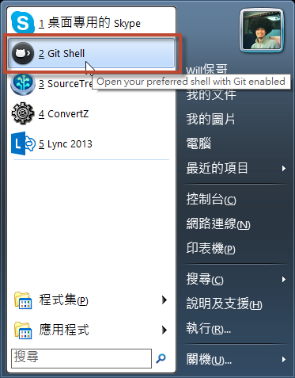
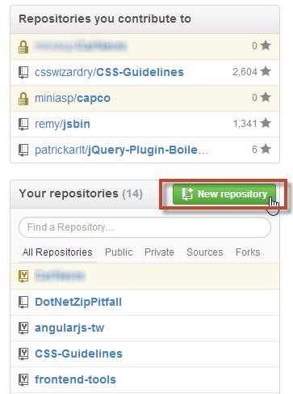
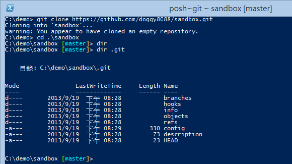

第 03 天：建立儲存庫
===========================================================

要開始使用 Git 最重要的就是要先有一份 Git 儲存庫 (Git Repository) 才行，但是，這份儲存庫從哪裡來呢？本篇文章會介紹多種建立儲存庫的方式。

要建立儲存庫，事實上，你有很多選擇，例如：

* 在本機建立本地的儲存庫 (local repository)
* 在本機建立一個共用的儲存庫 (shared repository)
* 在 GitHub 或其他 Git 平台建立遠端的儲存庫 (remote repository)

無論如何，你總是需要一個儲存庫，我們分別說明如下：

在本機建立本地的儲存庫 (local repository)
---------------------------------------

我們先開啟 [GitHub for Windows](http://windows.github.com/) 的 Git Shell 工具，這工具其實是個 Windows PowerShell 介面，但外掛了一些 Git 相關的環境變數與命令提示設定(Command Prompt)： 

開啟後，預設會直接進入 `%USERPROFILE%\Documents\GitHub` 資料夾，這是 [GitHub for Windows](http://windows.github.com/) 的預設專案根目錄，也就是只要預設透過 [GitHub for Windows](http://windows.github.com/) 從 GitHub 複製 (clone) 下來的專案都會放在這個目錄。

所以，我們可以直接在這裡建立一個新目錄，好當成我們的「工作目錄」(working directory)，我們可以輸入指令 `mkdir git-demo` 把目錄建立起來。然後再用 `cd git-demo` 進入該目錄。

由於這是一個空目錄，並不包含任何 Git 儲存庫，這時我們要建立儲存庫，就可以用 `git init` 指令把儲存庫給建立起來，預設儲存庫會放在工作目錄下的 `.git` 目錄下。

完整的操作步驟如下圖示：

建立完成後，你在 Git Shell 的命令提示符號中，應該可以發現有些不太一樣，他在目前所在路徑後面加上了個高亮的 `[master]` 字樣。這段提示，會顯示你目前所在`工作目錄`的各種狀態，如果看得懂的話，是一個非常有用的資訊來源，可以讓你在用命令列工具操作 Git 時，少打很多 `git status` 指令來查詢目前工作目錄的狀態。這部分會再下一篇文章中特別說明。

在本機建立一個共用的儲存庫 (shared repository)
---------------------------------------

共用儲存庫 (shared repository) 是指建立一個 Git 儲存庫但不包含工作目錄，這種情況比較常發生在 Linux 作業系統下，因為在 Linux 作業系統下通常都是多人使用同一台 Linux 主機。雖然在 Windows 作業系統也可以這樣使用，不過我們的開發環境大多還是在 Windows Client 的環境，比較少有多人共用一台電腦的情況。

如果要建立共用儲存庫，可以使用 `git init --bare` 指令建立，如下圖示。你可以發現，當 `git init` 加上 `--bare` 參數後，他會在當前目錄建立所有 Git 儲存庫的相關檔案與資料夾，你必須特別注意，這個資料夾不能直接拿來做開發用途，只能用來儲存 Git 的相關資訊，大多數情況下，你都不應該手動編輯這個資料夾的任何檔案，最好透過 git 指令進行操作。

由於這是一個「沒有工作目錄的純儲存庫」，所以共用儲存庫也有個別名叫做「裸儲存庫」 (bare repository)。

再次強調，Git 屬於「分散式版本控管」，每個人都有一份完整的儲存庫(Repository)。也就是說，當你想要建立一個「工作目錄」時，必須先取得這個「裸儲存庫」的內容回來，這時你必須使用 `git clone [REPO_URI]` 指令「複製」(clone)一份回來才行，而透過 `git clone` 的過程，不但會自動建立工作目錄，還會直接把這個「裸儲存庫」完整的複製回來。這個複製的過程，就如同「完整備份」一樣，是把所有 Git 儲存庫中的所有版本紀錄、所有版本的檔案、...等等，所有資料全部複製回來。完整的指令操作過程可以參考以下圖示：

在實務上，會使用「共用儲存庫」或「裸儲存庫」的方式可能有幾種：

* 在一台多人使用的機器上進行協同開發，可開放大部分人對這個「裸儲存庫的資料夾」僅有唯讀權限，只讓一個人或少許人才有寫入權限。
* 有些人會把裸儲存庫放到 Dropbox 跟自己的多台電腦同步這個裸儲存庫

請注意: 雖然「工作目錄」下的 `.git` 目錄也是一個「儲存庫」，不過工作目錄下的儲存庫還包含一些工作目錄下的索引資訊，紀錄著工作目錄下的狀態資訊，這些狀態資訊不會出現在 「共用儲存庫」裡面，這裡只有版本資訊而已 (也就是 Git 的物件資訊)。

在 GitHub 或其他 Git 平台建立遠端的儲存庫 (remote repository)
---------------------------------------

其實「遠端儲存庫」跟「共用儲存庫」幾乎是一樣的，差別僅在於「共用儲存庫」大多使用直接的檔案存取，而「遠端儲存庫」通常使用 SSH, Git protocol, HTTP 等協定可「遠端」存取 Git 儲存庫，其他的使用方式基本上是一樣的。

以下示範透過 GitHub 建立儲存庫，並將儲存庫複製回本地的情況：

* 先登入 GitHub，然後建立一個新的儲存庫

* 設定 GitHub 專案的相關資訊並建立儲存庫

* 建立完成後，他會提示你要如何取得該專案，或將你本地現有的專案匯入到 GitHub

* 如上圖，我們可以在 Quick setup 的地方點擊 "Set up in Desktop"，你的電腦會自動開啟 GitHub for Windows 工具，並自動複製(clone)這個儲存庫回來，並且建立工作目錄。

* 你也可以將遠端 Git 儲存庫的網址複製(Copy)下來，然後執行 `git clone [REPO_URL]` 即可複製(clone)一份回來。

今日小結
-------

以上就是三種建立 Git 儲存庫的方式。我重新整理一下本日學到的 Git 指令與參數：

* git init
* git init --bare
* git clone [REPOSITORY_URI] 

參考連結
-------

*  [GETTING AND CREATING PROJECTS - Git Reference](http://gitref.org/creating/)
*  [Git for Windows](http://msysgit.github.io/)
*  [GitHub for Windows](http://windows.github.com/)

-------
* [HOME](../README.md)
* [回目錄](README.md)
* [前一天：在 Windows 平台必裝的三套 Git 工具](02.md)
* [下一天：常用的 Git 版本控管指令](04.md)

-------

