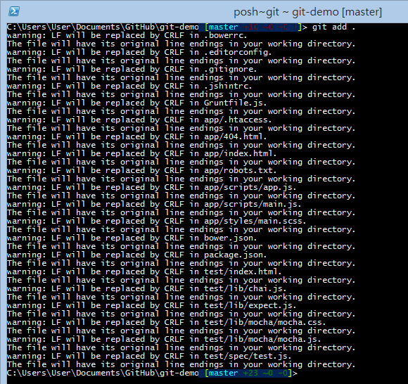
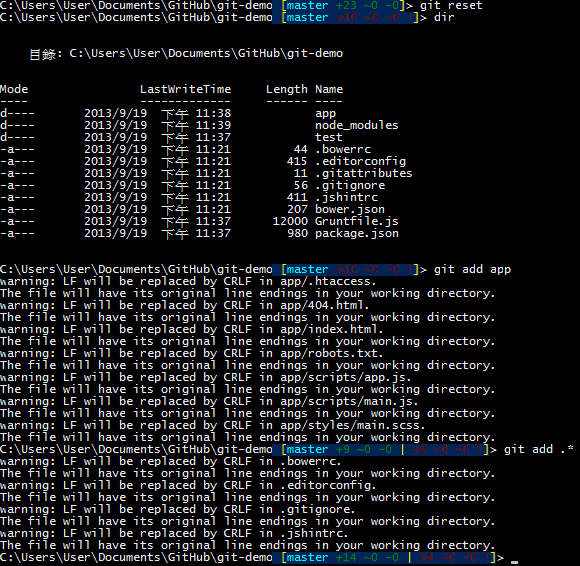
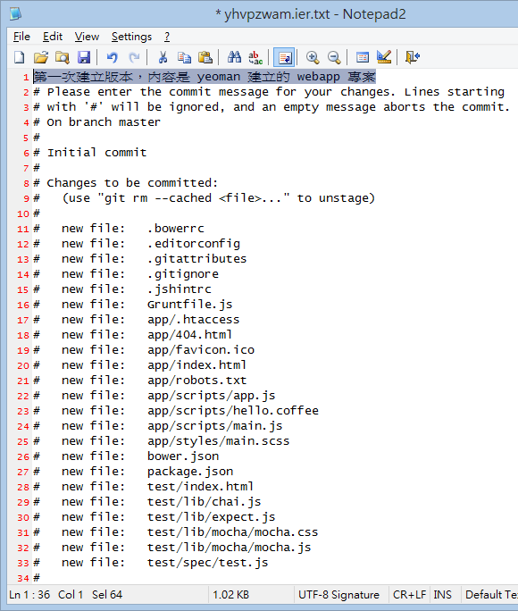
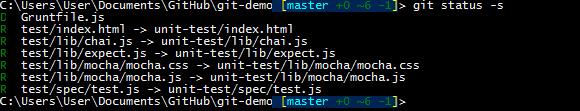

第 04 天：常用的 Git 版本控管指令
===========================================================

本篇文章將帶大家學會幾個最重要也最基本的版控工作，其中將包含基本的檔案操作如新增、刪除、重新命名檔案，提交變更 (建立新版本)、查詢歷史紀錄等工作。

準備工作目錄
-----------

複習一下上一篇「第 03 天：建立儲存庫」的內容，我們直接來建立一個本地儲存庫，即可開始本篇文章的所有練習。

	mkdir git-demo
	cd git-demo
	git init

新增檔案
--------

我們在工作目錄下放一些檔案，至於放什麼檔案都可以，總之先複製一些現有的檔案與目錄進到目前的工作目錄下。

本篇文章，我將以 [YEOMAN](http://yeoman.io/) 工具，快速產生一個 webapp 範例網站，只要一個指令就可以建立一個完整網站：

	yo webapp

**註**: 關於 [YEOMAN](http://yeoman.io/) 在 Windows 平台的使用，可以參考筆者的文章 [如何在 Windows 平台安裝與使用 Yeoman 1.0 相關工具](http://blog.miniasp.com/post/2013/08/11/Yeoman-1-0-Installation-and-Usage-on-Windows.aspx)，該文詳述完整的安裝與使用過程。

新增了檔案之後，如果你還在 Git Shell 介面下，應該會立刻看到如下圖的提示：

也就是以下這段位於路徑後面的提示：

	[master +10 ~0 -0 !]

在這段提示的地方，你可以看到幾個東西：

* master 代表目前工作目錄是 **master** 分支，也是 Git 的預設分支名稱。
* 「紅色」的數字都代表 Untracked (未追蹤) 的檔案，也就是這些變更都不會進入版本控管。
* +10 代表有 10 個「新增」的檔案
* ~0  代表有 0 個「修改」的檔案
* -0  代表有 0 個「刪除」的檔案

如果要要將這些新增的檔案加入到 Git 版本控管，你必須下達以下指令：

	git add .

如此一來，這個工作目錄下所有的檔案、目錄與子目錄下的所有檔案，全部都會被加入到這個 Git 工作目錄的【索引】或【快取】之中。請注意: 此時並沒有建立任何版本，只是告知 Git 這些檔案「即將」被加入 Git 版本庫而已。

如下圖示，是我這邊執行完 `git add .` 之後的結果，這裡所發生的 warning 訊息不是很嚴重，有興趣了解的人可以參考筆者的另一篇文章: [Git 在 Windows 平台處理斷行字元 (CRLF) 的注意事項](http://blog.miniasp.com/post/2013/09/15/Git-for-Windows-Line-Ending-Conversion-Notes.aspx)。

不過有趣的地方在於，原本「紅色的數字」現在卻變成了「綠色的數字」，這裡所代表的意義是：

* 「綠色」的數字都代表 Staged (準備好) 的檔案，也就是這些變更才會進入版本控管。
* +23 代表有 23 個「新增」的檔案將被建立一個版本
* ~0  代表有 0 個「修改」的檔案將被建立一個版本
* -0  代表有 0 個「刪除」的檔案將被建立一個版本

但原本不是只有 +10 (紅色) 而已嗎? 怎麼執行完後變成了 +23 (綠色) 呢？

我們執行 `git reset` 重設一下工作目錄的索引狀態，然後再執行一次 `git status` 查詢當前工作目錄的詳細狀態，如下圖示：

你可以發現，這邊列出的只有「第一層目錄下的檔案與目錄」而已，因為 git 不會這個時候去查到底目錄下到底有多少檔案沒有被追蹤。

當我們執行 `git add .` 之後，再執行一次 `git status` 查詢狀態，你可以發現連子目錄下的檔案也都全部被加入了，所以這個數字才會變多，如下圖示：

新增部分檔案
------------

剛剛提到的 `git add .` 指令會自動將所有檔案(含子目錄的檔案)加入到工作目錄索引中，有時候我們只想讓特定目錄或特定檔案加入版本，這時你也可以指定特定目錄，或利用萬用字元來加入檔案。

我們再執行一次 `git reset` 重設工作目錄的索引狀態，然後用 `git add app` 加入 app 這個資料夾與其下的所有檔案，還有用 `git add .*` 新增所有「點」開頭的檔案，如下圖示：

在執行的過程中，你應該可以發現，在執行 `git add` 的過程中，Git Shell 提示的文字也有了些變化，現在同時出現了「綠色的數字」與「紅色的數字」，所代表的意思跟上述是一樣的，是不是非常方便辨識！當你需要知道詳情才需要執行 `git status` 指令。

**註**: 詳細的指令與參數說明，可以輸入 `git help add` 查詢完整的文件。

提交變更 / 建立版本
------------------

這時我們預計要建立一個新版本了，在建立版本之前，我們還是把所有檔案給加入吧，請各位在執行一次 `git add .` 命令。

建立版本的指令如下：

	git commit
	git commit -m "版本紀錄的說明文字"

在 Git 版本控管中，所有的版本都必須擁有「版本紀錄的說明文字」 ( 簡稱 Log )，不像 Subversion 預設可以簽入「沒有版本紀錄說明」的版本。所以當你直接輸入 `git commit` 的話，預設會開啟 Notepad (記事本) 讓你輸入這個版本的訊息。開啟後的檔案會有很多 # 符號開頭的文字，這些都是註解，不會成為 Log 的一部分。

如下圖示，是我輸入的訊息文字：

當你按下 Ctrl+S 儲存這個文字檔，這時還不會建立一個新版本，還必須關閉這個 Notepad 視窗，這時才會正式建立版本，如下圖示：

建立版本完後，Git Shell 的提示就只剩下 `[master]` 字樣了，代表目前已經沒有任何要被建立版本的索引或快取。

**註**: 詳細的指令與參數說明，可以輸入 `git help commit` 查詢完整的文件。

查詢歷史紀錄
-----------

由於我們剛剛建立了一個版本，當我們想要查詢版本的歷史紀錄，可以輸入以下指令：

	git log

有時候紀錄越來越多，你也可以透過以下指令限制輸出的版本數量，你只要透過一個減號 ( - ) 與一個數字，就可以限定輸出最近幾筆紀錄：

	git log -10

**註**: 詳細的指令與參數說明，可以輸入 `git help log` 查詢完整的文件。

刪除檔案
----------

在 Git 指令列工具中也有個 `rm` 指令，可以用來刪除檔案。例如我們想刪除 `Gruntfile.js` 這個檔案，可以輸入以下指令：

	git rm 'Gruntfile.js'

這個 `git rm` 的指令執行的時候，會同時做兩件事：

1. 刪除工作目錄快取的 'Gruntfile.js' 這個檔案 (用來標示這個刪除檔案的動作要列入版本控管)
2. 刪除工作目錄下的 'Gruntfile.js' 這個實體檔案 (代表真的把這個實體檔案給刪除)

**註**: 詳細的指令與參數說明，可以輸入 `git help rm` 查詢完整的文件。

檔案更名
----------

在 Git 指令列工具中也有個 `mv` 指令，可以用來變更檔案或目錄的名稱。例如我們想把 `test` 目錄更名為 `unit-test` 名稱，可以輸入以下指令：

	git mv test unit-test

**註**: 詳細的指令與參數說明，可以輸入 `git help mv` 查詢完整的文件。

顯示工作目錄的索引狀態
---------------------

剛剛我們一直會看到 `git status` 來顯示工作目錄的狀態，你也可以使用 `git status -s` 來顯示較為精簡的版本。

**註**: 詳細的指令與參數說明，可以輸入 `git help status` 查詢完整的文件。

重置目前的工作目錄
-----------------

我們曾經學過如何利用 `git reset` 重置目前工作目錄的索引狀態，但請注意，這個指令預設只會重置「索引狀態」，那些你用 `git rm` 刪除的目錄或檔案，還是用 `git mv` 更名的目錄或檔案，透過 `git reset` 都無法把「實體檔案」給救回來。

如果想把工作目錄也給還原到目前的最新版，則必須輸入以下指令：

	git reset --hard

**註**: 詳細的指令與參數說明，可以輸入 `git help reset` 查詢完整的文件。

還原其中一個被改壞的檔案
----------------------

如果檔案編輯到一半，發現被改壞了，你希望能救回改沒修改前的版本，這時你可以利用以下指令還原檔案：

	git checkout master Gruntfile.js

這段指令的意思是把 `master` 分支中最新版的 Grunefile.js 給還原，由於我先前已經把 Gruntfile.js 給刪除了，為了要救回這一個檔，可以用這個方式救回。這樣可以避免使用 `git reset --hard` 一次把所有檔案都給還原了！

請注意，還原的過程也會一併復原工作目錄的索引狀態喔！

**註**: 詳細的指令與參數說明，可以輸入 `git help checkout` 查詢完整的文件。

今日小結
-------

今日的文章，可以說是在 Git 版本控管中不斷會重複使用的指令與參數，必須非常熟練才行，接下來的文章，將會詳細探討 Git 版本控管的內部結構，千萬不要錯過！

我重新整理一下本日學到的 Git 指令與參數：

* git init
* git add .
* git add app/*
* git add *.txt
* git status
* git status -s
* git commit
* git commit -m "版本紀錄的說明文字"
* git log
* git log -10
* git rm '*.txt'
* git rm 'app/*.html'
* git mv 'oldname' 'newname'
* git reset
* git reset --hard
* git checkout master 'filename'

參考連結
-------

* [BASIC SNAPSHOTTING](http://gitref.org/basic/)

-------
* [HOME](../README.md)
* [回目錄](README.md)
* [前一天：建立儲存庫](03.md)
* [下一天：了解儲存庫、工作目錄、物件與索引之間的關係](05.md)

-------

