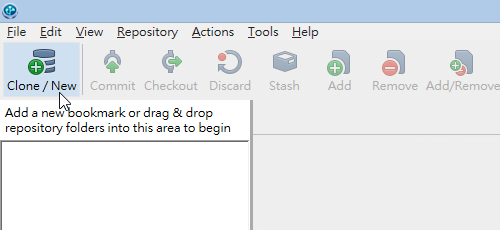
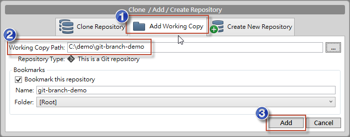

第 08 天：關於分支的基本觀念與使用方式
===========================================================

在 Git 裡面 **分支** (Branch) 是個非常重要的機制，使用上也必須特別小心，因為專案總不能無限制的「分支」下去，最終總是要合併的，但合併是日後的議題，這篇文章將會先帶大家學會 Git 分支基本觀念與使用方式。

關於分支的基本觀念
----------------

在版本控管中使用「分支」機制，最主要的目的就是用來解決開發過程中版本衝突的問題。筆者認為，有許多曾經用過任何版本控管機制的人，都會認為「分支」是個「產生版本衝突」的元兇，因為當你開始分支之後，一定就會想到合併的議題，而當分支之後，若是有人跟你一樣修改到相同檔案的相同一行時，就會引發「版本衝突」，而只要發生衝突，就必須費心解決。

當衝突發生時，有時可以很輕易的決定要用自己的版本或是對方的版本，但有時卻沒那麼容易，複雜的時候還要依據衝突的片段，找到當初改過這幾行的人出來，協調出彼此的變更對系統的影響，最後決定要怎樣合併，諸如此類的問題非常繁瑣，也因此很多人會盡力避免「分支」的情況發生，以免發生「衝突」。

不過，若是開發團隊越來越大，系統功能越來越多，就算你不對版本做分支，大家的衝突情況一樣也會層出不窮，有時候還不是衝突的問題，而是 A 寫好一個功能，但被 B 的後續版本給蓋掉了，然後沒有任何衝突發生，這也不是大家所樂見的。然而，這也是一種「無形的衝突」狀況。

以前在集中管理的 Subversion 版控機制中，也有分支的概念，也可以運作的很好。當然，如果你的軟體架構不夠好，如果你對分支的概念、工具的使用也不是很清楚，我相信使用「分支」時也不會多順利，這是個必然的結果，這世界絕不會有「免學、無痛、自然學會分支」的這種版本控管工具出現，事在人為，人的觀念不對，用什麼工具都不會順的。

由於 Git 屬於「分散式版本控管機制」，在分散式版本管理的使用情境中，最不想做的事情就是「管理」，所以 Git 很少有所謂的管理機制或權限控管機制，它唯一想做的僅僅是讓大家可以順利的「分支」與「合併」而已。

我們以【第 03 天：建立儲存庫】這篇文章提到的「遠端的儲存庫 (remote repository)」為例，你可以這樣想像：從我們使用 `git clone` 指令開始，其實就是「分支」的開始，你從遠端儲存庫複製一份完整的儲存庫下來，然後開始在自己的本地端建立版本，等軟體修訂到一定程度後再「合併」回去，只是這時合併的指令叫做 `git push` 而已。

這種分支與合併的情形，在 Git 版本控管的過程中無所不在，遠端的儲存庫可以有分支，本地的儲存庫可以有分支，你可以從遠端任何一個分支合併(pull)到本地分支，也可以將本地的分支推向(push)遠端的分支，你當然也可以從本地任何一個分支合併(merge)到本地的另一個分支。可以想見，如果「分支」沒有一套良好的控管邏輯，最後可以組合出各種極其複雜的版本控管使用情境，這也不是大家所樂見的。因此，好好學會「分支」與「合併」真的非常重要。例如 git-flow 就是一套廣受歡迎的分支管理模式，這不是一套工具，而是一種管理分支的邏輯，這部分在我未來的文章中將會加以說明。

Linux kernel 發展的過程，在全世界有成千上萬的開發人員共同參與，為了管理這麼大量的開發團隊，Git 儼然而生，這是套分散式的版控機制，每個人都有完整的版本，版本散出去之後，大家必須管好自己的版本，然後遵照團隊的要求合併回來。然而，在合併回來之前，這套機制確保每個人都能夠順利的開發，不受任何其他開發人員的版本而影響，而 Git 確實做到了這點，同時又降低了版本控管的複雜度。

當然，我也必須講，如果參與軟體開發的團隊只有兩三人，而且這些人還都聚在一起，那確實不一定要使用 Git 版本控管，使用 Subversion 也是個很好的選擇，簡單又直覺，開發的過程中若遇到問題，前後左右協調一下就能解決，這比讓整個團隊都來了解 Git 來的方便很多。

如果你的團隊有點規模，或大家並沒有坐在一起工作，又要做版本控管的話，或許 Git 是個不錯的選擇，但工作團隊之間擁有一致的版控觀念或習慣，也是非常重要的一件事。

準備工作目錄
-----------

我們透過以下指令快速建立一個擁有兩個版本的 Git 儲存庫與工作目錄：

	mkdir git-branch-demo
	cd git-branch-demo
	git init
	
	echo. > a.txt
	git add .
	git commit -m "Initial commit"
	
	echo 1 > a.txt
	git add .
	git commit -m "a.txt: set 1 as content"

接著使用 `git log` 取得版本資訊如下：
	
	C:\demo\git-branch-demo>git log
	commit b917758c0f2f347a895ee5bbb5e5c8228f66335a
	Author: Will <doggy.huang@gmail.com>
	Date:   Fri Oct 4 20:58:16 2013 +0800
	
	    a.txt: set 1 as content
	
	commit aa3e4fe2ee065b046e00a74b1f12a0b0f8154003
	Author: Will <doggy.huang@gmail.com>
	Date:   Fri Oct 4 20:04:39 2013 +0800
	
	    Initial commit

接著我們透過 `git branch` 指令得知我們已經擁有一個名為 `master` 的分支，這是在 Git 儲存庫中的預設分支。如果你嘗試透過 `git branch -d master` 刪除這個分支，將會得到 `error: Cannot delete the branch 'master' which you are currently on.` 的錯誤訊息，這意思是「當你目前工作目錄分支設定為 master 時，不能刪除目前這個分支」，也就是說，你必須先切換到「其他分支」才能刪除這個分支。

當然，我們現在只有一個分支，自然無法刪除自己。

建立分支
--------

建立分支最常見有兩種方法，分別是：

1. 建立分支，但目前工作目錄維持在自己的分支: `git branch [BranchName]`

	當我執行 `git branch newbranch1` 指令，這會建立一個新的 `newbranch1` 分支，我們接著用 `git branch` 查看目前有多少分支，你會看到兩個，但目前工作目錄還會停留在 `master` 分支上，如下圖示：

	

	如果這時你在目前的工作目錄建立版本，這時會建立在 `master` 分支裡面，我們這時建立一個新檔案，並且透過 `git commit` 建立版本，指令如下：

		echo master > b.txt
		git add .
		git commit -m "Create b.txt with content 'master' in the master branch"

	請先記得：我們先在預設的 `master` 分支建立兩個版本，然後建立一個分支，然後在 `master` 分支又建立了一個版本。

2. 建立分支，並將目前工作目錄切換到新的分支: `git checkout -b [BranchName]`

	接下來，我們用第二種方法建立分支，當我執行 `git checkout -b newbranch2` 指令，不但會建立一個新分支，還會將目前工作目錄切換到另一個分支，最後用 `git branch` 查看目前有多少分支，你會看到已經有三個，而且目前工作目錄已經切換到剛剛建立的 `newbranch2` 分支上，如下圖示：

	

	如果這時你在目前的工作目錄建立版本，這時會建立在 `newbranch2` 分支裡面，我們這時建立一個新檔案，並且透過 `git commit` 建立版本，指令如下：

		echo newbranch2 > b.txt
 		git add .
		git commit -m "Modify b.txt with content 'newbranch2' in the newbranch2 branch"

	請記得：我們先在預設的 `master` 分支建立兩個版本，然後建立一個分支，然後在 `master` 分支又建立了一個版本，接著又把當下這份 `master` 分支的狀態建立一個新的 `newbranch2` 分支，並將工作目錄到切換到 `newbranch2` 分支，然後再建立一個版本。我們這時如果執行 `git log` 會顯示出 4 個版本紀錄，因為分支會自動繼承來源分支的完整歷史。

**註**: 詳細的指令與參數說明，可以輸入 `git help branch` 查詢完整的文件。

	git branch [branch_name]

切換分支
--------

如果你想將工作目錄切換到其他分支，你可以輸入以下指令 (不含 -b 參數)：

	git checkout [branch_name]

假設我們想把工作目錄切換到 `newbranch1` 分支，這時可以輸入 `git checkout newbranch1` 切換過去，然後你可以立刻使用 `git branch` 檢查目前工作目錄是否切換過去，然後再用 `git log` 檢查當下 `newbranch1` 分支的歷史紀錄。因為這是我們第一次建立的分支，照理說這個分支狀態應該只會有兩筆歷史紀錄而已，如下圖示：

**註**: 詳細的指令與參數說明，可以輸入 `git help checkout` 查詢完整的文件。

	git checkout [branch_name]

刪除分支
---------

如果你想刪除現有的分支，就如同我們在**準備工作目錄**有提到過的指令，如下：

	git branch -d [branch_name]

先前也有提到，你不能刪除目前工作目錄所指定的分支，必須先切換到其他分支後，再刪除你目前這個分支。舉個例子來說，如果你想刪除當下這個 `newbranch1` 分支，那麼你必須先切換到其他分支，例如 `master` 分支，然後再下達 `git branch -d newbranch1` 指令，即可刪除分支，如下圖示：

查看工作目錄在哪個分支
--------------------

你可以透過 `git branch` 命令，查看目前所在分支，如下圖示：

查看 Git 儲存庫的完整分支圖
-------------------------

最後，我用 SourceTree 工具來顯示目前 Git 儲存庫的分支圖。目前我們只有兩個分支，一個是 `master` 分支，另一個是 `newbranch2` 分支，因為 `newbranch1` 分支已經在練習的過程中被刪除了。為了要讓我們的分支有「樹狀」的感覺，接下來我要示範如何重新建立一個與先前 `newbranch1` 一樣狀態的分支，並且在這個分支下加入一個新版本。

不知道各位還記不記得，我們是在 `master` 分支建立兩個版本後才建立 `newbranch1` 分支的，現在我們就先找到到這個版本的 commit 物件 id，透過 `git log` 即可取得，如下圖示：

所以我的 commit 物件 id 為: b917758c0f2f347a895ee5bbb5e5c8228f66335a

接著我先把工作目錄切換到這個版本，透過 `git checkout [commit_id]` 即可完成這個任務：

	git checkout b917758c0f2f347a895ee5bbb5e5c8228f66335a

這時你用 `git log` 應該只會看到兩個版本紀錄而已，因為我們已經把工作目錄的狀態切換成這個版本了。從下圖可以看到我們執行 `git checkout b917758c0f2f347a895ee5bbb5e5c8228f66335a` 時會出現一對訊息，這些訊息很重要，必須了解一下，如下圖示：

首先，由於你將工作目錄的版本切換到「舊的」版本，所以你會被提示這個工作目錄已經進入了所謂的 **detached HEAD** 狀態，這是一種「目前工作目錄不在最新版」的提示，你可以隨時切換到 Git 儲存庫的任意版本，但是由於這個版本已經有「下一版」，所以如果你在目前的「舊版」執行 `git commit` 的話，就會導致這個新版本無法被追蹤變更，所以建議不要這麼做。

若你要在 **detached HEAD** 狀態建立一個可被追蹤的版本，那麼正確的方法則是透過「建立分支」的方式來追蹤，現在我們就要在這個版本建立一個新的 `newbranch1` 分支，並將工作目錄切換過去，指令如下：

	git checkout -b newbranch1

然後我們再建立一個新檔案 `b.txt`，內容為 `newbranch1`，並建立一個新版本，指令如下：

	echo newbranch1 > b.txt
	git add .
	git commit -m "Add b.txt in newbranch1"

好了，我們現在有了 `master` 以外的兩個分支，而且兩個分支都有自己的版本，你先在腦中思考一下這棵樹長怎樣！

接著我們開啟 SourceTree 工具，並將這個工作目錄加入到 SourceTree 的管理工具中：

加入後，我們切換到這個 Git 儲存庫的分支，總共有三個，我們分別切換過去看看：

最早的版本在最下面，最新版在最上面，當我們切換到不同的分支，你可看到這三個個分支圖示都一樣，只有預設停留的「光棒」不一樣。首先，從圖片來看，你看到的是「整份 Git 儲存庫」中的所有版本、所有分支，以及該分支是從哪個版本開始建立分支的。而「光棒」則是該分支的「最新版」位於整個 Git 版本庫的哪個版本。

今日小結
-------

其實在 Git 裡面使用分支是很容易的事，難的地方在於讓大家都知道「分支」到底在做什麼，還有大家對「分支」的**想像**是否是一致的，只要大家對分支的想像是一致的，在團隊版控上就不會有太大的落差。

對我來說，分支我會把它想像成一種「快照」功能，把某個 commit 版本與其歷史版本建立出一個快照，然後複製一份出來，並給予一個分支名稱，你可以在這些分支上建立版本，等待日後進行合併。

而整份 Git 儲存庫，則會保留所有的分支與版本，最終呈現出一個樹狀架構的分支圖，我們最後透過 SourceTree 工具可以清楚的看到 Git 儲存庫中的分支狀況與版本變化。這張圖，我很早就看過，但第一次完全看不懂，只覺得是「一張圖」，沒有感覺，但自從越來越了解 Git 之後，這張分支圖可以讓我一目了然的理解整個 Git 儲存庫的變化情形，也更容易掌握 Git 的版本變化。

希望可以透過我的文字與指令搭配圖片示範，讓大家在自己腦中勾勒出一個分支架構，對 Git 分支結構有更深層的理解。

我重新整理一下本日學到的 Git 指令與參數：

* git branch
* git branch [branch_name]
* git checkout -b [branch_name]
* git checkout [branch_name]
* git branch -d [branch_name]
* git log 

參考連結
-------

* [BRANCHING AND MERGING](http://gitref.org/branching/)

-------
* [HOME](../README.md)
* [回目錄](README.md)
* [前一天：解析 Git 資料結構 - 索引結構](07.md)
* [下一天：比對檔案與版本差異](09.md)

-------

