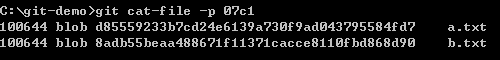

第 10 天：認識 Git 物件的絕對名稱
=================================================

在 Git 版本控管的過程，每一個版本就代表一個 commit 物件。又因為版控過程中經常會建立分支，最終產出的 commit graph 可能會蠻複雜的，所以如何識別不同的版本，或是快速定位到特定版本以取得資訊，就變得很重要。本篇文章將帶大家認識 Git 裡常用的物件名稱概念與使用方法。

物件絕對名稱
------------

在 Git 中，每個物件都會有一個以 SHA 雜湊運算過的 id，而這個 id 就是所謂的「絕對名稱」。如果該物件是 commit 物件，那這就是 commit 物件的絕對名稱，所以我們只要找出 commit 物件的絕對名稱，就可以隨時取得該版本。如下圖箭頭標示處，就是我們透過 `git log` 取得的 commit 物件 id，我們隨時可以取得該 commit 物件的詳細資訊。

如果我們想看如上圖 commit 物件的內容，可以利用 `git cat-file -p commitid` 來取得，如下圖示：

物件絕對名稱的簡短語法
---------------------

由於 Git 物件 id 是透過內容進行 SHA1 雜湊後的結果，所以很長，在 Git 標示「絕對名稱」時，可以用前面幾碼代替，最少不可低於 4 個字元。也就是說 4 ~ 40 個字元長度的「絕對名稱」都是可以用的。

例如我們從上圖也可以看出在這個 commit 物件的的內容包含了一個 tree 物件，該物件也有一個 tree 物件的絕對名稱 `07c1321be49815d53eb2413f0ad5286010ebb6cc`，所以我也可以再次透過 `git cat-file -p treeid` 來取得該 tree 物件的內容，如下圖示：

有時候我們想取得版本紀錄會使用 `git log` 命令，同時也會輸出每個檔案的變更比較結果，結果會十分冗長，這時可以用 `git log --pretty=oneline` 指令來取得較為精簡的歷史紀錄，同時你也可以取得 commit 物件完整的「絕對名稱」，如下圖示：

另外一個常用的技巧則是僅輸出部分的「絕對名稱」，透過 `git log --pretty=oneline --abbrev-commit` 指令執行即可，如下圖示：

今日小結
-------

以上這就是絕對名稱的用法，由於 Git 物件的特性，你可以透過物件的絕對名稱存取到 Git 儲存庫中任意物件，還有很多 git 指令都會用到絕對名稱，熟悉了這些概念與表示法，你將更能掌握 Git 物件。

我重新整理一下本日學到的 Git 指令與參數：

* git log
* git cat-file -p [object_id]
* git log --pretty=oneline
* git log --pretty=oneline --abbrev-commit

-------
* [HOME](../README.md)
* [回目錄](README.md)
* [前一天：比對檔案與版本差異](09.md)
* [下一天：認識 Git 物件的一般參照與符號參照](11.md)

-------

