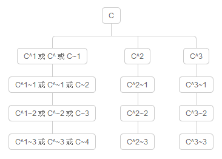

第 12 天：認識 Git 物件的相對名稱
=================================================

在認識了 Git 物件的「絕對名稱」與「參照名稱」後，最後我們來介紹 Git 版控過程中也很常用到的「相對名稱」。

我們再複習一次，在 Git 版本控管的過程，每一個版本就代表一個 commit 物件，每個 commit 物件會有一個「絕對名稱」，該名稱是將內容以 SHA1 雜湊運算後的一個 40 字元的字串，你可以用前 4 ~ 40 個字元來當成該 commit 物件的識別名稱。版控的過程中，也可以讓你透過「參照名稱」來代表某個 commit 物件，每個「參照名稱」最終會對應到一個物件的「絕對名稱」。而「參照名稱」又區分「一般參照」與「符號參照」，其中「一般參照」直接對應到｢絕對名稱｣，而「符號參照」則是對應到另一個「一般參照」。

這篇文章所要介紹的則是透過「相對名稱」的表示法，讓你找到特定 commit 物件後，用相對的位置來找到其他的「commit 物件」。

相對名稱的表示法
----------------

使用相對名稱其實非常簡單，這裡有兩個特殊符號你必須記得，一個是 `^` 另一個是 `~` 符號。

如果要找到 `HEAD` 的前一版本，我們會使用 `HEAD~` 或 `HEAD~1` 來表示「HEAD 這個 commit 物件的前一版」。**註**：這裡你應該已經很清楚 `HEAD` 是一個 Git 內建的「符號參照名稱」，代表目前分支的最新版。

如果你要找出另一個 `f2e` 分支的前兩個版本 (不含 `f2e` 的 `HEAD` 版本)，你則可以用 `f2e~2` 或用 `f2e~~` 來表示，這就是最基本的表示方法。

在沒有分支與合併的儲存庫中，關於 `^1` 與 `~1` 所表達的意思是完全相同的，都代表「前一版」。但事實上在有分支與合併的儲存庫中，他們有不同的意義，這部分容後再述。

這就是最基本的「相對名稱」表示法。

關於 commit 物件彼此間的連結
---------------------------

比較常見的 Git 儲存庫，預設只會有一個「根 commit 物件」，也就是我們最一開始建立的那個版本，又稱「初始送交」(Initial Commit)。你也至少要有第一個 commit 物件後才能開始分支，所以我們可以說：「在一個 Git 儲存庫中，所有的 commit 物件中，除了第一個 commit 物件外，任何其他的 commit 物件一定都會有一個以上的上層 commit 物件(parent commit)」。為什麼有可能有「一個以上」的上層 commit 物件呢？因為你很有可能會合併兩個以上的分支到另一個分支裡，所以合併完成後的那個 commit 物件就會有多個 parent commit 物件。

我們用個簡單的例子來證明這點，我們用 `git cat-file -p [object_id]` 來取得最前面兩筆 commit 物件的內容，藉此了解到每個 commit 物件確實一定會有 parent 屬性，並指向上層 commit 物件的絕對名稱，唯獨第一筆 commit 物件不會有 parent 屬性。如下圖示：

了解相對名稱表示法 `^` 與 `~` 的差異
------------------------------------

關於 `~` 的意義，代表「第一個上層 commit 物件」的意思。

關於 `^` 代表的意思則是「擁有多個上層 commit 物件時，要代表第幾個第一代的上層物件」。

如果你有一個「參照名稱」為 `C`，若要找到它的第一個上層 commit 物件，你可以有以下表達方式：

* C^
* C^1
* C~
* C~1

如果你要找到它的第二個上層 commit 物件 (在沒有合併的狀況下)，你可以有以下表達方式：

* C^^
* C^1^1
* C~2
* C~~
* C~1~1

但你不能用 `C^2` 來表達「第二個上層 commit 物件」！原因是在沒有合併的情況下，這個 `C` 只有一個上層物件而已，你只能用 `C^2` 代表｢上一層物件的第二個上層物件」。

上述講起來有點抽象又有點繞口，我特別畫了一張圖給各位看一下，透過圖解可能會比較明白些。如下圖示，我們想找到 `C` 這個 commit 物件的相對路徑下的其他 commit 物件(上層物件)，由於 `C` 這個 commit 物件有三個上層物件，這代表這個 commit 物件是透過合併而被建立的，那麼你要透過「相對名稱」找到每一個路徑，就必須搭配組合 `^` 與 `~` 的使用技巧，才能定位到每個你想開啟的版本。

介紹 `git rev-parse` 指令
--------------------------

在 Git for Windows 工具裡有個 `git rev-parse` 指令，透過這個指令可以把任意「參考名稱」或「相對名稱」解析出「絕對名稱」，雖然這工具不是很常會用到，但做 Git 教學的時候還蠻實用的。用法如下範例：

* git rev-parse master
* git rev-parse HEAD
* git rev-parse ORIG_HEAD
* git rev-parse HEAD^
* git rev-parse HEAD~5

今日小結
-------

當瞭解了「相對名稱」後，在 Git 中表示 commit 物件的各種方式已經講解完畢，相信你應該更能掌握 Git 各版本之間的操作。

我重新整理一下本日學到的 Git 指令與參數：

* git log
* git cat-file -p [object_id]
* git rev-parse

-------
* [HOME](../README.md)
* [回目錄](README.md)
* [前一天：認識 Git 物件的一般參照與符號參照](11.md)
* [下一天：暫存工作目錄與索引的變更狀態](13.md)

-------

