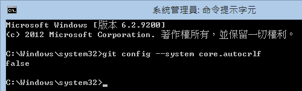
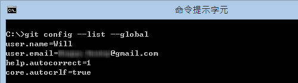

第 14 天： Git for Windows 選項設定
====================================================

使用 Git for Windows 指令列工具絕對比透過 GUI 工具操作來的有效率，原因就在於你可以把許多重複的版控工作透過指令自動化，或將複雜的標準作業流程(SOP)轉化成簡單的指令操作。本篇文章將分享幾則使用 Git for Windows 指令列工具的小技巧。

關於 Git 指令列工具的選項設定
----------------------------

在 Git 指令列工具裡，有許多「選項」可以設定，如同我們使用 GUI 工具通常都會有 [工具] -> [偏好設定] 一樣，可以微調指令執行時的一些行為。最常見的，當然就是首次使用 Git for Windows 的時候，必須設定 `user.name` 與 `user.email` 選項，沒有這兩個選項設定，你連執行 `git commit` 的權力都沒有。

若要列出目前設定在 Git for Windows 工具下的所有選項，可以使用 `git config --list` 命令，如下圖示：

**註**：由於網路上大部分的 Git 文章，都介紹 Linux 或 Mac 電腦的執行環境如何設定，我的文章將會專注於 Windows 平台的設定教學。不過，除了儲存路徑比較不一樣之外，其實指令的用法都是相通的。

若想查詢所有可用的「選項」有哪些，可在命令提示字元下執行 `git help config` 即可顯示完整的文件說明或可連到 [git-config(1) Manual Page](https://www.kernel.org/pub/software/scm/git/docs/git-config.html) 頁面查看。

儲存 Git 選項設定的三個地方
--------------------------

1. **系統層級** ( `--system` ) (System-level configuration) (**設定於整台電腦，適用於本機所有使用者的預設值**)

	如果要列出所有設定在「系統層級」的「選項」，可以執行 `git config --list --system` 命令，也就是額外加上 `--system` 即可篩選出關於系統層級的選項設定，如下圖示：

	

	所有的「系統層級」的選項設定預設會儲存在 `C:\Program Files (x86)\Git\etc\gitconfig` 這個檔案裡。不過，如果你電腦使用的作業系統是 Windows Vista 以上版本 (含 Windows 7 與 Windows 8 作業系統) 又同時啟用「使用者帳戶控制」 (UAC; User Access Control) 的話，那麼這個路徑將會是 `%LOCALAPPDATA%\VirtualStore\Program Files (x86)\Git\etc\gitconfig` (這個路徑位於使用者的目錄下）。會有這層改變的原因就出在 UAC 限制了一般程式存取「系統資料夾」中的檔案權限，導致你無法在使用 `git config` 寫入選項設定到這個設定檔裡。在 Windows Vista 以上版本，實作了一套 **VirtualStore** 相容性技術，讓你的程式試圖寫入檔案的同時，也可以寫入成功，不過寫入的路徑卻是不同的，這點必須特別注意。

	這個 Windows 內建的 **VirtualStore** 相容性技術，其技術文件非常稀有，似乎代表著很少人知道這個東西，但這技術確實可能會讓使用者產生困擾。例如，我們用「**一般方式執行命令提示字元**」與用「**以系統管理員身分執行命令提示字元**」，所寫入的「系統層級選項」是不能互通的。換句話說，如果你用「**以系統管理員身分執行命令提示字元**」，如下圖示：

	

	然後執行 `git config --system --list` 先列出所有參數，我們可以發現目前的 `core.autocrlf` 參數為 `true`，接著我將系統層級的 `core.autocrlf` 修改為 false，最後執行 `git config --system core.autocrlf` 讀出 `core.autocrlf` 的內容，你可以看到我們已經把 `core.autocrlf` 選項修改為 `false` 了。如下圖示：

	

	再來我們用一般權限執行「命令提示字元」：

	

	然後執行 `git config --system core.autocrlf` 讀出 `core.autocrlf` 的內容，這時你可以看到我的 `core.autocrlf` 選項值也是 `false`，目前並沒有發現任何問題。不過這時如果你再執行 `git config --system core.autocrlf true` 把 `core.autocrlf` 選項設定改回 `true` 的話，在目前的環境下也沒問題：

	

	但如果我們重新「**以系統管理員身分執行命令提示字元**」，再輸入一次 `git config --system core.autocrlf` 讀出 `core.autocrlf` 的內容，你會發現其選項值竟然為 `false`，這個所謂的「系統層級」設定並沒有真的套用到所謂的「系統層級」，所以你日後使用 Git 的過程中發現「怪怪的」狀況，或懷疑 Git for Windows 這工具好像有 Bugs，但事實上這跟工具一點關係都沒有，是作業系統的問題！

	

	如果你的 Windows 登入帳號為 `Will` 的話，這個 `%LOCALAPPDATA%\VirtualStore\Program Files (x86)\Git\etc\gitconfig` 路徑就會自動展開為 `C:\Users\Will\AppData\Local\VirtualStore\Program Files (x86)\Git\etc\gitconfig`，也代表著，當你在「一般權限」下執行「命令提示字元」，並且透過 `git config --system` 設定「系統層級」選項，那麼該設定將會變成只有「自己」能夠套用而已，不會套用到本機其他使用者身上。

	結論：**若要設定「系統層級」選項，請務必用【以系統管理員身分執行】的方式啟用命令提示字元，然後再執行 `git config` 命令，才能寫入正確的檔案位置。**

	補充資訊: [VirtualStore - Inside Windows Vista User Account Control](http://technet.microsoft.com/en-us/magazine/2007.06.uac.aspx)

2. **使用者層級** ( `--global` ) (User-level configuration) (**設定於目前登入的使用者**)

	如果要列出所有設定在「使用者層級」的「選項」，可以執行 `git config --list --global` 命令，也就是額外加上 `--global` 即可篩選出關於使用者層級的選項設定，如下圖示：

	

	關於「使用者層級」的選項設定預設會儲存在 `%USERPROFILE%\.gitconfig` 或 `C:\Users\<使用者帳號>\.gitconfig` 這個檔案裡。由於檔案儲存在自己的使用者資料夾下，沒有像「系統層級」設定時有權限問題。

	一般來說，我們通常會把 `user.name` 與 `user.email` 選項設定在「使用者層級」，例如以下設定範例(請換成你自己的姓名與電子郵件地址)：

		git config --global user.name "Will Huang"
		git config --global user.email "will@example.com"

	還有，由於「使用者層級」顧名思義就是「使用者自己專用的地方」，所以通常我們也會把「個人化」的環境設定都設定在這裡，這部分本文稍後就會分享幾個環境設定的技巧。

3. **儲存區層級** ( `--local` ) (Repository-level configuration) (**設定於工作目錄下的 `.git\config` 設定檔中**)

	如果要列出所有設定在「儲存區層級」的「選項」，可以執行 `git config --list --local` 命令，也就是額外加上 `--local` 即可篩選出關於儲存區層級的選項設定，如下圖示：

	

	儲存區層級的選項設定檔預設儲存在你 Git 工作目錄的 `.git\config` 設定檔中，這檔案會在你建立本地儲存庫或透過 `git clone` 取得遠端儲存庫時自動建立，如果你要定義將「特定工作目錄」才要有的選項設定，則可以直接將選項設定儲存在這裡。

Git 選項設定的套用順序
----------------------

由於設定 Git 選項時可以套用三種不同的層級，不同的層級下可以設定相同名稱的選項，但要以哪一個層級的設定為準呢？事實上 Git 指令列工具在執行時會依據以下優先順序進行套用：

1. 先套用系統層級 (優先權最低)
2. 再套用使用者層級
3. 再套用儲存區層級 (優先權最高)

也就是說，你如果再系統層級曾經設定過 `core.autocrlf` 選項，然後在使用者層級又重新定義過一次，那麼最終會套用的 `core.autocrlf` 選項值將會是「使用者層級」的設定值。

不過，若你的執行環境若是使用 Windows Vista 以上並啟用 UAC 使用者存取控制，而且還只用「一般權限」執行這些 Git 命令的話，讀取與套用的順序會多一個判斷：

1. 套用系統層級: `C:\Program Files (x86)\Git\etc\gitconfig`
2. 套用系統層級: `%LOCALAPPDATA%\VirtualStore\Program Files (x86)\Git\etc\gitconfig`
3. 套用使用者層級: `%USERPROFILE%\.gitconfig`
4. 套用儲存區層級: `.git\config` 

若你想要知道目前的工作環境最終套用的選項設定有哪些，直接執行 `git config --list` 即可以取得所有「已設定」的選項設定清單：

選項設定的操作方式
------------------

* 取得選項設定清單

		git config --list
		git config --list --system
		git config --list --global
		git config --list --local

* 取得特定選項值

		git config [config_section.config_name]

		git config user.name
		git config user.email

* 設定特定選項值

		git config [config_section.config_name] [config_value]

		git config user.name "Will Huang"
		git config user.email "will@example.com"

* 刪除特定選項設定 

		git config --unset --system [config_section.config_name]
		git config --unset --global [config_section.config_name]
		git config --unset --local  [config_section.config_name]

選項設定檔的內容結構
------------------

Git 選項設定的檔案內容其實格式都一樣，我們試著開啟一個**使用者層級**下的設定檔看看 ( `%USERPROFILE%\.gitconfig` )：

我們從上圖可以看到，中括號 ( `[` 與 `]` ) 所包含的是一個「區段名稱」，代表某一群設定檔的分類，而其他的內容則是一組 Key/Value 的對應設定。通常我們會用 `git config` 命令來操作這些選項設定，但你其實也可以直接用 Notepad 編輯這些檔案，可以達到完全一樣的效果。
如果想了解有哪些選項可用，可以在命令提示字元下執行 `git help config` 即可顯示說明文件。

常用選項設定
------------

* 設定指令別名 (Alias)

	有沒有覺得每次用 git 打指令很囉嗦，尤其是經常使用的 `git status`, `git commit`, `git add` 或 `git log` 等指令，有時候還要外加一些額外的指令參數，每次這樣輸入還真的挺煩的。其實你可以透過指令別名的設定，讓指令輸入的更短一些。

	首先，我們先設定一些我常用的 Git Alias 設定，指令如下：

		git config --global alias.co   checkout
		git config --global alias.ci   commit
		git config --global alias.st   status
		git config --global alias.sts  "status -s"
		git config --global alias.br   branch
		git config --global alias.re   remote
		git config --global alias.di   diff
		git config --global alias.type "cat-file -t"
		git config --global alias.dump "cat-file -p"
		git config --global alias.lo   "log --oneline"
		git config --global alias.ll "log --pretty=format:'%h %ad | %s%d [%Cgreen%an%Creset]' --graph --date=short"
		git config --global alias.lg "log --graph --pretty=format:'%Cred%h%Creset %ad |%C(yellow)%d%Creset %s %Cgreen(%cr)%Creset [%Cgreen%an%Creset]' --abbrev-commit --date=short"

	設定完這些「指令別名」後，如果今後你要顯示工作目錄狀態，原本你要輸入完整的 `git status`，現在你可以只輸入 `git st` 即可完成。如果你要顯示簡易版的狀態資訊，以前你要輸入 `git status -s` 才能完成，現在你只要輸入 `git sts` 即可完成。要顯示單行的歷史紀錄，現在也只要輸入 `git lo`, `git ll` 或 `git lg` 就可以完成。是不是相對的簡單很多呢！ :-)

* 指定預設文字編輯器

	預設 Git for Windows 在執行 `git commit` 的時候，會開啟 Vim 編輯器。如果你想切換成記事本的話，可以透過以下指令完成設定：

		git config --global core.editor notepad.exe

	如果想指定 Notepad++ 當為主要編輯器的話，可以透過以下指令完成設定 (請自行修改執行檔路徑)：

		git config --global core.editor "\"C:\Program Files (x86)\Notepad++\notepad++.exe\""

	當然，你想換成 Sublime Text 也是沒問題的，只要把執行檔路徑寫對即可！

* 直接編輯設定檔

	有時候直接編輯設定檔會比下指令來的方便些，所以如果你想要直接從指令列開啟編輯設定檔的話，可以參考以下指令：

		git config --edit --system
		git config --edit --global
		git config --edit --local

	如此一來可以省去開啟檔案總管，並找到路徑後再開啟檔案的繁瑣步驟。

* 自動辨識 CRLF 字元

	在 Windows 底下，建議最好打開 core.autocrlf 選項，讓 Git 將檔案儲存進物件儲存區 ( object storage ) 時，可以自動過濾所有 CR 字元 ( `\r` )，以利 Git 專案能更容易跨平台，讓在 Linux 與 Windows 平台做開發的人都能順利使用 Git 版本控管。

		git config --global core.autocrlf true

	筆者曾經寫過一篇 [Git 在 Windows 平台處理斷行字元 (CRLF) 的注意事項](http://blog.miniasp.com/post/2013/09/15/Git-for-Windows-Line-Ending-Conversion-Notes.aspx) 的文章，建議各位可以看看。

* 自動訂正打錯的參數

	畢竟我們是用指令列工具再輸入，打錯字在所難免，例如你輸入 `git statsu` (打錯字了)，若啟用「自動訂正」選項，則 Git 工具會自動修正為 `git status` 並成功執行，讓你不用重打一次。以下是開啟自動訂正選項的指令：

		git config --global help.autocorrect 1

* 啟用訊息顏色

	預設 Git for Windows 的「系統層級」設定中已經啟用了訊息顏色功能，但如果你不小心關閉的話，可以用以下指令開啟：

		git config --system color.ui auto

* 自訂 commit 訊息範本

	每當我們輸入 `git commit` 的時候，都會跳出一個文字編輯視窗，讓我們輸入本次要 commit 的紀錄訊息，但每次都需要重頭輸入訊息。在團隊中，你可能會希望大家共用一個「文字範本」，好讓大家在 `git commit` 的時候都能夠填寫必要的欄位或資訊。

	如果要指令 commit 訊息範本，必須先建立一個文字範本檔案，假設我放在 G:\git-commit-template.txt

	接著透過以下指令，設定 commit 訊息範本的路徑：

		git config --local commit.template "G:\git-commit-template.txt"

	最後執行 `git commit` 所跳出的訊息編輯視窗就會有預設內容了：

	

	各位不知道有沒有注意到，我故意用 `--local` 參數，將設定儲存在「儲存庫層級」下 ( `.git\config` )，主要原因就是「訊息範本」有時候是跟著「專案」走的，不同的專案可能會想套用不同的訊息範本。如果你跟我有相同的需求，就可以套用 `--local` 參數。否則，你也可以套用 `--global` 直接套用在使用者層級下。

今日小結
-------

今天介紹的 Git for Windows 選項設定不是很常用，通常也只需要設定一次就沒事了，但「工欲善其事、必先利其器」，先把環境、選項都給設定好，你將可大幅減少 Git 版本控管的花費時間。

我重新整理一下本日學到的 Git 指令與參數：

* git config --list
* git config --list --system
* git config --list --global
* git config --list --local

* git config --edit --system
* git config --edit --global
* git config --edit --local

* git config [config_section.config_name]
* git config [config_section.config_name] [config_value]
* git config --unset --system [config_section.config_name]
* git config --unset --global [config_section.config_name]
* git config --unset --local  [config_section.config_name]
 
* git config user.name
* git config user.email
* git config user.name "Will Huang"
* git config user.email "will@example.com"

* git config --global alias.co   checkout
* git config --global alias.ci   commit
* git config --global alias.st   status
* git config --global alias.sts  "status -s"
* git config --global alias.br   branch
* git config --global alias.re   remote
* git config --global alias.di   diff
* git config --global alias.type "cat-file -t"
* git config --global alias.dump "cat-file -p"
* git config --global alias.lo   "log --oneline"
* git config --global alias.ll "log --pretty=format:'%h %ad | %s%d [%Cgreen%an%Creset]' --graph --date=short"
* git config --global alias.lg "log --graph --pretty=format:'%Cred%h%Creset %ad |%C(yellow)%d%Creset %s %Cgreen(%cr)%Creset [%Cgreen%an%Creset]' --abbrev-commit --date=short"
* git config --global core.editor notepad.exe
* git config --global core.autocrlf true
* git config --global help.autocorrect 1
* git config --system color.ui auto
* git config --local commit.template "G:\git-commit-template.txt"

參考連結
-------

* [Git - Alias](http://c9s.blogspot.tw/2009/11/git-alias.html)
* [11. Aliases | Git How To](http://githowto.com/aliases)
* [7.1 Customizing Git - Git Configuration](http://git-scm.com/book/en/Customizing-Git-Git-Configuration)
* [git-config(1) Manual Page](https://www.kernel.org/pub/software/scm/git/docs/git-config.html)

-------
* [HOME](../README.md)
* [回目錄](README.md)
* [前一天：暫存工作目錄與索引的變更狀態](13.md)
* [下一天：標籤 - 標記版本控制過程中的重要事件](15.md)

-------

