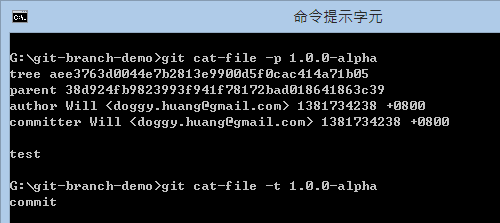
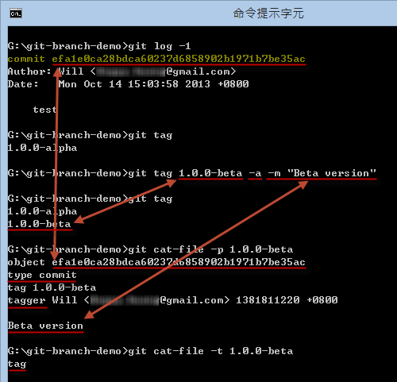
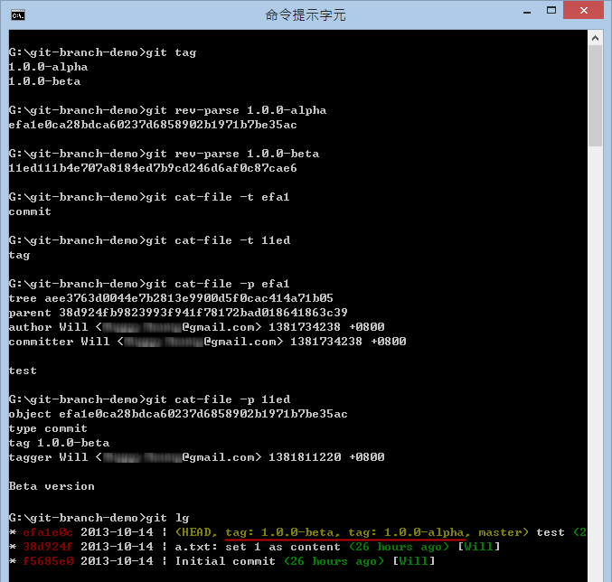

第 15 天：標籤 - 標記版本控制過程中的重要事件
===========================================================

在使用 Git 版本控管的過程中，會產生大量的版本，隨著寒暑易節、物換星移，在這眾多的版本之中，一定會有一些值得我們紀錄的幾個重要版本，這就是｢標籤｣ (Tag) 能幫我們做的事。

關於標籤 (Tag) 的基本概念
------------------------

基本上，標籤的用途就是用來標記某一個「版本」或稱為「commit 物件」，以一個「好記的名稱」來幫助我們記憶【某個】版本。

Git 標籤 (Tag) 擁有兩種型態，這兩種類型分別是：

* 輕量標籤 (lightweight tag) 
* 標示標籤 (annotated tag)

我們在【第 11 天：認識 Git 物件的一般參照與符號參照】文章中有提到「一般參照」包含了「標籤名稱」這項，這裡的「標籤名稱」就是所謂的「輕量標籤」(lightweight tag) 。所以「輕量標籤」可以說是某個 commit 版本的「別名」而已，是一種「相對名稱」。

「標示標籤」(annotated tag)則是一種 Git 物件，就像我們在【第 06 天：解析 Git 資料結構 - 物件結構】提到的，Git 物件包含 4 種物件類型，分別是 Blob, Tree, Commit 與 Tag 物件，這裡講的「標示標籤」就是 Tag 物件。Tag 物件會儲存在 Git 的物件儲存區當中 ( 會存到 `.git\objects\` 目錄下 )，並且會關聯到另一個 commit 物件，建立「標示標籤」時還能像建立 commit 物件時一樣包含「版本訊息」。在內建的 Git 標籤機制中，甚至你還可以利用 [GnuPG](http://gnupg.org/) 金鑰對 Tag 物件加以簽章，以確保訊息的「不可否認性」。

雖然我們有這兩種標籤類型，看起來也都像某個 commit 物件的「別名」，但這兩種標籤在使用上只有些微的差異而已。在大部分的使用情境下，我們都會用「標示標籤」來建立「標籤物件」並且給予「版本訊息」，因為這種「標籤」才是 Git 儲存庫中「永久的物件」。( 儲存到物件儲存庫中的 Git 物件都是不變的，只有索引才是變動的 )

了解輕量標籤(lightweight tag)的使用方式
---------------------------------------

我用一個簡單的例子說明建立「輕量標籤」的過程，如下圖示：(請自行看圖說故事)

**提示**：所有在 `.git\refs\` 下的檔案都是個「參考名稱」。

大致的使用說明如下：

* 列出所有標籤：`git tag`
* 建立輕量標籤：`git tag [tagname]`
* 刪除輕量標籤：`git tag [tagname] -d`

如果我們想看這個「輕量標籤」的內容，我們可以透過 `git cat-file -p [tagname]` 取得。如果我們想看這個「輕量標籤」的物件類型，可以透過 `git cat-file -t [tagname]` 取得。如下圖示：

**請注意**: 輕量標籤不是個 Git 物件，所以我們從上圖可以看出，該 Tag 名稱取得的是 commit 物件的內容，而且該名稱所查出的物件類型是 commit 物件。

了解標示標籤(annotated tag)的使用方式
------------------------------------

我也用一個簡單的例子說明建立「標示標籤」的過程，如下圖示：(請自行看圖說故事)

這裡跟「輕量標籤」有些不一樣的地方：

1. 當我們執行 `git tag` 列出所有標籤時，所有標籤都會混在一起，看不出標籤的類型。
2. 建立「標示標籤」要加上 `-a` 參數。
3. 建立「標示標籤」一定要加上「版本訊息」，跟執行 `git commit` 一樣都有 `-m` 參數可用。
4. 當我們執行 `git cat-file -p 1.0.0-beta` 時，你應該可以看出這個物件內容跟 commit 物件稍稍有點不同。
5. 當我們執行 `git cat-file -p 1.0.0-beta` 時，你從內容看到的 `type` 講的是上一行 `object` 的物件類型，這代表你也可以把任何 Git 物件建立成一個標籤物件。
6. 當我們執行 `git cat-file -t 1.0.0-beta` 時，得到的是 tag 物件類型。

標示標籤的指令用法，跟輕量標籤一模一樣，差別只有 `-a` 參數而已。（如果只有使用 `-m` 他會隱含著 `-a` 也幫你加上。）

※ 預設 `git tag [tagname] -a` 會將當前的 `HEAD` 版本建立成「標籤物件」，如果要將其他特定物件建立為標籤的用法為 `git tag [tagname] [object_id]`。

今日小結
-------

最後，我把本篇文章建立的兩個例子重新比較一遍，從下圖你應該可以很清楚看出兩者之間的差異：

我重新整理一下本日學到的 Git 指令與參數：

* git tag
* git tag [tagname]
* git tag [tagname] -a
* git tag [tagname] -d

※ 若想查詢 `git tag` 的完整用法，可在命令提示字元下執行 `git help tag` 即可顯示完整的文件說明。

參考連結
-------

* [BRANCHING AND MERGING](http://gitref.org/branching/#tag)
* [Semantic Versioning](http://semver.org/)

-------
* [HOME](../README.md)
* [回目錄](README.md)
* [前一天：Git for Windows 選項設定](14.md)
* [下一天：善用版本日誌 git reflog 追蹤變更軌跡](16.md)

-------

