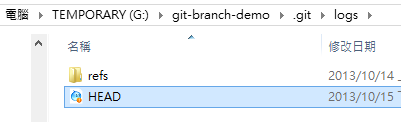

第 16 天：善用版本日誌 git reflog 追蹤變更軌跡
============================================================

其實學習 Git 版本控管的指令操作並不難，但要弄清楚 Git 到底對我的儲存庫做了什麼事，還真不太容易。當你一步步了解 Git 的核心與運作原理，自然能有效掌控 Git 儲存庫中的版本變化。本篇文章，就來說說 Git 如何記錄我們的每一版的變更軌跡。

了解版本紀錄的過程
-----------------

在清楚理解 Git 基礎原理與物件結構之前，你不可能了解版本紀錄的過程。而當你不了解版本紀錄的過程，自然會擔心「到底我的版本到哪去了」，也許有人跟你說「我們用了版本控管，所以所有版本都會留下，你大可放心改 Code」。知道是一回事，知不知道怎麼做又是一回事，然後是不是真的做得到又是另外一回事。我們在版控的過程中盡情 commit 建立版本，但如果有一天發現有某個版本改壞了，或是因為執行了一些合併或重置等動作導致版本消失了，那又該怎麼辦呢？

還好在 Git 裡面，有一套嚴謹的紀錄機制，而且這套機制非常開放，紀錄的檔案都是文字格式，還蠻容易了解，接下來我們就來說明版本紀錄的過程。

我們先進入任何一個 Git 工作目錄的 `.git/` 資料夾，你可以看到一個 `logs` 目錄，如下圖示：

這個 `logs` 資料夾下有個 `HEAD` 檔案，這檔案紀錄著「當前分支」的版本變更紀錄：

我們開啟該檔看看其內容 (其中物件 id 的部分我有刻意稍作刪減，以免每行的內容過長)：

	0000000 f5685e0 Will <xxxx@gmail.com> 1381718394 +0800	commit (initial): Initial commit
	f5685e0 38d924f Will <xxxx@gmail.com> 1381718395 +0800	commit: a.txt: set 1 as content
	38d924f efa1e0c Will <xxxx@gmail.com> 1381734238 +0800	commit: test
	efa1e0c af493e5 Will <xxxx@gmail.com> 1381837967 +0800	commit: Add c.txt

從這裡你將可看出目前在這個分支下曾經記錄過 4 個版本，此時我們用 `git reflog` 即可列印出所有「歷史紀錄」的版本變化，你會發現內容是一樣的，但順序正好顛倒。從文字檔中看到的內容，「第一版」在最上面，而透過 `git reflog` 則是先顯示「最新版」最後才是「第一版」：

這時我們試圖建立一個新版本，看看記錄檔的變化，你會發現版本被建立成功：

從上圖你可以發現到，這裡有個特殊的「參考名稱」為 `HEAD@{0}`，這裡每個版本都會有一個歷史紀錄都會有個編號，代表著這個版本的在記錄檔中的順位。如果是 `HEAD@{0}` 的話，永遠代表目前分支的「最新版」，換句話說就是你在這個「分支」中最近一次對 Git 操作的紀錄。你對 Git 所做的任何版本變更，全部都會被記錄下來。

復原意外地變更
--------------

初學者剛開始使用 Git 很有可能會不小心執行錯誤，例如透過 `git merge` 執行合併時發生了衝突，或是透過 `git pull` 取得遠端儲存庫最新版時發生了失誤。在這種情況下，你可以利用 `HEAD@{0}` 這個特殊的「參考名稱」來對此版本「定位」，並將目前的 Git 儲存庫版本回復到前一版或前面好幾版。

例如，我們如果想要「取消」最近一次的版本紀錄，我們可以透過 `git reset HEAD@{1} --hard` 來復原變更。如此一來，這個原本在 `HEAD@{0}` 的變更，就會被刪除。不過，在 Git 裡面，所有的變更都會被記錄，其中包含你做 `git reset "HEAD@{1}" --hard` 的這個動作，如下圖示：

這代表甚麼意義呢？這代表你在執行任意 Git 命令時，再也不用擔心害怕你的任何資料會遺失，就算你怎樣下錯指令都沒關係，所有已經在版本庫中的檔案，全部都會保存下來，完全不會有遺失的機會。所以，這時如果你想復原剛剛執行的 `git reset "HEAD@{1}" --hard` 動作，只要再執行一次 `git reset "HEAD@{1}" --hard` 即可，是不是非常棒呢！你看下圖，我把剛剛的 `9967b3f` 這版本給救回來了：

紀錄版本變更的原則
-----------------

事實上在使用 Git 版控的過程中，有很多機會會產生「版本歷史紀錄」，我說的並不是單純的 `git log` 顯示版本紀錄，而是原始且完整的變更歷史紀錄。這些紀錄版本變更有個基本原則：【只要你透過指令修改了任何參照(ref)的內容，或是變更任何分支的 `HEAD` 參照內容，就會建立歷史紀錄】。也因為這個原則，所以指令名稱才會稱為 `reflog`，因為是改了 `ref` (參照內容) 才引發的 `log` (紀錄)。

例如我們拿 `git checkout` 命令還切換不同的分支，這個切換的過程由於會修改 `.git\HEAD` 參照的內容，所以也會產生一個歷史紀錄，如下圖示：

還有哪些動作會導致產生新的 reflog 紀錄呢？以下幾個動作你可以參考，但其實可以不用死記，記住原則就好了：

* commit
* checkout
* pull
* push
* merge
* reset
* clone
* branch
* rebase
* stash

除此之外，每一個分支、每一個暫存版本(stash)，都會有自己的 reflog 歷史紀錄，這些資料也全都會儲存在 `.git\logs\refs\` 資料夾下。

只顯示特定分支的 reflog 紀錄
----------------------------

在查詢歷史紀錄時，你也可以針對特定分支(Branch)進行查詢，僅顯示特定分支的變更歷史紀錄，如下圖示：

顯示 reflog 的詳細版本記錄
--------------------------

我們已經學會用 `git reflog` 就可以取出版本歷史紀錄的摘要資訊。但如果我們想要顯示每一個 reflog 版本中，每一個版本的完整 commit 內容，那麼你可以用 `git log -g` 指令顯示出來：

刪除特定幾個版本的歷史紀錄
------------------------

基本上，版本日誌(reflog)所記錄的只是變更的歷程，而且預設只會儲存在「工作目錄」下的 `.git/` 目錄裡，這裡所記錄的一樣只是 commit 物件的指標而已。無論你對這些紀錄做任何操作，不管是竄改、刪除，都不會影響到目前物件儲存庫的任何內容，也不會影響版本控管的任何資訊。

如果你想刪除之前紀錄的某些紀錄，可以利用 `git reflog delete ref@{specifier}` 來刪除特定歷史紀錄。如下圖示：

**註**：這些版本日誌預設並不會被同步到「遠端儲存庫」，以免多人開發時大家互相影響，所以版本日誌算是比較個人的東西。

設定歷史紀錄的過期時間
---------------------

當你的 Git 儲存庫越用越久，可想見這份歷史紀錄將會越累積越多，這樣難道不會爆掉嗎？還好，預設來說 Git 會幫你保存這些歷史紀錄 90 天，如果這些紀錄中已經有些 commit 物件不在分支線上，則預設會保留 30 天。

舉個例子來說，假如你先前建立了一個分支，然後 commit 了幾個版本，最後直接把該分支刪掉，這時這些曾經 commit 過的版本 (即 commit 物件) 還會儲存在物件儲存區 (object storage) 中，但已經無法使用 `git log` 取得該版本，我們會稱這些版本為「不在分支線上的版本」。

如果你想修改預設的過期期限，可以透過 `git config gc.reflogExpire` 與 `git config gc.reflogExpireUnreachable` 來修正這兩個過期預設值。如果你的硬碟很大，永遠不想刪除紀錄，可以考慮設定如下：

	git config --global gc.reflogExpire "never"
	git config --global gc.reflogExpireUnreachable "never"

如果只想保存 7 天，則可考慮設定如下：

	git config --global gc.reflogExpire "7 days"
	git config --global gc.reflogExpireUnreachable "7 days"

**註**：從上述範例所看到的 `7 days` 這段字，我找了好久都沒有看到完整的說明文件，最後終於找到 Git 處理日期格式的原始碼(C語言)，有興趣的也可以看看：[http://git.kernel.org/cgit/git/git.git/tree/date.c](http://git.kernel.org/cgit/git/git.git/tree/date.c)

除此之外，你也可以針對特定分支設定其預設的過期時間。例如我想讓 `master` 分支只保留 14 天期，而 `develop` 分支可以保留完整記錄，那麼你可以這樣設定：(注意: 以下範例我把設定儲存在本地儲存庫中，所以使用了 `--local` 參數)

	git config --local gc.master.reflogExpire "14 days"
	git config --local gc.master.reflogExpireUnreachable "14 days"

	git config --local gc.develop.reflogExpire "never"
	git config --local gc.develop.reflogExpireUnreachable "never"

上述指令寫入到 `.git\config` 的內容將會是：

	[gc "master"]
		reflogExpire = 14 days
		reflogExpireUnreachable = 14 days
	[gc "develop"]
		reflogExpire = never
		reflogExpireUnreachable = never

清除歷史紀錄
-------------

若要立即清除所有歷史紀錄，可以使用 `git reflog expire --expire=now --all` 指令完成刪除工作，最後搭配 `git gc` 重新整理或清除那些找不到、無法追蹤的版本。如下圖示：

今日小結
-------

Git 的版本日誌(reflog)幫我們記憶在版控過程中的所有變更，幫助我們「回憶」到底這段時間到底對 Git 儲存庫做了什麼事。不過你也要很清楚的知道，這些只是個「日誌」而已，不管有沒有這些日誌，都不影響我們 Git 儲存庫中的任何版本資訊。

我重新整理一下本日學到的 Git 指令與參數：

* git reflog
* git reflog [ref] 
* git log -g 
* git reset "HEAD@{1}" --hard
* git reflog delete "ref@{specifier}"
* git reflog delete "HEAD@{0}"
* git reflog expire --expire=now --all
* git gc 
* git config --global gc.reflogExpire "never"
* git config --global gc.reflogExpireUnreachable "never"

參考連結
-------

* [git-reflog(1) Manual Page](http://git-scm.com/docs/git-reflog)
* [git-gc(1) Manual Page](http://git-scm.com/docs/git-gc)
* [http://git.kernel.org/cgit/git/git.git/tree/date.c](http://git.kernel.org/cgit/git/git.git/tree/date.c)

-------
* [HOME](../README.md)
* [回目錄](README.md)
* [前一天：標籤 - 標記版本控制過程中的重要事件](15.md)
* [下一天：關於合併的基本觀念與使用方式](17.md)

------- 

