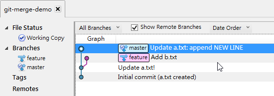
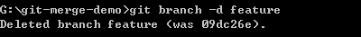
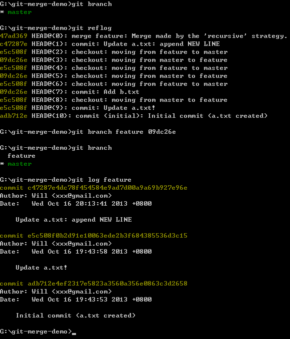
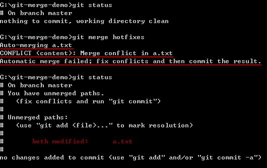

第 17 天：關於合併的基本觀念與使用方式
========================================================

我曾在【第 08 天：關於分支的基本觀念與使用方式】提過關於「分支」的基本觀念與用法，現在則要來講「合併」如何進行。由於 Git 是一種分散式版本控管系統(DVCS)，過程中會不斷的進行分支與合併，無論是有意的合併(`git merge`)或無意的合併(`git pull`)，總之使用 Git 版控「分支」與「合併」的動作確實經常發生。本篇文章將說明「合併」動作的基本觀念與使用方式。

關於「合併」的基本觀念
--------------------

當你在 Git 工作目錄下建立分支時，可以讓你的系統依據不同的需求分別進行開發，又不互相影響。例如你原本穩定的系統可以放在 `master` 分支中進行開發，而當要修正錯誤時則額外建立一個 `bugfix` 分支來改正軟體錯誤，等 Bugs 修正後，在透過「合併」的方式將 `bugfix` 分支上的變更重新套用到 `master` 上面，這就是一種主要的使用情境。

一般來說，大家都是以一個主要或預設分支進行開發(`master`)，然後再依據需求建立分支(`bugfix`)，最後則是將兩個分支合併成一個。事實上，執行「合併」動作時，是將另一個分支合併回目前分支，然後再手動將另一個分支給移除，這樣才符合「兩個分支合併成一個」的概念。

實務上，也經常有機會將三個、四個或更多的分支合併到其中一個分支。例如你除了主要分支(`master`)外，還額外建立了除錯用的分支(`bugfix`)與新增功能(`feature`)的分支，當開發到一定程度後，你可以決定要不要將這個兩個分支一起合併回主要分支(`master`)。

在 Git 使用合併時，有一個重要的觀念是【合併的動作必須發生在同一個儲存庫中】。請回想一下，在任何一個 Git 儲存庫中，都必須存在一個 Initial Commit 物件(初始版本)，而所有其他版本都會跟這個版本有關係，這個關係我們稱為「在分支線上的可追蹤物件」(the tracked object on the branch heads)，所以你不能將一個儲存庫的特定分支合併到另一個毫不相干的儲存庫的某個分支裡。

合併的時候，如果兩個分支當中有修改到相同的檔案，但只要修改的行數不一樣，Git 就會自動幫你套用/合併這兩個變更。但如果就這麼剛好，你在兩個分支裡面改到「同一個檔案」的「同一行」，那麼在合併的時候就會引發衝突事件。當合併衝突發生時，Git 並不會幫你決定任何事情，而是將「解決衝突」的工作交給「你」來負責，且這些發生衝突的檔案也都會被標示為 `unmerged` 狀態，合併衝突後你可以用 `git status` 指令看到這些狀態。 

體驗一場「成功的合併」
--------------------

簡單來說，「成功的合併」就是沒有發生「衝突」的合併。我們用一個簡單的例子說明合併的過程與指令的用法：
	
	mkdir git-merge-demo
	cd git-merge-demo
	git init
	
	echo. > a.txt
	git add .
	git commit -m "Initial commit (a.txt created)"
	
	echo 1 > a.txt
	git add .
	git commit -m "Update a.txt!"

執行結果如下圖示，我們建立了兩個版本，而且最新版的 `a.txt` 內容為 `1`：

接著我們透過 `git checkout -b feature` 建立一個 `feature` 分支，並同時把工作目錄給切換到 `feature` 分支進行開發，然後建立一個內容為 `2` 的 `b.txt` 檔案：

**注意**：在切換「分支」之前，請隨時查看並保持「工作目錄」的狀態是「乾淨的」，不要有任何檔案異動中的狀態。

現在我們回顧一下兩個分支的內容：

* 主要分支：`master`
	* 擁有 `a.txt` 其內容為 `1` 
* 功能分支：`feature` (目前所在分支)
	* 擁有 `a.txt` 其內容為 `1`	(此檔案室從 `master` 分支繼承過來的)
	* 擁有 `b.txt` 其內容為 `2`

我們現在要做 3 件事：

1. 將工作目錄切換回 `master` 主要分支
2. 將 `a.txt` 的內容新增一行 `NEW LINE` 在第二行 (第一行不動)
3. 將 `a.txt` 的異動加入索引，並 commit 版本 

如下圖示：

現在我們再回顧一次當下兩個分支的內容：

* 主要分支：`master` (目前所在分支)
	* 擁有 `a.txt` 其內容有兩行，第一行為 `1`，第二行是 `NEW LINE`
	* 這裡沒有 `feature` 分支的變更，也就是沒有 `b.txt` 檔案。 
* 功能分支：`feature`
	* 擁有 `a.txt` 其內容為 `1`	(這是從 `master` 分支繼承過來的，在 `feature` 沒動過)
	* 擁有 `b.txt` 其內容為 `2`	(這是從 `feature` 才新建立的檔案)

我們用 SourceTree 可以查看較為漂亮的 commit graph (版本圖)：

由於兩個分支都有在建立 `feature` 分支後都做過異動，不過你可能會發現到，這兩個分支當中，從「分支點」開始，所做的修改並沒有互相衝突，只要是這種狀況，合併並不會發生問題。接下來我們就來執行「合併」動作 (`git merge`)。

從下圖示中，有許多我想強調的細節：

1. 合併之前，先看清楚自己在哪個分支
2. 合併之前，請確保工作目錄是乾淨的
3. 合併時請用 `git merge [另一個分支]` 來將另一個分支的變更合併回來
4. 你可以從下圖看到我打錯字了，但 Git 還會自動幫我執行正確的指令，詳情請見【第 14 天： Git for Windows 選項設定】
5. 合併成功後，你可以利用 `git log` 查看版本紀錄，你可以發現**「合併」的過程會自動建立一個新版本**！

我們看看「合併後」的分支狀況，用 SourceTree 的 commit graph 來看：

最後我們來看看合併後的檔案內容，確實如我們預期的把兩個分支中的變更都給合併了：

這就是一場成功的「合併」！ :-)

刪除不必要的分支
----------------

假設我們 `feature` 分支還會持續開發新功能，所以可以暫時將它留著，讓後續還能繼續切換到 `feature` 分支繼續開發。

如果你確定用不到的話，可以用 `git branch -d feature` 刪除該分支。

在 Git 裡，只要沒有執行過「合併」的分支，都不能用上述指令進行刪除，必須改用 `git branch -D feature` 才能刪除該分支。

救回誤刪的分支
--------------

不過，如果你不小心「誤刪」該分支(`feature`)的話，則必須用以下步驟救回分支，稍微麻煩一點：

1. 先利用 `git reflog` 找出該分支(`feature`)最後一個版本的 object id (也就是 SHA1 格式的物件絕對名稱)
2. 執行 `git branch feature <SHA1>` 即可

如下圖示，最終還是能把誤刪的 `feature` 分支給救回：

體驗一場「衝突的合併」
--------------------

現在，我們從 `master` 分支的最新版(`HEAD`)建立一個 `hotfixes` 分支，執行指令：`git checkout -b hotfixes`

我們修改 `a.txt` 的第一行，把原本的 `1` 修改為 `bugfixed: 1`，並建立版本。然後切換回 `master` 分支：

接著，我們在 `master` 分支修改 `a.txt` 的第一行，把原本的 `1` 修改為 `bugfixed by Will: 1`，並建立版本。

現在，我們兩個分支都同時修改了 `a.txt` 的檔案內容，而且都在同一行，這樣的修改方式，勢必引發「衝突」。我們就馬上來體驗一下：

沒錯，真的衝突了，而且 Git 告訴我要自己修正(fix)這個衝突(conflicts)。我們用 `git status` 可以看出目前發生衝突的檔案有哪些，而且你也可以看到這個檔案位於 `Unmerged paths` 這個區段。

查看衝突的內容
--------------

當你發生衝突的時候，切莫慌張，先執行 `git diff` 自動比對出到底哪些檔案的哪幾行發生衝突了。

從上圖你必須注意的是 `diff` 針對衝突內容的表示法，看的懂，你才容易知道怎樣改：

* 從 `<<<<<<< HEAD` 到 `=======` 的內容，代表 `HEAD` 裡 `a.txt` 的內容。**註**：`HEAD` 代表當前 `master` 分支的最新版。
* 從 `=======` 到 `>>>>>>> hotfixes` 的內容，代表 `hotfixes` 分支裡 `a.txt` 的內容

解決衝突狀態的方法
-----------------

我先來說說「解決衝突狀態」的方法，其實很簡單，直接輸入 `git add .` 把目前工作目錄的狀態加入到「索引」之中，就可以取消這些 Unmerged 檔案的衝突狀態。

如果你很懶，遇到衝突什麼都不改，直接執行 `git add .` 再加上 `git commit` 的話，確實會「解決衝突」，但所 commit 的版本將會包含這些衝突的表示文字，如果你身處一個開發團隊，肯定會被罵翻到臭頭，請你千萬不要這麼做！

做錯了？沒關係，只要執行 `git reset --hard ORIG_HEAD` 就可以回復到上一版，然後再重新合併一次引發相同的衝突。

找出衝突的檔案
--------------

當合併發生衝突時的檔案數量很少時，或許直接打 `git diff` 可以看得出差異，但如果是兩個比較大的分支發生衝突的話，很有可能會有一大堆檔案有衝突的狀況。這時你可能會想一個一個檔案的來查看衝突的狀況，這時你可以用以下兩種 Git 指令找出衝突的檔案：

* 執行 `git status`
* 執行 `git ls-files -u`

找到之後再用 `git diff [filepath]` 就可以僅比對其中一個檔案了：

真正解決衝突
------------

真的要解決衝突，你必須手動把這些衝突的檔案改好。不過，如果這時使用 SourceTree 來修復衝突的檔案，那生命將會美好許多。

我們開啟 SourceTree 並進入 Working Copy 節點，在檔案清單中按下滑鼠右鍵，這時有個 **Resolve Conflicts** (解決衝突) 的選單，這裡你就能選擇你要用我的(`Mine`)或是用其他人的(`Theirs`)來解決這個檔案的衝突狀態。所謂「我的」就是你當前工作目錄的那個分支(`master`)，而「他的」就是被我們指定合併進來的那個分支(`hotfixes`)。

如果我選 **Resolve Using 'Mine'** 的話，他還會出現一個確認合併的視窗，你按下 OK 之後，SourceTree 就會自動將檔案中發生衝突的那些段落，修改成「我的」版本：

請注意：當你利用 SourceTree 幫你解決衝突後，該檔案也會直接加入到索引之中(`git add .`)，但不會幫你執行 `git commit` 動作，所以你還要自己多做這一步：

輸入一些版本訊息後，就可以執行 Commit 動作( Commit 按鈕在視窗右下角 )： 

我們來看解決衝突並合併後的 commit graph 如下：

今日小結
-------

Git 合併算是比較困難的部分，但重點還是在觀念，觀念正確了，就算發生衝突也不用害怕。搭配好用的 GUI 工具，也能夠更加順利與快速的解決衝突問題。說真的，若發生衝突時沒有 GUI 工具，光是打指令真的會瘋掉。

我重新整理一下本日學到的 Git 指令與參數：

* git merge [other_branchname]
* git checkout -b [new_branchname]
* git reflog
* git branch -d [branchname]
* git branch -D [branchname]
* git branch feature <SHA1>
* git reset --hard ORIG_HEAD
* git status
* git ls-files -u
* git diff [filepath]

參考連結
-------

* [BRANCHING AND MERGING](http://gitref.org/branching/#merge)

-------
* [HOME](../README.md)
* [回目錄](README.md)
* [前一天：善用版本日誌 git reflog 追蹤變更軌](16.md)
* <a href="18.md">下一天：修正 commit 過的版本歷史紀錄 Part 1 (reset & amend)</a>

-------

