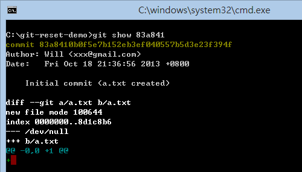
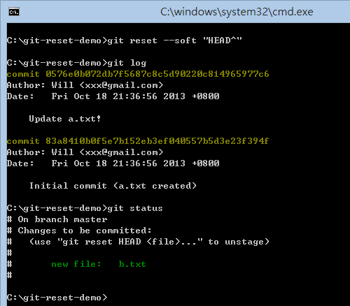
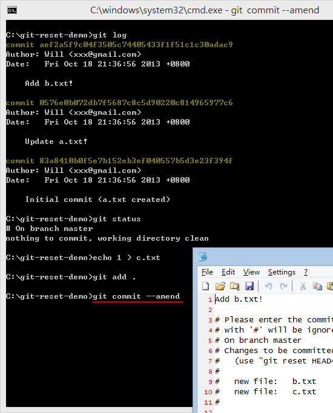

第 18 天：修正 commit 過的版本歷史紀錄 Part 1
=============================================================

當你使用 Git 進行版本控管時，我們會利用 `git commit` 建立許多版本，由於 Git 屬分散式版本控管機制，對於版本控管方面沒有太多的權限設計，跟其他如 Subversion 或 TFVC 這類版控系統相比，Git 提供更多「修正版本記錄」的機制，讓你在「分享」版本給其他人的時候，能夠預先做個整理。

版本控管的基本原則
-------------------

我們在進行版本控管時，無論是 Git, Subversion 或 TFVC 都一樣，維持一個良好的版本紀錄有助於我們追蹤每個版本的更新歷程 (當有需要做這件事的時候)。以我個人的經驗，我們很難有機會，也不太想去追蹤我們某個專案中軟體開發的進程，我們許多專案累積的版本紀錄數量有多達數千筆，誰會有這種閒工夫去追查歷史呢？

然而實務上，當軟體的臭蟲(Bug)發生的時候，我們會需要去追蹤特定臭蟲的歷史紀錄，以查出該臭蟲真正發生的原因，這個時候就是版本控管帶來最大價值的時候。

也因此，要怎樣維持一個好的「版本紀錄」也是非常重要的，這邊有一些控管原則可以分享給大家：

* 做一個小功能修改就建立版本，這樣才容易追蹤變更
* 千萬不要累積一大堆修改後才建立一個「大版本」
* 有邏輯、有順序的修正功能，確保相關的版本修正可以按順序提交(commit)，這樣才便於追蹤

不過，人非聖賢、孰能無過，哪個人能確保團隊所有人都能時時刻刻照著上述原則進行版控？哪個人不是「想到哪改到哪」呢？這樣的要求變得有點緣木求魚、不切實際。所以，我們需要有一套「修改版本」的機制，讓版本提交到遠端伺服器上的時候，就已經是完美的版本狀態。

修正 commit 歷史紀錄的理由
---------------------------

到目前為止，我還沒提到關於「遠端儲存庫」的細節，所以大部分的 Git 操作都還專注在本地端，也就是在工作目錄下的版本管控，這個儲存庫就位於你的 `.git/` 目錄下。然而，之後我們即將提到「遠端儲存庫」的應用，到時就不只一個人擁有儲存庫，所需要注意的細節也就更多。

完全開放每個人都能夠任意的修正 commit 歷史紀錄，這個概念對於熟悉 Subversion 或 TFVC 的人來說或許聽起來非常很奇怪，因為以往大家都集中連接到版本控管的伺服器上，用的是集中式的儲存庫，如果有人可以任意竄改歷史紀錄，那版控還叫做版控嗎？

其實在 Git 版本控管中，概念是一樣的，只要同一份儲存庫有多人共用的情況下，若有人任意竄改版本，那麼 Git 版本控管一樣會無法正常運作。

所以，到底甚麼樣的使用情境會需要去修改版本紀錄呢？以下幾點各位可以參考看看。

假設我們現在有 [A] -> [B] -> [C] 三個版本：

* 可能 [C] 版本你發現 commit 錯了，必須刪除這一版本所有變更
* 你可能 commit 了之後才發現 [C] 這個版本其實只有測試程式碼，你也想刪除他
* 其中有些版本的紀錄訊息有錯字，你想修改訊息文字，但不影響檔案的變更歷程
* 你可能想把這些版本的 commit 順序調整為 [A] -> [C] -> [B]，讓版本演進更有邏輯性
* 你發現 [B] 這個版本忘了加入一個重要的檔案就 commit 了，你想事後補救這次變更
* 在你打算｢分享」分支出去時，發現了程式碼有瑕疵，你可以修改完後再分享出去

修正 commit 歷史紀錄的注意事項
-----------------------------

Git 保留了「修改版本歷史紀錄」的機制，主要是希望你能在「自我控管版本」到了一定程度後，自己整理一下版本紀錄的各種資訊，好讓你將版本「發布」出去後，讓其他人能夠更清楚的理解你對這些版本到底做了哪些修改。

所以，修改版本歷史紀錄時，有些事情必須特別注意：

* 一個儲存庫可以有許多分支 (預設分支名稱為 `master`)
* 分享 Git 原始碼的最小單位是以「分支」為單位
* 你可以任意修改某個支線上的版本，只要你還沒「分享」給其他人
* **當你「分享」特定分支給其他人之後，這些「已分享」的版本歷史紀錄就別再改了！**

準備本日練習用的版本庫
----------------------

之前我們曾在【第 04 天：常用的 Git 版本控管指令】學過 `git reset` 的用法，主要用來 **重置目前的工作目錄**。不過，相同的指令，也可以用來修正版本歷史紀錄。

在開始說明前，我們一樣先用以下指令建立一個練習用的工作目錄與本地儲存庫：
	
	mkdir git-reset-demo
	cd git-reset-demo
	git init
	
	echo. > a.txt
	git add .
	git commit -m "Initial commit (a.txt created)"
	
	echo 1 > a.txt
	git add .
	git commit -m "Update a.txt!"
	
	echo 1 > b.txt
	git add .
	git commit -m "Add b.txt!"

以上建立了三個版本，執行 `git log` 的結果如下圖示：

刪除最近一次的版本
-------------------

我們參考上圖，用文字表達這三個版本的順序如下：

	[83a841] > [0576e0] > [aef2a5] 

現在，我想把最後一個版本刪除，變成：

	[83a841] > [0576e0]

那麼，你可以執行 `git reset --hard "HEAD^"` 即可刪除 `HEAD` 這個版本：
**請注意**：在「命令提示字元下」 `^` 是特殊符號，所以必須用雙引號括起來！

此時你可以看見，原本的最新版被刪除了，那是因為剛剛我們執行 `git reset --hard "HEAD^"` 這個動作，把 `HEAD` 指向的位址改到了前一個版本 ( `HEAD^` )，所以你打 `git log` 就看不到這個版本了。

事實上，原本你感覺被刪除的版本，其實一直儲存在 Git 的物件儲存區(object storage)裡，也就是這筆資料一直躺在 `.git\objects\` 目錄下。我們還是可以用 `git show 83a841` 取得該版本 ( 即 commit 物件 ) 的詳細資料：

刪除最近一次的版本，但保留最後一次的變更
------------------------------------

還記得嗎？無論你對 Git 儲存庫做了什麼事，都是可以還原的，只要執行 `git reset --hard ORIG_HEAD` 即可。

另一個刪除版本的技巧，則是「刪除最近一次的版本紀錄，但留下最後一次版本變更的異動內容」，這時你可以執行 `git reset --soft "HEAD^"` 達成這個任務：

這代表著，你可以保留最後一次的變更，再加上一些變更後，重新執行 `git commit` 一次，並重新設定一個新的紀錄訊息。

重新提交一次最後一個版本 (即 `HEAD` 版本)
-----------------------------------------

如果你發現不小心執行了 `git commit` 動作，但還有些檔案忘了加進去 (`git add [filepath]`) 或只是紀錄訊息寫錯，想重新補上的話，直接執行 `git commit --amend` 即可。這個動作，會把目前紀錄在索引中的變更檔案，全部添加到當前最新版之中，並且要求你修改原本的紀錄訊息。

我們再執行一次 `git reset --hard ORIG_HEAD` 復原到原本的狀態。

底下我試著多新增一個 `c.txt` 檔案上去，然後直接執行 `git commit --amend` 命令，這時會跳出指定的文字編輯器進行編輯，且預設會把目前這次的訊息也給填上，你只要修改一下就可以了

我把紀錄訊息修改成以下文字，並且存檔後退出，版本就會建立完成：
	
	Add b.txt!
	Add c.txt!

執行的結果如下，但最值得注意的是，最新版的 `HEAD` 已經是完全不同的 commit 物件了，所以用 `git log` 所看到的 commit 物件絕對名稱跟之前已經不一樣了。

今日小結
-------

今天簡單的學到如何對【最新版】(`HEAD`)進行版本的變更，大多用在不小心 `git commit` 錯的情況，事實上還會有更多調整版本歷史紀錄的方式，這些會在之後的文章中出現。

我重新整理一下本日學到的 Git 指令與參數：

* git reset --hard "HEAD^"
* git reset --soft "HEAD^"
* git reset --hard ORIG_HEAD
* git commit --amend 

參考連結
-------

* [git-reset(1) Manual Page](https://www.kernel.org/pub/software/scm/git/docs/git-reset.html)

-------
* [HOME](../README.md)
* [回目錄](README.md)
* [前一天：關於合併的基本觀念與使用方式](17.md)
* [下一天：設定 .gitignore 忽略清單](19.md)

-------

