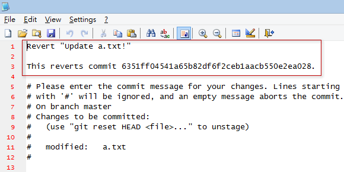
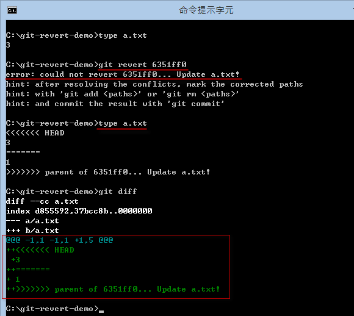
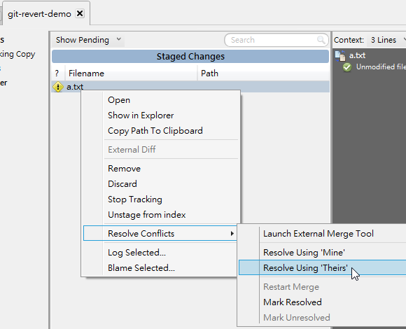
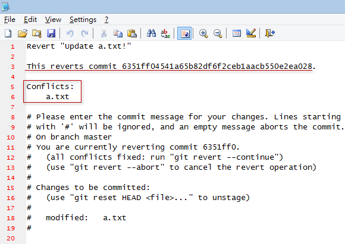

第 20 天：修正 commit 過的版本歷史紀錄 Part 2
=============================================================

在版本控管過程中，還有個常見的狀況，那就是當執行了多個版本之後，才發現前面有幾個版本改錯了，例如你不小心把測試中的程式碼也給 commit 進去，導致目前這個版本發生了問題。這時你就必須了解本篇文章所說明的內容。

準備本日練習用的版本庫
----------------------

在開始說明前，我們一樣先用以下指令建立一個練習用的工作目錄與本地儲存庫。我們先建立一個 `a.txt` 的檔案，內容為 `1`。然後修正一版，內容改為 `2`。接著在新增一個 `b.txt` 檔案，內容為 `1`。所以一共有三個版本：
	
	mkdir git-revert-demo
	cd git-revert-demo
	git init
	
	echo 1 > a.txt
	git add .
	git commit -m "Initial commit (a.txt created)"
	
	echo 2 > a.txt
	git add .
	git commit -m "Update a.txt!"
	
	echo 1 > b.txt
	git add .
	git commit -m "Add b.txt!"

假設我們這個時候發現，在我們上一個版本 ( `HEAD~` 或 `HEAD^` 或 `6351ff0` ) 被改錯了，你希望可以將**該版本**還原就好，而不是把版本重置到第一版再重改一次，那麼你可以試試 `git revert` 指令，他可以把某個版本的變更，透過「相反」的步驟把變更給還原。

何謂「相反」的步驟呢？我們立刻來試試這個指令的用法。

使用 `git revert` 命令
-----------------------

假設我們從 `git log` 顯示的歷史記錄中，發現有個版本有問題，那麼我們可以先看看這個版本的變更紀錄。如下圖示，你可以先用 `git log` 查出版本編號，然後再用 `git show [commit_id]` 查出該版本的相關資訊。

**請注意**：執行 `git revert` 命令之前，請先確保工作目錄是乾淨的！如果有改到一半的檔案，建議可透過 `git stash` 建立暫存版本。

從上圖你可以看到 `6351ff0` 這個版本的 `a.txt` 檔案，是將第 1 行的內容從 `1` 修改成 `2` 的，那也代表著「相反」的步驟則是把 `2` 改成 `1` 才對。這時，如果我想把這個版本的變更給「還原」，則可以輸入 `git revert 6351ff0` 這個指令，執行成功後會額外再建立一個新版本。如下圖示：

執行過程中會讓你編輯最後要 commit 的訊息，預設會加上 `Revert` 字樣，還有會在第三行的地方加上 `This reverts commit xxxx` 告訴你說這個版本主要目的是從 `xxxx` 版本還原的。

從最新版的變更中，你也可以看出，這次版本主要是將 `a.txt` 內容第 1 行的 `2` 改為 `1` 的，剛好跟原本的變更「相反」。

使用 `git revert` 命令失敗的情況
--------------------------------

事實上，這個 `git revert` 是執行了「合併」的動作，我們來證明這個過程。我們在還原了 `6351ff0` 這個版本後，這個 `a.txt` 的內容變成了 `1`，然而我再修改一次 `a.txt` 檔案，這次把內容修改為 `3`，如下圖示：

這時如果我們再重新執行一次 `git revert 6351ff0` 這個指令，試圖再還原一次，你會看到的是「合併」失敗時才會有的衝突情形：

發生本次衝突的原因就在於，我們想還原的 `6351ff0` 這個版本，這次的變更原本是 `1` 改成 `2`，由於我們想還原內容，則是把 `2` 改為 `1`，但我們現在的內容卻是 `3` 而不是 `2`，因而發生了衝突狀況。

所以這種「合併衝突」的狀況，跟我們之前在【第 17 天：關於合併的基本觀念與使用方式】如出一轍，解決的方法也是一樣，你可以選擇：

1. 手動編輯 `a.txt` 檔案，把合併衝突的標示給移除，編輯出一個你覺得正確的內容。
2. 使用 SourceTree 工具，自行選出一個你想要的版本。

如果你選擇 'Theirs' (他的) 版本，就代表你想要接受 `6351ff0` 的版本：

解決衝突後，你可以看到我們的 `a.txt` 內容已經變回了 `1`，並執行 `git commit` 提交這次版本變更：

一樣在執行 `git commit` 的過程中，會跳出讓你編輯 commit 訊息的視窗，這裡的預設內容也會標示那些檔案發生了衝突：

我們重看一次 `git log` 的內容與最近一次的變更內容，你就可以看出完整的版本變更資訊：

使用 `git revert` 命令套用變更，但不執行 commit 動作
---------------------------------------------------

使用 `git revert` 時，預設若執行成功，會直接建立一個 commit 版本，如果你希望在執行 `git revert` 之後先保留變更的內容，也許再添加一些檔案或修改一些內容，然後再自行簽入的話，可以使用以下步驟。

假設這次我們想還原 `955ca89` 這個版本，這個版本其實是新增一個 `b.txt` 檔案而已，如果我們用 `git show 955ca89` 顯示其變更狀況，你可以看到有一行 `--- /dev/null` 其實就是代表 `955ca89` 這一版之前並沒有這個檔案，代表這個檔案是在這一版本才新增進來的，而且內容為 `1`。這也代表著，如果要成功「還原」(revert) 這版，目前的 `b.txt` 內容必須為 `1`，然後才會成功執行「刪除」的動作。

現在我們輸入 `git revert -n` 執行完後，沒有提示任何文字，但事實上 `b.txt` 這個檔案已經成功被刪除了，我們執行 `git status` 就可以看出結果： 

這個時候，索引狀態已經被更新，但你還是可以繼續修改這個版本，直到你想完成本次動作。從上圖你可以看到你有兩個執行的選項，分別是：

1. `git revert --continue` 代表你已經完成所有操作，並且建立一個新版本，就跟執行 `git commit` 一樣。
2. `git revert --abort` 代表你準備放棄這次復原的動作，執行這個命令會讓所有變更狀態還原，也就是刪除的檔案又會被加回來。 

**請注意**：當 `git revert -n` 執行完後，並不是用 `git commit` 建立版本喔！

今日小結
-------

今天介紹的「還原」版本的機制，其實是透過「新增一個版本」的方式把變更的內容改回來，而且透過這種方式，你可以透過版本歷史紀錄中明確找出你到底是針對哪幾個版本進行還原的。另外就是這個「還原」的過程，其實跟「合併」的過程非常類似，發生衝突時的解決方法也都如出一轍。

我重新整理一下本日學到的 Git 指令與參數：

* git show [commit_id]
* git revert [commit_id]
* git revert [commit_id] -n

另外還有些參數沒介紹到，建議可用 `git help revert` 查詢完整用法：

* git revert [commit_id] -s	(在訊息內容加上目前使用者的簽署名稱)
* git revert [commit_id] -e (在完成版本之前顯示編輯訊息的視窗) 

-------
* [HOME](../README.md)
* [回目錄](README.md)
* [前一天：設定 .gitignore 忽略清單](19.md)
* <a href="21.md">下一天：修正 commit 過的版本歷史紀錄 Part 3 (cherry-pick)</a>

-------

