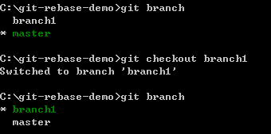
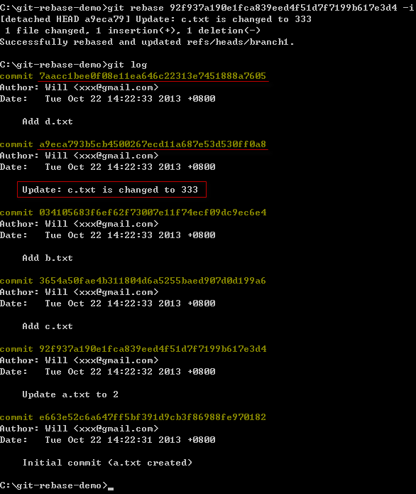

第 23 天：修正 commit 過的版本歷史紀錄 Part 5
============================================================

我們上一篇文章談到的 Rebase 是用來將現有的兩個分支進行「重新指定基礎版本」，執行 Rebase 之後，也會改掉原本分支的起點 (分支點移動了)，所以導致版本線圖發生變化。不過 Rebase 可以做到的能力不只這樣，他還能用來修改特定分支線上任何一個版本的版本資訊。

準備本日練習用的版本庫
-------------------------

我們一樣先用以下指令建立一個練習用的工作目錄與本地儲存庫 (一樣先切換到 `C:\` 然後複製貼上就會自動建立完成)：
		
	mkdir git-rebase-demo
	
	cd git-rebase-demo
	git init
	
	echo 1 > a.txt
	git add .
	git commit -m "Initial commit (a.txt created)"
	
	ping 127.0.0.1 -n 2 >nul
	
	echo 2 > a.txt
	git add .
	git commit -m "Update a.txt to 2"
	
	ping 127.0.0.1 -n 2 >nul
	
	:: 建立並切換到 branch1 分支
	git checkout -b branch1
	
	echo b > b.txt
	git add .
	git commit -m "Add b.txt"
	
	echo c > c.txt
	git add .
	git commit -m "Add c.txt"
	
	echo 333 > c.txt
	git add .
	git commit -m "Update c.txt to 333"
	
	echo d > d.txt
	git add .
	git commit -m "Add d.txt"
	
	ping 127.0.0.1 -n 2 >nul
	
	:: 切換到 master 分支
	git checkout master
	
	echo 3 > a.txt
	git add .
	git commit -m "Update a.txt to 3"

**註**：上述指令中的 `ping  127.0.0.1 -n 2 >nul` 主要是用到了 [如何在批次檔(Batch)中實現 sleep 命令讓任務暫停執行 n 秒](http://blog.miniasp.com/post/2009/06/24/Sleep-command-in-Batch.aspx) 文章中提到的技巧。

我們用 SourceTree 查看儲存庫的 commit graph (版本線圖) 如下：

使用 `git rebase` 命令的注意事項
---------------------------------

這件事還是必須重申一次！首先，你的「工作目錄」必須是乾淨，工作目錄下的「索引」不能有任何準備要 commit 的檔案 (staged files) 在裡面，否則指令將會無法執行。

再來，也是最重要的，如果你的分支是從遠端儲存庫下載回來的，請**千萬不要**透過 Rebase 修改版本歷史紀錄，否則你將會無法將修改過後的版本送到遠端儲存庫！

Rebase 能做的事
-----------------

上一篇文章講的，你可以將某個分支當成自己目前分支的「基礎版本」。除了這件事以外，你還可以用來修改某個分支中「特定一段」歷程的紀錄，你可以做的事情包括：

1. 調換 commit 的順序
2. 修改 commit 的訊息
3. 插入一個 commit
4. 編輯一個 commit
5. 拆解一個 commit
6. 壓縮一個 commit，且保留訊息紀錄
7. 壓縮一個 commit，但丟棄版本紀錄
8. 刪除一個 commit

這八件事，可以完整看出 Rebase 修正歷史版本紀錄的強大威力，接下來我們就逐一介紹如何好好利用 Rebase 幫我們修訂版本。

1. 調換 commit 的順序
-----------------------

首先，我們先切換到 `branch1` 分支 ( `git checkout branch1` )

到 SourceTree 查看版本線圖，然後我們先決定這個分支中想要執行 Rebase 的起點 (不一定要是分支的起始點，任何一版都可以)，決定之後，直接在 SourceTree 複製該版本的**絕對名稱**(也就是以 SHA1 雜湊過的 Git 物件ID)。從下圖你可以看到，我們先在該版本按下滑鼠右鍵，然後再點選 **Copy SHA to Clipboard** 即可將 id 複製到剪貼簿中：

然後我們執行 `git rebase 92f937a190e1fca839eed4f51d7f7199b617e3d4 -i`
**注意**: 這裡的 `92f937a190e1fca839eed4f51d7f7199b617e3d4` 跟你自己建立的可能不一樣，請不要照抄。

接著會跳出編輯器，並且讓你編輯一系列「指令」，如下圖示：

你如果什麼都不改，就是執行這一系列 `pick` 等動作，這裡必須先讓各位瞭解的是這些指令的格式，與他的順利代表的意義。

我們先來看第一行，區分成三個欄位，分別以「空白字元」間隔，分別如下：

1. `pick` 代表的是「命令」，底下註解的部分有一系列「命令」的名稱與簡寫，你寫 `p` 與 `pick` 都是一樣的意思。
2. `d86532d` 代表的是要使用的 commit 物件編號(絕對名稱)。
3. 剩下的文字則是這個版本的紀錄訊息摘要。

如果你有看過【**第 22 天：修正 commit 過的版本歷史紀錄 Part 4**】這篇文章，你應該會知道執行 Rebase 的時候，會先將我們目前 `branch1` 分支的最新版本(head)倒帶(rewind)到你這次指定的分支起點(rewinding head)，在這個例子裡，我們指定的分支起點就是 `92f937a190e1fca839eed4f51d7f7199b617e3d4` 這個節點。

這時我們用 `git log` 查看一下目前的版本紀錄，我們指定的那個版本，並不在我們的 Rebase 指令清單中。該指令清單，由上至下分別是「最舊版」到「最新版」的順序，跟我們用 `git log` 執行的顯示順序剛好相反：

	
我們再重看一次這幾個版本如下：

	pick d86532d Add b.txt
	pick 22e1885 Add c.txt
	pick bf40b2c Update c.txt to 333
	pick 5027152 Add d.txt

這裡的 `pick` 代表的功能是 `use commit`，也就是我們要用這個版本來 commit 新版本。也就是上一篇文章講到的**重新套用**(replay)這個字，所以這幾個指令，就是讓你在分支「倒帶」之後，重新用這幾個版本套用一次版本變更，而且重新套用的過程會沿用當時版本的變更紀錄。

現在我們先來嘗試「**調換 commit 的順序**」這個命令。

若要完成「**調換 commit 的順序**」的任務，你只要很簡單的修改這份文字檔，把版本的前後順序對調即可，例如我們修改成：

	pick 22e1885 Add c.txt
	pick d86532d Add b.txt
	pick bf40b2c Update c.txt to 333
	pick 5027152 Add d.txt

然後存檔退出，我們看看指令最後的執行結果為何，你可以發現，我們這兩個版本真的順序對調了：

這裡有一點你必須特別注意，那就是從 `92f937a190e1fca839eed4f51d7f7199b617e3d4` 這個版本開始，所有後續版本的 commit 絕對名稱全部都不一樣了，這代表我們在 Rebase 的過程會重新建立許多新的 commit 物件。那麼舊的物件到哪裡去了呢？真相是，這些以前的版本全部都還在，只是你找不到罷了，全都躺在 Git 物件儲存庫中，只要你知道這些版本(也就是 commit 物件)的絕對名稱，你就可以隨時取出！(請回憶一下 `git reflog` 命令)

我們從 SourceTree 裡面看一下版本線圖，感覺上跟上面那張圖好像差很多，但其實只有這兩個版本調換而已，線圖不太一樣的原因是時間序改變了，我想這應該是 SourceTree 的顯示邏輯跟時間序有關，才會讓這線圖變得跟之前差這麼多，初學者可別弄亂了。

2. 修改 commit 的訊息
-----------------------

修改曾經 commit 過的訊息，只要稍加修改 Rebase 的命令即可，我們先看看目前的版本紀錄：

如果我們打算把下圖標示紅線的版本訊息修改為 `Update: c.txt is changed to 333` 文字的話，我們先執行跟上個例子相同的指令：

	git rebase 92f937a190e1fca839eed4f51d7f7199b617e3d4 -i

然後會開啟文字編輯器，此時的內容應該如下：

	pick 3654a50 Add c.txt
	pick 0341056 Add b.txt
	pick 6883d87 Update c.txt to 333
	pick 36ed38f Add d.txt

我們想修改 `6883d87` 這個版本的訊息，只要把這一行前面的 `pick` 改成 `reword` 即可。修改完後的文字如下：

	pick 3654a50 Add c.txt
	pick 0341056 Add b.txt
	reword 6883d87 Update c.txt to 333
	pick 36ed38f Add d.txt

然後存檔退出，接著 Git 會開始重新 `pick` 這些版本進行套用，但套用到 `reword` 這個命令時，會重新再開啟一次文字編輯器，讓你可以在此時變更版本訊息文字，這時我們直接改成 `Update: c.txt is changed to 333` 文字後存檔退出，接著就會直接套用完後續的版本。

我們最後再用 `git log` 查看版本紀錄，發現該版本的訊息確實已經變更為我們修改的那段文字。而且該版本與後續的版本 commit 物件編號也會不一樣，不一樣代表這兩個是新的 commit 物件。

3. 插入一個 commit
-----------------------

接著我們再執行一次 `git rebase 92f937a190e1fca839eed4f51d7f7199b617e3d4 -i` 指令，目前的 Rebase 指令如下：
	
	pick 3654a50 Add c.txt
	pick 0341056 Add b.txt
	pick a9eca79 Update: c.txt is changed to 333
	pick 7aacc1b Add d.txt

如果我們想在 `a9eca79` 版本之後「插入一個新版本」，只要在  `a9eca79` 這行前面的 `pick` 改成 `edit` 即可讓 Rebase 在重新套用的過程中「暫停」在這個版本，然後讓你可以對這個版本進行「編輯」動作：

	pick 3654a50 Add c.txt
	pick 0341056 Add b.txt
	edit a9eca79 Update: c.txt is changed to 333
	pick 7aacc1b Add d.txt

然後存檔退出，接著 Git 會開始執行套用，等執行到 `a9eca79` 這個版本時，套用的動作會被中斷，並提示你可以執行 `git commit --amend` 重新執行一次 commit 動作：

因為我們的目的是希望在 `a9eca79` 這個版本之後「插入」一個新版本，所以我們可以直接在這個階段「建立新版本」！

例如我想新增一個版本是「新增一個 `z.txt` 檔案」，我可以這麼做：

我們執行 `git rebase --continue` 讓 Rebase 指令繼續完成。最終完成的畫面如下圖示：

最後我們用 `git log` 查看一下，確實我們剛剛建立的 `Add z.txt` 這個版本已經成功被建立！

4. 編輯一個 commit
-----------------------

編輯一個 commit 的動作，就如【插入一個 commit】的示範一樣，你只要先把該版本修正為 `edit` 命令，就可以利用 `git commit --amend` 重新執行一次 commit 動作，就等同於編輯了某個版本的紀錄。

5. 拆解一個 commit
-----------------------

拆解一個 commit 紀錄，代表的是你想要把「某一個 commit 紀錄」變成兩筆紀錄，其實這個動作跟【插入一個 commit】幾乎是完全一樣的。差別僅在於你只要把編輯中的那個版本，將某些檔案從「索引」狀態中移除，然後執行 `git commit --amend` 就可以建立一個新版。然後再執行 `git add .` 重新把這些檔案加入，然後再執行 `git commit`，即可將原本一個版本的變更，變成兩個版本。

6. 壓縮一個 commit，且合併訊息紀錄
----------------------------------

所謂的「壓縮一個 commit 版本」，代表你這幾個版本中，有個版本訊息有點多餘，而且覺得可以把這個版本的變更合併到「上一個版本」(parent commit)中，那麼你可以修改 Rebase 指令，把 `pick` 修改為 `squash` 即可。

透過壓縮的方式，被套用 `squash` 命令的版本，其「版本紀錄訊息」會被自動加入到「上一個版本」的訊息中。

7. 壓縮一個 commit，但丟棄版本紀錄
----------------------------------

如果你只想合併兩個版本的變更，但不需要合併紀錄訊息的話，那麼你可以修改 Rebase 指令，把 `pick` 修改為 `fixup` 即可。

8. 刪除一個 commit
-----------------------

刪除一個 commit 版本是最簡單的，只要直接把要刪除的這幾行 `pick` 命令給移除即可。

今日小結
-------

看到這裡，你應該能感受到 Rebase 的強大威力。透過 `git rebase` 可以有效幫你「重整版本」，不但讓你的 Git 版本記錄更加易懂，也更有邏輯。這樣做的好處，在多人開發的 Git 專案中尤其明顯，為了你的團隊成員著想，各位不得不學啊！

我重新整理一下本日學到的 Git 指令與參數：

* git rebase -i [commit_id]
* git commit --amend

-------
* [HOME](../README.md)
* [回目錄](README.md)
* <a href="22.md">前一天：修正 commit 過的版本歷史紀錄 Part 4 (rebase)</a>
* [下一天：使用 GitHub 遠端儲存庫 - 入門篇](24.md)

-------

