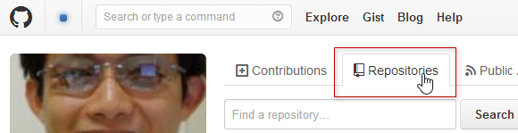
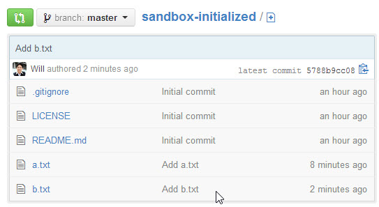
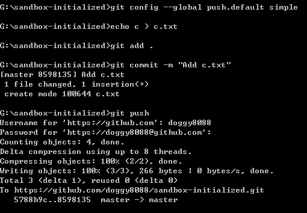
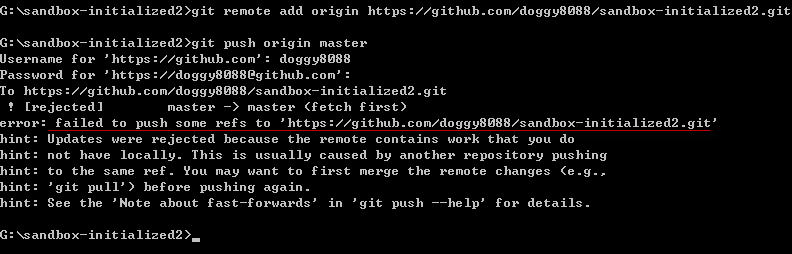

第 24 天：使用 GitHub 遠端儲存庫 - 入門篇
========================================================

GitHub 是目前全世界最多人採用的 Git 線上管理平台，他包含了完整的 Git 遠端儲存庫實作，還有完整的議題追蹤機制與報表，更有成千上萬的開源碼專案都在 GitHub 進行 Git 版本控管。即便在我們公司，也有許多專案採用 GitHub 當成我們主要的 Git 平台。本篇文章主要帶大家上手 GitHub 最基本的使用方式。

我們先來說明在 GitHub 建立專案的兩種不同的方式。

在 GitHub 建立一個「**沒有版本**」的空白 Git 儲存庫
----------------------------------------------------

先登入 GitHub，再進入 GitHub 首頁： [https://github.com](https://github.com)

點選右上角你的使用者名稱進入個人首頁：

切換到 **Repositories** 頁籤：

再點選右邊綠色的 **New** 按鈕，以建立一個你自己的 GitHub 專案 (包含 Git 遠端儲存庫)：

如果你要建立一個「**沒有版本**」的空白 Git 儲存庫，最重要的就是最下方的 **Initialize this repository with a README** 不要勾選，還有 **Add .gitignore** 與 **Add a licenes** 都保留預設的 **None** 選項：

最後按下 **Create repository** 即可建立完成，當你建立起一個「**沒有版本**」的空白 Git 儲存庫之後，畫面最下方也提到了幾個讓你上傳本地 Git 儲存庫的指令教學，照著打就可以把本地儲存庫的變更上傳到 GitHub 的遠端儲存庫中。

在 GitHub 建立一個「**有初始化版本**」的 Git 儲存庫
----------------------------------------------------

建立一個「**有初始化版本**」的空白 Git 儲存庫，其實就是在 GitHub 建立專案時，勾選了一些初始化的檔案，在建立的過程 GitHub 會依據你所挑選的選項，先幫你建立好一個初始化的 Git 版本：

建立完成後，在 GitHub 上顯示的內容會不太一樣，因為你已經有一個 commit 版本在上面了：

將本地儲存庫的變更上傳到遠端儲存庫的方法
--------------------------------------

我有在【第 03 天：建立儲存庫】這篇文章中提到如何取得從 GitHub 建立的遠端儲存庫 (remote repository)，不過若要將本地變更送上 GitHub 則有好幾種不同的方式，其中包括：

1. 在 GitHub 建立一個「**沒有版本**」的空白 Git 儲存庫，然後透過 `git clone` 取得遠端儲存庫，再建立版本後上傳
2. 在 GitHub 建立一個「**沒有版本**」的空白 Git 儲存庫，然後直接將現有的本地 Git 儲存庫上傳到指定的 GitHub 專案
2. 在 GitHub 建立一個「**有初始化版本**」的 Git 儲存庫，然後透過 `git clone` 取得遠端儲存庫，再建立版本後上傳
3. 在 GitHub 建立一個「**有初始化版本**」的 Git 儲存庫，然後直接將現有的本地 Git 儲存庫上傳到指定的 GitHub 專案

以上就是我們首次使用 GitHub 時，最常見的四種上傳方式。嚴格說起來，上述四種上傳方式，應該只有兩種而已，也就是：

1. 透過 `git clone` 取得遠端儲存庫，再建立版本後上傳
2. 直接將現有的本地 Git 儲存庫上傳到指定的 GitHub 專案

為什麼我想拆成四個來講呢？主要有兩個原因：

1. 【透過 `git clone` 取得遠端儲存庫，再建立版本後上傳】的這種方式，因為「**沒有版本**」的空白 Git 儲存庫，連預設的 `master` 分支都沒有，所以用預設的指令無法上傳到遠端儲存庫。所以在指令操作上會有兩種用法。
2. 【直接將現有的本地 Git 儲存庫上傳到指定的 GitHub 專案】的這種方式，因為通常一個 Git 儲存庫只會有一個「初始 commit 物件」，如果你在本地儲存庫已經建立了幾個版本，代表在你的本地儲存庫中已經有了自己的「初始 commit 物件」，這將會與 GitHub 建立的「**有初始化版本**」的 Git 儲存庫相互衝突，所以上傳的指令也會有些不同。

以下我們先來說明【**透過 `git clone` 取得遠端儲存庫，再建立版本後上傳**】這個方法。

透過 `git clone` 取得遠端儲存庫，再建立版本後上傳
------------------------------------------------

這個方法最簡單，因為你還沒有本地儲存庫的存在，甚至連工作目錄都還沒有，所以我們直接利用 `git clone` 即可把專案下載。然而，在使用 GitHub 的時候，最簡單的方法就是利用 GitHub for Windows 工具。你只要點擊 **Clone in Desktop** 按鈕，即可自動啟動 GitHub for Windows 工具幫你下載 Git 專案：

* 「**沒有版本**」的空白 Git 儲存庫

	

* 「**有初始化版本**」的 Git 儲存庫

	

你也可以直接複製 GitHub 提供的 URL 網址，然後利用 `git clone` 指令下載，例如：

如果你用 `git clone https://github.com/doggy8088/sandbox-empty.git` 複製一個 「**沒有版本**」的空白 Git 儲存庫，將會得到一個 **warning: You appear to have cloned an empty repository.** 警告訊息，不過這不影響你上傳本地的變更。

如果你用 `git clone https://github.com/doggy8088/sandbox-initialized.git` 複製一個 「**有初始化版本**」的 Git 儲存庫，將會直接從 GitHub 下載擁有完整變更歷史的「遠端儲存庫」，所以你會看到有下載物件數量、壓縮、解壓縮等資訊。

我們以 `sandbox-empty` 這個專案為例，由於這是一個 「**沒有版本**」的空白 Git 儲存庫，在 GitHub 上的遠端儲存庫是完全空的，連預設的 `master` 分支都沒有，所以在下達 `git push` 指令時必須加上 `-u` 參數，才能成功地把本地儲存庫上傳到 GitHub 上的遠端儲存庫，其指令是 `git push -u origin master`

我們再以 `sandbox-initialized` 這個專案為例，由於這是一個  「**有初始化版本**」的 Git 儲存庫，在 GitHub 上的遠端儲存庫已經有一個版本，同時也建立好預設的 `master` 分支，所以在下達 `git push` 指令時可以不用加上 `-u` 參數，就成功地把本地儲存庫上傳到 GitHub 上的遠端儲存庫，其指令是 `git push origin master`

當你第二次建立版本時，直接執行 `git push` 就會自動上傳成功：

不過，當你執行簡單版本的 `git push` 會出現一段提示，告訴你要設定 `push.default` 這個選項，因為這種簡寫的 `git push` 方法，Git 的預設行為將會在 Git 2.0 之後發生改變，建議你透過設定  `push.default` 選項的方式明確指定 push 的方法。詳細說明請參見 `git help config` 的說明文件，搜尋 `push.default` 即可找到相關說明。我建議各位設定成 `simple`，以利跟日後的 Git 指令列工具的預設值相同，指令如下：

	git config --global push.default simple

設定好之後，下次執行 `git push` 就不會再出現提示訊息了：

之後的操作，在我們這兩個練習用的工作目錄都完全一樣。

直接將現有的本地 Git 儲存庫上傳到指定的 GitHub 專案
------------------------------------------------

接下來我們再來說明【**直接將現有的本地 Git 儲存庫上傳到指定的 GitHub 專案**】這個方法。但由於練習用的 GitHub 專案已經被上傳一些物件，所以請各位重新再建立兩個新專案，分別是一個「**沒有版本**」的空白 Git 儲存庫，與另一個「**有初始化版本**」的 Git 儲存庫。

一個「**沒有版本**」的 Git 儲存庫，專案名稱：`sandbox-empty2`
一個「**有初始化版本**」的空白 Git 儲存庫，專案名稱：`sandbox-initialized2`

接著我們建立兩個本地儲存庫與工作目錄，指令如下：

	mkdir sandbox-empty2
	cd sandbox-empty2
	
	git init
	
	echo a > a.txt
	git add .
	git commit -m "Initial commit"
	
	cd ..
	mkdir sandbox-initialized2
	cd sandbox-initialized2
	
	git init
	
	echo a > a.txt
	git add .
	git commit -m "Initial commit"

我們先以 `sandbox-empty2` 專案為例，由於我們本地儲存庫跟 GitHub 上的遠端儲存庫完全沒有關聯，所以必須告訴 Git 遠端儲存庫在哪。這時我們可以輸入 `git remote add origin https://github.com/doggy8088/sandbox-empty2.git` 建立一個名為 `origin` 的參照名稱，並指向 `https://github.com/doggy8088/sandbox-empty2.git` 位址，也就是我們在 GitHub 上的遠端儲存庫位址。接著就跟我們先前講解的步驟一模一樣，如下圖示：

 
接著我們再以 `sandbox-initialized2` 專案為例，請記得複製到正確的 URL 位址：

然後輸入跟以上相同的指令 (記得改 URL 喔)：`git remote add origin https://github.com/doggy8088/sandbox-initialized2.git`

你可以發現，這次的 `git push` 動作被 GitHub 拒絕了！因為你不能把兩個完全無關的 Git 版本直接上傳到 GitHub 上的遠端儲存庫。

解決的方法很簡單，只要把遠端儲存庫的 `master` 分支，成功合併回我本地的分支，即可建立兩個不同版本庫之間的關聯，這樣你就可以把本地的 `master` 分支推送到 GitHub 上遠端儲存庫的 `master` 分支了。

將遠端儲存庫的 `master` 分支取回，並合併到本地儲存庫的 `master` 分支，有兩種方法：

1. 使用 `git pull origin master` 指令
2. 使用 `git fetch` 指令後再執行 `git merge origin/master` 合併動作 (這個方法會在後續的文章詳述)

先用 `git --version` 查看自己的版本，若你的 Git 版本是 `2.8.4` (包含)以前，你可以成功合併，

成功執行的過程如下圖示：

但是從 `Git 2.9.0` 開始，預設行為不允許合併沒有共同祖先的分支：

需要加上 `--allow-unrelated-histories` 允許 Git 合併沒有共同祖先的分支。

因此完整指令為 `git pull origin master --allow-unrelated-histories`：

今日小結
-------

本篇文章完整的介紹如何將本地儲存庫上傳到 GitHub 上的遠端儲存庫，雖然過程有點麻煩，但如果你透過 GitHub for Windows 操作的話，要上傳到 GitHub 只要簡單的按下 **sync** 按鈕，就可以自動上傳了，連帳號密碼都不用輸入，這樣是不是簡單很多。 (^_^)

我重新整理一下本日學到的 Git 指令與參數：

* git push origin master
* git push -u origin master
* git pull origin master
* git config --global push.default simple
* git push
* git fetch
* git merge origin/master
* git --version
* git pull origin master --allow-unrelated-histories

-------
* [HOME](../README.md)
* [回目錄](README.md)
* <a href="23.md">前一天：修正 commit 過的版本歷史紀錄 Part 5 (rebase 2)</a>
* [下一天：使用 GitHub 遠端儲存庫 - 觀念篇](25.md)

-------

