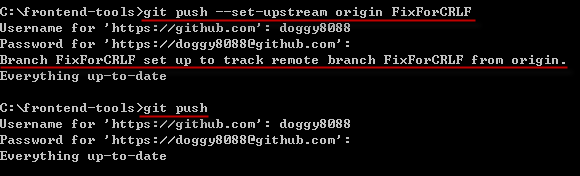

第 25 天：使用 GitHub 遠端儲存庫 - 觀念篇
========================================================

上一篇大家學會了如何下載遠端儲存庫 (`git clone`, `git pull`) 與上傳遠端儲存庫 (`git push`)，本篇文章來教大家認識遠端儲存庫的其他細節。

與遠端儲存庫有關的指令
---------------------

* `git clone`

	將**遠端儲存庫**複製到本地，並建立**工作目錄**與**本地儲存庫** (就是 `.git` 資料夾)

* `git pull`

	將遠端儲存庫的最新版下載回來，下載的內容包含完整的物件儲存庫(object storage)。並且將遠端分支合併到本地分支。 (將 `origin/master` 遠端分支合併到 `master` 本地分支)

	所以一個 `git pull` 動作，完全相等於以下兩段指令：

		git fetch
		git merge origin/master

* `git push`

	將本地儲存庫中目前分支的所有相關物件**推送**到遠端儲存庫中。

* `git fetch`

	將遠端儲存庫的最新版下載回來，下載的內容包含完整的物件儲存庫(object storage)。
	這個命令**不包含**「合併」分支的動作。

* `git ls-remote`

	顯示特定遠端儲存庫的參照名稱。包含**遠端分支**與**遠端標籤**。

關於追蹤分支的概念
------------------

我們先前學習過關於「分支」的概念，不過僅限於｢本地分支｣，今天我們多出了個「遠端分支」，事情就相對複雜一些。

基本上，當我們的版本控管流程加上了遠端儲存庫之後，原本的**分支**就可以被拆成四種不同的概念：

1. 遠端追蹤分支

	這個分支位於遠端，目的是用來追蹤分支的變化情形。通常遠端分支你是存取不到的。

2. 本地追蹤分支

	當你執行 `git clone` 複製一個遠端容器回來之後，所有遠端追蹤分支會被下載回來，並且相對應的建立起一個同名的 **本地追蹤分支**。

	我們以複製 jQuery 在 GitHub 上的專案為例，透過 `git clone https://github.com/jquery/jquery.git` 下載回來後，執行 `git branch -a` 指令，顯示出所有「本地分支」與「本地追蹤分支」。「本地追蹤分支」就是如下圖**紅字**的部分：

	

3. 本地分支

	在透過 `git branch` 指令執行時所顯示的分支，就是所謂的「本地分支」，這些分支存在於本地端，而這些分支又常被稱為 **主題分支** (Topic Branch) 或 **開發分支** (Development Branch)，就是因為這些分支預設不會被推送到遠端儲存庫，主要用來做開發用途。

4. 遠端分支

	顧名思義，遠端分支就是在遠端儲存庫中的分支，如此而已。如果你用 GitHub 的話，你是無法存取遠端分支的。

	雖然說「概念上」可以分為這四類，但其實這些分支就只是**參照名稱**而已，而這裡的「追蹤分支」主要就是用來跟遠端的分支做對應，你不應該直接在這些分支上建立版本 (雖然你還是可以這麼做，但強烈不建議亂搞)，而是把這些「本地追蹤分支」視為是一種｢唯讀｣的分支。

註冊遠端儲存庫
---------------

我們在上一篇有提過可以透過 `git remote` 指令手動加入一個「遠端儲存庫」，例如：

	git remote add origin https://github.com/doggy8088/sandbox-empty2.git

這個 `origin` 名稱是在 Git 版本控管中慣用的預設遠端分支的參照名稱，主要目的是用來代表一個遠端儲存庫的 URL 位址。

不過，事實上你可以在你的工作目錄中，建立多個遠端儲存庫的參照位址。例如我們以 `sandbox-empty2` 這個專案為例，我們先複製回來，然後透過 `git remote -v` 可列出目前註冊在工作目錄裡的遠端儲存庫資訊。如果我們額外將 jQuery 的遠端儲存庫也一併下載回來，則可以用以下指令先行註冊一個名稱起來。

	git remote add jquery https://github.com/jquery/jquery.git

最後再用 `git fetch` 指令把完整的 jQuery 遠端儲存庫一併下載回來，完整的執行過程如下圖示：

你可以看到，我們事實上可以在一個 Git 工作目錄中，加入許多相關或不相關的遠端儲存庫，這些複製回來的**完整儲存庫**，都包含了這些儲存庫中的所有物件與變更歷史，這些 Git 物件隨時都可以靈活運用。不過，通常我們註冊多個遠端儲存庫的機會並不多，除非你想抓特其他團隊成員的版本庫回來查看內容。

這些註冊進工作目錄的遠端儲存庫設定資訊，都儲存在 `.git\config` 設定檔中，其內容如下範例：

	[remote "origin"]
		url = https://github.com/doggy8088/sandbox-empty2.git
		fetch = +refs/heads/*:refs/remotes/origin/*
	[remote "jquery"]
		url = https://github.com/jquery/jquery.git
		fetch = +refs/heads/*:refs/remotes/jquery/*

這個 `[remote "origin"]` 區段的設定，包含了遠端儲存庫的代表名稱 `origin`，還有兩個重要的參數，分別是 `url` 與 `fetch` 這兩個，所代表的意思是：「遠端儲存庫 URL 位址在 `https://github.com/doggy8088/sandbox-empty2.git`，然後 `fetch` 所指定的則是一個**參照名稱對應規格**(refspec)。」

何謂參照名稱對應規格 (refspec)
-------------------------------

我們先來看一下 refspec 的格式：

	+refs/heads/*:refs/remotes/origin/*

這個格式概略區分成 4 塊：

* `+`

	設定 `+` 加號，代表傳輸資料時，不會特別使用安全性確認機制。

* `refs/heads/*`

	「來源參照規格」，代表一個位於**遠端儲存庫**的**遠端分支**，而 `*` 星號代表 `refs/heads/` 這個路徑下｢所有的遠端參照」。

* `:`

	這用來區隔｢來源分支｣與「目的分支」

* `refs/remotes/origin/*`

	「目的參照規格」，代表一個位於**本地儲存庫**的**本地追蹤分支**，而 `*` 星號代表工作目錄的 `refs/remotes/origin/` 這個路徑下｢所有的本地參照」。

當我們定義好這份 refspec 對應規格後，主要會影響到的是 `git fetch` 與 `git push` 這兩個遠端儲存庫的操作。

`git fetch` 就是把遠端儲存庫的相關物件取回，但要取得那些遠端分支的物件呢？就是透過這份 refspec 的定義，他才知道的。以上述為例，當你執行 `git fetch` 或 `git fetch origin` 的時候，他會先透過 URL 連到遠端儲存庫，然後找出「來源參照規格」的那些遠端分支 (`refs/heads/*`)，取回之後放入「目的參照規格」的那些本地追蹤分支(`refs/remotes/origin/*`)。

我們要怎樣查詢遠端儲存庫到底有哪些分支呢？你可以執行 `git ls-remote` 或 `git ls-remote origin` 即可列出所有遠端分支：

如果你把 fetch 的 refspec 修改成以下這樣，那麼除了 `master` 以外的遠端分支，就不會被下載了！：

	fetch = +refs/heads/master:refs/remotes/origin/master

如果你想明確下載特定幾個分支就好，你可以重複定義好幾個不同的 `fetch` 參照規格 (refspec)，例如：

	[remote "origin"]
	       url = https://github.com/doggy8088/sandbox-empty2.git
	       fetch = +refs/heads/master:refs/remotes/origin/master
	       fetch = +refs/heads/TestBranch:refs/remotes/origin/TestBranch

另外，在我們透過 `git remote add [URL]` 建立遠端儲存庫設定時，並沒有 `push` 參照規格，其預設值如下：

	push = +refs/heads/*:refs/heads/*

所代表的意思則是，當執行 `git push` 時，Git 指令會參考這份 `push` 的參照規格，讓你將本地儲存庫在 `refs/heads/*` 底下的所有分支與標籤，全部都推送到相對應遠端儲存庫的 `refs/heads/*` 參照名稱下。

最後，無論你執行 `git push` 或 `git fetch`，在不特別加參數的情況下，Git 預設就是用 `origin` 當成遠端儲存庫，並使用 `origin` 的參照規格。

本地分支與遠端儲存庫之間的關係
---------------------------

我們已經知道，一個工作目錄下的本地儲存庫，可能會定義有多個遠端儲存庫。所以當你想將 **非 `master` 分支** 透過 `git push` 推送到遠端時，Git 可能不知道你到底想推送到哪裡，所以我們要另外定義本地分支與遠端儲存庫之間的關係。

我們以 `https://github.com/doggy8088/frontend-tools.git` 這個遠端儲存庫為例，我複製下來後，預設就會有一個 `master` 本地分支，我嘗試建立一個 `FixForCRLF` 本地分支，直接透過 `git push` 無法推送成功，你必須輸入完整的 `git push origin FixForCRLF` 指令才能將本地分支推送上去，原因就出在你並沒有設定「本地分支」與「遠端儲存庫」之間的預設對應。

要將**本地分支**建立起跟**遠端儲存庫**的對應關係，只要在 `git push` 的時候加上 `--set-upstream` 參數，即可將本地分支註冊進 `.git\config` 設定檔，之後再用 `git push` 就可以順利的自動推送上去。

執行 `git push --set-upstream origin FixForCRLF` 的同時，會在 `.git\config` 設定檔增加以下內容：

	[branch "FixForCRLF"]
		remote = origin
		merge = refs/heads/FixForCRLF

你可以從這個設定檔的格式中發現，在這個 `[branch "FixForCRLF"]` 設定裡面，有兩個屬性分別是 `remote` 與 `merge`，所代表的意思是：「當你想要將本地的 `FixForCRLF` 分支推送到遠端儲存庫時，預設的遠端儲存庫為 `origin` 這個，然後推送的時候要將本次的變更合併到 `refs/heads/FixForCRLF` 這個遠端分支裡。」

當然，我們在一開始執行 `git clone https://github.com/doggy8088/frontend-tools.git` 的時候，Git 就會預設幫我們建立好 `master` 分支的對應關係，所以針對 `master` 分支進行操作時，不需要額外加上 `--set-upstream` 就能使用。其分支的定義內容如下：

	[branch "master"]
		remote = origin
		merge = refs/heads/master

今日小結
-------

本篇文章詳細的介紹，在面對遠端儲存庫時的一些重要觀念，尤其是參照規格 (refspec) 這一段,學會之後才有機會設定更加符合自己或團隊需要的設定。不過，還是建議大家不要修改預設值，以免把大家搞糊塗了。

我重新整理一下本日學到的 Git 指令與參數：

* git remote -v
* git branch -r
* git branch -a
* git branch
* git push
* git ls-remote

-------
* [HOME](../README.md)
* [回目錄](README.md)
* [前一天：使用 GitHub 遠端儲存庫 - 入門篇](24.md)
* [下一天：多人在同一個遠端儲存庫中進行版控](26.md)

-------

