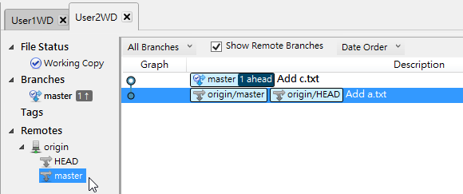

第 26 天：多人在同一個遠端儲存庫中進行版控
========================================================

一個人用的版本控管，只能算是當作原始碼歷史備份工具，在大多數的情況下，版本控管機制都是設計給多人共同使用的，尤其是 Git 這套分散式版本控管系統，更是設計給成千上萬人都能順利使用的版本控管工具。不過，在多人使用的情境下，通常多多少少也會帶來一些副作用，多跟少的問題。在 Git 版控中，多人同時進行版控的策略有好幾種，今天將介紹大家共用一個遠端儲存庫的使用方式與問題解決方法。

建立多人使用的遠端儲存庫與工作目錄
---------------------------------

我們先假設所有人只會共用一個「遠端儲存庫」，由於大家會用 `git clone` 指令把遠端儲存庫給複製回來，所以每個人都會有一份擁有完整歷史的版本庫。

為了簡化講解，我先在本地先建立一個「共用儲存庫」，把它當成「遠端儲存庫」來用，其用法跟你在用 GitHub 的時候一模一樣，不但觀念一樣，指令操作也都完全相同。我們先用以下指令建立一個共用儲存物，並位於 `C:/myproject.git` 資料夾下：

	c:
	cd \
	mkdir myproject.git
	cd myproject.git
	git init --bare

再來我們假設有兩位開發人員準備開發一個新專案 `myproject`，分別是 `User1` 與 `User2` 這兩位。

首先，`User1` 先利用 `git clone C:/myproject.git User1WD` 建立一個工作目錄，並在工作目錄下建立一個初始版本，並推送到 `origin` 遠端儲存庫。其指令如下：

	c:
	cd \
	git clone C:/myproject.git User1WD
	cd User1WD
	echo a > a.txt
	git add .
	git commit -m "Add a.txt"
	git push origin master

現在我們的遠端儲存庫 `C:/myproject.git` 已經有了一個初始版本，並擁有一個 `a.txt` 檔案。

接著，`User2` 利用 `git clone C:/myproject.git User2WD` 建立另一個屬於 `User2` 自己的工作目錄，預設會自動建立號 `origin` 遠端儲存庫的設定。其指令如下：

	c:
	cd \
	git clone C:/myproject.git User2WD
	cd User2WD

現在我們已經準備好一個「多人」(兩人) 使用的版控環境，並共用一個遠端儲存庫。

遠端儲存庫的基本開發流程
-----------------------

現在 `User1` 與 `User2` 擁有完全相同的儲存庫，版本也都完全一樣，都只有一個。

現在 `User1` 先聲奪人，搶先建立了版本，而且也將變更推送到 `C:/myproject.git` 遠端儲存庫：

	C:\User1WD>echo b > b.txt
	
	C:\User1WD>git add .
	
	C:\User1WD>git commit -m "Add b.txt"
	[master 7bcbc05] Add b.txt
	 1 file changed, 1 insertion(+)
	 create mode 100644 b.txt
	
	C:\User1WD>git push origin master
	Counting objects: 4, done.
	Delta compression using up to 4 threads.
	Compressing objects: 100% (2/2), done.
	Writing objects: 100% (3/3), 267 bytes | 0 bytes/s, done.
	Total 3 (delta 0), reused 0 (delta 0)
	To C:/myproject.git
	   f4f7df9..7bcbc05  master -> master

這時 `User2` 的工作目錄有兩個分支，一個是本地的 `master` 分支，另一個是 `origin/master` 本地追蹤分支。但是 `User2` 現在的 `origin/master` 並沒有得到遠端儲存庫的最新版，而且 `User2` 並不知道 `User1` 已經將他手邊的版本推送到遠端儲存庫了，所以還是繼續自己的開發作業，也在他自己的工作目錄中建立了一個版本。但在準備將版本推送到遠端儲存庫時，發現了一個問題，因為他的推送作業被遠端儲存庫拒絕了！原因就出在存在於遠端儲存庫的初始版本之後，已經擁有了一個新版本，他不允許另外一個人建立一個多重的版本歷史，所以拒絕你將本地版本推送上去。

	C:\User2WD>echo c > c.txt
	
	C:\User2WD>git add .
	
	C:\User2WD>git commit -m "Add c.txt"
	[master dbebba3] Add c.txt
	 1 file changed, 1 insertion(+)
	 create mode 100644 c.txt
	
	C:\User2WD>git push origin master
	To C:/myproject.git
	 ! [rejected]        master -> master (fetch first)
	error: failed to push some refs to 'C:/myproject.git'
	hint: Updates were rejected because the remote contains work that you do
	hint: not have locally. This is usually caused by another repository pushing
	hint: to the same ref. You may want to first merge the remote changes (e.g.,
	hint: 'git pull') before pushing again.
	hint: See the 'Note about fast-forwards' in 'git push --help' for details.

遇到這種問題請不要緊張，Git 很擅長處裡這種狀況。你 (`User2`) 現在要做的事，就是先把遠端儲存庫中的新物件取回，如下指令：

	C:\User2WD>git fetch
	remote: Counting objects: 4, done.
	remote: Compressing objects: 100% (2/2), done.
	remote: Total 3 (delta 0), reused 0 (delta 0)
	Unpacking objects: 100% (3/3), done.
	From C:/myproject
	   f4f7df9..7bcbc05  master     -> origin/master

這時我們可以看到 `User2WD` 中 `origin/master` 這個本地追蹤分支的的版本線圖，已經移動了一個版本，這代表你已經成功改變了 `origin/master` 的參照位址到最新的 `Add b.txt` 這個版本。

現在你要做的則是把 `origin/master` 版本的變更｢合併｣回自己的 `master` 本地分支：

	C:\User2WD>git merge origin/master
	Merge made by the 'recursive' strategy.
	 b.txt | 1 +
	 1 file changed, 1 insertion(+)
	 create mode 100644 b.txt

這樣你就可以將遠端儲存庫中 `master` 遠端分支的所有版本套用到自己的 `master` 分支上，也代表你現在可以嘗試把本地修改過的變更版本推送到遠端儲存庫了。

	C:\User2WD>git push origin master
	Counting objects: 7, done.
	Delta compression using up to 4 threads.
	Compressing objects: 100% (4/4), done.
	Writing objects: 100% (5/5), 566 bytes | 0 bytes/s, done.
	Total 5 (delta 0), reused 0 (delta 0)
	To C:/myproject.git
	   7bcbc05..32ef41c  master -> master

如果這個時候 `User2` 又再度做出變更，而且 `User1` 也不知道原來 `User2` 也送出了一些變更到遠端儲存庫 (在分散式的版本控管系統中，這種狀況很常見，畢竟大家並沒有坐在同一間辦公室)，而又建立了一個版本，當然他也無法成功的把變更推送上去。

	C:\User1WD>echo d > d.txt
	
	C:\User1WD>git add .
	
	C:\User1WD>git commit -m "Add d.txt"
	[master 57ea603] Add d.txt
	 1 file changed, 1 insertion(+)
	 create mode 100644 d.txt

此時 `User1` 該做的事，其實跟剛剛 `User2` 做的事一模一樣，也是要先用 `git fetch` 取回遠端儲存庫中的最新版，然後再用 `git merge origin/master` 合併回自己的 `master` 本地分支，最後再用 `git push` 推送進遠端儲存庫。不過，這次我們改用 `git pull` 指令幫我們一次做到 `git fetch` 與 `git merge origin/master` 這個動作，這動作相對的會簡單很多。

	C:\User1WD>git pull
	Merge made by the 'recursive' strategy.
	 c.txt | 1 +
	 1 file changed, 1 insertion(+)
	 create mode 100644 c.txt

最後，我們用 `git push origin master` 把版本給推送到遠端儲存庫：

	C:\User1WD>git push origin master
	Counting objects: 7, done.
	Delta compression using up to 4 threads.
	Compressing objects: 100% (4/4), done.
	Writing objects: 100% (5/5), 484 bytes | 0 bytes/s, done.
	Total 5 (delta 2), reused 0 (delta 0)
	To C:/myproject.git
	   32ef41c..1ae28db  master -> master

就這樣不斷周而復始，完成多人協同作業的步驟。

今日小結
---------

無法避免的，在執行 `git merge origin/master` 或 `git pull` 的過程中，還是很有可能會出現合併衝突的現象，遇到這種情形你還是必須手動處裡並協調解決衝突，但這已經是多人使用 Git 版本控管中最簡單的使用方式。

如果你今天發生了衝突狀況，而又不知道如何解決，因為版本尚未被成功合併，所以你可以執行以下指令「重置」到目前的 `HEAD` 版本：

	git reset --hard HEAD

如果你今天成功的合併了，但又想反悔這次的合併動作，那麼你還是可以執行以下指令「重置」到**合併前**的版本狀態，也就是重置到 `ORIG_HEAD` 這個版本：

	git reset --hard ORIG_HEAD

我重新整理一下本日學到的 Git 指令與參數：

* git init --bare
* git clone [repo_url] [dir]
* git add .
* git commit -m "message"
* git push origin master
* git fetch
* git merge origin/master
* git pull
* git reset --hard HEAD
* git reset --hard ORIG_HEAD

-------
* [HOME](../README.md)
* [回目錄](README.md)
* [前一天：使用 GitHub 遠端儲存庫 - 觀念篇](25.md)
* [下一天：透過分支在同一個遠端儲存庫中進行版控](27.md)

-------

