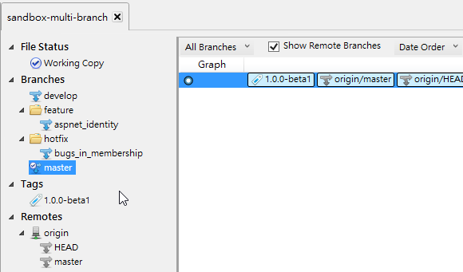
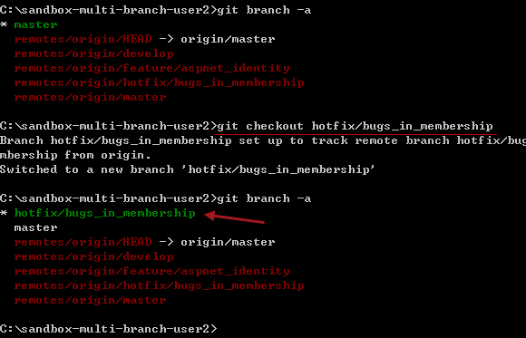

第 27 天：透過分支在同一個遠端儲存庫中進行版控
============================================================

如果在公司內部只有一個共用的 Git 遠端儲存庫，大家都有存取權限的情況下，可能會遇到一些協同作業上的問題，那就是不同人彼此之間的程式碼互相干擾的情況。例如你在團隊開發的過程中，被指派負責開發新功能，但同時間其他同事負責修正目前上線的程式錯誤，如果兩人共用同一個分支 (例如 `master` 分支)，那麼在版控的過程中就很容易發生衝突的情況，這時你應該要善加利用分支將不同用途的原始碼分別進行版本管理。

建立多人使用的遠端儲存庫與工作目錄
--------------------------------

我在 GitHub 上建立了一個 `sandbox-multi-branch` 專案，並直接在 GitHub 上建立一個 **Initial commit** 版本，用做本篇文章的遠端儲存庫。但這次我改用 `git@github.com:doggy8088/sandbox-multi-branch.git` 這個網址，透過 SSH 通訊協定來存取我的遠端儲存庫，好讓我可以不用每次執行遠端儲存庫的操作時都要輸入帳號密碼。

我們執行以下指令將專案複製回來：

	C:\>git clone git@github.com:doggy8088/sandbox-multi-branch.git
	Cloning into 'sandbox-multi-branch'...
	Receiving objecg objects: 3, done.Receiving objects:  33% (1/3)
	Receiving objects: 100%0), reused 0 (delta 0)ts:  66% (2/3)
	Receiving objects: 100% (3/3), done.
	
	C:\>cd sandbox-multi-branch
	
	C:\sandbox-multi-branch>git log
	commit 6eeee883275e3d5e0281767aca4f456d952fa682
	Author: Will 保哥 <xxx@gmail.com>
	Date:   Sun Oct 27 07:13:50 2013 -0700
	
	    Initial commit

	C:\sandbox-multi-branch>git branch -a
	* master
	  remotes/origin/HEAD -> origin/master
	  remotes/origin/master

此時我們的 `.git\config` 內容如下：

	[core]
		repositoryformatversion = 0
		filemode = false
		bare = false
		logallrefupdates = true
		symlinks = false
		ignorecase = true
		hideDotFiles = dotGitOnly
	[remote "origin"]
		url = git@github.com:doggy8088/sandbox-multi-branch.git
		fetch = +refs/heads/*:refs/remotes/origin/*
	[branch "master"]
		remote = origin
		merge = refs/heads/master

常見的分支名稱
--------------

我們知道在建立好一個新的 Git 儲存庫時，預設都會有一個 `master` 分支。在實務上，這個分支通常用來當作目前系統的「穩定版本」，也就是這個版本必須是乾淨且高品質的原始碼版本。所以，我們會要求所有人都不要用這個分支來建立任何版本，真正要建立版本時，一定會透過「合併」的方式來進行操作，以確保版本能夠更容易被追蹤。

進入開發階段時，我們通常會再從 `master` 分支建立起另一個 `develop` 分支，用來作為「開發分支」，也就是所有人都會在這個分支上進行開發，但這個時候或許會產生一些衝突的情形，因為大家都在同一個分支上進行版本控管。不過這種用法跟以往我們用 Subversion 的時候是比較類似的，所以使用上的觀念通常差不多。本文稍後就會介紹一些分支開發的練習，但我們現在就可以先建立一個 `develop` 分支起來。

	C:\sandbox-multi-branch>git branch
	* master
	
	C:\sandbox-multi-branch>git checkout -b develop
	Switched to a new branch 'develop'
	
	C:\sandbox-multi-branch>git branch
	* develop
	  master

開發過程中，有時候我們也會因為需求變更，而被指派開發一些新功能，但這些新功能可能變動性還很大，甚至只是想進行 PoC 驗證而開發的小功能。這些小功能只是測試用途，你不想因為開發這些測試功能而影響到大家的開發作業，所以這時我們會選擇再建立起一個「新功能分支」，專門用來存放這些新增功能的程式碼版本。這個測試用的「功能分支」，通常會建立在 `develop` 之上，所以我們會再從 `develop` 分支來建立另一個分支。但這個分支的名稱，實務上通常會取名為 `feature/[branch_name]`，例如：`feature/aspnet_identity`。

	C:\sandbox-multi-branch>git branch
	* develop
	  master
	
	C:\sandbox-multi-branch>git checkout -b feature/aspnet_identity
	Switched to a new branch 'feature/aspnet_identity'
	
	C:\sandbox-multi-branch>git branch
	  develop
	* feature/aspnet_identity
	  master

如果你發現在開發的過程中，「正式機」 (生產環境) 的系統出現了一個嚴重錯誤，但在「開發分支」裡又包含一些尚未完成的功能，這時你可能會從 `master` 分支緊急建立一個「修正分支」，通常的命名為 `hotfix/[branch_name]`，例如：`hotfix/bugs_in_membership`。

	C:\sandbox-multi-branch>git branch
	  develop
	* feature/aspnet_identity
	  master
	
	C:\sandbox-multi-branch>git checkout master
	Switched to branch 'master'
	
	C:\sandbox-multi-branch>git branch
	  develop
	  feature/aspnet_identity
	* master
	
	C:\sandbox-multi-branch>git checkout -b hotfix/bugs_in_membership
	Switched to a new branch 'hotfix/bugs_in_membership'
	
	C:\sandbox-multi-branch>git branch
	  develop
	  feature/aspnet_identity
	* hotfix/bugs_in_membership
	  master

如果你發現目前的 `master` 分支趨於穩定版本，那麼你可能會想替目前的 `master` 分支建立起一個「標籤物件」或稱「標示標籤」(annotated tag)，那麼你可以先切換到 `master` 分支後輸入 `git tag 1.0.0-beta1 -a -m "V1.0.0-beta1 created"` 即可建立一個名為 `1.0.0-beta` 的標示標籤，並透過 `-m` 賦予標籤一個說明訊息。

	C:\sandbox-multi-branch>git branch
	  develop
	  feature/aspnet_identity
	* hotfix/bugs_in_membership
	  master
	
	C:\sandbox-multi-branch>git checkout master
	Switched to branch 'master'
	
	C:\sandbox-multi-branch>git tag 1.0.0-beta1 -a -m "V1.0.0-beta1 created"
	
	C:\sandbox-multi-branch>git tag
	1.0.0-beta1

以上就是使用 Git 的過程中常見的命名規則與版控流程。

將本地分支送上遠端儲存庫
--------------------------

目前為止我們建立了好幾個分支與標籤，用 SourceTree 來看，目前還看不出分支的版本線圖，畢竟我們還沒有建立任何版本，但該有的分支已經被成功建立，如下圖示：

不過，這些分支都僅儲存在本地儲存庫中，團隊中所有其他人都無法得到你建立的這些分支，如果要將這些分支的參照名稱推送到遠端儲存庫，可以使用 `git push --all` 這個指令。

	C:\sandbox-multi-branch>git push --all
	Total 0 (delta 0), reused 0 (delta 0)
	To git@github.com:doggy8088/sandbox-multi-branch.git
	 * [new branch]      develop -> develop
	 * [new branch]      feature/aspnet_identity -> feature/aspnet_identity
	 * [new branch]      hotfix/bugs_in_membership -> hotfix/bugs_in_membership

不過如果只下達 `--all` 參數是不夠的，可能還要加上 `--tags` 參數，才能將標示標籤也一併推送到遠端儲存庫。

	C:\sandbox-multi-branch>git push --tags
	Counting objects: 1, done.
	Writing objects: 100% (1/1), 159 bytes | 0 bytes/s, done.
	Total 1 (delta 0), reused 0 (delta 0)
	To git@github.com:doggy8088/sandbox-multi-branch.git
	 * [new tag]         1.0.0-beta1 -> 1.0.0-beta1

這個時候，所有物件與參照名稱都已經儲存在遠端儲存庫了。我們連到 GitHub 就能看到這些物件已經可以被瀏覽到：

如果切換到 **Tags** 頁籤的話，也可以看到標籤物件也被送上來了：

請團隊成員下載遠端儲存庫所有物件
------------------------------

這個時候大家就能夠透過 `git fetch --all --tags` 將所有物件取回，包含所有物件參照與標籤參照。

我們建立起另一個工作目錄，模擬其他使用者取回資料的情況：

	C:\>git clone git@github.com:doggy8088/sandbox-multi-branch.git sandbox-multi-branch-user2
	Cloning into 'sandbox-multi-branch-user2'...
	remote: Counting objects: 4, done.
	remote: Compressing objects: 100% (2/2), done.
	remote: Total 4 (delta 0), reused 1 (delta 0)
	Receiving objects: 100% (4/4), done.
	
	C:\>cd sandbox-multi-branch-user2

	C:\sandbox-multi-branch-user2>git fetch --all --tags
	Fetching origin

取回物件後，用 SourceTree 查看儲存庫的狀態如下：

開始各自進行不同的分支開發
-------------------------

現在開始，團隊所有成員都擁有了預先定義好的「Git 儲存庫範本」，大家就能各就各位，開發自己需要開發的功能。或許會有兩個人在 `develop` 分支上進行開發，或許會有一個人被指派 `hotfix/bugs_in_membership` 分支進行修復任務，諸如此類的，等分支完成開發後，再將變更推送到遠端儲存庫裡。

眼尖的你可能會發現，這個 `User2` 的本地分支只有 `master` 而已，跟我們原本建立的那個工作目錄有些不一樣。之前在【第 25 天：使用 GitHub 遠端儲存庫 - 觀念篇】文章中不是提到說「**把這些「本地追蹤分支」視為是一種｢唯讀｣的分支**」嗎？沒有本地分支要怎樣進行呢？

關於這一點，各位也不用擔心，Git 早就幫我們想好了。假設你現在被賦予的任務是去開發 `hotfix/bugs_in_membership` 分支，並負責把變更錯誤修正，你可以直接執行 `git checkout hotfix/bugs_in_membership` 將這個「本地追蹤分支」給取出 (checkout)。 

	C:\sandbox-multi-branch-user2>git branch -a
	* master
	  remotes/origin/HEAD -> origin/master
	  remotes/origin/develop
	  remotes/origin/feature/aspnet_identity
	  remotes/origin/hotfix/bugs_in_membership
	  remotes/origin/master
	
	C:\sandbox-multi-branch-user2>git checkout hotfix/bugs_in_membership
	Branch hotfix/bugs_in_membership set up to track remote branch hotfix/bugs_in_me
	mbership from origin.
	Switched to a new branch 'hotfix/bugs_in_membership'
	
	C:\sandbox-multi-branch-user2>git branch -a
	* hotfix/bugs_in_membership
	  master
	  remotes/origin/HEAD -> origin/master
	  remotes/origin/develop
	  remotes/origin/feature/aspnet_identity
	  remotes/origin/hotfix/bugs_in_membership
	  remotes/origin/master

在取出 `hotfix/bugs_in_membership` 這個「本地追蹤分支」後，Git 會動幫你建立起一個同名的「本地分支」，所以你根本不用擔心有沒有本地分支的情形。

這時我們模擬在 `hotfix/bugs_in_membership` 這個「本地分支」建立一個版本：

	C:\sandbox-multi-branch-user2>git status
	# On branch hotfix/bugs_in_membership
	nothing to commit, working directory clean
	
	C:\sandbox-multi-branch-user2>echo %date% %time% > a.txt
	
	C:\sandbox-multi-branch-user2>git add .
	
	C:\sandbox-multi-branch-user2>git commit -m "Add a.txt"
	[hotfix/bugs_in_membership 250e907] Add a.txt
	 1 file changed, 1 insertion(+)
	 create mode 100644 a.txt

目前的版本線圖如下：

接著如果你想將變更推送到遠端，只要下達 `git push origin hotfix/bugs_in_membership` 即可將變更推送回去：

	C:\sandbox-multi-branch-user2>git push origin hotfix/bugs_in_membership
	Counting objects: 4, done.
	Delta compression using up to 8 threads.
	Compressing objects: 100% (2/2), done.
	Writing objects: 100% (3/3), 294 bytes | 0 bytes/s, done.
	Total 3 (delta 0), reused 0 (delta 0)
	To git@github.com:doggy8088/sandbox-multi-branch.git
	   6eeee88..250e907  hotfix/bugs_in_membership -> hotfix/bugs_in_membership

不過目前為止，你所推送回去的，只有 `hotfix/bugs_in_membership` 這個分支的版本而已，你並沒有將變更「合併」回 `master` 分支。這樣操作所代表的意思是，你將變更放上遠端儲存庫，目的是為了將變更可以讓其他人看到，也可以取回繼續修改，就跟昨天【第 26 天：多人在同一個遠端儲存庫中進行版控】文章中講的版控流程一樣。

如果你想合併回去，可以先切換至 `master` 分支，再去合併 `hotfix/bugs_in_membership` 分支的變更，最後在推送到遠端儲存庫。如下指令範例：

	C:\sandbox-multi-branch-user2>git branch -a
	* hotfix/bugs_in_membership
	  master
	  remotes/origin/HEAD -> origin/master
	  remotes/origin/develop
	  remotes/origin/feature/aspnet_identity
	  remotes/origin/hotfix/bugs_in_membership
	  remotes/origin/master
	
	C:\sandbox-multi-branch-user2>git checkout master
	Switched to branch 'master'
	
	C:\sandbox-multi-branch-user2>git merge hotfix/bugs_in_membership
	Updating 6eeee88..250e907
	Fast-forward
	 a.txt | 1 +
	 1 file changed, 1 insertion(+)
	 create mode 100644 a.txt
	
	C:\sandbox-multi-branch-user2>git push
	Total 0 (delta 0), reused 0 (delta 0)
	To git@github.com:doggy8088/sandbox-multi-branch.git
	   6eeee88..250e907  master -> master

如此一來，`master` 的分支內容就成功被更新，並且推送到遠端儲存庫了。

想當然爾，其他的分支也都是用類似的方式運作著。

今日小結
-------

今天更進一步介紹了 Git 更接近實務面的版控流程，讓大家透過不同的分支進行開發，彼此之間做一個有效區隔，然後還能在同一個遠端儲存庫中進行版控，同時享受了集中式版本控管的特性，以及分散式版本控管的彈性，非常優秀不是嗎！ ^_^

我重新整理一下本日學到的 Git 指令與參數：

* git push --all --tags
* git fetch --all --tags
* git branch -a
* git checkout hotfix/bugs_in_membership
* git push origin hotfix/bugs_in_membership

-------
* [HOME](../README.md)
* [回目錄](README.md)
* [前一天：多人在同一個遠端儲存庫中進行版控](26.md)
* [下一天：了解 GitHub 上 forks 與 pull request 的版控流程](28.md)

-------

