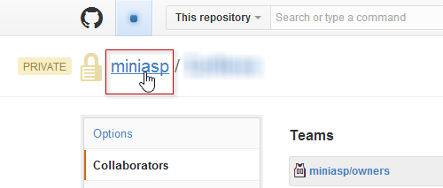
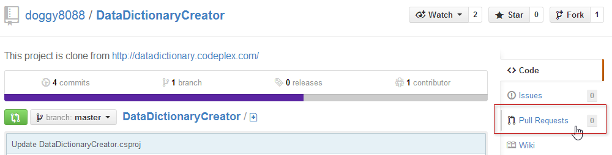
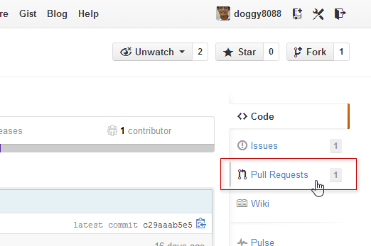

第 28 天：了解 GitHub 的 fork 與 pull request 版控流程
========================================================================

我們知道 Git 儲存庫並沒有什麼「權限控管」的概念，因為他是分散式的版本控管系統，當你執行 `git clone` 之後就會把整份擁有完整版本歷史的儲存庫下載回來，接著你就可以在本地離線的進行開發與建立版本，最後再將變更推送到遠端儲存庫。不過，如果我們只有一份遠端儲存庫的話，這代表大家都有權限將變更推送到遠端儲存庫。因此，GitHub 採用了 forks 與 pull request 的流程，讓你可以做到基本的權限控管。

設定 GitHub 專案的權限控管 - 個人帳號
-------------------------------------

在 GitHub 的個人帳戶下，並沒有甚麼權限控管的機制，所以只要你授權特定人為協同開發人員 (Collaborators)，他就能自由的 Push 與 Pull 專案原始碼。

我以我之前在 GitHub 上建立的某個專案為例，專案網址：[https://github.com/doggy8088/DataDictionaryCreator](https://github.com/doggy8088/DataDictionaryCreator)

進入該網址後，點選右側選單的 **Settings** 連結進入：

然後就可以加入授權的協同開發人員，這裡要輸入的是對方在 GitHub 上的帳號：

設定成功的圖示如下：

但由於你沒辦法設定更細的 Git 遠端儲存庫權限，所以只要被指派的人，就能夠存取完整的 Git 遠端儲存庫，大家都能對任意分支進行推送 (Push)、拉取 (Pull) 或刪除分支等動作，要是團隊遇上天兵，那可能會是場災難。

設定 GitHub 專案的權限控管 - 組織帳號
-------------------------------------

在 GitHub 的組織帳戶下，就可以設定人員群組(Teams)，你就可以在群組上設定更細的權限，其中包括三種權限：

* Pull Only (唯讀)
* Push & Pull (可讀可寫)
* Push, Pull & Administrative (可讀可寫以及專案管理權限)

設定群組的方法如下：

然後選擇團隊：

你也可以點選進入組織設定頁面，進一步的來挑選團隊成員：

使用 Fork 功能
---------------

英文的 Fork 字面翻譯是「叉子」的意思，就好像你刀叉去把食物「叉」起來一樣，直接把菜挪放到你自己的盤子裡，我比喻的「菜」就是你要複製的 GitHub 專案，而「盤子」就是你的 GitHub 帳號。

註：老外用刀叉比較多，如果 GitHub 是台灣發展的，這個單字可能會是 Chopsticks (筷子)，哈！ XD 

現在我們以 [https://github.com/doggy8088/DataDictionaryCreator](https://github.com/doggy8088/DataDictionaryCreator) 為例，這個專案，你當然沒有「寫入」權限，只有「唯讀」而已。

我現在登入另外一個 GitHub 帳號 ( `LearnGitForks` )，然後將該專案「叉」到這個帳戶自己 GitHub 帳號下：

按下去之後，他骨子裡其實就是使用 `git clone` 來複製該專案到你的 GitHub 帳號下，估計只要十幾秒鐘就會複製完成，看你複製的專案大小：

完成後，在你自己的帳號下，就會有個完全一樣的 Git 專案被建立，但會在名稱下顯示一段 `forked from` 提示你該專案是來從哪裡複製過來的。

因為該專案已經在你自己的帳號下，所以此時你已經可以把該專案當成「自己的遠端儲存庫」在用，完全沒有讀寫權限的問題。

因為 Git 是個分散式版本控管系統，只要你有 fetch 的權限，基本上就可以抓到該版本庫的完整版本變更歷程。

使用 Fork 過的 Git 遠端儲存庫
-------------------------------

在版本控管方面，使用上幾乎跟用自己的 Git 遠端儲存庫沒什麼兩樣，而且你也有完整的歷史紀錄。請記得這份資料是從 [https://github.com/doggy8088/DataDictionaryCreator](https://github.com/doggy8088/DataDictionaryCreator) 複製過來的就好。

我們先取得遠端儲存庫回來：

	C:\>git clone git@github.com:LearnGitForks/DataDictionaryCreator.git
	Cloning into 'DataDictionaryCreator'...
	remote: Counting objects: 57, done.
	remote: Compressing objects: 100% (45/45), done.
	Receiving objects:  71% (41/57), 36.00 KiB | 42.00 KiB/s
	Receiving objects: 100% (57/57), 94.08 KiB | 42.00 KiB/s, done.
	Resolving deltas: 100% (12/12), done.
	
	C:\>cd DataDictionaryCreator
	
	C:\DataDictionaryCreator>

然後我們建立起一個版本，然後把變更推送回去：

	C:\DataDictionaryCreator>echo TEST > test.md
	
	C:\DataDictionaryCreator>git add .
	
	C:\DataDictionaryCreator>git commit -m "Add a test.md for test purpose"
	[master b2004b0] Add a test.md for test purpose
	 1 file changed, 1 insertion(+)
	 create mode 100644 test.md
	
	C:\DataDictionaryCreator>git push
	Counting objects: 4, done.
	Delta compression using up to 8 threads.
	Compressing objects: 100% (2/2), done.
	Writing objects: 100% (3/3), 285 bytes | 0 bytes/s, done.
	Total 3 (delta 1), reused 0 (delta 0)
	To git@github.com:LearnGitForks/DataDictionaryCreator.git
	   c29aaab..b2004b0  master -> master
	
	C:\DataDictionaryCreator>

使用 pull request 將變更合併回當初的 GitHub 專案 
--------------------------------------------------

剛剛我們用 `LearnGitForks` 身分，把專案從 `doggy8088` 這邊 Fork 回來，然後用 `LearnGitForks` 的身分 `git clone` 回本地端，建立版本後再用 `git push` 推回 GitHub 的 `LearnGitForks` 下。

現在我們要把儲存在 `LearnGitForks` 帳號下的 `DataDictionaryCreator` 專案「合併」回 `doggy8088` 帳號下的 `DataDictionaryCreator` 專案，這時因為是跨帳號的，所以必須利用 `pull request` 才能把變更「合併」回去。

註：這裡的 pull request 照字面翻譯是「拉取要求」的意思，代表要以 `LearnGitForks` 的身分，請 `doggy8088` 把我的變更給拉回去 (`git pull`)，但你不能強迫對方拉(`pull`)，所以必須拜託(`request`)對方拉，所以才叫做 pull request。

這時，你要用 `LearnGitForks` 的身分，連到 `https://github.com/doggy8088/DataDictionaryCreator` 這一頁，然後點選 **Pull Requests** 頁籤：

然後點選 `New pull request` 按鈕，準備建立一個新的 pull request 項目：

接下來你要選擇兩個版本 (兩個 commit 物件)，GitHub 才能建立 patch 檔案，也才能知道要合併那些東西回去。但你選不到自己 fork 過的版本，因此你要點選 **compare across forks** 

然後你就可以選擇到自己 fork 過的專案與分支了！不過，這一步要特別注意不要選錯，你的版本因為比較新，所以應該要把右邊的版本選擇成你的，GitHub 才知道從 `doggy8088/DataDictionaryCreator` 的 `master` 分支，到 `LearnGitForks/DataDictionaryCreator` 的 `master` 分支，到底發生了那些版本變化。

最後你會看到有哪些檔案以及哪些地方變更了，然後你就可以按下 **Click to create a pull request for this comparison** 建立起一個 pull request：

最後，我們先看一下右上角有個 **Able to merge** 的地方，會預先告訴你合併的結果，顯示你的版本跟目前的 `doggy8088:master` 的版本是否有衝突發生。如果都沒問題，再輸入一些說明文字給原作者 ( `doggy8088` ) ，並按下 `Send pull request` 即可建立完成。

**註** Github for Mac;Github for Windows 已增加pull request功能

接受 pull request 的要求，確認合併回自己的 GitHub 專案 
------------------------------------------------------

最後一個步驟，則是讓原作者 ( `doggy8088` ) 去看有誰傳送了一個 pull request 給自己。

現在我重新以 `doggy8088` 登入 GitHub，並到該專案發現有一個 **Pull Requests** 進來了：

點擊進去：

最後按下 **Merge pull request** 即可完成合併工作。

今日小結
-------

做到這裡，你應該大致能夠了解為什麼會有 fork 與 pull request 的存在，最主要的就是「權限」以及「版本庫隔離」的需求。一個上千人的專案 (`Linux Kernel`)，如果所有人都能存取主要的遠端儲存庫，那不是很恐怖嗎！

不過在一般企業裡，你不一定要這樣做，畢竟操作的步驟確實繁瑣了些。實際要怎麼用，就要靠你自己判斷了。

參考連結
-------

* [Fork A Repo](https://help.github.com/articles/fork-a-repo)
* [Using Pull Requests](https://help.github.com/articles/using-pull-requests)
* [Git workflow: Forks, remotes, and pull requests](http://nathanhoad.net/git-workflow-forks-remotes-and-pull-requests)
* [Fork a Repo, Compare Code, and Create a Pull Request](https://confluence.atlassian.com/display/BITBUCKET/Fork+a+Repo,+Compare+Code,+and+Create+a+Pull+Request)
* [Forks and Pull Requests in GitHub](http://chronicle.com/blogs/profhacker/forks-and-pull-requests-in-github/47753)

-------
* [HOME](../README.md)
* [回目錄](README.md)
* [前一天：透過分支在同一個遠端儲存庫中進行版控](27.md)
* [下一天：如何將 Subversion 專案匯入到 Git 儲存庫](29.md)

-------

