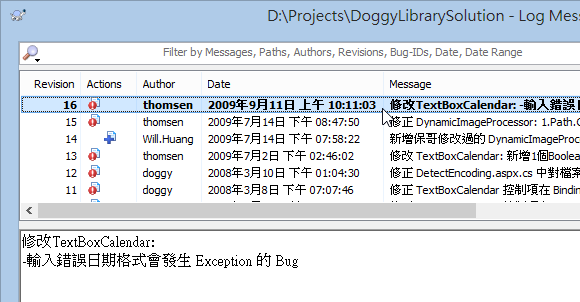
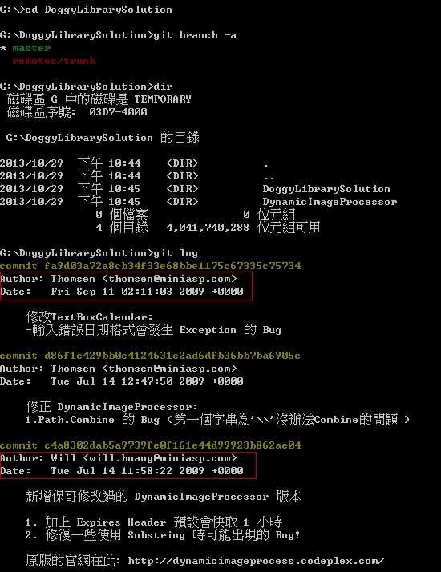
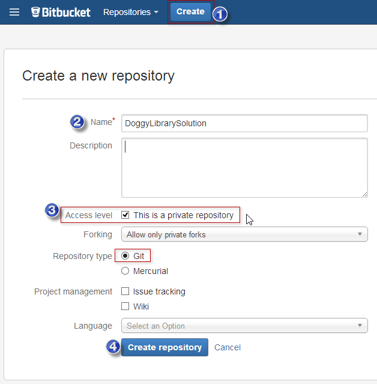
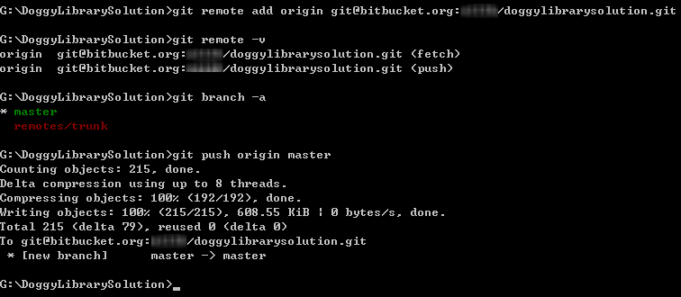

第 29 天：如何將 Subversion 專案匯入到 Git 儲存庫
==================================================================

當你越來越了解 Git 版本控管，一定會越來越想把手邊的 Subversion ( 簡稱 SVN ) 專案改用 Git 進行版本控管。但礙於兩者的版本架構差別甚大，轉換的過程稍微麻煩些，主要是要打些指令才行，還好 Git 已經內建了許多 SVN 的整合指令，讓我們可以容易地將 SVN 專案轉換過去。本篇文章將介紹如何用簡單的四步驟，將現有的 SVN 專案轉成 Git 儲存庫，並將轉換後的本地儲存庫送上遠端儲存庫。

準備使用者清單對應檔
--------------------

我們先來看一個用 TortoiseSVN 的 Show log 看到的版本歷史清單，在 **Author** 欄位看到的只有「使用者名稱」而已：

不過，使用 Git 必須至少有「使用者名稱」與「電子郵件地址」才能建立版本，所以我們必須先把 SVN 專案中所有的 **Author** 取出，並設定好一個對應檔，才能完整的將 SVN 專案匯入到 Git 專案中。

我們假設 2 個變數：

* SVN 專案網址：`https://svnrepo:23443/svn/DoggyLibrarySolution`
* SVN 工作目錄：`D:\Projects\DoggyLibrarySolution`
* GIT 安裝路徑：`C:\Program Files (x86)\Git` 

**請注意**：執行 svn 命令必須事先安裝 Subversion 指令列工具，下載連結: [Subversion Edge Download](http://www.collab.net/downloads/subversion)

我們開啟「命令提示字元」並進入 SVN 工作目錄，然後執行以下指令，你會得到一個 `SVNUsers.txt` 檔案：

	SET PATH=%PATH%;C:\Program Files (x86)\Git\bin\
	svn log --quiet --xml | sed -n -e "s/<\/\?author>//g" -e "/[<>]/!p" | sort | sed "$!N; /^\(.*\)\n\1$/!P; D" > SVNUsers.txt

由於我們這個 SVN 專案只有 4 位開發人員，所以得到的 `SVNUsers.txt` 檔案內容如下：

接下來，我要修改這個檔案，在每一行後面加上 `=` 等號，再加上「使用者名稱」與「電子郵件地址」，格式如下：

	svnuser = GitUsername <GitEmail>

修改完後的內容如下：

將 SVN 專案取出並轉換成 Git 工作目錄
-------------------------------------

假設我想將 GIT 工作目錄設定在 `G:\DoggyLibrarySolution` 資料夾，那麼你可以先把修改後的 `SVNUsers.txt` 檔案複製到 `G:\` 目錄下，然後執行以下指令：

	git svn clone https://svnrepo:23443/svn/DoggyLibrarySolution --no-metadata -A SVNUsers.txt --stdlayout

如果你可以存取的 SVN 儲存庫權限只有 /trunk 而已的話，你不能使用 --stdlayout 屬性，例如：

	git svn clone https://svnrepo:23443/svn/DoggyLibrarySolution/trunk --no-metadata -A SVNUsers.txt

這個指令執行時，可能會需要你輸入 SVN 版本庫的登入帳號密碼。

轉換後的結果來看，你會發現轉換後的 Git 儲存庫，版本資訊非常完整，他會保留 SVN 當初留下的 commit 時間與作者資訊，這裡的作者資訊所顯示的使用者名稱與電子郵件地址則是我們剛剛定義檔所設定的那些對應資訊：

轉換 SVN 的忽略清單 (即 `svn:ignore` 屬性)
-------------------------------------------

SVN 專案中有所謂的 `svn:ignore` 屬性，這等同於 Git 的 `.gitignore` 忽略清單。但是 SVN 的忽略清單散落在每個目錄屬性中，還好你可以透過 `git svn show-ignore` 指令轉換這些資訊為 Git 的格式。

接著我們直接透過以下指令取得 `.gitignore` 忽略清單檔的內容：

	git svn show-ignore

不過你可能會遇到以下錯誤：

	G:\DoggyLibrarySolution>git svn show-ignore
	config --get svn-remote.svn.fetch :refs/remotes/git-svn$: command returned error: 1

如果遇到這個錯誤，代表 `git svn show-ignore` 找不到你的 SVN 路徑，這通常發生在你的 SVN 版本庫使用了標準的 trunk, branches, tags 資料結構，這時你可以改輸入以下指令：

	git svn show-ignore -i trunk

接著我們建立一個 `.gitignore` 忽略清單檔，並建立一個新版本，指令如下：

	git svn show-ignore -i trunk > .gitignore
	git add .gitignore
	git commit -m "Create .gitignore from SVN"

將專案推送到遠端儲存庫
------------------------

由於 GitHub 在預設的情況下，只能建立「開源碼」的 Git 專案，所以我們這次改用 [Bitbucket](https://bitbucket.org/) 網站來建立一個私有的 Git 專案 (Private Repository)。

建立完成後，按下 **Clone** 去複製 Git 儲存庫網址：

接著就跟我們之前學到的一樣，把現有的專案給推送上去，如下指令：

	git remote add origin git@bitbucket.org:myaccount/doggylibrarysolution.git
	git push origin master

今日小結
-------

就這樣簡單四步驟，就可以把 SVN 專案完整的轉移到 Git 儲存庫，是不是非常簡單呢。

事實上，這個工作目錄還可以持續地跟原本的 SVN 版本庫溝通，可以 commit 變更，也可以 pull 變更回來 ( `git svn rebase` )，詳細的操作說明只要執行 `git help svn` 就可以取得完整說明。當然，我還是建議轉過去就轉過去了，否則在 Git 環境下操作 SVN 總覺得怪怪的，有點多此一舉的感覺，但確實有可能有這種需求。

-------
* [HOME](../README.md)
* [回目錄](README.md)
* [前一天：了解 GitHub 上 forks 與 pull request 的版控流程](28.md)
* [下一天：分享工作中幾個好用的 Git 操作技巧](30.md)

-------

