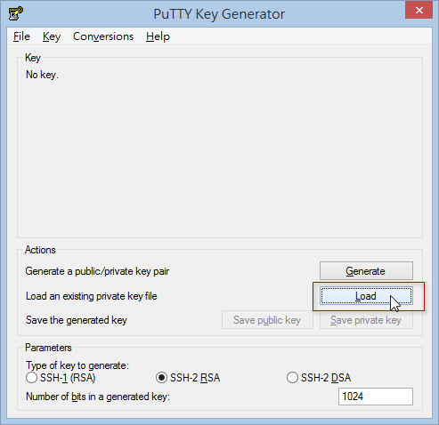

第 30 天：分享工作中幾個好用的 Git 操作技巧
========================================================

終於來到了最後一天，這篇文章將分享幾個好用的 Git 操作技巧，或許可以節省你不少 Git 版控過程的時間。

如何讓 git pull / push / fetch 不用輸入帳號、密碼
--------------------------------------------------

我們在使用 GitHub 的時候，由於預設使用 **HTTPS** 通訊協定取得 Git 儲存庫，例如：`https://github.com/doggy8088/frontend-tools.git`。但事實上你可以改用 **SSH** 選擇當成取得 Git 遠端儲存庫的網址，如下圖示：

使用 HTTPS 通訊協定來存取 GitHub 上的遠端儲存庫，由於無法記憶帳號密碼，所以每次執行遠端儲存庫的指令一定都會被要求輸入帳號、密碼。但改用 SSH 的話，就可以透過預先定義好的金鑰來進行身分驗證。

在第一次使用 GitHub for Windows 工具的時候，如果你有照著步驟登入與設定，這套工具會預設幫你產生一對金鑰，然後該工具會自動上傳到 GitHub 的 **SSH Key** 專區，讓你日後不用再輸入帳號密碼，就能順利的操作 GitHub 上的遠端儲存庫。

這一對金鑰，預設就放在 `%USERPROFILE%\.ssh` 資料夾下，如果你的 Windows 登入使用者名稱為 `Will` 的話，這個路徑就位於 `C:\Users\Will\.ssh` 目錄下。這對金鑰的檔名分別是 `github_rsa` (私鑰) 與 `github_rsa.pub` (公鑰)，如下圖示：

也因為這一對金鑰的存在，所以你在 **Git Shell** 底下操作 Git 指令，所有針對遠端儲存庫上的操作，都不需要再次輸入帳號密碼。

事實上，不用輸入密碼的原因是「**GitHub for Windows 工具已經把 SSH 金鑰上傳到 GitHub 網站了**」，設定的網址在 `https://github.com/settings/ssh`，我們可以從以下圖示看出設定的位址：

不過，如果你希望在「命令提示字元」（非 Windows Powershell 執行環境）下也可以不用輸入帳號密碼驗證，那麼你可以嘗試將 `%USERPROFILE%\.ssh` 資料夾下的兩個檔案分別把 `github_rsa` 複製一份改名成 `id_rsa`，然後把 `github_rsa.pub` 複製一份改名成 `id_rsa.pub`，即可完成設定！完成後如下圖示：

這樣就可以大功告成。

不過，如果你之前從 GitHub 複製回來的版本庫是用 HTTPS 通訊協定的話，那麼你還必須將這個遠端 URL 修改成 ssh 的格式。例如我們現有的　remote URL 如下：

	G:\demo\frontend-tools>git remote -v
	origin  https://github.com/doggy8088/frontend-tools.git (fetch)
	origin  https://github.com/doggy8088/frontend-tools.git (push)

我們可以用 `git remote set-url origin git@github.com:doggy8088/frontend-tools.git` 來將現有的遠端 URL 改成 SSH 的通訊協定，請看一下執行過程：

	G:\demo\frontend-tools>git remote -v
	origin  https://github.com/doggy8088/frontend-tools.git (fetch)
	origin  https://github.com/doggy8088/frontend-tools.git (push)
	
	G:\demo\frontend-tools>git push
	Username for 'https://github.com': fatal: could not read Username for 'https://github.com': No such file or directory
	^C
	G:\demo\frontend-tools>git remote set-url origin git@github.com:doggy8088/frontend-tools.git
	
	G:\demo\frontend-tools>git remote -v
	origin  git@github.com:doggy8088/frontend-tools.git (fetch)
	origin  git@github.com:doggy8088/frontend-tools.git (push)
	
	G:\demo\frontend-tools>git push
	Everything up-to-date
	
	G:\demo\frontend-tools>

如此一來，就可以不再需要驗證帳號密碼了。

如何讓操作 Bitbucket 遠端儲存庫時，也可以不用輸入帳號、密碼
----------------------------------------------------------

由於 GitHub for Windows 幫我們建立好一個現成的金鑰，如果你要直接沿用，可以透過以下步驟產生 GitHub 與 Bitbucket 都能支援的 SSH 金鑰格式：

1. 如果你有安裝　SourceTree 的話，將會在以下路徑找到 `puttygen.exe` 工具，並請直接開啟程式：

	路徑：`C:\Program Files (x86)\Atlassian\SourceTree\tools\putty`

	

	

2. 接著載入 `%USERPROFILE%\.ssh\github_rsa` 私密金鑰檔案，並複製產生後的一串亂碼，這就是 SSH 金鑰中的公鑰：

	

	※ 不過，如果你已經有 `github_rsa.pub` 這個檔案的話，直接用 Notepad 開啟這個檔案，也可以直接拿來當成公鑰的內容。

	這個 SSH 公鑰的內容格式大致如下：

		ssh-rsa AAAAB3NzaC1yc2EAAAABIwAAACEAxtaDp6VqaKlm2b2EMJFL99T0ApR053qY2n7on8k+prv9ImajkjlVFqlLCu89JJYgz7/VehXxIYo11e45iIHUC8zkgtzomjuUPVFIGLCkKP/k8WbmNA/NZb0CV/n8JI1gEYM4aMuIh9DaJw6N7KfkYo39ZJR4aKmACbjdO+ls71cRJ6hOkBo2wPRqsOJeipIdEh4wiekaWWApZyBm2uUsvs5nb/FtdxZ+AQlODozeLJFmnjBXCJUM4TimbWgZR2tPyvhI4Id5NRQf4112SLiQXP0YN2SXGRRLZG0x7LBLk6FzmdUQBxEzayK7t6SBmsHyRvMOOADt55L8oDCjYzghIw== imported-openssh-key

3. 接著進入 Bitbucket 首頁，並找到 SSH Key 頁面，並按下 **Add Key** 以新增金鑰：

	

	

	

4. 輸入一個好記名稱與公鑰內容後，就大功告成，從今以後連接 Bitbucket 也不用再輸入帳號、密碼了。

	

	

如何還原一個 `git rebase` 變動
-------------------------------

如果單純地用 `git merge` 合併一個檔案，要還原合併很簡單，直接打 `git reset --hard ORIG_HEAD` 即可還原本次合併的變更。但是 `git rebase` 怎麼辦？因為 `git rebase` 會將版本線圖改變，而且分支的結構也會發生變化，感覺上好像很難做還原動作，但其實非常簡單。

我用一張圖來解釋還原的過程：

1. 先知道你在 Rebase 之前，是落於哪個版本。
2. 再查出你要從哪個版本開始 Rebase
3. 然後真正執行 Rebase 動作
4. 不管做了哪些動作，你再執行一次 `git reflog` 就可以看出 Rebase 真正做了幾件事
5. 若要還原 Rebase 的版本，只要找到 Rebase 之前的版本，就可以透過　`git reset --hard` 來還原  

取得遠端儲存庫的統計資訊
-------------------------

由於我們透過 `git clone` 的時候，就可以抓回完整的版本紀錄，這代表我們可以隨時在本地儲存庫統計版本資訊。

例如我們想取得版本庫中所有人的 commit 次數統計，可以輸入　`git shortlog -sne` 即可詳細列出每個人的 commit 次數，而且加上 `-n` 參數還可以按照 commit 數量進行降冪排序：

	G:\CSS-Guidelines>git shortlog -sne
	    58  Harry Roberts <harry@csswizardry.com>
	     2  Matteo Nicoletti <matteo.nicoletti@webdev.it>
	     1  Mike <mike@mikepennisi.com>
	     1  Tim Vandecasteele <tim.vandecasteele@gmail.com>

也可以利用 `git shortlog` 顯示出每個人最近 commit 過的歷史紀錄。

	G:\CSS-Guidelines>git shortlog
	Harry Roberts (58):
	      Iitial commit
	      Adding readme and other guideline text
	      Update URL to BSkyB
	      Fix typo in README
	      Update doc URL
	      Update README intro
	      Update README intro
	      Embolden sharing details
	      Update copyright date
	      Add closing sentence to preprocessor section.
	      Tidy up link to CSS perf article.
	      Correct syntax for conditional comment.
	      Fix typo
	      Add note about syntax rules.
	      Use more robust URL in tweet link.
	      Use more robust URL in tweet link
	      Use more robust URL in tweet link
	      Merge pull request #3 from jugglinmike/typo
	      Add section on key selectors
	      Add section on key selectors
	      Remove Twitter link
	      Reformat and add BEM section
	      Complete rewrite
	      Rename file
	      Add table of contents
	      Add note about spaces and multiline
	      Reword of quasi-qualified selectors
	      Reword ruleset anatomy section
	      Fix typo in naming conventions
	      Clarify BEM meaning
	      Fix typo in comments section
	      Clarify quasi-qualifiying
	      Intro to second section
	      Reword new componnets section
	      Add JS naming section
	      Add JS hooks to ToC
	      Clear up JS hooks class definition
	      Reword source order section
	      Update link to inuit.css tables grid
	      Add classes in HTML section
	      Remove Sky disclaimer
	      Personalise tone of voice
	      Add section on internationalisation
	      Add link to Russian translation by @matmuchrapna
	      Remove unnecessary word
	      Slight reword
	      Completely reverse stance on internationalisation
	      Merge branch 'master' of github.com:csswizardry/CSS-Guidelines
	      Fix typo (thanks @stanton)
	      Fix typo (thanks @stanton)
	      Add Chinese translation
	      Add link to French translation
	      Merge pull request #7 from matteo-webdev/master
	      Merge pull request #15 from tim-vandecasteele/patch-1
	      Add link to Japanese translation. Thanks, @kiwanami
	
	Matteo Nicoletti (2):
	      Removed trailing spaces
	      Corrected "inuit.css’s table grid system" link
	
	Mike (1):
	      Insert omitted word
	
	Tim Vandecasteele (1):
	      Type is -> in

你也可以利用 GitHub 上 **Graph** 頁面提供的統計資訊：

這裡主要提供六種報表：

* Contributors (本專案貢獻者的活躍程度）
* Commit Activity (每一天的 commit 活動數量)
* Code Frequency (原始碼異動服務，可看出每天新增與刪除的程式碼行數)
* Punchcard (每一天的 commit 數量，用打卡的方式來顯示) (類似上下班打卡的那種卡片)
* Network (pull request 與 merge 的圖形表示)
* Members (所有 fork 此專案的 github 成員)

點進去之後，還可以繼續往下鑽(Drill-Down)，查看更細的統計報表：

從工作目錄清除不在版本庫中的檔案
----------------------------------

我們在 Git 工作目錄中，通常會產生一些不必要的檔案，而這些檔案通常都會透過 `.gitignore` 檔案，讓 Git 自動忽略這些檔案。如果你今天想要把這些額外的檔案都給刪除掉，可以透過 `git clean -f` 強迫刪除這些檔案。

不過，執行之前，還是建議用 `git clean -n` 看一下，這個指令會列出他「預計」會刪除那些檔案，等你確認過後在執行 `git clean -f` 刪除即可檔案。

刪除遠端分支
-------------

如果你將「本地分支」透過 `git push origin FixForCRLF` 指令建立起「遠端分支」，也代表在遠端會被建立一個名為 `FixForCRLF` 的分支，如果你想在本地下指令刪除遠端追蹤分支，可以輸入以下指令 (在遠端分支前面加上個 `:` 而已)：

	git push origin :FixForCRLF

另一個同樣目的的指令用法如下，指令看起來較為直覺些：

	git push origin --delete FixForCRLF

※ 不過使用時要注意，如果有人下載過這個遠端分支的話，他就再也無法透過 `git push` 把變更推送上來了。

找出改壞程式的兇手
--------------------

替原始碼做版控，最有效的就是每個檔案的每一行都可以進行詳細追蹤，今天如果程式發生異常，且找到哪一行出錯時，就可以透過 `git blame` 指令，幫你找出真正改壞程式的兇手，並且去看他為什麼會改壞。

用法如下：

	git blame [filename]

	git blame -L [開始行數],[結束行數] [filename]

例如：

	git blame README.md

	git blame -L 8,16 ViewModels/MemberViewModel.cs

	git blame -L 4, Models/Product.cs

今日小結
----------

一些小技巧，需要的時候就會用的到。

鐵人賽完結感言
--------------

短短 30 天，說長不長、說短不短，但我為了寫這個系列文章，還真的是累翻了。剛我把我的文章原稿放進 Word 統計，這才驚覺我寫了十幾萬字 (不含程式碼)，這真是太神奇了，傑克！

如同我之前講過的，雖然市面上 Git 的 GUI 工具好幾套，但想要有效率且正確的使用這些 Git 工具，先建立起完整的 Git 基本觀念非常重要，否則只會一直鬼打牆而已。

Git 博大精深，短短 30 天著實無法完整交代所有細節，但工作上會用到的觀念與工具都講到，如果認真看的話，相信對大家在工作上會有幫助。

-------
* [HOME](../README.md)
* [回目錄](README.md)
* [前一天：如何將 Subversion 專案匯入到 Git 儲存庫](29.md)

-------

